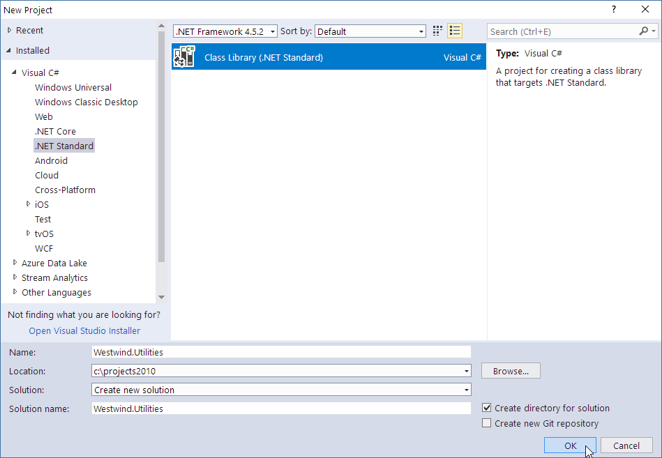
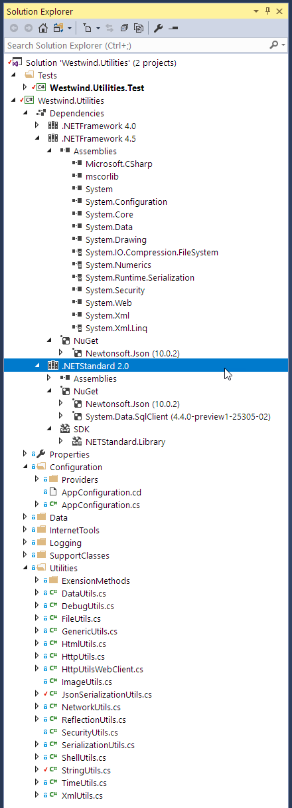
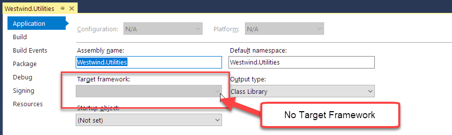
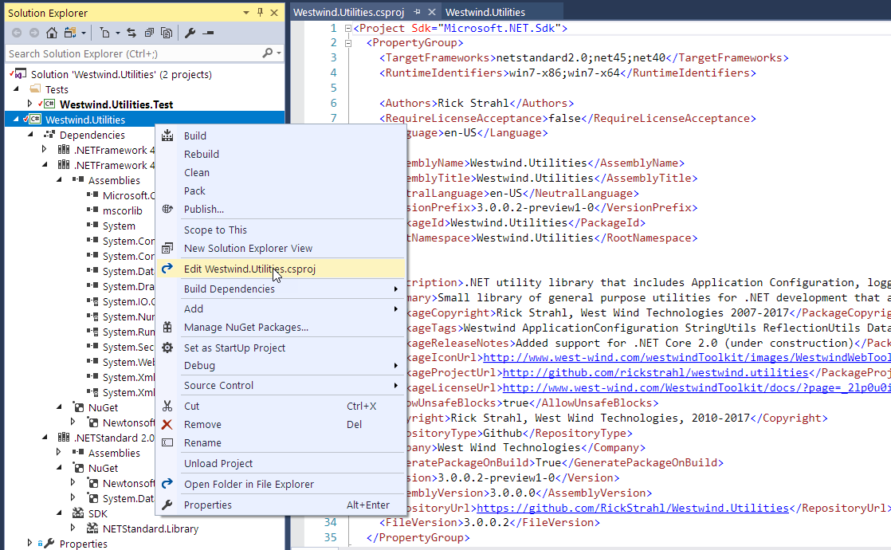
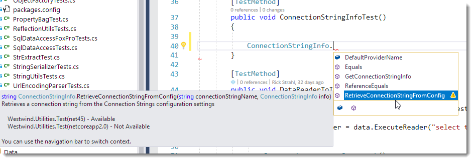
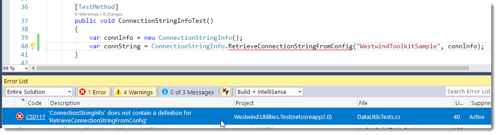
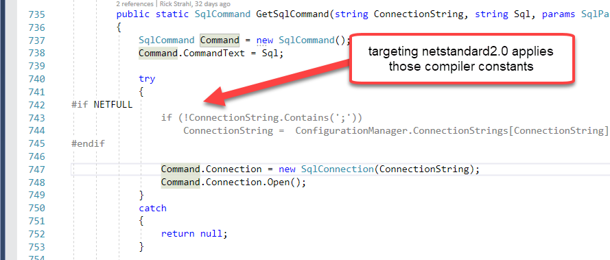
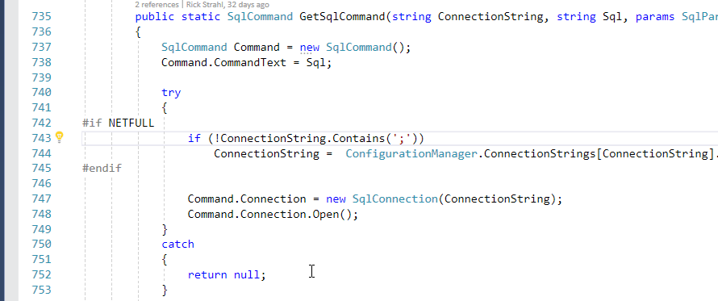
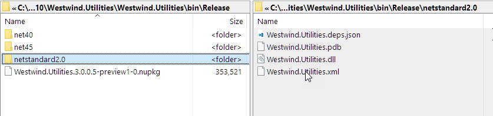
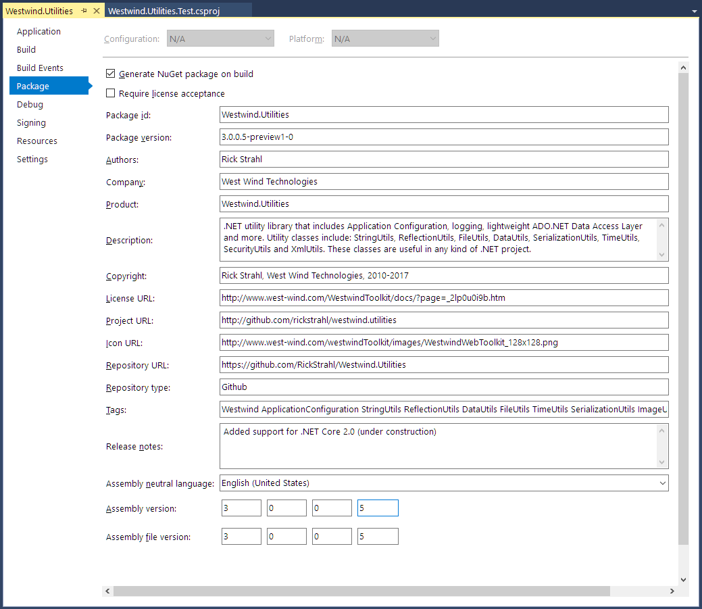

# Multi-Targeting and Porting a .NET Library to .NET Core 2.0

<a href="https://west-wind.com" target="top">West Wind</a>


.NET Standard and .NET Core have been on my mind for a long time now - years really, but the reality is while I've been using the technology quite a bit, I've not jumped in with both feet. In fact, to date I have yet to build anything 'real' for customers beyond a few internal infrastructure projects and quite a few sample applications. 

For me personally, .NET Standard 2.0 and .NET Core 2.0 with their much bigger base library foot print and the real possibility of porting the majority of existing library code over to .NET Core really has been a deciding factor for me to start moving some of my existing full framework libraries that I've been using for as long as I have been using .NET to .NET Core 2.0. Being able to bring some of the tools I use to be productive over to .NET Core is actually pretty important factor to overcoming my reluctance to move into .NET Core. Nobody wants to rewrite code they already have just to get back to square one, but with .NET Core 2.0 it really looks like most code will migrate pretty easily.

This isn't just important to me personally, but I think this is a vital requirement for moving much of the support libraries that exist for .NET into .NET Core and providing the full featured eco-system that we've come to expect from .NET applications. Currently with .NET Core 1.x it's been hit or miss feature wise to feel confident you can actually make it through a project without getting stuck with some missing core feature you can't easily find and have to build from scratch. My feeling is that .NET Core 2.0 will change all that by making it possible for most libraries to be ported with minimal effort.

In this post I describe porting an existing full framework library to .NET Core 2.0 and multi-targeting the project to support .NET 4.5, 4.0 and .NET Standard 2.0. The porting process was even easier than I expected, although the tooling required a bit of patience to get on with. 

What you need to follow along:

* [Visual Studio 2017 Update 3 Preview 2 or later](https://www.visualstudio.com/vs/preview/)
* [.NET Core 2.0 SDK Preview](https://www.microsoft.com/net/core/preview)

Note that currently there's no support for .NET Core 2.0/.NET Standard 2.0 in the release version of Visual Studio, and that's why the Preview install is required. You can install the minimal .NET and .NET Core payload for a lightish install, and the install is side by side with Visual Studio 2017 RTM so both work.

### .NET Standard?
A key concept to the porting process is .NET Standard 2.0 and how it relates to .NET Core 2.0.

For those of you that don't know, .NET Standard is a **specification** that serves as a blue print for .NET runtime implementations. The standard specifies what base features the runtime has to implement to support it. .NET Standard describes the base API library - what we used to think of as the Base Class Library (BCL) in full framework that make up the core features of the platform. 

.NET Standard is a **standard** not an implementation and it's up to the runtime to implement the features set forth in the standard. The logistics of this involve some runtime magic where each runtime provides a set of .NET Standard forwarding assemblies that map the .NET Standard APIs to the actual underlying APIs on the specific runtime.

For the purposes of this discussion, the salient point is that .NET Core 2.0 is an implementation of .NET Standard 2.0 which means that if I implement a .NET Standard 2.0 compliant DLL it will run on .NET Core 2.0. And any other platform like .NET 4.6.1, Xamarin, Mono, UWP and Unity all of which will eventually support .NET Standard 2.0. By targeting .NET Standard 2.0 I can insure that my DLL will run on any of the target platforms that .NET Standard supports.

The big win with .NET Standard is that it provides a common interface to consumers of a library, as well as an official guideline to the actual runtime implementers.

For Visual Studio purposes targeting .NET Standard for a class library is also what gives the new SDK project type that is required to make multi-targeting work.

I don't want to rehash all the details about how .NET Standard works here, but you can read my earlier blog post [.NET Standard 2.0 - Making Sense of .NET Again](https://weblog.west-wind.com/posts/2016/Nov/23/NET-Standard-20-Making-Sense-of-NET-Again) for a more detailed discussion on just how that works.

The key takeaway for this post is that your .NET Applications can now **target** .NET Standard 2.0 in your class libraries (or applications) and can have a very reasonable expectation of interoperability for a number of platforms. In this post I'll talk about full framework .NET 4.5, 4.0 and .NET Core 2.

##AD##

### Putting it to a Test: Porting a .NET 4.5/4.0 Library
To really put this all into perspective I decided to move one of my libraries - [Westwind.Utilities](https://github.com/RickStrahl/Westwind.Utilities) - to .NET Core 2.0 and in the process target .NET Standard 2.0, .NET 4.5 and .NET 4.0 all in a single project. Multi-targeting from a single project is an awesome feature that makes it possible to create a single .NET library project that can target multiple .NET Framework targets. Using a single project I can create binaries - and a NuGet package if desired - for multiple platforms.

**Westwind.Utilities** is a **really old** project that I've been using since the very early years of .NET and it's interesting in this context because it contains a large hodge-podge of functionality that touches a lot of different framework features in a single library. If I built this today I would probably have broken most of the features out into separate projects, but there's a lot of convenience in having these features I use in almost every project provided in a single package. Anyway, the point is this is very typical full framework legacy .NET code that was designed with no concept of .NET Core and makes a for a good example of what you're likely to find when you start porting full framework code to .NET Core 2 and later.

### Creating a new .NET Standard Project
The first step for moving this library is to create a new .NET Standard Class Library:



This creates a new SDK style project using a **csproj** file. This is the new, more streamlined, MSBUILD based project format that uses the underlying **dotnet** command line tooling to build, test and publish your library. These projects can also target multiple runtime versions, and when compiled, output multiple versions of your assembly for each runtime. You can also optionally publish and create a Nuget package that includes all runtime versions. The new SDK format lets you configure NuGet attributes directly in the **csproj** file configuration.

I also set up a test project at the same time to move over the existing tests for the old project.

### Multi-Target Projects in Visual Studio
When it is all said and done, here's the what the final ported project ends up looking like in Visual Studio:



Notice the three targets for .NET 4.5, 4.0 and .NET Standard 2.0 all living in the same project. You can also see the dependencies that each of the different runtime implementations are pulling in. .NET Core only shows the two packages (Json.net and SqlClient) I pulled in, while .NET 4.5 shows the specific assembly reference - both explicit assemblies and dependent assemblies (the ones with the lock in Solution Explorer).

The **good news** is that you can now have **a single project with multiple targets** with one single build step. Yay! 

The **bad news** is that there's currently **no visual tooling** support for managing multi-target projects in Visual Studio and you have to deal with the `.csproj` file directly to change targets or apply special target configuration settings. 

To ram that point home, when I go to the project properties for the my class library project here's what I see:



Yup - no runtime target shows because the UI can't handle multiple frameworks (it only looks at `<TargetFramework>` not `<TargetFrameworks>`). In order to manage multiple frameworks you currently have to work directly with the `.csproj` file. 

Luckily that is now a lot easier for a couple of reasons: 

* **Implicit File Inclusion**  
The new .csproj format no longer explicitly needs to add every file to the project. Code files are now implicitly considered part of the project and so no longer need to be explicitly included in the project which drastically reduces the size and complexity of the project file as well as reducing the change churn in the file which is better for source control management. There are still overrides that let you specify custom behaviors for specific files or add files that need to be explicitly included or pushed out as content into the build folder. But for your base code files, they are considered included by default unless you tell the project otherwise.

* **Side by Side Editing**  
You can now easily edit the `.csproj` file from Visual Studio while the project is still active. Most changes are immediately reflected in Visual Studio although in the current preview that behavior is still a little spotty and some things require an explicit project/solution reload.



### Editing `.csproj` for Multi Targeting
In order to target multiple platforms with a single project you have to make at least one change in your project, by changing the `<TargetFramework>` element (which is created when you create a new .NET Standard class library project) to `<TargetFrameworks>` and providing a list of semicolon separated targets:

```xml
<TargetFrameworks>netstandard2.0;net45;net40</TargetFrameworks>
```

Et voila: I now have project that compiles for 3 separate targets! 

You can find a list of [target frameworks available in the .NET Platform Guide](https://docs.microsoft.com/en-us/dotnet/standard/frameworks). Here I'm targeting .NET Standard 2.0 for my .NET Core 2.0 applications and standard .NET 4.5 and 4.0 for the full framework libraries. Note that if your library can work entirely with .NET Standard and doesn't need any additional features, you can potentially just target a version .NET Standard, but if you're migrating from full framework you're probably better off just creating separate full framework targets alongside the .NET Standard target.

As shown in the project above Visual Studio automatically breaks out the different runtime dependencies and you can manage those in Visual Studio, but they are also referenced in the .csproj file. It's relatively easy to set target specific build and configuration options.

The following shows some of the settings I use for the .NET Standard 2.0 and .NET 4.5 targets (omitting the .NET 4.0 ones which are the same as 4.5 except for the name).

```xml
<!-- common NuGet package refs that affect all projects -->
<ItemGroup>
	<PackageReference Include="Newtonsoft.Json" Version="10.0.2" />
</ItemGroup>


<!-- .NET Standard 2.0 references, compilation flags and build options -->
<PropertyGroup Condition=" '$(TargetFramework)' == 'netstandard2.0'">
	<DefineConstants>NETCORE;NETSTANDARD;NETSTANDARD2_0</DefineConstants>
</PropertyGroup>
<ItemGroup Condition=" '$(TargetFramework)' == 'netstandard2.0'">
	<PackageReference Include="System.Data.SqlClient" Version="4.4.0-preview1-25305-02" />
</ItemGroup>


<!-- .NET 4.5 references, compilation flags and build options -->
<ItemGroup Condition=" '$(TargetFramework)' == 'net45' ">		
	<Reference Include="mscorlib" />
	<Reference Include="System" />
	<Reference Include="System.Core" />
	<Reference Include="Microsoft.CSharp" />		
	<Reference Include="System.Data" />
	<Reference Include="System.Web" />
	<Reference Include="System.Drawing" />
	<Reference Include="System.Security" />
	<Reference Include="System.Xml" />
	<Reference Include="System.Configuration" />
</ItemGroup>
<PropertyGroup Condition=" '$(TargetFramework)' == 'net45'">
	<DefineConstants>NET45;NETFULL</DefineConstants>
</PropertyGroup>
```

<small>You can look at the [complete .csproj file on GitHub](https://github.com/RickStrahl/Westwind.Utilities/blob/master/Westwind.Utilities/Westwind.Utilities.csproj)</small>

The key items here are the runtime dependencies which are NuGet packages for .NET Standard and explicit assemblies and Nuget packages for the full framework versions. There are also custom compiler flags that are set up, which I use in the project's code to differentiate between .NET Standard and Full Framework features so I can conditionally bracket code. Typically I use `NETFULL` and `NETSTANDARD` to differentiate between the two different paradigms and the specific version specifiers like `NET45` and `NETSTANDARD_20` which coincide with the [standard .NET Framework monikers](https://docs.microsoft.com/en-us/dotnet/standard/frameworks).

Unlike in older versions of .csproj files the above is easy to read and understand, so modifying the .csproj file manually shouldn't be a big deal. I also presume that at some point Visual Studio will support setting up configuration for multiple framework targets interactively probably with a frameworks selection dropdown instead of the single value.

Note that although you have to deal with framework specific settings using the .csproj file, all project wide features can still be set up through Visual Studio's IDE. So if you add special attributes to files (like content files to copy in a test project for example) those features still work from Visual Studio and update the .csproj file for you. It's just the top level target features that are not available in VS right now.

### Moving Project Files
Let's get back to the actual migration of my project. 

Because I am essentially creating a new project for this library, I have to move the old files into the new project. The process is to simply move the files/folders from the old project into the new. Because you no longer have to explicitly include files into the new SDK project, there's no need to perform an explict **Include File** step. I can simply copy files from the old project and they will just show up in the new project.

Because this library is not very feature focused, I decided to move small, logically related chunks of the project at a time in order to not get overwhelmed by the migration errors I was likely to run into.

#### Low Level Features: It just works
In this case I started with several of the the independent utility functions which are freestanding. I used the [StringUtils class](https://github.com/RickStrahl/Westwind.Utilities/blob/master/Westwind.Utilities/Utilities/StringUtils.cs) and it just ported without any issues. Because the features used in these utilities are based on core runtime features no changes are required and they just compile and work. Starting with these allowed me to get the project up and compiling for all runtimes, making sure that the cross project compilation works and that the NuGet package generation works. 

The good news is that a large swath of the library falls into this category. As I pulled in new pieces of the library, about 85% of the files imported required no attention at all - .NET Standard's larger foot print lets me reuse the majority of my code as is. The rest required some conditional logic that either removes functionality or uses different logic to implement the same functionality. More on that in a minute.

#### Test Project: NETCOREAPP
At the same time I also brought over the related tests for those initially imported classes. The Test project also has to go through the same framework configuration steps I went over earlier as it too needs to support all the different target frameworks. The process is pretty much the same, but the test project (and all other .NET Core non-classlibrary projects) has to target `netcoreapp2.0` rather then `netstandard2.0`:

```xml
<TargetFrameworks>netcoreapp2.0;net45;net40</TargetFrameworks>
```

`netcoreapp2.0` targets a specific version of the framework rather than .NET Standard which is currently necessary for top level execution frameworks (console apps and test runners). 

### Framework Specific Differences
Once I got through the obviously basic files that I knew would port, I started importing some of the more involved components, knowing full well that I was going to run into compatibility problems. This include those that use System.Configuration (which isn't support in .NET Core and which is the biggest pain point for me), a number of System.Data and System.Data.SqlClient issues, and a few odds and ends here and there.

When porting code from full framework .NET to .NET Core you are likely to find a APIs that aren't available or behave differently, so there will be some conditional code you need to write to ensure that code is handled properly. 

There are a couple of obvious ways to handle differences:

* Block out the code that won't work on .NET Core 2
* Use conditional code to run code differently for each framework

Either way this takes the form  of using a compile time constant to **bracket** code or completely removing code that just isn't going to be available for .NET Core (or full framework in the reverse case which is likely rare).

To deal with this I use custom compiler constants that are declared in the .csproj file for each platform:

```xml
<PropertyGroup Condition=" '$(TargetFramework)' == 'netstandard2.0'">
	<DefineConstants>NETCORE;NETSTANDARD;NETSTANDARD2_0</DefineConstants>
</PropertyGroup>

<PropertyGroup Condition=" '$(TargetFramework)' == 'net45'">
	<DefineConstants>NET45;NETFULL</DefineConstants>
</PropertyGroup>

<PropertyGroup Condition=" '$(TargetFramework)' == 'net40'">
	<DefineConstants>NET40;NETFULL</DefineConstants>
</PropertyGroup>
```

In code you can then do things like this:

```cs
#if NETFULL
    Console.WriteLine("NETFULL");
#else
    Console.WriteLine("NETCORE");
#endif
```

The most common scenario by far is checking for full framework, and then doing something that's not available. Here's a real life example where in one of my Sql helpers I use a configuration file connection string optionally, which isn't available on .NET Core since there's no 'ConnectionStrings' configuration:

```cs
public static SqlCommand GetSqlCommand(string ConnectionString, string Sql, params SqlParameter[] Parameters)
{
    SqlCommand Command = new SqlCommand();
    Command.CommandText = Sql;

    try
    {
    
#if NETFULL
    if (!ConnectionString.Contains(';'))
            ConnectionString =  ConfigurationManager.ConnectionStrings[ConnectionString].ConnectionString;
#endif

        Command.Connection = new SqlConnection(ConnectionString);
        Command.Connection.Open();
    }
    catch
    {
        return null;
    }

    ... 

    return Command;
}
```

This code assumes that non full-framework code feeds a fully qualified connection string rather than a  `ConnectionString` entry while full framework code can continue to use the connection string value.

Here's another one - .NET Core changes the default EncryptionKey behavior by requiring a fixed 24 byte keysize for DES Key Hashing:

```cs
#if NETFULL
    public static int EncryptionKeySize = 16;  // set for compatibility with previous version
#else
    public static int EncryptionKeySize = 24;
#endif	
```

Then later in code I do:

```cs
if (EncryptionKeySize == 16)
{
    MD5CryptoServiceProvider hash = new MD5CryptoServiceProvider();
    des.Key = hash.ComputeHash(encryptionKey);
}
else
{
    SHA256CryptoServiceProvider hash = new SHA256CryptoServiceProvider();
    des.Key = hash.ComputeHash(encryptionKey)
    			  .Take(EncryptionKeySize)
    			  .ToArray();
}
```

In .NET Core the encryption key has to be the exact size (24 bytes) where in Full Framework the key was allowed to be 16 bytes. On full framework the key was fixed up by duplicating the first 8 bytes to fill to 24 bytes, but on .NET Core that same process does not work. So I have to explicitly provide the larger key. This is a behavior change and in fact causes some interop breakage because the key hash algorithm changes which in term breaks the two way encryption.  But at least with this code it's possible to now use 24 bit keys both on full framework and .NET Core.

Another issue I ran into is my `ImageUtils` class which relies on System.Drawing to provide some convenience wrappers around common image operations. There's no System.Drawing on .NET Core so for this library I had to completely bracket out the entire class:

```cs
#if NETFULL
public static class ImageUtils 
{
    ...
}
#endif
```
This way the class still works on full framework, but for .NET Core - for the moment - I'm out of luck. There are a number of other image solutions out there:

* [System.Drawing for .NET Core](https://www.nuget.org/packages/CoreCompat.System.Drawing/1.0.0-beta001)
* [ImageSharp](https://github.com/JimBobSquarePants/ImageSharp)

It'd be reasonable to eventually update ImageUtils to either of these libraries, but at the moment that seems like low priority. Backwards compatibility for full framework is preserved, and on .NET Core it's probably a better idea to just use ImageSharp going forward as it provides - unlike System.Drawing - a relatively simple API to perform common Image Manipulation tasks like resizing, rotation and converting of images that is provided by ImageUtils in the first place.

Then there are some **Windows specific features** in the library: A handful of `ShellUtils` that open documents and browsers, a few Windows security related utilities which also don't work with .NET Core and aren't supported by .NET Standard. These are treated the same way as ImageUtils by bracketing them out for .NET Standard. 

The key takeaway though is this: 

> All in all though there's very little code that required special handling using any of these approaches. Most of the original .NET 4.x code is happy as is when targeting .NET Standard 2.0 which is a huge improvement over previous .NET Standard Versions.

### Seeing Framework Specific Code in Visual Studio
If you used bracketing on your own code, or if you use other framework libraries that are conditionally hiding interfaces you can see these in visual studio in the editor when hovering over functions:



Here the `RetrieveConnectionStringInfoFromConfig()` function does exist on the `netcoreapp2.0` (in a test project here) target, because the implementation simply brackets out the code to read the connectionstring from the config file.

If you compile code and you reference this function you get a compiler error in Visual Studio and it shows which target it applies to:



which is quite helpful in tracking down missing APIs or finding places where you own code is using features you may have removed for .NET Standard.

### Multiple Target Frameworks in Visual Studio
As you've seen, you're able to target multiple frameworks, but since Visual Studio has no direct support for it there are a number of issues that you need to deal with in - less than optimal ways at the moment.

#### Selecting a Target Framework
You can't select a target in Visual Studio directly when using multiple targets, but you can get Visual Studio to use a specific target in code by setting your selected framework as the first TargetFramework. So using:

```xml
<TargetFrameworks>netstandard2.0;net45;net40</TargetFrameworks>
```

uses .NET Standard 2.0. This means in code any of the `netstandard2.0` constants will be applied, and unit tests (`netcoreapp2.0`) will run using that target.

If you want to see the .NET 4.5  constants applied and run unit tests with that framework use:

```xml
<TargetFrameworks>net45;net40;netstandard2.0</TargetFrameworks>
```

Whichever framework is first is applied.

In Visual Studio you will see something like this with .NET Standard as the target, where there is no `NETFULL` compiler directive available:



You can see that the conditional block is not included as `NETFULL` is not set.

If I switch the first target framework to .NET 4.5 the `NETFULL` directive is available and the code now is not low-lighted:



### Running Tests in Visual Studio - One Framework at a Time
Likewise if you want to run tests for a specific framework you have to ensure you specify the framework you want to use as the first framework in the list of frameworks:

This uses .NET Core 2.0 to run tests:

```xml
<TargetFrameworks>netcoreapp2.0;net45;net40</TargetFrameworks>
```

This uses .NET 4.5 to run tests:

```xml
<TargetFrameworks>net45;netcoreapp2.0;net40</TargetFrameworks>
```
### Using Command Line Tools to Build and Test
Because SDK Projects are using the .NET  command line tooling you can also build, test and 'package' your application from the command 
line using the `dotnet` command.

To compile all of your code for all targets, open a command window in the library project base folder:

```dos
dotnet build -c Release
```
This produces three output folders, one for each target (.NET Standard 2.0, .NET 4.5 and .NET 4.0) as well as a NuGet Package:



#### Nuget Packaging
Notice that the compilation also produced a NuGet package. The .csproj file contains most of the NuGet properties necessary to describe a NuGet package. You can access those now on the project's **Package** tab:



All of that information is stored in the .csproj file like this:

```xml
<PropertyGroup>
    <TargetFrameworks>net45;net40;netstandard2.0</TargetFrameworks>
    <RuntimeIdentifiers>win7-x86;win7-x64</RuntimeIdentifiers>
    
    <!-- Nuget Attributes -->
    <Authors>Rick Strahl</Authors>
    <RequireLicenseAcceptance>false</RequireLicenseAcceptance>
    <Language>en-US</Language>
    <AssemblyName>Westwind.Utilities</AssemblyName>
    <AssemblyTitle>Westwind.Utilities</AssemblyTitle>
    <NeutralLanguage>en-US</NeutralLanguage>
    <VersionPrefix>3.0.0.5-preview1-0</VersionPrefix>
    <PackageId>Westwind.Utilities</PackageId>
    <RootNamespace>Westwind.Utilities</RootNamespace>
    <Description>.NET utility library that includes Application Configuration, logging, lightweight ADO.NET Data Access Layer and more. Utility classes include: StringUtils, ReflectionUtils, FileUtils, DataUtils, SerializationUtils, TimeUtils, SecurityUtils and XmlUtils. These classes are useful in any kind of .NET project.</Description>
    <Summary>Small library of general purpose utilities for .NET development that almost every application can use. Used as a core reference library for other West Wind libraries.</Summary>
    <PackageCopyright>Rick Strahl, West Wind Technologies 2007-2017</PackageCopyright>
    <PackageTags>Westwind ApplicationConfiguration StringUtils ReflectionUtils DataUtils FileUtils TimeUtils SerializationUtils ImageUtils Logging DAL Sql ADO.NET</PackageTags>
    <PackageReleaseNotes>Added support for .NET Core 2.0 (under construction)</PackageReleaseNotes>
    <PackageIconUrl>http://www.west-wind.com/westwindToolkit/images/WestwindWebToolkit_128x128.png</PackageIconUrl>
    <PackageProjectUrl>http://github.com/rickstrahl/westwind.utilities</PackageProjectUrl>
    <PackageLicenseUrl>http://www.west-wind.com/WestwindToolkit/docs/?page=_2lp0u0i9b.htm</PackageLicenseUrl>
    <AllowUnsafeBlocks>true</AllowUnsafeBlocks>
    <Copyright>Rick Strahl, West Wind Technologies, 2010-2017</Copyright>
    <RepositoryType>Github</RepositoryType>
    <Company>West Wind Technologies</Company>
    <GeneratePackageOnBuild>True</GeneratePackageOnBuild>
    <Version>3.0.0.5-preview1-0</Version>
    <AssemblyVersion>3.0.0.5</AssemblyVersion>
    <RepositoryUrl>https://github.com/RickStrahl/Westwind.Utilities</RepositoryUrl>
    <FileVersion>3.0.0.5</FileVersion>
</PropertyGroup>
```

so you can pick and choose whichever approach works best for you. The resulting package is ready to get pushed to a NuGet repository which is really nice.

### Tests: Running All Tests Only Works from the Command Line
As mentioned above you can only target a single framework at a time in Visual Studio and in order to switch the test single target you have to change the order of framework in the `TargetFrameworks`. If you want to run **all tests** for **all platforms** at once you can run them from the command line.

To do this, open a command prompt from the **test project folder**, then do:

```dos
dotnet test
```
which runs all tests for all framework targets.

You can also run tests for a specific framework:

```dos
dotnet test -f netcoreapp2.0
```

where the framework parameter matches one of the test targets.

The `dotnet test` command lets you also specify specific tests by passing a test class or test class and member filter using the fully qualified type name.

To run a specific Test class:

```dos
dotnet test --filter "Westwind.Utilities.Tests.StrExtractTests"
```

or run a specific test method:

```dos
dotnet test --filter "Westwind.Utilities.Tests.StrExtractTests.ExtractStringTest"
```

Right now the command line is the only way to run multi-targeted tests, but again I think Microsoft will likely bake this into Visual Studio eventually, hopefully before .NET Core 2.0 and the next round of Visual Studio Updates ships.

### Summary
Whew - this turned into a longer post than anticipated. There are a lot of details in relation to running applications this way and while there's some manually management of the .csproj file require, I can say that easily beats the headache of having to maintain multiple projects for each target with class .NET projects. The multi-targeting features make working with multiple targets a breeze and the fact that the build can also produce a final NuGet package is an extra bonus.

If you plan on playing with this stuff, make sure you use **Visual Studio 2017 Update 3 Preview 2.1** or later. There were a lot of problems with earlier builds and performance was absolutely terrible. Preview 2.1 which landed just a few days ago I think, improves performance and finally makes multi-targeted tests work for all targets (although still no support for testing multiple targets all at once).

The tooling is not quite there yet obviously but I think that's to be expected given that the functionality just has been implemented recently - the new SDK projects are still relatively new and there are still many new features hammered out for .NET Standard 2.0 - Visual Studio is slowly catching up. It takes a little extra effort dealing with the .csproj file, but with the new format this process isn't anywhere as daunting as it used to be.

If you're library author and you've been on the fence jumping into .NET Core, it's time to start investigating what it takes - chances are moving your library to .NET Core is easier than you might have thought with the new features available. Have at it...

### Requirements
* [Visual Studio 2017 Update 3 Preview 2 or later](https://www.visualstudio.com/vs/preview/)
* [.NET Core 2.0 SDK Preview](https://www.microsoft.com/net/core/preview)

### Resources
* [Westwind.Utilities (Preview) Repo on GitHub](https://github.com/RickStrahl/Westwind.Utilities)
* [Complete Westwind.Utilities .csproj file](https://github.com/RickStrahl/Westwind.Utilities/blob/master/Westwind.Utilities/Westwind.Utilities.csproj)
* [.NET Standard 2.0 - Making Sense of .NET Again](https://weblog.west-wind.com/posts/2016/Nov/23/NET-Standard-20-Making-Sense-of-NET-Again)
* [.NET Target Frameworks and Monikers](https://docs.microsoft.com/en-us/dotnet/standard/frameworks)

<div style="margin-top: 30px;font-size: 0.8em;
            border-top: 1px solid #eee;padding-top: 8px;">
    
    this post created with 
    <a href="https://markdownmonster.west-wind.com" 
       target="top">Markdown Monster</a> 
</div>