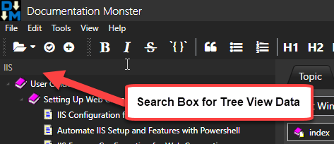

# Debouncing and Throttling Dispatcher Events


One thing I need quite frequently in Windows UI applications, is some way to manage events that are firing frequently, limiting the input based on a timeout. Rather than handling each and every event that fires I only want to handle one in a given timeout period or after a certain amount of idle time has passed.

These operations are called **debouncing** - where events are meant to be run out after an idle timeout has elapsed, or **throttling** - where events only fire in a specified interval. In both cases only the last event is fired.

### Debouncing?
Yeah I know - it's a terrible term that means practically nothing to most people. It's derived from an old computer hardware term. Specifically it has its origins computer IO switches that needed to be *debounced* in order to not produce signal overlap.

The best definition and differentiation I found is in this excellent [CSS-Tricks Blog Post](https://css-tricks.com/the-difference-between-throttling-and-debouncing/):

> ### Debouncing
> Debouncing enforces that a function not be called again until a certain amount of time has passed without it being called. As in "execute this function only if 100 milliseconds have passed without it being called".

> ### Throttling
> Throttling enforces a maximum number of times a function can be called over time. As in "execute this function at most once every 100 milliseconds".

In other word: Throttling fires events in specific timeout intervals, while debouncing only fires one event - the last event - each time the event stream times out.

##AD##

### Debouncing and Throttling Use Cases
Debouncing and Throttling is useful for just about any event that fires more frequently than what you actually need to or want to handle. Lots of UI events fire in rapid succession often producing thousands of events a second, and if you handle some of these events with any sort of expensive logic it's easy to bring an application's UI to a crawl. Debouncing or Throttling can help fire these events less frequently and still provide for handling the logic of the core event to process.

Here are a couple of practical examples that I often use Debouncing or Throttling for and I'll provide concrete examples at the end of this post:

* **Search Box Input**  
Debounce text input so a search operation doesn't fire while the user is still typing, but rather wait until after the user completes typing for a brief moment. This prevents me from firing filtering logic to apply the search filter - which can be slow -  after every keystroke.

* **Displaying Messages that Timeout**   
I often use Statusbar messages to display progress or status information to users and I want to have those messages time out with calls like `ShowStatus("Weblog post uploaded...",6000)` where the message goes away after 6 seconds and reverts to a default message. If you have multiple messages fired though within those 6 seconds the timeout fires in the middle of a still pending message. Debouncing ensures that only the last message timeout is applied and so the last message displayed is the one that eventually times out and goes away, while all the previous timeouts are ignored.

* **Resize Operations**  
Resizing of Windows or Panels in an application can fire a crazy amount of events and if your resize logic affects a large number of layout items it can easily cause some annoying UI stutter. Throttling with very short intervals can help break down events into few more manageable calls that allow updating the UI in intervals you specify.

### Debounce in .NET
There's no native functionality to provide debouncing or throttling in .NET. 

There's support for a Throttle function in  in the [Reactive Extensions](https://github.com/Reactive-Extensions/Rx.NET), but it looks like it actually implements Debounce behavior.

```
var input = searchTextChanged
    .Throttle(TimeSpan.FromMilliseconds(400))
    .Select(args => SearchText);
```    

Personally I'm not using RX much, and I certainly won't add it to an app just for this feature. It also looks like Throttle actually implements Debounce (go figure) rather than Throttling. If you are already using RX by all means apply RX operators to provide Debounce/Throttling behavior.

##AD## 

### Creating a DebounceDispatcher
Up until recently I've dealt with these throttling/debouncing scenarios primarily with custom logic. I'd add a timer, start and stop the timer. It's not overly complicated to do so, but it's a pain to add the properties and logic to each and every instance where this code is required.

In a recent conversation with [Markus Egger](http://www.codemag.com/People/Bio/Markus.Egger), he pointed out that he uses the [DispatcherTimer](https://msdn.microsoft.com/en-us/library/system.windows.threading.dispatchertimer(v=vs.110).aspx) for these sort of things, which in turn led me to wrap up some of the logic we discussed in an easy to reuse class.

The following `DebounceDispatcher` provides both `Debounce()` and `Throttle()` methods.

```cs
/// <summary>
/// Provides Debounce() and Throttle() methods.
/// Use these methods to ensure that events aren't handled too frequently.
/// 
/// Throttle() ensures that events are throttled by the interval specified.
/// Only the last event in the interval sequence of events fires.
/// 
/// Debounce() fires an event only after the specified interval has passed
/// in which no other pending event has fired. Only the last event in the
/// sequence is fired.
/// </summary>
public class DebounceDispatcher
{
    private DispatcherTimer timer;
    private DateTime timerStarted { get; set; } = DateTime.UtcNow.AddYears(-1);

    /// <summary>
    /// Debounce an event by resetting the event timeout every time the event is 
    /// fired. The behavior is that the Action passed is fired only after events
    /// stop firing for the given timeout period.
    /// 
    /// Use Debounce when you want events to fire only after events stop firing
    /// after the given interval timeout period.
    /// 
    /// Wrap the logic you would normally use in your event code into
    /// the  Action you pass to this method to debounce the event.
    /// Example: https://gist.github.com/RickStrahl/0519b678f3294e27891f4d4f0608519a
    /// </summary>
    /// <param name="interval">Timeout in Milliseconds</param>
    /// <param name="action">Action<object> to fire when debounced event fires</object></param>
    /// <param name="param">optional parameter</param>
    /// <param name="priority">optional priorty for the dispatcher</param>
    /// <param name="disp">optional dispatcher. If not passed or null CurrentDispatcher is used.</param>        
    public void Debounce(int interval, Action<object> action,
        object param = null,
        DispatcherPriority priority = DispatcherPriority.ApplicationIdle,
        Dispatcher disp = null)
    {
        // kill pending timer and pending ticks
        timer?.Stop();
        timer = null;

        if (disp == null)
            disp = Dispatcher.CurrentDispatcher;

        // timer is recreated for each event and effectively
        // resets the timeout. Action only fires after timeout has fully
        // elapsed without other events firing in between
        timer = new DispatcherTimer(TimeSpan.FromMilliseconds(interval), priority, (s, e) =>
        {
            if (timer == null)
                return;

            timer?.Stop();
            timer = null;
            action.Invoke(param);
        }, disp);

        timer.Start();
    }

    /// <summary>
    /// This method throttles events by allowing only 1 event to fire for the given
    /// timeout period. Only the last event fired is handled - all others are ignored.
    /// Throttle will fire events every timeout ms even if additional events are pending.
    /// 
    /// Use Throttle where you need to ensure that events fire at given intervals.
    /// </summary>
    /// <param name="interval">Timeout in Milliseconds</param>
    /// <param name="action">Action<object> to fire when debounced event fires</object></param>
    /// <param name="param">optional parameter</param>
    /// <param name="priority">optional priorty for the dispatcher</param>
    /// <param name="disp">optional dispatcher. If not passed or null CurrentDispatcher is used.</param>
    public void Throttle(int interval, Action<object> action,
        object param = null,
        DispatcherPriority priority = DispatcherPriority.ApplicationIdle,
        Dispatcher disp = null)
    {
        // kill pending timer and pending ticks
        timer?.Stop();
        timer = null;

        if (disp == null)
            disp = Dispatcher.CurrentDispatcher;

        var curTime = DateTime.UtcNow;

        // if timeout is not up yet - adjust timeout to fire 
        // with potentially new Action parameters           
        if (curTime.Subtract(timerStarted).TotalMilliseconds < interval)
            interval -= (int) curTime.Subtract(timerStarted).TotalMilliseconds;

        timer = new DispatcherTimer(TimeSpan.FromMilliseconds(interval), priority, (s, e) =>
        {
            if (timer == null)
                return;

            timer?.Stop();
            timer = null;
            action.Invoke(param);
        }, disp);

        timer.Start();
        timerStarted = curTime;            
    }
}
```

### Example Usage of Debounce
Let's look at a couple of Debounce use cases.

#### Search Text Box Filter
In many applications where there's list data I like to be able to filter the list data with a search box. For example, in the application in the Figure below I filter the topics of a documentation project:



This is a WPF application, so there are a couple of ways that the Debounce operation could be handled.

* Hooking up an Event Handler
* Hooking up to OnPropertyChanged() in the model

##### Event Handler
The most common way you're likely to use Debounce operations is by hooking an event handler using code like this:

```cs
private DebounceDispatcher debounceTimer = new DebounceDispatcher();
       
private void TextSearchText_KeyUp(object sender, KeyEventArgs e)
{
    debounceTimer.Debounce(500, (p) =>
    {                
        Model.AppModel.Window.ShowStatus("Searching topics...");
        Model.TopicsFilter = TextSearchText.Text;
        Model.AppModel.Window.ShowStatus();
    });        
}
```
This works, as long as the search value you are trapping is not bound to a model. So rather than using a model bound value, in the code above I explicitly use the KeyUp event to trap keystrokes and then debounce those keystrokes.

##### With Model Binding
If I'm using model binding like so:

```xml
 <TextBox Name="TextSearchText" 
          Text="{Binding TopicsFilter,UpdateSourceTrigger=PropertyChanged}" />
```

I can also trap the change binding in the model like this:

```cs
public string TopicsFilter
{
    get { return _topicsFilter; }
    set
    {
        if (value == _topicsFilter) return;
        _topicsFilter = value;
        OnPropertyChanged();

        // debounce the tree filter change notifications
        debounceTopicsFilter.Debounce(500, e => OnPropertyChanged(nameof(FilteredTopicTree)));
    }
}
private string _topicsFilter;
private readonly DebounceDispatcher debounceTopicsFilter = new DebounceDispatcher();
```

Notice the debouncing of the `OnPropertyChanged("FilteredTopicTree")` call, which is what eventually triggers the topic tree to reload the list with the new filter and then re-display the tree. This works great, although it's a bit unorthodox because it mixes some of the UI behavior into the model. However, in my case this is easily the best solution as it traps all cases where the search text is updated.

In this app the topic tree can be thousands of items and the re-render can take a few seconds. Unfortunately the overhead isn't the list retrieval which is pretty quick (half second for a few thousand records), but the actual data binding of the list is very slow (even with a virtualized tree). 

Without debouncing the search functionality with a project with more than few hundred topics would be unusable. With debouncing - even with a few thousand topics the search functionality works well.

> ####  @icon-info-circle WPF and the *Delay* Binding Property
> There's actually an easier way to do UI debouncing of binding events by using the WPF `Delay` binding property:
> ```
> Text="{Binding TopicsFilter,UpdateSourceTrigger=PropertyChanged,Delay=500}"
> ```
> which debounces the key input.

#### Fading Status Bar 
Another example I use in most UI apps is a resetting status bar, where I can display a `StatusMessage()` with a timeout:

```cs
ShowStatus("Weblog entry posted to {blogName}",8000);
```

After 8 seconds the status resets to the default *Ready* message. Without debouncing the issue is if I have multiple messages that have timeouts, the first one to complete will reset the message even if subsequent messages are still pending and shouldn't reset yet. By debouncing I can insure that only the last `ShowStatus()` call resets the message.

The implementation of this method with debouncing is quite simple and looks like this:

```cs
 private DebounceDispatcher statusDebounce = new DebounceDispatcher();

public void ShowStatus(string message = null, int milliSeconds = 0)
{
    if (message == null)
    {
        message = "Ready";
        SetStatusIcon();
    }

    StatusText.Text = message;

    if (milliSeconds > 0)
    {
        statusDebounce.Debounce(milliSeconds, (win) =>
        {
            var window = win as MainWindow;
            window?.ShowStatus(null, 0);
        }, this);
    }
    WindowUtilities.DoEvents();
}
```
##AD##

#### Throttling Window Resizing
In [Markdown Monster](https://markdownmonster.west-wind.com) the Window Resize operation causes various child panels to update themselves by resizing and re-organizing themselves. This resize can affect a lot of different controls and if left without any throttling, the display can get quite flickery. 

By throttling I can delay the resize events a bit and fire those resizing events a lot less frequently drastically reducing the resize flicker.

```cs
private DebounceDispatcher resizeThrottle = new DebounceDispatcher();
private void MainWindow_SizeChanged(object sender, SizeChangedEventArgs e)
{
    resizeThrottle.Throttle(5, parm => PanelRefresh());
}
```

Now the PanelRefresh fires only once every 5ms instead of tens of times per ms and the resizing operations are much smoother as a result. Yay!

### Summary
Debounce and Throttle are pretty useful. Once I created these I've sprinkled this code into various areas of applications where event management required some scaling back. The use cases I described above took quite a bit more code before and these helpers made this code much simpler. While looking around for implementations I didn't find much except a number of Reactive Extensions examples, which frankly looked more cryptic than my original  implementations.

Hopefully some of you may find this as useful as it's been for me.

### Resources
* [Debounce Dispatcher Code in Markdown Monster GitHub Repo](https://github.com/RickStrahl/MarkdownMonster/blob/master/MarkdownMonster/_Classes/Utilities/DebounceDispatcher.cs)
* [The Difference Between Throttling and Debouncing](https://css-tricks.com/the-difference-between-throttling-and-debouncing/)
* [The new Binding's Delay Property](http://www.jonathanantoine.com/2011/09/21/wpf-4-5-part-4-the-new-bindings-delay-property/)

<div style="margin-top: 30px;font-size: 0.8em;
            border-top: 1px solid #eee;padding-top: 8px;">
    
    this post created with 
    <a href="https://markdownmonster.west-wind.com" 
       target="top">Markdown Monster</a> 
</div>