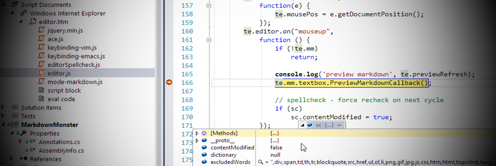
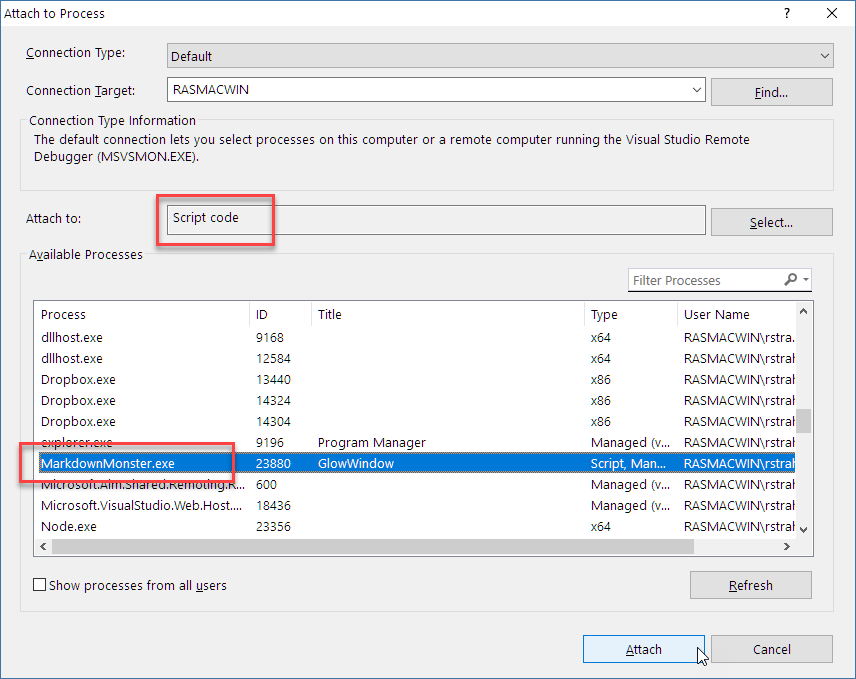
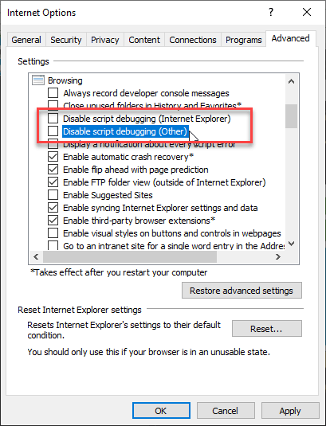

# JavaScript Debugging in a Web Browser Control with Visual Studio

Debugging an embedded Web Browser control in a Windows application can be a pain. The Web Browser control is essentially an embedded instance of the Internet Explorer engine, but it lacks any of the support (F12) tooling for debugging.

A few months ago [I posted a about using Firebug Lite to provide at least Console output](https://weblog.west-wind.com/posts/2017/Mar/08/Debugging-the-Web-Browser-Control-with-FireBug) to your JavaScript/HTML based  logic. This basically provides an integrated console - based on inline JavaScript - with full support for console logging output including deep object tree access for variables. If all you need is to access a few simple values to check state or other informational settings, this is certainly a quick and easy to go.

## Visual Studio Studio HTML Debugging
But if you need to debug more complex code, using Console based output can only get you so far. A few days ago I had introduced a regression bug into the spell checking code in [Markdown Monster](https://markdownmonster.west-wind.com) and man was it tricky to debug. Console debugging had me running in circles.

##AD##

Right around the same time [I got a comment on the Firebug Debugging post](https://weblog.west-wind.com/posts/2017/Mar/08/Debugging-the-Web-Browser-Control-with-FireBug?Action=ApproveComment&CommentId=299498#299498) that casually mentioned that you can use Script debugging in an EXE application by externally attaching a debugger to the EXE and then choosing Script Debugger. A bit of experimenting ensued...

I vaguely knew that Visual Studio can debug Internet Explorer code, but didn't put the pieces together to see how to do this with my own applications like [Markdown Monster](https://markdownmonster.west-wind.com) that are running an embedded Web Browser control. It didn't occur to me because standalone Windows projects like a WPF app don't offer script debugging as part of the debugging UI.

There are two ways to do this:

* [Attach Debugger to a running Process](#attach-debugger)
* [Enable Script Debugging in Internet Explorer Settings](#break-on-error-internet-explorer-options)

### Attach Debugger
You can start up Visual Studio and attach a debugger to an already running application that hosts the Web Browser control and specify you want to debug Script code. This works, but it's a bit tedious because you need to explicitly **attach the debugger** to a running process to do it. But since you are attaching to a process, it works with any kind of EXE application not just .NET applications, and it works even if you can't change and set breakpoints in the script code.

To set this up:

* Start up your application from Explorer or Command Line
* In Visual Studio use **Tools->Attach to Process**
* Attach the Debugger to Script Code
* Pick your EXE from the Process list

Here's what the Attach Dialog should look like:

### Break on Error Internet Explorer Options
The Web Browser control is essentially embedded Internet Explorer so Internet Explorer's options determine Web Browser behavior as well. One of the options available allows you enable script debugging. Actually it's more like  *disable the disable script debugging default option* :-).

To do this:

* Open Internet Explorer
* Go to Settings
* Go to the Advanced Tab
* Set both Disable script debugging to unchecked

Once enabled you can set `debugger` breakpoints in your script code and force a dialog that lets you choose the debugger you want to use. 

and that should plant you right at your breakpoint in Visual Studio.

> #### @icon-warning Script Debugging Dialog pops on All Errors
> Note that when script debugging is enabled like this, any error in the JavaScript code will trigger this dialog. 

##AD##

### Inside of Visual Studio
Once the debugger is attached, Visual Studio automatically tracks any scripts that are running in a **Script Documents** section in the Solution Explorer and you can open the document from there.

Markdown Monster uses HTML for the Markdown editor and also the preview so both of these pages and their scripts show up in the **Script Documents** section immediately.

Now to debug code:

* Open the script file from **Script Documents** *(not from your project!)*
* Set a breakpoint anywhere
* Run your code to the breakpoint
* Examine variables by hovering
* Fix broken sheiit
* Go on with your bad self!

To open the JavaScript Console and DOM Explorer:

* Type **JavaScript Console** into Quick Launch
* Type **DOM Explorer** into Quick Launch

Here's what all of this (minus the DOM Explorer) looks like in Visual Studio:

Once you have a breakpoint set you can examine variables and drill into objects just like you'd expect to do in Visual Studio.

You can also open the JavaScript Console which gives you interactive access to the document and script code running in it - just as you would with the regular F12 tools in Internet Explorer. There's also a DOM Explorer that lets you drill into any open document's DOM tree and CSS. These two features use the same F12 tools that you use in full Internet Explorer, just planted into Visual Studio. Usually this wouldn't be so exciting since the F12 tools work fine in IE, but since the Web Browser Control doesn't have a shell and hence no F12 tools support, this fills a big glaring hole in Web Browser Control development.

### Watch where you make Code Changes!
If you look at my screen shot you can see that the script file debugged is open and I can edit this file and make changes - if I reload the page (or open a new document in Markdown Monster for example) the change shows up in the executing code. 

But be aware that the path to the script file will be in the **application's deployment folder**, not the file that might live in your project.

In Markdown Monster the Editor and Preview JavaScript code is part of my .NET project as content files that are copied to the output folder when the project builds.

When you debug with the Visual Studio debugger, the files in **Script Documents** are the actual files running, which are in the deployment folder (ie. `\bin\Release`). So **if you make changes to a script file, make sure you copy those changes back to your project folders after you're done debugging** or else the changes are simply overwritten the next time you compile your project. 

You've been warned! :-)

I say this because I've done this more than a few times in the past - debugged my files made some changes, then recompiled the .NET project and: *Faaaark!*, I just overwrote my changes. Don't let that happen to you. 

## Debug This!
Having full debugging support for the Web Browser Control in my own Windows applications is going to make my life a lot easier. I've made do with Console output based debugging for a long time and while it's a huge step up from no debug support at all it can be tedious. Using the full debugger is a huge leg up when dealing with more complex code  in JavaScript.

After I hooked up the debugger in Visual Studio I found my Spellcheck issue in Markdown Monster in a matter of a couple of minutes after previously spending well over an hour with trying to find the right `console.log()` calls to try and trace down the bug. 

**Attach to Process** is a bit tedious but it works with **any** executable - it doesn't have to be a .NET application like my WPF Markdown Monster app. I have an ancient FoxPro application that also use the Web Browser control and I can debug the HTML/JavaScript code the same way in Visual Studio. Heck even an old MFC application Web Browser would be debuggable this way. 

**Internet Explorer Options** setup is probably a better way if you control the script code you are debugging as you can just enable it and set breakpoints with `debugger` statements to get into Visual Studio to debug. I find myself using this approach now primarily, after I forgot how to get that enabled in the IE options (thanks to Ian's comment).

What would be even nicer if Visual Studio allowed you to debug Script code as part of running a .NET application, but that option sadly is not available so one of the other approaches is needed to get into Visual Studio's script debugger.

Awesome! Thanks to [@Donnchadha](https://weblog.west-wind.com/posts/2017/Mar/08/Debugging-the-Web-Browser-Control-with-FireBug#299554) for pointing me in the right direction.

    
    this post created with 
    <a href="https://markdownmonster.west-wind.com" 
       target="top">Markdown Monster</a> 

