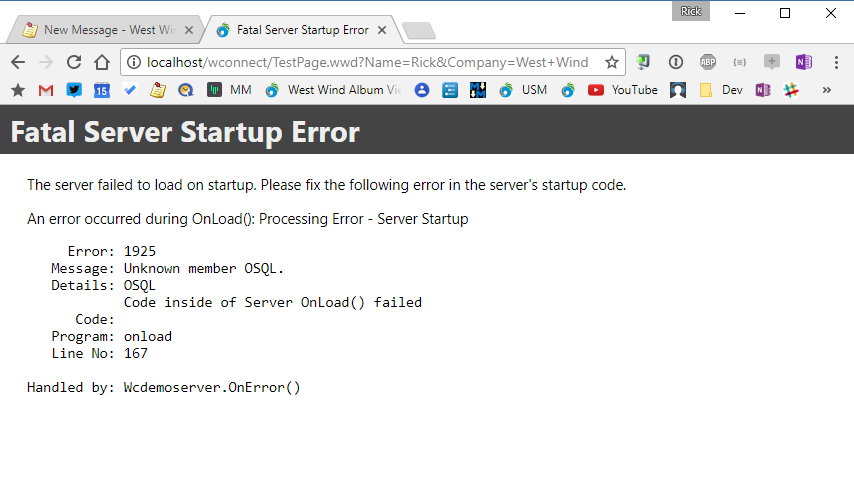

# Web Connection 6.15 Release is Here
It's time for another Web Connection update with version 6.15 hitting the release mark. This update is 


Inspired by [a recent discussion with Brett Carraway on the message board](https://support.west-wind.com/Thread4Y80K5LGN.wwt) I've made a bunch of changes in the way [Web Connection](https://west-wind.com/webconnection/)'s startup code works. 

Startup code debugging - especially in production and in COM Mode - has been notoriously difficult to debug because of the way Web Connection fires server initialization code that happens as part of the server's `Init()` constructor. Due to this implementation getting error information about startup failures - especially under COM - can be difficult to track down, because there's no instance on an error, there's also no error information available to pass back to the COM host.

Because startup code fires in the constructor you often just end up with nondescript COM errors like **Unable to retrieve Server Instance** or **COM Server Execution Error**.

### A quick Refresher on Web Connection Server Loading
Web Connection exposes both an `OnInit()` and `OnLoad()` event hook that you can hook user code to. Both methods fire once on server startup.  `OnInit()` is meant for low level server configuration - basically where to find the configuration file. You rarely change this method from what the default template generates. `OnLoad()` is meant for letting you configure your application's environment, which means setting paths with `SET PATH`, loading classes and procedure files, opening global connections, mapping drives etc. - all the stuff your application needs. Currently, if there's an error in your user code, the server will never load, and you will get a nondescript error message.

### New Feature: Separating OnInit() and OnLoad()
The new features coming in Web Connection 6.15 separate the initial server instantiation code in `OnInit()`, and the more application specific application configuration in `OnLoad()` into separate operations. `OnLoad()` now fires as part of the request pipeline, when the first request comes in, rather than as part of the constructor. Since most of the processing that can fail during startup is likely to be application specific code this will make it much easier to trap and report on errors that occur during the `OnLoad()` phase. `OnInit()` will still fail as before since they are still running inside of the constructor.

Don't worrry - these changes won't affect application level code. If you have existing `OnInit()` or `OnLoad()` code, that code will continue to run as is - no changes required. The changes only affect the underlying Web Connection Server plumbing and not your code.

Before I look at the new features and what they do in more detail, let's discuss the issues related to startup code debugging.

### Startup Code Issues in Web Connection
Runtime startup code debugging is one of the trickiest things with Web Connection. Why? Because of the way Web Connection works, the entire server bootstrap and load process occurs in the `Init()` constructor code of the FoxPro server. This means if **anything** goes wrong at all, the server will not load, and more importantly, the server has no way to report error information back to the Web Connection Module and ultimately the IIS page that gets generated. When errors occur during initialization you typically just get nondescript COM errors and 500 error page from IIS. Not so helpful that.

All of this happens because Web Connection currently fires `OnInit()` and `OnLoad()` in the FoxPro `Init()` constructor function. Any code failure in `Init()` in FoxPro fails to produce an instance, and when running the server in COM mode produces a COM Error that doesn't forward any information about what went wrong. While Web Connection can and does capture exceptions in the load sequence, it has no way to report that error back to the Web Connection module because no instance has been created yet. Even `COMRETURNERROR` doesn't work, because it needs to have an instance in order to work first.

So in current versions the only way to get error information is via logs. Startup errors are logged in `wcTracelog.txt` in the server EXE's folder (assuming permissions are available) as well as in the `wwRequestLog`. Today you can also use [Server::Trace()](https://west-wind.com/webconnection/docs/_4ax0u7iq5.htm) to write Debug statements to the `wcTracelog.txt` file for debug type log output that can often help trace where code is reaching and what current values are. It works but is tedious if you're flying blind.

* **Development Mode - Code stops on error**  
While in development that's usually not a problem. If something goes wrong you see the error and FoxPro stops which is perfect. You can see what happens and you can step through the code as necessary. This works fine and was never really a problem.

* **Production File Mode Startup - Error Dialogs**  
Running in File Based mode will still produce an exception that can often shows up as a `WAIT WINDOW` on the interactive desktop instance of the Web Connection server. While that's not super helpful, it's better than nothing and often can give you a clue as to what's happening.

* **Production COM Server Startup - No Error Info**  
COM Servers are even worse. Because the code that runs `OnInit()` and `OnLoad()` behaviors in the FoxPro Server's `Init()` constructor, an error anywhere in that code simply causes the server loading to fail with what amounts to an unknown COM error. Even though Web Connection captures and tracks the error that occurred, it can't report the error in any way because there's no instance to read the error information off of.

In either COM or file based modes if you're running in production you often don't have easy access to the server, so even if there some sort of error message displayed, you may not see it. With COM, typically there's no interactive UI so there's nothing to see.

That leaves the log files which again you have to look at on the server to debug.

### Current Version Workarounds for Startup Errors - Tracing
In Web Connection 6.0 I introduced server tracing via the [Server::Trace()](https://west-wind.com/webconnection/docs/_4ax0u7iq5.htm) method. There are two modes for this:

* Automatic Server Error Logging in `wcTracelog.txt`
* Trace Logging for your own code

#### Automatic Trace Error Log
Web Connection automatically writes to the log file if a server load error occurs. As long as your server has rights to write in the server's startup folder `wcTracelog.txt` is filled with the error info and usually that will give you a good clue what's going wrong. But this file lives on the server and you have to access it and when you fire up your server at first you still end up with a nasty and unhelpful COM error.

Error tracelog output looks something like this:

```txt
07/01/2017 06:54:09 PM - Processing Error - Server Startup

<PRE>
     Error: 1925
   Message: Unknown member OSQL.
   Details: OSQL
            Code inside of Server OnLoad() failed
      Code: this.oSql.Execute("select * from users")
   Program: onload
   Line No: 167

Handled by: Wcdemoserver.OnError()<br>
</PRE>
```

#### Explicit Trace Logging by your Code
If you know you have a problem in your startup code and you need to debug it in a production application - because **'it works on my machine'**, but not on the server of course - you can use the [Server.Trace()](https://west-wind.com/webconnection/docs/_4ax0u7iq5.htm) method to write out state messages that let you see how far your code gets and lets you echo out messages.

Tracelog output can be written like this (in Server code in `OnLoad()` or `OnInit`):

```foxpro
this.Trace("Entering OnInit()")
```

and output looks something like this:

```txt
07/01/2017 06:54:09 PM - Entering OnInit()
07/01/2017 06:54:09 PM - Completed OnInit()
07/01/2017 06:54:09 PM - Completed OnLoad()
07/01/2017 06:54:09 PM - Initialized Sql
```

Using tracing it's possible to debug server code, but it's not optimal of course. In order to make any changes to the log output you have to change your code and you have to recompile and redeploy your server, which can be a pain.

### Web Connection 6.15 Improvements
In Web Connection 6.15 the way Web Connection fires the `OnLoad()` event changes. No longer will the event be fired as part of the server's constructor/`Init()` code. Rather Web Connection now fires the `OnLoad()` as part of the first request that is directed against the server. There's now a flag in the server class that does essentially this:

```foxpro
*** Now do server load Configuration
IF (this.lInStartup)
   THIS.OnLoadInternal()
ENDIF
```

The `lIsInStartup` flag is `.t.` initially and set to `.f.` as part of `LoadInternal()`. `LoadInternal()` is a wrapper around your `OnLoad()` hook method, which traps errors and if an error occurs handles that error by logging it and setting a `lStartupError` flag.

This flag is checked just before the request would normally be processed:

```foxpro
IF (this.lStartupError)   
    lcHtml = this.ErrorMsg(;
    		"Fatal Server Startup Error",;
    		"<p>The server failed to load on startup. Please fix the following error in the server's startup code.</p>" + ;
   	        "<p>An error occurred during OnLoad(): "+ this.cErrorMsg) + "</p>"
	this.SendServerResponse(lcHtml)	
ELSE
   ****************************************************************
   *** NOW CALL THE USER CODE - PROCESS IS NON FRAMEWORK ENTRYPOINT 
   ****************************************************************
   IF THIS.lDebugMode OR this.lUseErrorMethodErrorHandling 
      .Process()
   ELSE
      TRY 
         .Process()         
      *** IN theory no errors should occur here
      *** because wwProcess handles its own errors
      CATCH TO loException
         THIS.OnError(loException)
      ENDTRY
   ENDIF   
ENDIF
```

If an error occurs you then see an error page like this:



This error page is permanent - any subsequent requests will display this error until the startup error is fixed.

Under the old behavior the server would have never loaded - now the server has loaded but the error information is now available and can be displayed on this error page and you know what to fix at this point. Request data is still logged.

### Faster COM Server Loading
Because COM servers no longer have to hit your `OnLoad()` code before returning an instance to COM, COM Servers can load more quickly. Instances pop up much quicker and are ready to process requests **before** all servers have fired their `OnLoad()` code. This is especially true if you have time consuming startup or initialization code in `OnLoad()` which is now delayed until the first hit goes against the server. This can also get around timeout issues with slow load code (which previously was capped at 10 seconds for all servers as a group).

### Parallel COM Server Loading
In addition the new version now loads COM servers in parallel so servers load much quicker as code no longer has to wait for each of the servers to load in sequence. 

Combined with the reduced startup overhead of not having to run the `OnLoad()` code, server initialization is significantly faster than before especially for servers that have slow loading initialization code for setting up things like first SQL connections or remote share file access.

### Related Improvement: Dynamic Instance Configuration on Module Admin Page
Since I've been dealing with instance performance improvements another small enhancement comes in the form a new Web Connection Module Administration configuration option on the .NET Module admin page: You can now dynamically configure the instance count right on the Admin page:


This option updates the `ServerCount` configuration and immediately updates the pool count. 

> #### @icon-warning .NET Module Only
> This feature works only with the .NET Module. The ISAPI DLL does not support this functionality.


### Locked and Loaded
These improvements have come up in discussions on a few occasions in the past and I hope they will make life easier for you. Debugging startup errors is one of a few common issues I frequently get support calls for, so hopefully this will cut down on that end of things.

These features will be provided in Web Connection 6.15 which is scheduled for later this month. 


<div style="margin-top: 30px;font-size: 0.8em;
            border-top: 1px solid #eee;padding-top: 8px;">
    
    this post created with 
    <a href="https://markdownmonster.west-wind.com" 
       target="top">Markdown Monster</a> 
</div>