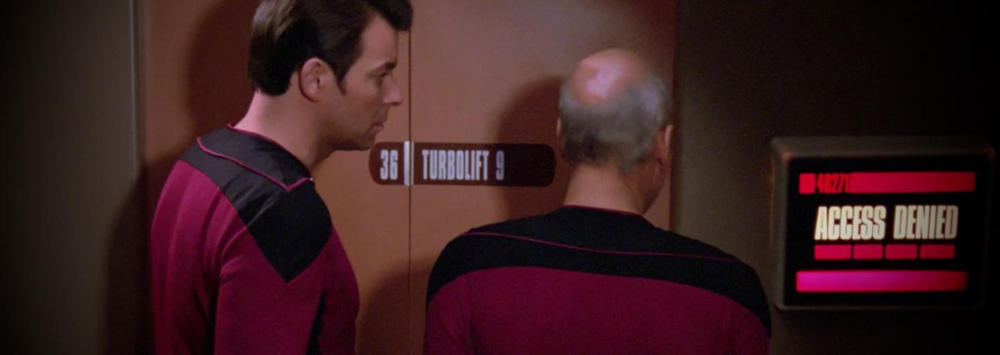
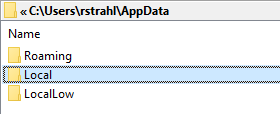
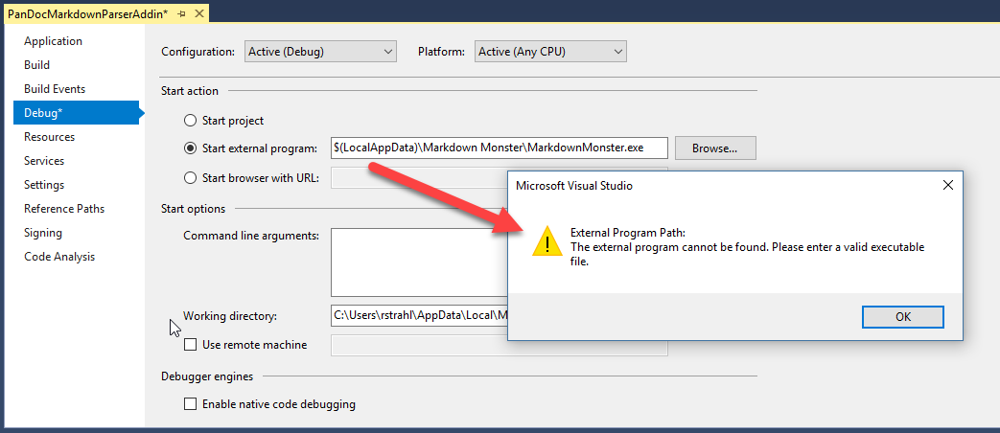
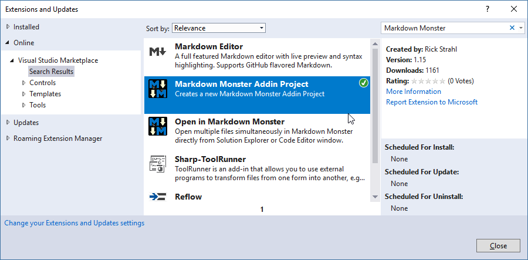
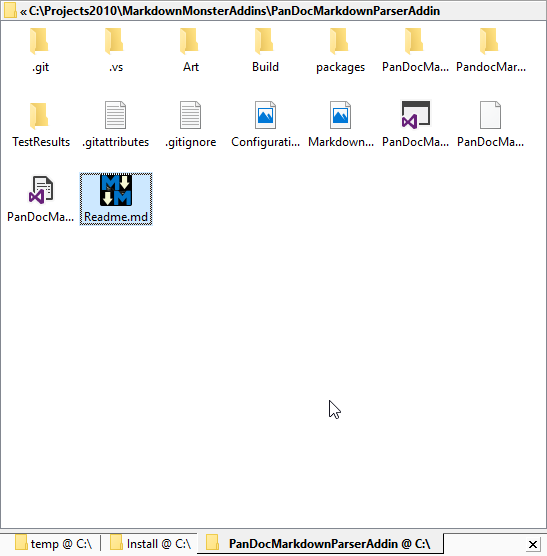
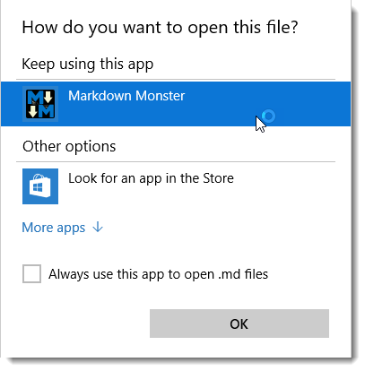

# Updating the Markdown Monster Installer for non-Admin Installation



A couple of weeks ago I updated [Markdown Monster](http://markdownmonster.west-wind.com/) to run as a fully portable application that no longer requires administrative privileges to install. Yay! The installer now doesn't trigger admin elevation and the resulting installation is a free standing install that can either be installed with the Installer or installed as a portable install simply by copying files out of a Zip folder. There are also corresponding Chocolatey installers for both [full](https://chocolatey.org/packages/MarkdownMonster) and [portable](https://chocolatey.org/packages/MarkdownMonsterPortable) installs.

The full installer still installs a few settings in the registry and desktop shortcuts etc, but all of the important registry settings are now made in the User's Registry hive and are totally optional. If using a Portable install or simply copying files, Markdown Monster checks for each of these configuration settings on startup and internally sets them as part of the startup. 

I've been surprised that there have been a lot of requests for having an admin-less install. Personally I prefer a full install that shows up in **Programs and Features** with full uninstall support, but now with these changes I can actually have an admin-less install and still get that system installer registration. Meet the cake... and Im eating it!

It's been a slow process getting here - knocking off one feature at a time, some of which (namely the extension mapping) I thought weren't actually possible as non-admin feature, as they aren't well documented. But I'm excited to see that Markdown Monster now runs of a very light touch installer. In this post I describe the various steps of making the existing install work which might give those of you that want to do something similar the tools to do the same.

##AD##

### Moving Folder Location
Originally Markdown Monster was installed in Program Files (x86). Installing an application in this folder hierarchy automatically means that the installer has to run as an Administrator in order to be able to write files in that folder structure (unless the user has changed permissions explicitly). The typical installer ideology is that Program Files is meant for statically installing an application that after install cannot be changed.

The main brunt of the recent update which included the move to the Admin-less install in version 1.4, is about the new location in the `%LocalAppData%\Markdown Monster` folder. LocalAppData is the 'fixed' user specific folder for a given user. The interactive user has full rights there and can read and write files. Note that there are 3 'AppData' folders:



Typically you use `%AppData%` which maps the to the **Roaming** profile for user storing user data. Markdown Monster stores its configuration settings, installs Addins and their configurations here. `%LocalAppData%` maps to the **Local** folder and it's meant to house truly locally maintained data that is user and machine specific. In this case Markdown Monster installs here as each install is done locally on each machine. Frankly, I'm not sure what **LocalLow** is used for - on my machine I see only very few files there and they all look temporary and cached files.

Markdown Monster installs in `%LocalAppData%` which allows installation without admin privileges. Files are simply copied into this folder and the application can run even if there's no installer at all.

> #### @icon-car Portable Installation
> If you want a truly portable installation of Markdown Monster you could actually install the files in your DropBox, OneDrive or GoogleDrive folder and run it from there. It'd be available on any Windows machine that has Dropbox installed and MM will automatically configure itself the first time it runs. Missing are only shortcuts

#### Installer Preferred
I do recommend the installer to properly install **and** uninstall the various registry settings and files, but if desired the portable install can be installed from a simple file based zip archive and placed anywhere on disk to run. When running using the portable install the handful of registry settings in `HKEY_CURRENT_USER` are made by the Markdown Monster executable itself, which also means they won't be 'uninstalled'.

There were a few hiccups related to the new file locations. The main one being that addins could previously rely on a fixed location in `c:\program files (x86)` or `%ProgramFiles%` when pointing to the main project's dependencies required for addins. Now the path will be different depending on user.

Initially I thought that you can't using paths like `$(LocalAppData)` in the various project dialogs like the Debug settings. If you do you get this error:



Luckily it turns out that this is a bug in the Visual Studio IDE, but is supported in the project file (.csproj.user for the Debug settings):

```xml
<PropertyGroup Condition="'$(Configuration)|$(Platform)' == 'Debug|AnyCPU'">
    <StartAction>Program</StartAction>
    <StartProgram>$(LocalAppData)\Markdown Monster\MarkdownMonster.exe</StartProgram>
    <StartWorkingDirectory>$(LocalAppData)\Markdown Monster</StartWorkingDirectory>
</PropertyGroup>
```

When the project loads the value expands out to the full file path (ie. `c:\user\ricks\Markdown Monster`) and displays that way in the UI. If the path is not changed, the original `$(environmentVar)` value stays intact. But if you edit/change the value you're back to having to specifying an explicit paths with templated paths not working.

This applies the debug path, build output and document paths as well as referenced assembly paths:

```xml
  ...
  <PropertyGroup Condition=" '$(Configuration)|$(Platform)' == 'Debug|AnyCPU' ">
    <DebugSymbols>true</DebugSymbols>
    <DebugType>full</DebugType>
    <Optimize>false</Optimize>
    <OutputPath>$(AppData)\Markdown Monster\Addins\PanDocMarkdownParser\</OutputPath>
    <DefineConstants>DEBUG;TRACE</DefineConstants>
    <ErrorReport>prompt</ErrorReport>
    <WarningLevel>4</WarningLevel>
  </PropertyGroup>
  <PropertyGroup Condition=" '$(Configuration)|$(Platform)' == 'Release|AnyCPU' ">
    <DebugType>pdbonly</DebugType>
    <Optimize>true</Optimize>
    <OutputPath>$(AppData)\Markdown Monster\Addins\PanDocMarkdownParser\</OutputPath>
    <DefineConstants>TRACE</DefineConstants>
    <ErrorReport>prompt</ErrorReport>
    <WarningLevel>4</WarningLevel>
  </PropertyGroup>

  <ItemGroup>
    <Reference Include="Newtonsoft.Json">
      <HintPath>$(LocalAppData)\Markdown Monster\NewtonSoft.Json.dll</HintPath>
      <Private>False</Private>
    </Reference>
    <Reference Include="Westwind.Utilities">
      <HintPath>$(LocalAppData)\Markdown Monster\Westwind.Utilities.dll</HintPath>
      <Private>False</Private>
    </Reference>
    <Reference Include="MarkdownMonster">
      <HintPath>$(LocalAppData)\Markdown Monster\MarkdownMonster.exe</HintPath>
      <Private>False</Private>
    </Reference>
    ...
```

### Tracking Startup Path
It should be pretty obvious, but it's important to not hard code or *deduce* the application's startup path at this location can (and has - twice) move.

It's tempting to just assume you can figure out the startup path (there are a few situations where MM can change paths temporarily - especially in addins) so having a consistent path to return is key.

Markdown Monster determines where it's starting from, keeps track of that folder and makes it easily available in a static variable. So even if the path has changed it can get back to the initial launch folder:

```cs
public partial class App : System.Windows.Application
{
    public static string InitialStartDirectory;

    public App()
    {
        SplashScreen splashScreen = new SplashScreen("assets/markdownmonstersplash.png");
        splashScreen.Show(true);
    
        InitialStartDirectory = Environment.CurrentDirectory;
    
        ...
    }
    
    ...
}
```        

This ensures that the initial startup directory is **always** available via `App.InitialStartupDirectory`. Because this is the case there were no hiccups in Markdown Monster itself when the path changed - only in some of the dependencies like Addins that didn't use this setting.

##AD##

### Updating the Addin Template
A related issue came up when the project default path was changed and that Addins now have to look for their dependencies for development in a different place. After moving my Markdown Monster installations into a new folder I found that all of my addin projects in Visual Studio won't build because the addins look for Markdown Monster assemblies in the hardcoded Program Files folder rather than the new LocalAppData folder.

In addition Markdown Monster also provides a [Markdown Monster Visual Studio Addin Project Template](https://marketplace.visualstudio.com/items?itemName=RickStrahl.MarkdownMonsterAddinProject) that makes it very easy to create a new addin and this template too hardcoded the Program Files location. The template has been updated with a dynamic value now so the Project Template now does the right thing.

You can download the [Markdown Monster Addin Project Template from the Visual Studio Market Place](https://marketplace.visualstudio.com/items?itemName=RickStrahl.MarkdownMonsterAddinProject) or directly from within the Visual Studio using the Extension Manager:



The good news is that the above environment variable project extensions work great and I was able to use 
them to update the Markdown Monster Addin Template project with these expansions - $(LocalAppData) and $(AppData) so that addin projects remain portable across machines when pulling from GitHub or simply copying projects. 

When creating an Addin, Markdown Monster needs to generate a new project with various references and the output folder and debug path already pre-configured so when you create the new template you can immediately compile the code and run it in the debugger (debugging starts the Markdown Monster exe and then lets you debug the addin through that main executable). 

### Registry Hacks: Removing HKEY_LOCAL_MACHINE
From the installer perspective the main reason I didn't even consider moving away from an Admin install for so longer after getting many requests for it is that I figured that i needed to write a few registry keys into the HKEY_LOCAL_MACHINE hive that requires admin privileges. It turns out that other than hardware settings most software operational settings can be set in HKEY_CURRENT_USER. Most examples however don't show this - most examples you see write to HKEY_LOCAL_MACHINE.

Markdown Monster sets three types of settings in the registry:

* Internet Explorer Browser Emulation
* File extension mappings for `.md` and `.markdown` extensions
* Adds to the user's path

Initially I thought none of these were available for user access, but it turns out they all are.

#### Internet Explorer Browser Emulation
Markdown Monster relies heavily on the Web Browser control. The editor tabs use the browser to host an [ACE Editor](https://ace.c9.io/) instance to provide most editing features. MM then provides many additional features that interact with the document using DOM to .NET COM interop. The Preview window is used to preview rendered HTML and it too has a number of custom interactions with the .NET application that allows for scroll syncing and a few other things.

All of this functionality requires that the Web Browser control runs a current version of IE rather than the default IE 7.0 (yes you read that right). While you can get away with the [Edge Meta Tag](https://stackoverflow.com/questions/6771258/what-does-meta-http-equiv-x-ua-compatible-content-ie-edge-do), for simple things, there are many limitations with it, especially if you're doing Interop between .NET and the browser's DOM as Markdown Monster does extensively. 

[Browser Emulation using registry keys](https://weblog.west-wind.com/posts/2011/may/21/web-browser-control-specifying-the-ie-version) allows overriding the default IE 7.0 rendering with IE 11 (or latest on earlier versions) in order to provide proper HTML 5 support and having the browser report the correct user agent for that version, which can be important if you're using third party libraries that rely on it. ACE Editor uses browser detection for a few things that otherwise are not possible and using Edge mode only made a number of things in the editor fail.

Here's what gets set for Browser Emulation using my [Inno Install script](https://github.com/RickStrahl/MarkdownMonster/blob/master/Install/MarkdownMonster.iss):
```txt
[Registry]
Root: HKCU; Subkey: "Software\Microsoft\Internet Explorer\Main\FeatureControl\FEATURE_BROWSER_EMULATION"; ValueType: dword; ValueName: "MarkdownMonster.exe"; ValueData: "11001"; Flags: createvalueifdoesntexist
```

#### File Extension Mapping
One thing I think is very important for any type of editor is the ability to open files based on file extensions. Windows lets you register an application for a specific file extension and those extensions then become available when you try to open a file with that extension. You see the primary mapping in Explorer with its associated icon:



If no extensions exist the application is just assigned to the extension as the default.  Otherwise the new application extension mapping is registered, but the old editor is still used by default. However, Markdown Monster now shows up as a supported extensions on the ] **Open With...** which shows all the applications that are registered for the give extension at the top, with other non-generic options below.



To get extensions mapped requires a few entries in the registry. You register the *Application* by name and then one or more extensions that map to that application name. 

Here's what this looks like in Inno:

```txt
[Registry]
; File Association for .md and .markdown
Root: HKCU; Subkey: "Software\Classes\.md";                             ValueData: "{#MyAppName}";          Flags: uninsdeletevalue; ValueType: string;  ValueName: ""
Root: HKCU; Subkey: "Software\Classes\.markdown";                       ValueData: "{#MyAppName}";          Flags: uninsdeletevalue; ValueType: string;  ValueName: ""
Root: HKCU; Subkey: "Software\Classes\{#MyAppName}";                    ValueData: "Program {#MyAppName}";  Flags: uninsdeletekey;   ValueType: string;  ValueName: ""
Root: HKCU; Subkey: "Software\Classes\{#MyAppName}\DefaultIcon";        ValueData: "{app}\{#MyAppExeName},0";               ValueType: string;  ValueName: ""
Root: HKCU; Subkey: "Software\Classes\{#MyAppName}\shell\open\command"; ValueData: """{app}\{#MyAppExeName}"" ""%1""";  ValueType: string;  ValueName: ""
```

I've used these settings for years, but set them in `HKEY_ROOT` - most of the **horrible** documentation and examples you find on registering extensions describes setting these values in `HEKY_ROOT`. 

But it turns out that the values are also mapped in `HEKY_CURRENT_USER\Software\Classes` and that works great to provide admin-less installation for the same behavior.

#### User's Environment Path
Another useful feature is that you can start Markdown Monster from the **Windows Command Prompt** or **Powershell**, as it registers itself on the path. You can do a few different things:

```dos
mm readme.md
mm c:\temp\readme.md
mm .
mm c:\temp\docs
```

You can open individual files either with relative paths, or explicit paths. You can also open folders in the same fashion which open the [Markdown Monster Folder Browser](http://markdownmonster.west-wind.com/docs/_4wu1cjyka.htm) with that folder selected, which is quite handy. I do this with VS Code for code projects all the time, but it also works really well with documentation projects where I use Markdown Monster.

Note that you can just run `mm` or `markdownmonster` from the command line because the path is added to the user's path during installation (or first launch).

Using Inno here's what this setting looks like:

```txt
Root: HKCU; Subkey: "Environment"; ValueType: expandsz; ValueName: "Path"; ValueData: "{olddata};{localappdata}\{#MyAppName}" ; Check: NeedsAddPath('{localappdata}\{#MyAppName}')
```

##AD##

### Using Code to Set the Registry
In the current version of Markdown Monster, the installer still creates these keys, but what's nice about these keys all living in `HKCU` these keys can also be set programmatically. When not installing Markdown Monster with the full install using either an xcopy deploy or a portable install, Markdown Monster sets these registry values via code. During startup MM checks to see if a key exists and if it doesn't goes ahead and creates it.


Here's the code in a `ComputerInfo` helper class that provides these operations:
```cs
public static void EnsureBrowserEmulationEnabled(string exename = "Markdownmonster.exe")
{

    try
    {
        using (
            var rk =
                Registry.CurrentUser.OpenSubKey(
                    @"SOFTWARE\Microsoft\Internet Explorer\Main\FeatureControl\FEATURE_BROWSER_EMULATION", true)
        )
        {
            dynamic value = rk.GetValue(exename);
            if (value == null)
                rk.SetValue(exename, (uint) 11001, RegistryValueKind.DWord);
        }
    }
    catch
    {
    }
}

public static void EnsureAssociations(bool force = false)
{
    dynamic value = null;

    string pf = Environment.CurrentDirectory;
    //.GetFolderPath(Environment.SpecialFolder.ProgramFilesX86);


    if (!TryGetRegistryKey("Software\\Classes\\Markdown Monster", null, out value, true))
    {
        using (var rk = Registry.CurrentUser.CreateSubKey("Software\\Classes\\Markdown Monster", true))
        {
            rk.SetValue(null, "Program Markdown Monster");
        }
    }
    else
    {
        if (!force)                    
            return; // already exists
    }

    if (!TryGetRegistryKey("Software\\Classes\\Markdown Monster\\shell\\open\\command", null, out value, true))
    {
        using (var rk = Registry.CurrentUser.CreateSubKey("Software\\Classes\\Markdown Monster\\shell\\open\\command", true))
        {
            rk.SetValue(null, $"\"{pf}\\MarkdownMonster.exe\" \"%1\"");
        }
    }

    if (!TryGetRegistryKey("Software\\Classes\\Markdown Monster\\DefaultIcon", null, out value, true))
    {
        var rk = Registry.CurrentUser.CreateSubKey("Software\\Classes\\Markdown Monster\\DefaultIcon", true);
        rk.SetValue(null, $"{pf}\\MarkdownMonster.exe,0");
    }


    if (!TryGetRegistryKey("Software\\Classes\\.md", null, out value,true))
    {
        var rk = Registry.CurrentUser.CreateSubKey("Software\\Classes\\.md");
        rk.SetValue(null, "Markdown Monster");                
    }

    if (!TryGetRegistryKey("Software\\Classes\\.markdown", null, out value, true))
    {
        using (var rk = Registry.CurrentUser.CreateSubKey("Software\\Classes\\.markdown"))
        {
            rk.SetValue(null, "Markdown Monster");
        }
    }

    
}

public static void EnsureSystemPath()
{
    try
    {
        using (var sk = Registry.CurrentUser.OpenSubKey("Environment", true))
        {
            string mmFolder = Path.Combine(Environment.GetFolderPath(Environment.SpecialFolder.ProgramFiles),
                "Markdown Monster");
            string path = sk.GetValue("Path").ToString();
            if (!path.Contains(mmFolder))
            {
                var pathList = path.Split(new char[] {';'}, StringSplitOptions.RemoveEmptyEntries).ToList();
                pathList.Add(mmFolder);
                path = string.Join(";", pathList.Distinct().ToArray());

                sk.SetValue("Path", path);
            }
        }
    }
    catch
    {
    }
}

public static bool TryGetRegistryKey(string path, string key, out dynamic value, bool UseCurrentUser = false)
{
    value = null;
    try
    {
        RegistryKey rk;
        if (UseCurrentUser)                
            rk = Registry.CurrentUser.OpenSubKey(path);                
        else
            rk = Registry.LocalMachine.OpenSubKey(path);

        if (rk == null) return false;
        value = rk.GetValue(key);
        return value != null;
    }
    catch
    {
        return false;
    }
}
```

Then in the applications `OnStartup()` code these operations are run in the background so as to not slow down startup:

```cs
new TaskFactory().StartNew(() =>
{
    ComputerInfo.EnsureBrowserEmulationEnabled("MarkdownMonster.exe");
    ComputerInfo.EnsureSystemPath();
    ComputerInfo.EnsureAssociations();

    if (!Directory.Exists(mmApp.Configuration.InternalCommonFolder))
        Directory.CreateDirectory(mmApp.Configuration.InternalCommonFolder);
});
```

### Summary
It's been a bit of a journey to get all the pieces in place to be able to run and install the application without requiring any elevation. Getting an application to work without admin is usually easy enough, but making sure an install can live without having to elevate and effectively run as a portable, xcopyable application requires a few more tweaks. This is especially true if you use an installer which almost always will by default dump your installs into Program Files.

Alas, I'm happy to see this work out as now Markdown Monster has become a portable application out of the box. Even if you used an installer to install it, you can xcopy to a USB stick and move it to a new machine, xcopy to a new install location and it will work, and even set some of the 'installer settings' that you would normally see with an installer. The one downside is that there's currently no way for the non-installed version to clean up its meager registry settings after uninstall - that only works if using the installer.

So this is a long-winded post to describe some of the things you're likely to run into if you are thinking of making your installer not require admin rights. And... as usual writing this down serves as a reminder for me in the future on what needs to be done to repeat this process with another application. I hope some of you find this as useful as I likely will a couple of years from now on another desktop project :smile: