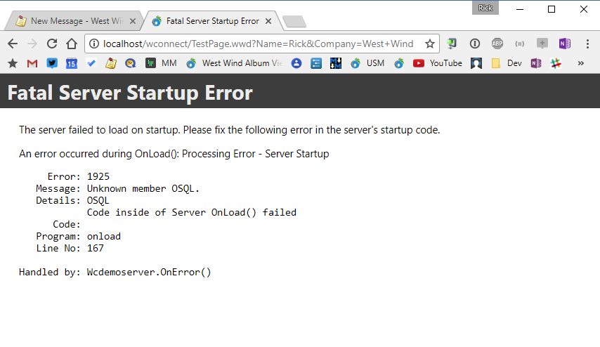
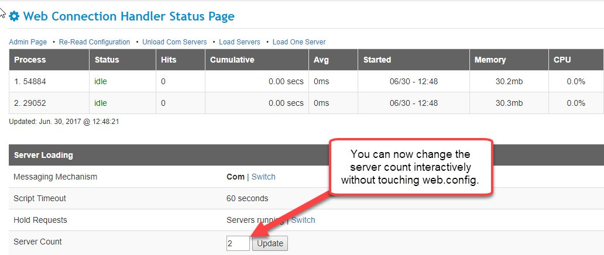

# Web Connection 6.15 is Here
It's time for another Web Connection update with version 6.15 hitting the release mark. This version adds a number of administrative feature updates related to server loading and server management. 

Here are the highlights:

* **New Install-IIS-Features Powershell Script**
* **COM Server Loading Changes**  
* **Server Count can now be Interactively set on Admin Page** 
* **Exe Servers hotswapped now automatically re-register for COM**  


### New Install-IIS-Features Powershell Script
Web Connection now ships with a new Powershell script that can more easily install IIS on your local machine, either for desktop or server versions of Windows. Powershell has access to script automation features that can automate the Windows Feature/Role installation that is required to properly install IIS. The provided script installs IIS with the features that are required to run Web Connection and is much quicker than manually using either the Windows desktop **Add Windows Features** or the server **Add Server Role** GUI installations.

* Open an **Administrator Powershell Command Prompt**
    ```powershell
    PS> cd \wconnect    
    PS> .\Install-IIS-Featured.ps1
    ```

This Powershell script enables the IIS Web Server role and adds all required features and once complete you can then install Web Connection or create new applications for IIS.

For more info on what this script does check out my recent blog post:

* [Automating IIS Feature Installation with Powershell](https://weblog.west-wind.com/posts/2017/May/25/Automating-IIS-Feature-Installation-with-Powershell)

### COM Server Loading Changes
Version 6.15 changes the way Web Connection servers execute their startup code. Specifically it removes the `OnLoad()` functionality from the FoxPro INIT call that was previously load to run both `OnInit()` and `OnLoad()` handling. 

While the INIT code works fine if there is no error, because requests ran in the FoxPro INIT constructor, any error would cause a COM Error that couldn't communicate any sort of error information back to the Web Connection module or ISAPI extension. The end result was that any startup code error would fail with a very cryptic and non-helpful COM error.

In v6.15 and later `OnLoad()` is now delay fired as part of the first request that hits the server. Because the code is no longer part of the FoxPro class constructor, the error can be trapped by FoxPro and Web Connection can actually display an error message like this:



<small>**Figure 1** - COM Server startup failures now display an error message.</small>

Once a startup error occurs, further operation of the server is capped, and all subsequent requests display this cached error message until the problem is fixed. So startup errors still cause the server to fail, but you at least get a reasonable error message about what failed and a clear indication that the problem is in the `OnLoad()` of the server.

#### Server Load Performance Benefits
This change also makes server loading considerably more efficient especially for those applications that have heavy initialization code. If you need to initialize lots of objects, create database connections or map drives all of which takes time, these operations are now removed from the immediate server load sequence which can time out very quickly. This means that actual server load time is generally much quicker and if a single request comes in the server pool can be available much more quickly than before.

For more info check out my recent post:

* [New Web Connection Server Startup Features in 6.15](https://west-wind.com/wconnect/weblog/ShowEntry.blog?id=930)

### Parallel Loading of COM Servers
When loading multiple COM servers, Web Connection now loads the server pool in parallel rather than sequentially. This also helps in reducing the time it takes to get the first request ready for processing.  

This works by loading each server on their respective threads simultaneously (using the .NET Parallel Task Library) which means multiple servers are loaded at the same time on their respective Thread Pool threads. This reduces load time for larger pools significantly, especially in combination with the above mentioned new server load features.

This feature works only with the Web Connection .NET Module, not with ISAPI.

### Server Count can now be interactively set on the Admin Page
We've also added a new feature to the Web Connection .NET Module admin page that now lets you set the server count interactively, using a text box on the admin page:



<small>**Figure 2** - COM Server counts can now be dynamically set on the Module Admin page.</small>

Using this new feature you can at any time change the server count remotely with just a few key strokes.

> #### @icon-info-circle Admin Changes require Write Access for the Web Account
> Any of the admin features that change settings write changes to `web.config` in the Web folder so you need to ensure that the Web account has write permissions.  The account that's in use is the Application Pool account and shows on the Admin page as the **Server Account**.

### Automatic `-regserver` on HotSwapped COM Servers
Web Connection has supported hotswapping of servers by way of uploading a new executable to a configured upload file and then hotswapping the server when running in COM mode or in standalone File mode. Web Connection has the ability to upload your file and then hotswap the server, by first unloading all instances, holding requests, copying the new file and then re-starting the hold requests flag. This process can be very quick depending on how many servers you need to start up and can be performed without any sort of server shutdown.

In v6.15 we've added the additional step of registering the the hotswapped exe using the `yourServer.exe -regserver` switch to ensure that if there were any changes to the COM server's type library due to wwServer interface changes, that these changes are reflected in the type library. In the past, not re-registering after changes could on occasion cause COM servers to fail as the COM member sequences between the registered type library and the actual type library got out of sync. 

With automatic registration this should no longer be an issue as the server is always re-registered even if it reregisters the same exact server interface.


### Next to No Developer Impact
All these changes in 6.15 deal with a few issues related to server loading under COM that have come up in the past and have finally been addressed. None of these changes require any changes on the developer's part - they are under the hood improvements. 

#### Possible Side Effect: No OnLoad() before First Hit
The only issue that may have some possible effect is the `OnLoad()` changes that now fire on the first incoming request rather than part of the FoxPro class `INIT()` constructor.  If you're using stock Web Connection servers generated by the templates or the examples, there's no issue.

If you are doing things like running your own background timer, or firing additional code off the Web Connection timer, it's possible that the code you're firing requires that the server is fully initialized, but `OnLoad()` may have not run yet.

If that's the case you can work around this by explicitly checking and firing the the OnLoad() code yourself as part of your timer or other inline code as a precaution:

```foxpro
IF (this.lInStartup)
   THIS.OnLoadInternal()
ENDIF	
```

This ensures that `OnloadInternal()` has not fired yet definitely gets fired. The `lInStartup` flag gets updated once `OnloadInternal()` has fired so this code runs only if the flag is set and runs only exactly one time either triggered by your code or Web Connection's own code when the first hit arrives.

### Locked and Loaded
These improvements have come up in discussions on a few occasions in the past and I hope they will make life easier for you. Debugging startup errors is one of a few common issues I frequently get support calls for, so hopefully this will cut down on this particular problem area and the rest of the improvements make for generally faster server start up in COM mode and more reliable error information if something goes wrong.

Enjoy.


<div style="margin-top: 30px;font-size: 0.8em;
            border-top: 1px solid #eee;padding-top: 8px;">
    
    this post created with 
    <a href="https://markdownmonster.west-wind.com" 
       target="top">Markdown Monster</a> 
</div>