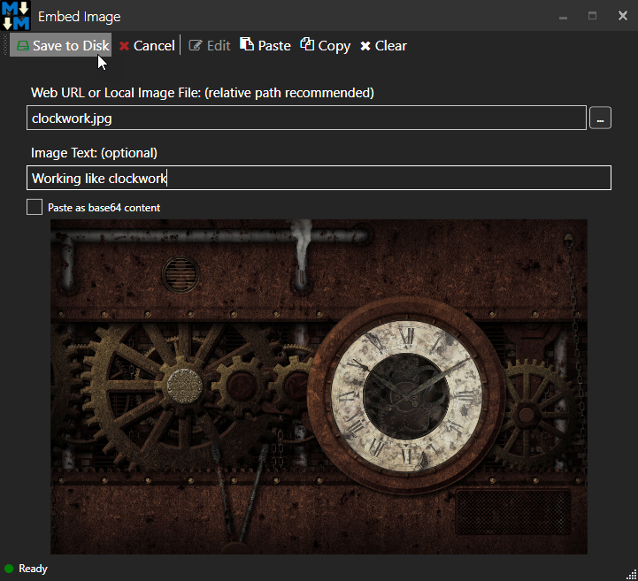
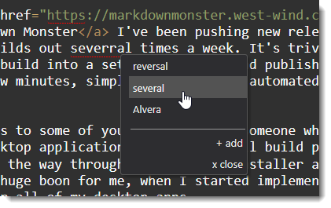
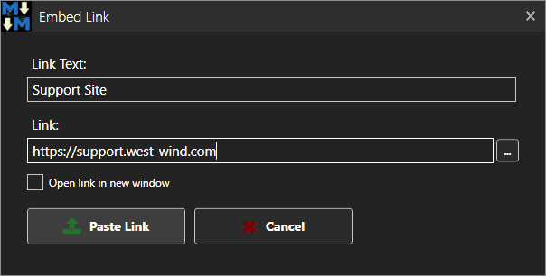
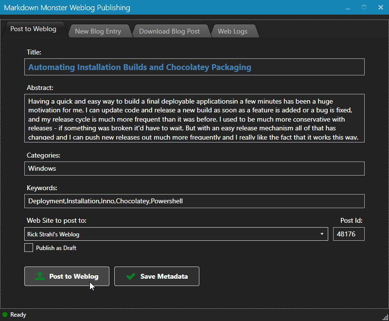
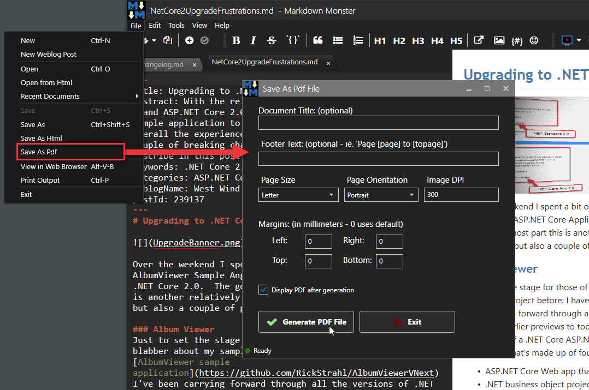
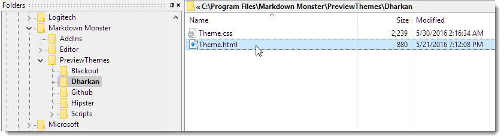
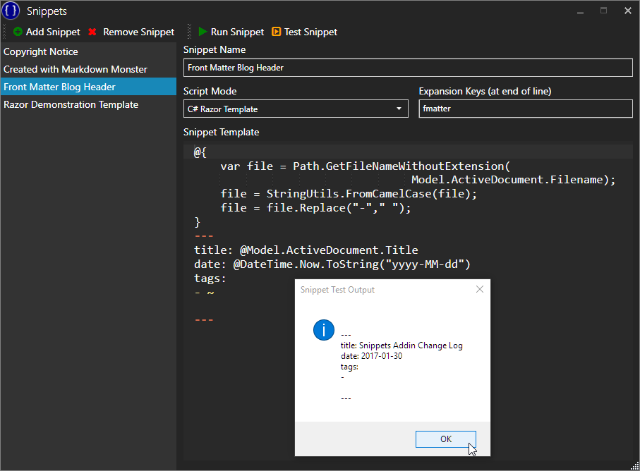
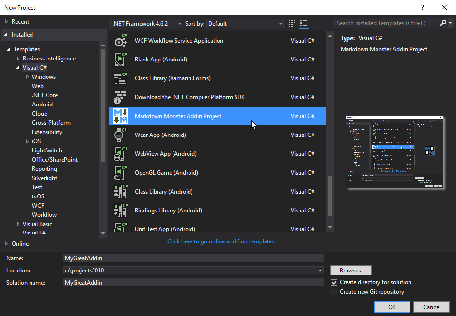

# Why use a dedicated Markdown Editor?

I often get asked why anybody would need a dedicated Markdown Editor. After all, just about any of the many multi-purpose editors out there today provide decent Markdown editing support with basic previewing and syntax highlighting.

> So why would you need a tools like [Markdown Monster](https://markdownmonster.west-wind.com) as a dedicated Markdown  editor?

That's a fair question. I use multi-purpose editors most of my developer day. I use [Visual Studio Code](https://code.visualstudio.com/) as my primary text and project editor and I have it open almost continuously throughout the day for editing code and all sorts of text documents. It serves as my project browser, terminal, development tool and general purpose text and script editor. And yes, I even use it to edit Markdown text quite frequent, because frankly the [Markdown support in VS Code](https://code.visualstudio.com/Docs/languages/markdown) is pretty damn good - for a generic editor.

### So why use a Custom Editor like Markdown Monster?
But when it comes to doing some *serious* writing, meaning I'm writing a longer piece of documentation, a blog post or article, I'll reach for Markdown Monster.

Generic editor Markdown support is great, but in essence these editors are just that - generic editors that provide text editing with some additional previewing of rendered Markdown. If that's all you need - that's great - an editor will serve you well.

But if you're using Markdown for more than just writing a short `Readme.md` in your favorite Github repo, you may find that there are a lot of things that can be optimized while writing Markdown text. Even though Markdown is text centric and can be entered almost entirely via keyboard entered text, that doesn't mean that there aren't a host of optimizations that you can apply to provide a better editing workflow.

With Markdown Monster I've optimized with what is an optimal workflow for me which is for the most part writing documentation and blog posts that contain lots of image content, code and basic markup.

Markdown Monster provides a host of features that you're not likely to find in a plain editor. 

Here's a list of a few things that go beyond basic editing features:

#### [Rich Image Support](http://markdownmonster.west-wind.com/docs/_4s01ezteq.htm)
You can embed images into MM in a variety of ways: Using markdown text, using a smart image dialog that can detect clipboard images and image Urls, pasting images directly from the Clipboard or dragging and dropping images into markdown document directly.

#### [Capture and Embed Screen Shots](http://markdownmonster.west-wind.com/docs/_4nj0wbomy.htm) 
MM comes with a built-in Screen Capture tool that lets you select windows to capture. You can run delayed captures to capture mouse cursors and actions (like dropped down menus). If you use SnagIt MM can use it to capture screen content, or you can use trusty old Ctrl & Alt PrtScn to capture a Window or the Screen and then simply paste it into the Markdown document.

#### [Inline Spell Checking](http://markdownmonster.west-wind.com/docs/_4rg0wj7pb.htm)
If you're writing Markdown content you likely are writing text, and that text should be spell checked.

#### [Embedding of Links](http://markdownmonster.west-wind.com/docs/_4xs10gaui.htm)
MM includes a link dialog that lets you highlight text, click (or press Ctrl-K) and automatically create a link to a URL on your clipboard or by typing in the URL. This often is much faster than manually typing the Markdown link syntax. With MM this becomes Select Text/Ctrl-K/Enter.

#### Publishing Content to a Weblog
If you're writing blog posts and you are using a service that uses Wordpress, MetaWeblog API or Medium, you can directly publish your Markdown to the Weblog using the built-in Weblog Addin.

#### Paste HTML as Markdown 
MM lets you convert HTML to Markdown. If you pick up lightly formatted HTML that uses Markdown supported HTML constructs, you can turn that HTML into Markdown simply by selecting some HTML in a browser and using the **Paste Html as Markdown** menu option to paste it. To be clear, this won't work with all HTML - any HTML that doesn't fit within the limited confines of Markdown's support HTML set is pasted as raw HTML.

#### Create PDF and HTML Output
You can easily create PDF and HTML output from your Markdown. MM can save rendered HTML as an HTML document either in raw form without custom styling or provide the full content used to render the preview which includes Preview styles. PDF output is statically generated from rendered HTML and makes for an easy, self-contained document that includes all formatting and images. You can also easily see the rendered HTML output or preview output in an external browser.

#### [Customize the HTML Preview](http://markdownmonster.west-wind.com/docs/_4nn17bfic.htm)
MM uses Web based templates to render the HTML preview. Several different styles are provided and you can easily create your own template that matches whatever target your final Markdown rendered HTML has to be deployed in. Templates are plain HTML and CSS and can be created in minutes to provide you a custom preview template that formats the Markdown output the way **you want it**.

#### Templating Support using C# and Razor
MM has support for a C# based Templating Addin ([Snippets Addin](https://github.com/RickStrahl/Snippets-MarkdownMonster-Addin)) that lets you create text expansions for Markdown, including full support for C# scripting via Razor. This lets you create sophisticated scripts to embed content into your Markdown document dynamically.

#### Extend Markdown Monster via Addins or Commander Addin
Want to enhance MM with your own functionality? Need to do something special in your Markdown documents or simply want a new UI feature that MM doesn't provide? You can extend Markdown Monster via [.NET based Addins](http://markdownmonster.west-wind.com/docs/_4ne0s0qoi.htm) with little effort. Alternately you can use the [Commander Addin](https://github.com/RickStrahl/Commander-MarkdownMonster-Addin) to create simple automation tasks without creating a full blown addin.

### Summary
Generic editors are great, and for many basic editing tasks they are perfectly fine. But if you find yourself writing a lot of text in Markdown you might want to check out a dedicated editor like [Markdown Monster](https://markdownmonster.west-wind.com) to see if you can improve your productivity with a few helpful features that facilitate an optimized workflow for things like image and link embedding and performing tasks that actually do something with your markdown other than just writing it. Give it a try - you may find you end up more productive...