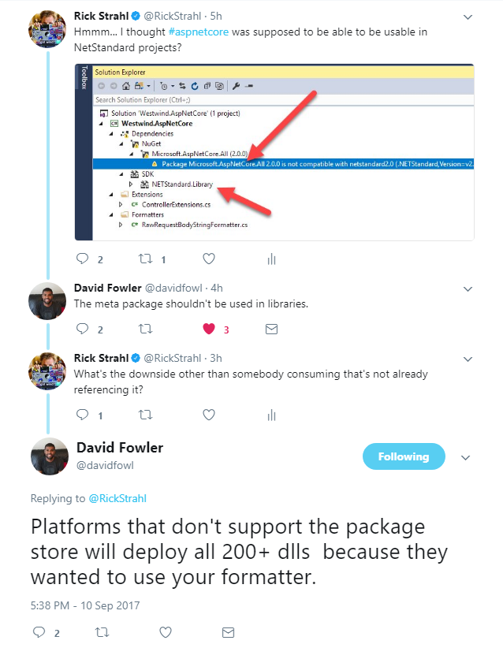
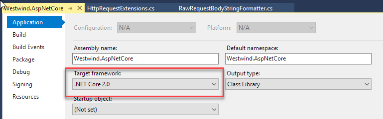
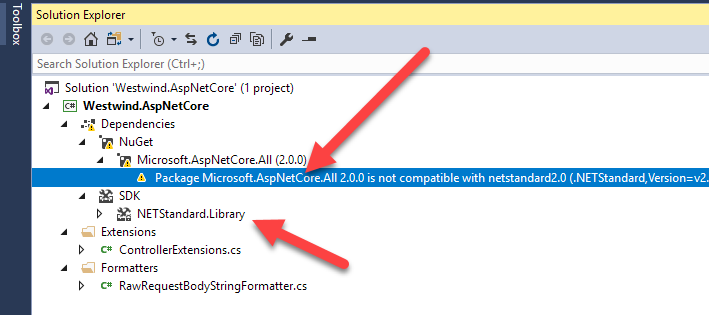
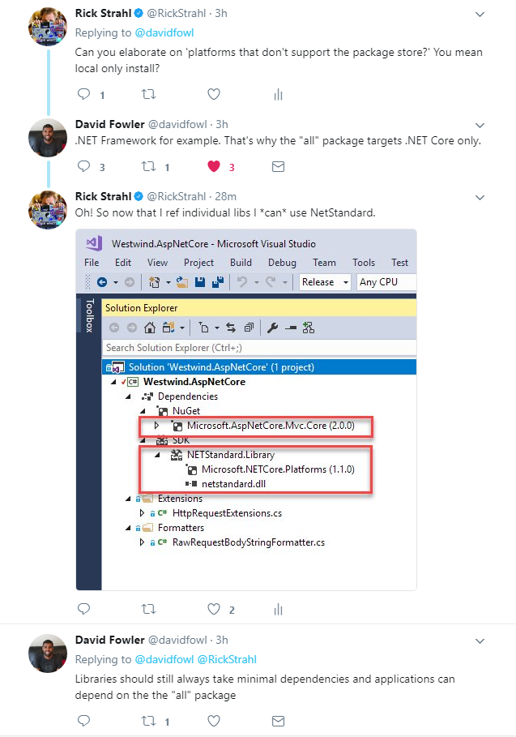
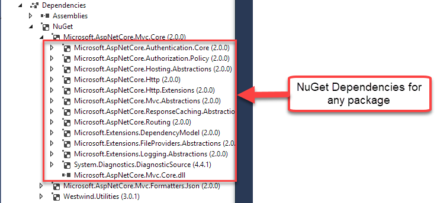
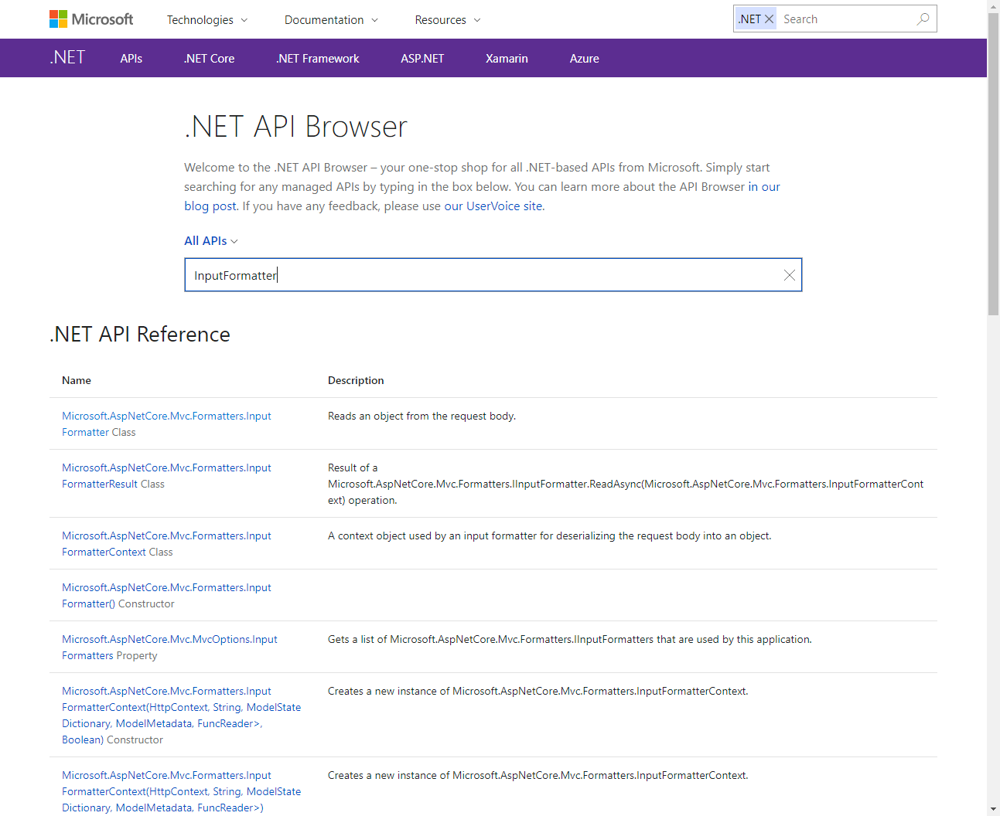

# A few notes on creating Class Libraries for ASP.NET Core


I'm starting to collect some of my helper and utility classes into a reusable library (as I tend to do) for my ASP.NET Core projects. In the process I ran into a few snags and after a brief discussion with David Fowler on Twitter I realized I was making a few non-obvious mistakes right from the get go.

In this quick post I point at couple of things I ran into and that you might also want to watch out for when creating class libraries that depend on ASP.NET Core features.

### Don't Reference the ASP.NET Core Meta Package
On first glance it seems the easiest way to ensure you get access to all of ASP.NET's Features in your support library, is to reference the `Microsoft.AspNetCore.All` meta package that brings in all of the ASP.NET Core dependencies, just like a default ASP.NET Core Web application does. 

The All package is good way to go for top level applications, especially those that target the pre-installed .NET Core runtimes. The ASP.NET Publish process can deal with sorting out where assemblies come from and in most cases referencing the meta package with its references to all packages just points at the pre-installed assemblies. .NET then sorts out at JIT time which assemblies are actually loaded. 

##AD##

So when I created my class library I figured, why not use the same package and add it to my classlib project - after all most use cases will already have the meta package in the top level project anyway.

Alas - David wagged a digital finger at me and reminded me that that this is not a good idea:



In hindsight, this makes perfect sense. If you stick the class library's package into another project it inherits the dependencies - ie. the entire ASP.NET stack. In most cases this probably not an issue, because the ALL meta package is probably already referenced in the top level Web project. Nothing gained, nothing lost, right?

But, in some cases the package might go into a purely local installation of an application that is using just the dependencies it needs rather than opting into the full ASP.NET Stack pointing at a pre-installed runtime. Now the consumer all of a sudden has to take a dependency on all those assemblies for whatever specialized functionality my lib provides. 

Worse, if some other class library want to reference your package, it now too has a dependency on the full ASP.NET stack. Not cool.

In short, if you're building an internal library that you know will always be consumed in an application that uses the full meta package, then it's probably OK to reference the meta package in your class library. 

But for any library that is going to be used generically in any kind of ASP.NET Core project or possibly as a dependency to other libraries, it's much more prudent to reference just the minimal dependencies you actually need.

### ASP.NET Core Class Libraries and .NET Standard
A related issue came up when creating the ASP.NET Core class library project. I typically create class libraries that target .NET Standard 2.0 because it potentially makes the library more portable. With ASP.NET Core that's probably not a critical requirement right now as it always targets .NET Core App (not .NET Standard), but who knows what the future holds. 

But when I referenced the ASP.NET Core meta package the class library project automatically forced me to target .NET Core 2.0.



<small>**Figure 1** - Using the Microsoft.AspNetCore.All package forces you to use the `NETCoreApp2.0` target</small>

Not only that but the drop down list actually doesn't give the option to change the target in Visual Studio - it only gives me options for .NET Core. What's going on?

Well, the ASP.NET Core meta package is actually responsible for changing the target, but I can change it manually in the .csproj file:

```xml
<Project Sdk="Microsoft.NET.Sdk">
  <PropertyGroup>
    <TargetFramework>netstandard2.0</TargetFramework>
  </PropertyGroup>
  <ItemGroup>
    <PackageReference Include="Microsoft.AspNetCore.Mvc.Core" Version="2.0.0" />
  </ItemGroup>
</Project>
```

However when I did that I got this error:



<small>**Figure 2** - No NETSTANDARD for you!</small>

Again the issue here that `Microsoft.AspNetCore.All` **explicitly** targets .NET Core 2.0 so that it's NOT used with other platforms.

Here's some more from David:



Based on David's suggestion to not use the ALL meta package, I switched to specific libraries and voila I can now target .NET Standard 2.0 in my project.

The reason for this is that .NET Standard can be consumed by other platforms, so potentially you'd be able to reference my package. If the meta package were there I would end up including all those assemblies from the meta package in say a full .NET Framework project which would really suck (I'm sure you've cursed some of the .NET Standard Projects Microsoft has put out that pukes a bunch of duplicated assemblies into your Bin folder - same thing).

##AD##

### Stick to Specific Dependencies in Class Libraries
The key take away from this is that the ASP.NET Core Meta package is just not a good choice for class libraries. So rather than referencing the entire framework, it's much better to reference just the individual components your application actually needs. And yeah - it's a lot more work finding the right packages to include and more importantly not choosing super high level ones that end up pulling in the world anyway.

### Lower, Lower, Lower Level
Further, David suggested making sure you use the **lowest level possible for NuGet packages**. For example, in a recent post I talked about an `InputFormatter` class which I moved to my helper class library. This library needed to reference `Microsoft.AspNetCore.Mvc.Core` in order to get a reference to `InputFormatter`. However that package is a pretty high level package that also pulls a large chunk of ASP.NET Core stack. David's suggestion was is to go lower level and consider implementing  `IInputFormatter` which requires just `Microsoft.AspNetCore.Mvc.Abstractions` which is very low level and doesn't have any dependencies.

To be fair though that's a tough call - I found out  quickly that I ran into other dependencies that live up higher up in the stack. At that point at the choice of implementing several additional interfaces from scratch, just to avoid additional references. Frankly - not worth it, and in the end I did need to use the `Microsoft.AspNetCore.Mvc.Core` package after all, but your requirements may vary. You have to pick your battles wisely.

Regardless, I think David's advice is sound. Start with just what you need and only add specific packages as needed. Don't go for the high level packages as your first resort - use it as a last resort.

### What do you need?
This is not always so easy because discovering where things live is not automatic. ASP.NET Core and MVC are scattered over dozens of packages. But the new NuGet Tooling in SDK projects at least shows you all NuGet Package dependencies along the way which usually gives you a good idea what things you can explicitly import. 

By looking at a higher level dependency you can often gleam the lower level dependencies you actually need to get your work done.



<small>**Figure 3** - You can always look at a Package's dependencies and figure out what dependencies you need. For all packages avalailable look at the `Microsoft.AspNetCore.All` package in a Web project.</small>

### A couple of Package Reference Tips

#### @icon-info-circle Use the .NET API Browser to find Package References
Microsoft's been investing heavily in creating good documentation and it has been paying off in spades. If you haven't checked out common topics for .NET Core or ASP.NET Core in the Microsoft Docs because you're thinking that the docs are on 'MSDN' - you're in for a shock. 

The docs are **really good** and open to community contribution. The docs are also much more consistent with a single documentation system spanning most of the documentation of the Microsoft Universe in the same format, with the same search tools and the same contribution and editing guidelines. Seriously - this is a huge accomplishment for Microsoft giving the special place in hell that was MSDN previously.

The doc system is all indexed and searchable and one really nice feature of this new integration is that there's a really useful **.NET API Browser** now that you can search for classes, namespaces, even member names. It uses a single textbox with auto-complete look up that lets you quickly jump to and even discover APIs.



<small>**Figure 4** - The .NET API browser is invaluable in discovering what package/assembly components live in </small>

It's fast and gets you were you need to go. Check it out at:
 
* [.NET API Browser](https://docs.microsoft.com/en-us/dotnet/api/)
* [ASP.NET Documentation](https://docs.microsoft.com/en-us/aspnet/core/)

#### @icon-info-circle Doc Tip: Nuget Packages and Assembly Names Match
Another useful tip from David: The ASP.NET Core and .NET Core Packages have **matching assembly and package names**. While the docs only show assembly names, they **should** in most cases match the package names you can search for on NuGet and with the .NET API Browser.

### Publishing, Runtimes and Distribution Size
At the end of the day using .NET Core adds a few additional considerations to how you deal with dependencies. Unlike full framework .NET which used to include everything inside of installed framework assemblies, .NET Core applications can be installed side by side and may not have an available runtime which means every single dependency has to be copied to a server. 

In .NET Core 1.x initially that was the only way to deploy an app and it meant you often deployed a 100 megs of stuff just to run a small app. 

.NET Core 2.x (and later versions of 1.x) brought back pre-installed runtimes, and as much as people want to tout the 'self-contained application' syndrom, I think most applications going forward will use the pre-installed runtime approach. Unlike full framework, .NET Core supports side by side runtime installs which mitigates the worst of the full framework issues related to out of sync runtime versions.

Let's always remember that at runtime, .NET Is smart enough to know what assemblies to load and what actually code compile with the JIT. Non-referenced code is not loaded by the runtime. So with fixed runtimes, referencing some additional packages isn't going to make any discernible difference at runtime.

Still, in the spirit of clean code it's a good idea to be precise rather than general, so making a reasonable effort to keep dependencies down - especially in class libraries is definitely a valid concern. But going overboard to remove a small dependendency is probably not worth the effort.

Caveat emptor. 

But the choice is there for you to decide.

<div style="margin-top: 30px;font-size: 0.8em;
            border-top: 1px solid #eee;padding-top: 8px;">
    
    this post created and published with 
    <a href="https://markdownmonster.west-wind.com" 
       target="top">Markdown Monster</a> 
</div>