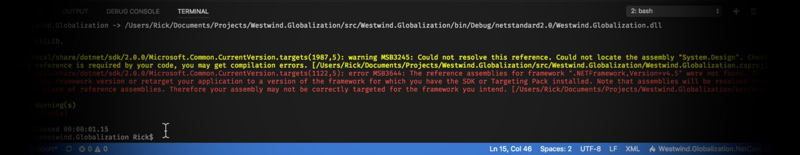
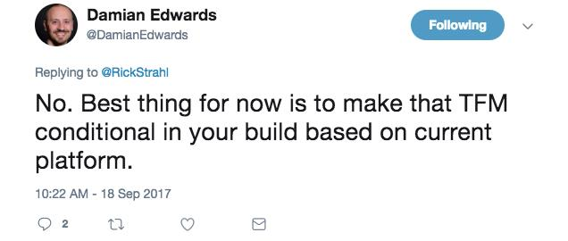
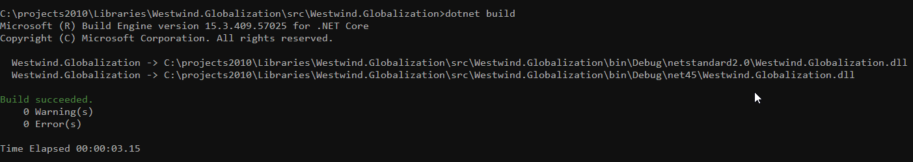
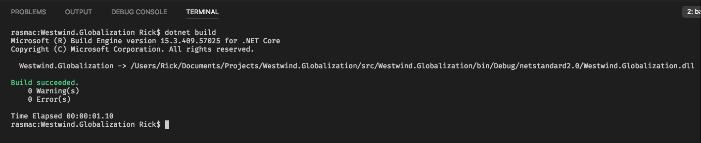

# Conditional TargetFrameworks for Multi-Targeted .NET SDK Projects on Cross-Platform Builds



This is a short post that addresses an issue I ran into today when converting a project to .NET Core 2.0. I've been upgrading a host of my existing tools to .NET Standard/Core 2.0 and most of these projects have existing .NET 4.5 (or later) targets that I want to continue pulling forward. The new SDK project type makes it relatively easy to create libraries that do multi-targeting in your SDK style `.csproj` file:

```xml
<TargetFrameworks>netstandard2.0;net45</TargetFrameworks>
```
Assuming you can get your code to build on both platforms, this simple directive will build assemblies and NuGet packages (if you turn the option on) for both platforms which is very cool.

It'll work, but... 

##AD##

### Cross Platform
There's a problem however when you do this multi-targeting. It works just fine on my local Windows machine where the specified target platform (.NET 4.5 SDK in this case) is installed.

However, if I now try to build on a Mac which doesn't have a net45 SDK I get:


> /usr/local/share/dotnet/sdk/2.0.0/Microsoft.Common.CurrentVersion.targets(1122,5): error MSB3644: 
>
> The reference assemblies for framework ".NETFramework,Version=v4.5" were not found. 
>
>To resolve this, install the SDK or Targeting Pack for this framework version or retarget your application to a version of the framework for which you have the SDK or Targeting Pack installed. Note that assemblies will be resolved from the Global Assembly Cache (GAC) and will beused in place of reference assemblies. Therefore your assembly may not be correctly targeted for the framework you intend.

The problem is of course that when you're trying to build on a non-Windows platform, or even on Windows when the net45 build targeting is not installed, the build fails. 

### Why not just target .NET Standard?
Initially I thought I'd get away with just targeting .NET Standard and use that from full framework applications. That works as long as you can get all the features you need from NetStandard.

In my case however I'm porting very old code and there are number of dependencies on things that are not in .NET Standard and either require a separate set of libraries or simply can't run. So targeting native **net45** (or whatever) is a good way to provide existing functionality while moving forward and also supporting .NET Standard/Core with a slightly diminished or altered feature set.

But how do you deal with that on multiple platforms?

You can change this:

```xml
<TargetFrameworks>netstandard2.0;net45</TargetFrameworks>
```

manually to:

```xml
<TargetFramework>netstandard2.0</TargetFrameworks>
```

and that works. The project builds, but only for the single target. It works but it's a nasty hack and I know if I do this manually, it will be forgotten at one point. There's a better way though...

##AD##

### Conditional TargetFrameworks
I asked if there's an easy way to deal with detectecting targets, and while the immediate answer is, "not directly", I kindly got a response from [@DamienEdwards](https://twitter.com/DamienEdwards) that offered a conditional approach:



After a bit of experimenting with the right MSBuild invokations - and a little help from [@andrewlocknet](https://twitter.com/andrewlocknet) and [@jeremylikness](https://twitter.com/jeremylikness) - I ended up with some conditional MSBuild blocks that work to do the right thing on Windows and in this case the Mac to build the project:

**Old code**

```xml
<Project Sdk="Microsoft.NET.Sdk">
  <PropertyGroup>
    <!-- *** THIS *** -->
    <TargetFrameworks>netstandard2.0;net45</TargetFrameworks>
    
    <Version>3.0.0-preview1-0</Version>
    <Authors>Rick Strahl</Authors>
    ...
</Project>
```

**New Code**
```xml
<Project Sdk="Microsoft.NET.Sdk">

    <!-- *** THIS *** -->
    <PropertyGroup Condition=" '$(OS)' != 'Windows_NT' ">
        <TargetFramework>netstandard2.0</TargetFramework>
    </PropertyGroup>
    <PropertyGroup Condition=" '$(OS)' == 'Windows_NT' "> 
        <TargetFrameworks>netstandard2.0;net45</TargetFrameworks>
    </PropertyGroup>
    <!-- *** THIS *** -->
  
  <PropertyGroup>
    <!-- <TargetFrameworks>netstandard2.0;net45</TargetFrameworks> -->
    <Version>3.0.0-preview1-0</Version>
    <Authors>Rick Strahl</Authors>
    ...
</Project>
```

> Notice that I use `<TargetFramework />` for the single NetStandard reference and `<TargetFrameworks />` for the 2 target NetStandard and Net45 build. It's an easy thing to miss!


### Said and Done!
So now when I build on **Windows**, I get this output:


<small>**Figure 1** - With conditional flags, both NetStandard and Net45 projects are built on Windows</small>

On the Mac:



<small>**Figure 2** - On OSX only the NetStandard package is built</small>


This works as expected and is a reasonable solution for any project that requires building to multiple platform targets and still needs to build on multiple platforms where the target is not available.

<div style="margin-top: 30px;font-size: 0.8em;
            border-top: 1px solid #eee;padding-top: 8px;">
    
    this post created and published with 
    <a href="https://markdownmonster.west-wind.com" 
       target="top">Markdown Monster</a> 
</div>