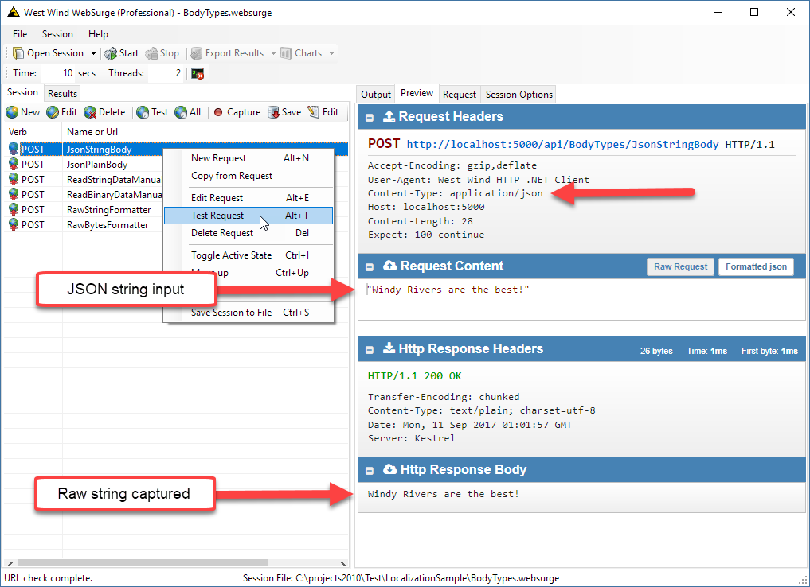
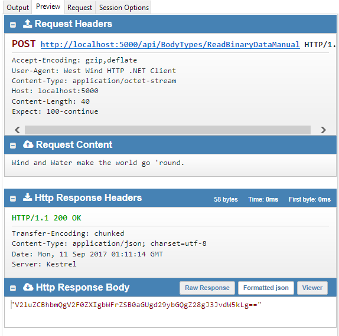

# Accepting Raw Request Body Content in ASP.NET Core 


A few years back I wrote a post about [Accepting Raw Request Content with ASP.NET Web API](https://weblog.west-wind.com/posts/2013/Dec/13/Accepting-Raw-Request-Body-Content-with-ASPNET-Web-API). The process to get at raw request data is rather indirekt, with no easy, or official way to get it into Controller action parameters. Not much has raelly changed in ASP.NET Core's implementation.

The good news is that it's quite a bit easier to create custom formatters in ASP.NET Core that let you customize how to handle 'unknown' content types in your controllers.

### Creating a Simple Test Controller
To check this out I created a new stock Core Web API project and changed the default `ValuesController` to this sample controller to start with:

```cs
public class BodyTypesController : Controller 
{ }
```    

#### JSON String Input
Lets start with a non-raw request, but rather with posting a string as JSON since that is very common. You can accept a string parameter and post JSON data from the client pretty easily.

```cs
[HttpPost]
[Route("api/BodyTypes/JsonStringBody")]
public string JsonStringBody([FromBody] string content)
{

    return content;
}
```

I can post the following:



<small>**Figure 1** - JSON String inputs thankfully capture as strings in ASP.NET Core</small>

This works to retrieve the JSON string as a plain string. Note that the string sent **is not a raw string, but rather a JSON string** as it includes the wrapping quotes:

```json
"Windy Rivers are the Best!"
```

> #### @icon-info-circle Don't Forget [FromBody]
> Make sure you add `[FromBody]` to any parameter that tries to read data from the POST body and maps it. It's easy to forget and not really obvious that it should be there. I say this because I've forgotten it plenty of times and scratched my head wondering why request data doesn't make it to my method or why requests fail outright with 404 responses.

#### No JSON - No Workey
If you want to send a RAW string or binary data and you want to pick that up as part of your request things get more complicated. ASP.NET Core handles only what it knows, which by default is JSON and Form data. Raw data is not directly mappable to controller parameters by default.

So if you trying to send this:

```http
POST http://localhost:5000/api/BodyTypes/JsonPlainBody HTTP/1.1
Accept-Encoding: gzip,deflate
User-Agent: West Wind HTTP .NET Client
Content-Type: text/plain
Host: localhost:5000
Content-Length: 28
Expect: 100-continue

Windy Rivers are the best!
```

to this controller action:

```cs
[HttpPost]
[Route("api/BodyTypes/PlainStringBody")]
public string PlainStringBody([FromBody] string content)
{
    return content;
}
```        

The result is a `404 Not Found`.

I'm essentially doing the same thing as in the first request, **except I'm not sending JSON content type** but plain text.  The endpoint exists, but MVC doesn't know what to do with the `text/plain` content or how to map it and so it fails with a `404 Not Found`.

It's not super obvious and I know this can trip up the unsuspecting Newbie who expects raw content to be mapped. However, this makes sense if you think about it: MVC has mappings for specific content types and if you pass data that doesn't fit those content types it can't convert the data, so it assumes there's no matching endpoint that can handle the request.

So how do we get at the raw data?

#### Reading Request.Body for Raw Data
Unfortunately ASP.NET Core doesn't let you just capture 'raw' data in any meaningful way just by way of method parameters. One way or another you need to do some custom processing of the `Request.Body` to get the raw data out and then deserialize it. 

You can capture the raw `Request.Body` and read the raw buffer out of that which is pretty straight forward. 

The easiest and least intrusive, but not so obvious way to do this is to have a method that accepts POST or PUT data **without parameters** and then read the raw data from `Request.Body`:

##### Read a String Buffer
```cs
[HttpPost]
[Route("api/BodyTypes/ReadStringDataManual")]
public async Task<string> ReadStringDataManual()
{
    using (StreamReader reader = new StreamReader(Request.Body, Encoding.UTF8))
    {  
        return await reader.ReadToEndAsync();
    }
}
```

This works with the following HTTP and plain text content:

```http
POST http://localhost:5000/api/BodyTypes/ReadStringDataManual HTTP/1.1
Accept-Encoding: gzip,deflate
Content-Type: text/plain
Host: localhost:5000
Content-Length: 37
Expect: 100-continue
Connection: Keep-Alive

Windy Rivers with Waves are the best!
```

To read binary data you can use the following:

###### Read a Byte Buffer
```cs
[Route("api/BodyTypes/ReadBinaryDataManual")]
public async Task<byte[]> RawBinaryDataManual()
{
    using (var ms = new MemoryStream(2048))
    {
        await Request.Body.CopyToAsync(ms);
        return  ms.ToArray();  // returns base64 encoded string JSON result
    }
}
```

which works with this HTTP:

```http
POST http://localhost:5000/api/BodyTypes/ReadBinaryDataManual HTTP/1.1
Accept-Encoding: gzip,deflate
User-Agent: West Wind HTTP .NET Client
Content-Type: application/octet-stream
Host: localhost:5000
Content-Length: 40
Expect: 100-continue
Connection: Keep-Alive

Wind and Water make the world go 'round.
```

I'm sending a string here to make it readable, but really the content could be raw binary byte data - it doesn't matter what the content is in this case but it should be considered as binary data.

Running this results in:



<small>**Figure 2** - Capturing raw binary request data.</small>

The result in the code is captured as binary `byte[]` and returned as JSON, which is why you see the base64 encoded result string that masquerades as a binary result.

##### Request Helpers
If you do this a lot a couple of `HttpRequest` extension methods might be useful:

```cs
public static class HttpRequestExtensions
{

    /// <summary>
    /// Retrieve the raw body as a string from the Request.Body stream
    /// </summary>
    /// <param name="request">Request instance to apply to</param>
    /// <param name="encoding">Optional - Encoding, defaults to UTF8</param>
    /// <returns></returns>
    public static async Task<string> GetRawBodyStringAsync(this HttpRequest request, Encoding encoding = null)
    {
        if (encoding == null)
            encoding = Encoding.UTF8;

        using (StreamReader reader = new StreamReader(request.Body, encoding))
            return await reader.ReadToEndAsync();
    }

    /// <summary>
    /// Retrieves the raw body as a byte array from the Request.Body stream
    /// </summary>
    /// <param name="request"></param>
    /// <returns></returns>
    public static async Task<byte[]> GetRawBodyBytesAsync(this HttpRequest request)
    {
        using (var ms = new MemoryStream(2048))
        {
            await request.Body.CopyToAsync(ms);
            return ms.ToArray();
        }
    }
}
```
<small>**Listing 1** - HttpRequest Extensions to retrieve raw body string and byte data. [Github](https://github.com/RickStrahl/Westwind.AspNetCore/blob/master/Westwind.AspNetCore/Extensions/HttpRequestExtensions.cs) </small>

which allows you to simplify those two previous controller methods to:

```cs
[HttpPost]
[Route("api/BodyTypes/ReadStringDataManual")]
public async Task<string> ReadStringDataManual()
{
    return await Request.GetRawBodyStringAsync();
}

[HttpPost]
[Route("api/BodyTypes/ReadBinaryDataManual")]
public async Task<byte[]> RawBinaryDataManual()
{
    return await Request.GetRawBodyBytesAsync();
}
```

### Automatically Converting Binary and Raw String Values
If you'd rather use a more deterministic approach and accept raw data through parameters, a little more work is required by building a custom `InputFormatter`. 

#### Create an MVC InputFormatter
ASP.NET Core has a clean and more generic way to handle custom formatting of content using an `InputFormatter`. Input formatters hook into the request processing pipeline and let you look at specific types of content to determine if you want to handle it. You can then read the request body and perform your own deserialization on the inbound content.

There are a couple of requirements for an InputFormatter:

* You need to use `[FromBody]` to get it fired
* You have to be able to look at the request and determine if and how to handle the content

So in this case for 'raw content' I want to look at requests that have the following content types:

* text/plain (string)
* application/octet-stream (byte[])
* No content type (string)

You can add others to this list or check other headers to determine if you want to handle the input but you need to be explicit what content types you want to handle.

To create a formatter you either implement **IInputFormatter** or inherit from **InputFormatter**. The latter is usually the better approach, and that's what I used to create `RawRequestBodyFormatter`:

```cs
/// <summary>
/// Formatter that allows content of type text/plain and application/octet stream
/// or no content type to be parsed to raw data. Allows for a single input parameter
/// in the form of:
/// 
/// public string RawString([FromBody] string data)
/// public byte[] RawData([FromBody] byte[] data)
/// </summary>
public class RawRequestBodyFormatter : InputFormatter
{
    public RawRequestBodyFormatter()
    {
        SupportedMediaTypes.Add(new MediaTypeHeaderValue("text/plain"));
        SupportedMediaTypes.Add(new MediaTypeHeaderValue("application/octet-stream"));
    }


    /// <summary>
    /// Allow text/plain, application/octet-stream and no content type to
    /// be processed
    /// </summary>
    /// <param name="context"></param>
    /// <returns></returns>
    public override Boolean CanRead(InputFormatterContext context)
    {
        if (context == null) throw new ArgumentNullException(nameof(context));

        var contentType = context.HttpContext.Request.ContentType;
        if (string.IsNullOrEmpty(contentType) || contentType == "text/plain" ||
            contentType == "application/octet-stream")
            return true;

        return false;
    }

    /// <summary>
    /// Handle text/plain or no content type for string results
    /// Handle application/octet-stream for byte[] results
    /// </summary>
    /// <param name="context"></param>
    /// <returns></returns>
    public override async Task<InputFormatterResult> ReadRequestBodyAsync(InputFormatterContext context)
    {
        var request = context.HttpContext.Request;
        var contentType = context.HttpContext.Request.ContentType;


        if (string.IsNullOrEmpty(contentType) || contentType == "text/plain")
        {
            using (var reader = new StreamReader(request.Body))
            {
                var content = await reader.ReadToEndAsync();
                return await InputFormatterResult.SuccessAsync(content);
            }
        }
        if (contentType == "application/octet-stream")
        {
            using (var ms = new MemoryStream(2048))
            {
                await request.Body.CopyToAsync(ms);
                var content = ms.ToArray();
                return await InputFormatterResult.SuccessAsync(content);
            }
        }

        return await InputFormatterResult.FailureAsync();
    }
}
```
<small>**Listing 2** - InputFormatter to handle Raw Request inputs for selected content types. [GitHub](https://github.com/RickStrahl/Westwind.AspNetCore/blob/master/Westwind.AspNetCore/Formatters/RawRequestBodyStringFormatter.cs) </small>


The formatter uses `CanRead()` to check requests for content types to support and then the `ReadRequestBodyAsync()` to read and deserialize the content into the result type that should be returned in the parameter of the controller method.

The InputFormatter has to be registered with MVC in the `ConfigureServices()` startup code:

```cs
public void ConfigureServices(IServiceCollection services)
{
    services.AddMvc(o => o.InputFormatters.Insert(0, new RawRequestBodyFormatter()));
}
```

#### Accepting Raw Input
With the formatter hooked up to the MVC formatter list you can now handle requests that POST or PUT to the server using `text/plain`, `application/octet-stream` or no content types.

#### Raw String

```cs
[HttpPost]
[Route("api/BodyTypes/RawStringFormatter")]        
public string RawStringFormatter([FromBody] string rawString)
{
    return rawString;
}
```

and you can post to it like this:

```txt
POST http://localhost:5000/api/BodyTypes/RawStringFormatter HTTP/1.1
Accept-Encoding: gzip,deflate

Raw Wind and Water make the world go 'round.
```

or

```txt
POST http://localhost:5000/api/BodyTypes/RawStringFormatter HTTP/1.1
Accept-Encoding: gzip,deflate
Content-type: text/plain

Raw Wind and Water make the world go plain.
```

The controller will now pick up the raw string text.

Note that you can call the same controller method with a content type of `application/json` and pass a JSON string and that will work as well. The `RawRequestBodyFormatter` simply adds support for the additional content types it supports.

#### Binary Data
Binary data works the same way but with a different signature and content type for the HTTP request.

```cs
[HttpPost]
[Route("api/BodyTypes/RawBytesFormatter")]
public byte[] RawBytesFormatter([FromBody] byte[] rawData)
{
    return rawData;
}  
```

and this HTTP request data with 'binary' content:

```txt
POST http://localhost:5000/api/BodyTypes/RawBytesFormatter HTTP/1.1
Accept-Encoding: gzip,deflate
Content-type: application/octet-stream

Raw Wind and Water make the world go 'round.
```

Again I'm sending a string to provide something readable here, but the string is treated as binary data by the method and returned as such as shown in Figure 2.

### Source Code provided
If you want to play with this stuff and experiment, I've uploaded my sample project to Github:
* [Sample Source Code on Github](https://github.com/RickStrahl/AspNetCoreRawRequestSample) 

The sample HTTP requests are setup in West Wind Web Surge and ready to test against or you can just use the `BodyTypes.websurge` file and pick out the raw HTTP request traces.

* [West Wind Web Surge for Http Testing](https://websurge.west-wind.com)

### Summary
Accepting raw data is not something you have to do all the time, but occassionally it is required for API based applications. ASP.NET MVC/Web API has never been very direct in getting at raw data, but once you understand how the pipeline manages request data and deals with content type mapping it's easy to get at binary data.

In this post I showed two approaches:

* Manually grabbing the `Request.Body` and deserializing from there
* Using a custom InputFormatter that looks at typical 'raw' Content data types

The former is easy to use but doesn't describe the API behavior via the method interface. The latter is a little more work and requires hooking up a custom formatter, but it allows keeping the API's contract visible as part of the controller methods which to me simply feels cleaner.

All of this is making me hungry for some **raw Sushi**...

<div style="margin-top: 30px;font-size: 0.8em;
            border-top: 1px solid #eee;padding-top: 8px;">
    
    this post created and published with 
    <a href="https://markdownmonster.west-wind.com" 
       target="top">Markdown Monster</a> 
</div>