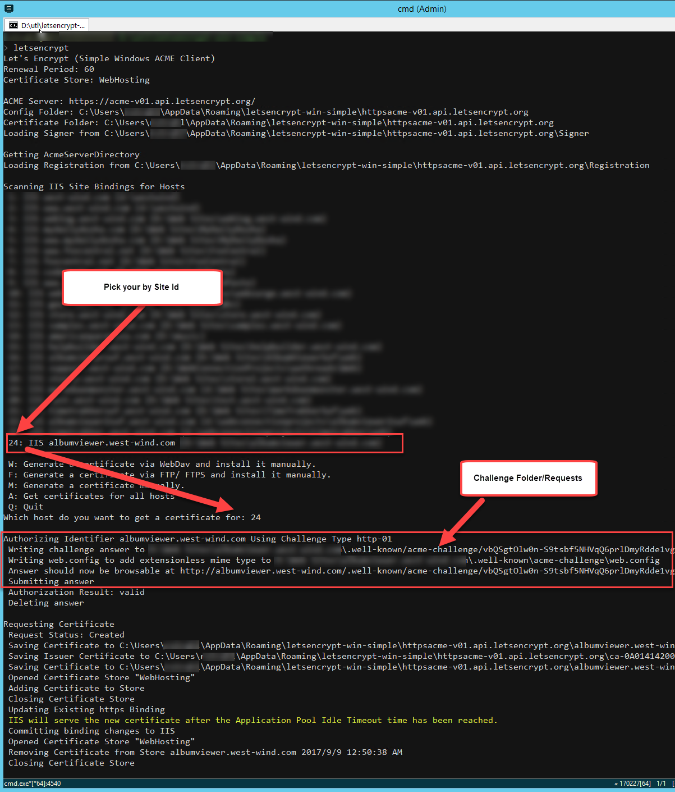
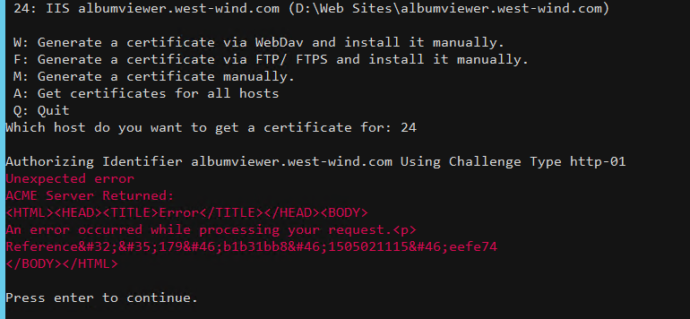

# Configuring LetsEncrypt for ASP.NET Core and IIS


I've written a bit about using free Lets Encrypt SSL Certificates with IIS on Windows ([here](https://weblog.west-wind.com/posts/2016/Feb/22/Using-Lets-Encrypt-with-IIS-on-Windows) and [here](https://weblog.west-wind.com/posts/2016/Jul/09/Moving-to-Lets-Encrypt-SSL-Certificates)). LetsEncrypt makes for a big improvement in streamlining SSL usage and administration, by making it easy to create and automatically update SSL certificates. And best of all, it's free and there's tooling that can completely automate the process.

Today I ran into an issue with a new sample site I set up with LetsEncrypt that is running IIS and ASP.NET Core. The problem is that the way IIS is configured by default, it passes all requests through to ASP.NET Kestrel Web Server to process. The issue is that Lets Encrypt needs to serve a special file out of a `.well-known` folder.

### Creating a Certificate with LetsEncrypt-WinSimple
To demonstrate let's create a LetsEncrypt certificate for my sample application Web site located here:

* [Album Viewer .NET Core/Angular Sample Site](https://albumviewer.west-wind.com)

I'm going to use [LetsEncrypt-Win-Simple](https://github.com/Lone-Coder/letsencrypt-win-simple), which is an easy to use command line based tool creates certificates, installs them in IIS and provides a scheduled task to check for and run renewals.

You can find more about LetsEncrypt-Win-Simple here:

* [LetsEncrypt-Win-Simple on Github](https://github.com/Lone-Coder/letsencrypt-win-simple)
* [Download from LetsEncrypt-Win-Simple Releases](https://github.com/Lone-Coder/letsencrypt-win-simple/releases)

Before you create a certificate for your IIS Site make sure your site is configured properly:

* Make sure you're using IIS on Server 2012 or Windows 8 and later
* The site must use Host Names (Host Headers) Bindings
* If using ASP.NET Core make sure the right .NET Core Runtime is installed
* Publish your site to the server and ensure it works using plain HTTP first

If all that's in place you can now create a certificate for the site:

* Unzip the LetsEncrypt-WinSimple Zip file into a new folder 
* Open an administrative Command Prompt or PowerShell in this folder
* Type `LetsEncrypt`
* Type a Site Id from the list by number
* Let 'er rip!


> #### @icon-warning If your Site doesn't show up
> If your site doesn't show up in the list make sure you are using host headers for your site. LetsEncrypt-Win-Simple only looks for sites with domain names configured in the `Host Names` binding configuration settings.

For a typical site the process should something like this:



And voila that should create a certificate and add it to IIS on your site. 

##AD##

### Eeeer, hold on there Doc: ASP.NET Core on IIS
If you try this on a site that uses IIS with the ASP.NET Core module configured, you're going to find that this process doesn't work - you'll get an error to the effect that the Validation File returned HTML instead of the desired validation id:



The reason is that Lets Encrypt serves **an extensionless file out of a special folder** it creates off the root of the Web site:

```txt
/.well-known/acme-challenge/<longId here>
```

By default your ASP.NET Core application doesn't have a way to serve this file as ASP.NET doesn't recognize it as a static file but handles it as an extensionless URL.

LetsEncrypt-Win-Simple uses a custom `web.config` file in the `.well-known` folder to allow access to the extensionless file that is stored at that endpoint. Unfortunately, when running IIS with ASP.NET Core, **all** requests are routed directly into the ASP.NET Core Module and therefore your application.

Which results in:


<small>**No Soup for you!**</small>

There are a number of ways you can fix this from temporarily disabling the AspNetCore Module, to adding some code in your Asp.NET Core application configuration to handle the special Urls.

Lets take a look at some of the approaches.


### 1. Remove the IIS AspnetCore Handler from web.config
By default the ASP.NET Core handler takes over **all requests**, and routes them to the ASP.NET Kestrel Service.  Any URL that hits IIS, automatically gets routed to Kestrel.  

This means any request that isn't explicitly covered by an ASP.NET Core route or route hanlder - including a LetsEncrypt domain validation request is going to fail.

The easiest way to get LetsEncrypt work is by taking ASP.NET Core out of the equation and simply commenting out the AspNetCoreModule handler in `web.config`:

```xml
<!--
<add name="aspNetCore" path="*" verb="*"
    modules="AspNetCoreModule"
    resourceType="Unspecified" />
-->
```		

This brings back IIS handling of the request and the LE installed web.config takes over and allows serving the validation files.

This is easy enough to do for the initial installation of the certificate. But you will have to do this each time you renew the certificate as well which won't allow for automatic renewals to work. 

So a slightly better approach is needed.

##AD## 

### 2. Fix LetsEncrypt-WinSimple Web.config
Along the same lines you can also fix the `web.config` that LetsEncrypt-WinSimple creates. It uses a `web_config.xml` file template to create in the challenge folder with a `web.config` built from this template. You can override this file in your LetsEncrypt-WinSimple install folder by explicitly removing the `aspNetCore` handler:

```
<?xml version="1.0" encoding="UTF-8"?>

<configuration>
  <system.webServer>
    <validation validateIntegratedModeConfiguration="false" />
    <staticContent>
      <mimeMap fileExtension="." mimeType="text/json" />
    </staticContent>
    
    <!--- *** THIS --->
    <handlers>
      <remove name="aspNetCore" />
    </handlers>
    <!--- *** THIS --->
    
  </system.webServer>
  <system.web>
    <authorization>
      <allow users="*" />
    </authorization>
  </system.web>
</configuration>
```

When you you now run LetsEncrypt-WinSimple it'll create a new Web.config in the target folder which now excludes the `aspNetCore` module and so bypasses it altogether. IIS then tries to serve the file directly.

This works and also allows for renewals to work, so this is a good approach if you're willing to change the LetsEncrypt-WinSimple `web_config.xml` template file and - more importantly - remember to do that each time you update the software and then install a new site.

> #### Update
> Looks like the latest version of LetsEncrypt-Win-Simple (1.9.4 currently) includes handler removal code in their template for `web_config.xml` and with this you shouldn't have to make any modifications. 
>
> The stock file now has:
> ```xml
> <?xml version="1.0" encoding="UTF-8"?>
> <configuration>
>   <system.webServer>
>     <httpRedirect enabled="false" />
>     <validation validateIntegratedModeConfiguration="false" />
>     <staticContent>
>       <clear />
>       <mimeMap fileExtension="." mimeType="text/json" />
>     </staticContent>
>     <handlers>
>       <clear />
>       <add name="StaticFile" path="*" verb="GET" modules="StaticFileModule" resourceType="Either" />
>     </handlers>
>   </system.webServer>
> </configuration>
> ```
### 3. Adding Custom Routing in your ASP.NET Core Config
If you'd rather not mess with the IIS configuration and rather let your application handle this you can also do that in a number of ways. Here are two approaches.

The first adds a custom route handler in the `ConfigureServices()` configuration like this:

```cs
// Handle Lets Encrypt Route (before MVC processing!)
app.UseRouter(r =>
{
    r.MapGet(".well-known/acme-challenge/{id}", async (request, response, routeData) =>
    {
        var id = routeData.Values["id"] as string;
        var file = Path.Combine(env.WebRootPath, ".well-known","acme-challenge", id);
        await response.SendFileAsync(file);
    });
});

// put last so header configs like CORS or Cookies etc can fire
app.UseMvc(routes =>
{                
    routes.MapRoute(
        name: "default",
        template: "{controller=Home}/{action=Index}/{id?}");
});
```

This creates a custom route that simply serves the ID as a file. Because `MapGet()` is declared before the MVC routes, the request is handled by this operation.

### 4. Use a Controller Action with Custom Route
Another alternative is do the same thing using a controller method with an attribute route:

```cs
[HttpGet]
[Route(".well-known/acme-challenge/{id}")]
public ActionResult LetsEncrypt(string id)
{
    var file = Path.Combine(this.HostingEnv.WebRootPath, ".well-known", "acme-challenge", id);
    return PhysicalFile(file, "text/plain");            
}
```

We have to serve the `PhysicalFile()` result (rather then `File()`) here, because IIS apparently is not resolving an extensionless file properly to use `File()` result. But this works nicely in serving up the challenge file.

##AD## 

### 5. IIS Redirect
I've talked about using IIS Rewrite Rules to handle preemptive HTML5 routes at the IIS level as well as serving static files using IIS. 

* [IIS and ASP.NET Core Rewrite Rules for Static Files and Html 5 Routing](https://weblog.west-wind.com/posts/2017/Apr/27/IIS-and-ASPNET-Core-Rewrite-Rules-for-AspNetCoreModule)

If you are using these types of routes it's possible your rewrite rules catch the extensionless file that LetsEncrypt uses. To work around this you can create a custom rule that simply rewrites to the file immediately.

```xml
<configuration>
<system.webServer>
    <rewrite>
      <rules>
        <clear />
        <rule name="LetsEncrypt" stopProcessing="true">
            <match url=".*" />
            <conditions logicalGrouping="MatchAll" trackAllCaptures="false">
                <add input="{REQUEST_URI}" pattern=".well-known/" />
            </conditions>
            <action type="Rewrite" url="{REQUEST_URI}" />
        </rule>
        
        ...  other rules
    </rewrite>
</system.webServer>    
</configuration>
```    

This basically captures the LetsEncrypt route and serves the URL bypassing all other rules and the AspNetCore Module handler to just serve the file directly.

### Summary
So there you go - a few different choices for letting LetsEncrypt work properly. The real issue here is that Lets Encrypt uses extensionless files, which are a bit painful in IIS to handle. If this was a file with an extension a simple static file mapping would have solved this problem much more cleanly.

Alas a little more work is required. You can choose from the various options I've shown that allow you to control where the LetsEncrypt access is handled:

* Remove Handler let IIS Handle it (IIS Level)
* Override LetsEncrypt Configuration (LetsEncrypt level)
* Use ASP.NET Core code (Application Level)

Each of these approaches works but you can pick which fits your scenario best. Use the code based approach if you need for this to work across multiple platforms and your server handles all requests including static files from within the Asp.NET core app. Otherwise the rewrite rule or custom web.config overrides in the challenge folder will do the trick more easily without impacting the application directly.

### Resources
* [LetsEncrypt WinSimple](https://github.com/Lone-Coder/letsencrypt-win-simple)
* [Using Let's Encrypt with IIS on Windows](https://weblog.west-wind.com/posts/2016/Feb/22/Using-Lets-Encrypt-with-IIS-on-Windows)
* [Moving to LetsEncrypt SSL Certificates](https://weblog.west-wind.com/posts/2016/Jul/09/Moving-to-Lets-Encrypt-SSL-Certificates)
* [Getting motivated to move to HTTPS](https://weblog.west-wind.com/posts/2016/May/09/Getting-motivated-to-move-to-SSL-and-HTTPS)


<div style="margin-top: 30px;font-size: 0.8em;
            border-top: 1px solid #eee;padding-top: 8px;">
    
    this post created and published with 
    <a href="https://markdownmonster.west-wind.com" 
       target="top">Markdown Monster</a> 
</div>