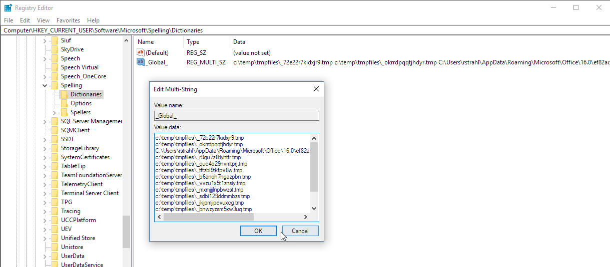

# WPF Slow Window Loading due to Invalid SpellCheck Dictionaries


File this one into the *Mr. Murpy Loves Me* category: I ran into a nasty issue yesterday with Markdown Monster, which is a WPF application. I got into trouble by innocently adding an `SpellCheck.IsEnabled=true` attribute to one of my text boxes on the Weblog Publishing form like this:

```xml
<TextBox TextWrapping="Wrap" Height="100"
         Text="{Binding ActivePostMetadata.Abstract}" 
         IsEnabled="{Binding IsAbstractVisible}" 
         
         SpellCheck.IsEnabled="True"  />
```

That's simple enough, and it works:


<small>**Figure 1** - WPF Spellchecking is easy to add with a simple property on a TextBox control</small>

### Why so slow???
But... on my dev machine there was a major problem: With that code in place the simple form that contains the spell check now took **3+ seconds to load**. Say what?

So I tried to track this down. I removed the spell check code and immediately the form popped up instantly. Add the spell check back in - 3+ seconds load time. 

Next, I tried this on another computer - a low end convertible no less - and guess what: No slowdown even with the spell check code in place. WTF?

A quick look at the Visual Studio Profiler Analysis on my machine quickly pointed me at `InitializeComponent()` block of code after which the Profiler disappears into native code, so the issue is something internal to WPF. 

### Dictionaries, Dictionaries
It turns out WPF spell checking uses Windows dictionaries and these dictionaries are globally referenced in the registry. When I took a look at the global dictionary registration key in the registry at:

```txt
HKEY_CURRENT_USER\Software\Microsoft\Spelling\Dictionaries  
Key: _Global_
```

I immediately found my problem:



<small>**Figure 2** - Global dictionaries registered had a bunch of temporary non-existant files.</small>

Ugh! There were about 15 temporary dictionaries referenced in this section and sure enough these were the cause of my slow down. 

Once I removed all the temp dictionaries and left just the legit Office dictionary my form now just pops again immediately.

The slowdown was caused by the errant dictionaries.  I'm not sure why this is so incredibly slow. Given that the files referenced don't exist, there can't be any parsing happening. I also double checked to see that there weren't massive files in these folders which would make the look up really slow, but that's also not the case. Just having bad entries slows down the spell checker something fierce.

### Temporary Dictionaries?
I also have no idea where these errant spell check dictionaries came from. I've been keeping an eye on this registry key and haven't seen temporary dictionaries returning. Clearly some application was writing out these files that subsequently get killed when my `TMPFILES` folder gets cleaned up by a daily scheduled task. 

But unfortunately I have no idea which one. I'll keep an eye on this key and see if it returns after more use.

### Moral of the Story
At the end of the day, *if* you should run into a problem with slow spell checking code - check your registry and make sure the dictionaries in use are legit. 

It's definitely not something you are very likely to run into, but it's one of those strange edge cases that when they bite you, it takes a lot of time to track down. If you're unlucky enough to be bitten by this particular issue, hopefully you landed here and can fix your problem quickly - unlike me who wasted a few hours tracking this down.

... and... exit Mr. Murphy. End Act One.

<div style="margin-top: 30px;font-size: 0.8em;
            border-top: 1px solid #eee;padding-top: 8px;">
    
    this post created and published with 
    <a href="https://markdownmonster.west-wind.com" 
       target="top">Markdown Monster</a> 
</div>