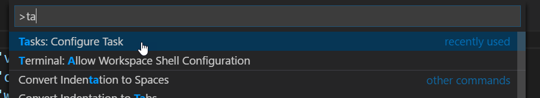
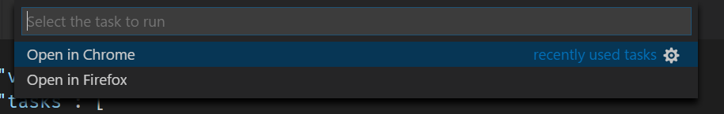

# Running a Web Browser with a HTTP Url from Visual Studio Code

Here's a quick tip for [Visual Studio Code](https://code.visualstudio.com/) and how to open the current document in a Web Browser. 

I've been using Visual Studio Code more and more in recent months and it just keeps getting better and better as a general code editor. I like the speed and it the environment 'just feels' very comfortable to work in. While I still use other editors for full on development most of the time for their IDE features, for quick edits or updates I tend to always use Visual Studio Code.

I especially like it for Web development of all sorts, although for heavy duty work I still prefer [WebStorm](https://www.jetbrains.com/webstorm/) for its true IDE features (heavy duty refactoring, auto-complete, CSS and HTML navigation features).

For heads down coding VS Code is very nice and just feels better than most other editors. But one thing I miss is a quick and easy way to launch a browser from the current HTML document I'm editing either locally running from disk, or on my currently running development Web server.  

But luckily it's quite easy to create a new custom **Task** in Visual Studio and add it to your project. If you use Visual Studio Code for Web editing and you quickly want to preview and HTML page in a browser, here's a simple way you can add a task to open a Web Browser.

##AD##

### Creating a new Task in tasks.json

To do this:

* Bring up the Command Pallete (Ctrl-Shift-P)
* Type in Task or Configure Task



This brings up the Task editor for the current project, which edits a `tasks.json` file in the `.vscode` folder in the editor root where you opened the editor.

You can now add tasks. I'm going to add two tasks to open Chrome with the current open document as a fixed HTML URL with the project relative path:

```json
{
    "version": "0.1.0",
    "tasks": [
        {
            "taskName": "Open in Chrome",     
            "isBuildCommand": true,
            "command": "Chrome",
            "windows": {
                "command": "C:/Program Files (x86)/Google/Chrome/Application/chrome.exe"
            },
            "args": [
                "http://localhost:5000/${relativeFile}"
            ]
        },
        {
            "taskName": "Open in Firefox",     
            "isBuildCommand": true,
            "command": "Firefox",
            "windows": {
                "command": "C:/Program Files (x86)/Mozilla Firefox/firefox.exe"                
            },
            "args": [
                "http://localhost:5000/${relativeFile}"
            ]
        }
    ]
}
```

This hooks up the tasks as build tasks. Pressing `Ctrl-Shift-B` fires the first build task automatically - in this case Chrome.

Alternately:

* Bring up the Command Console (**Ctrl-Shift-P**)
* Type **Run Task**
* Pick from the list of tasks
 


### Launching HTML from the File System
The code above uses a hardcoded project specific URL that hits a local Web server. You can also just preview the file from disk which is a little more generic.

```json
{
    "taskName": "Open as HTML File",     
    "isShellCommand": true,
    "command": "Shell",
    "windows": {
        "command": "explorer.exe"                
    },
    "args": [
        "${file}"
    ]
} 
```

This will use whatever browser is configured on Windows and launch it from the local file system. 

### Easy Extensibility
The more I look in Visual Studio code the more i find to like. The extensibility model is super easy so it's easy to add things like code snippets or as I've shown here tasks that are tied to a hotkey.

There's a lot more you can do with tasks - so be sure to check out the documentation linked below.

### Resources
* [Visual Studio Code Tasks Documentation ](https://code.visualstudio.com/docs/editor/tasks)

<div style="margin-top: 30px;font-size: 0.8em;
            border-top: 1px solid #eee;padding-top: 8px;">
    
    this post created and published with 
    <a href="https://markdownmonster.west-wind.com" 
       target="top">Markdown Monster</a> 
</div>