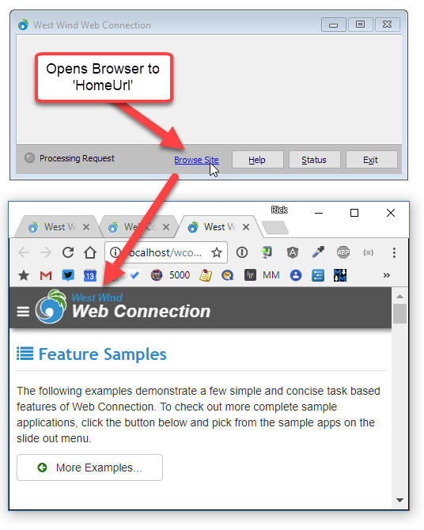
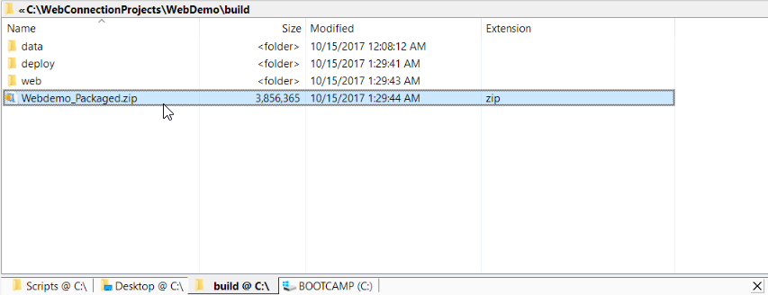

# West Wind Web Connection 6.17 released

Time for another [West Wind Web Connection](https://west-wind.com/WebConnection) update with version 6.17. This release is mostly a maintenance release that fixes a few small bugs and updates a few existing features with minor enhancements. 


### Better Error information for wwDotnetBridge Load Errors
wwDotnetBridge now will report error information when it fails to load. Previously this error information wasn't forwarded from C++ loader code due to some Unicode conversion issues. 

This should make it much easier to debug wwDotnetBridge loader errors. The most common errors are related to missing assemblies or blocked access denied errors which should be clearer now. Small feature but probably very useful to those getting started and running into problems.


### Browse Site link on the Web Connection Server Form
The Web Connection Server window now has a **Browse Site** button that will open the system browser to the configured `HomeUrl` configuration value.



The value is set in new projects to the configured local development Web root. But you can customize this value using the `HomeUrl` value in `MyApp.ini`:

```
HomeUrl=http://localhost/MyApp/
```

You can also temporarily set this URL to a specific page that you are working on so you can quickly jump to that page from within FoxPro.

The form is now also properly resizable with the request links properly adjusting in the requests list.

### JsonSerialize() and JsonDeserialize() Global Functions
As you probably know Web Connection includes the [wwJsonSerializer Class](https://west-wind.com/webconnection/docs/_1wu18owba.htm) class and makes it pretty easy to serialize and deserialize data. 

However, you still need to create an instance of an object, set a couple of options and then use the serialize method. These two methods make it even easier to do JSON serialization with a single function call so you can more easily serialize data for debugging or embedding into scripts and templates.

Here's what the new code looks like:

```foxpro
DO wwJsonSerializer && load libs

lcCustomerJson = JsonSerialize(loCustomer)
loClonedCustomer = JsonDeserialize(lcCustomerJson)

Assert(loConedCustomer.LastName == loCustomer.Lastname)
```

### New Process Class Template Updates
When Web Connection creates a new project or a new process class, it uses a stock template (`Templates\process.prg`) from which to create the new process class. 

In this update the class now defaults to `nPageScriptMode=3` which executes MVC scripts via `Response.ExpandScript()` when no matching process/controller method can be found. Scripts are the preferred mechanism for building MVC style applications. Previously the mode was `1` which used templates. The problem with that was that people would expect the full feature set of scripts that would then not work. Switching the default should cause less confusion for new users. 

Of course if you prefer to have 'headless' Views fire templates (`Response.ExpandTemplate()`) you can just just manually set the value back to 1.

### Build Script Updates
The `build.bat` file generated into a new project folder to create a packaged application ready for deployment has been updated to create a more complete deployment package. 

Previously the script only pulled the EXE and all the Web Connection system dlls required to deploy the binary folder. 

The updated script adds the Web and Data folders by default and creates the same structure as the project with Deploy/Web/Data top level folders. 



This should make it easier to deploy applications for the first time which is the primary purpose of the build script. Subsequent  udpates are better handled with Web Deploy (in Visual Studio or with MsBuild) for Web content and the `bld_MyApp.prg` application updater for your application's binary.

It can also be useful when updating Web Connection versions as the build script pulls all the dependent Web Connection DLLs from the install folder into the `Deploy` folder. For updates you might want to modify the script by removing the Web and Data folder creation.

This is another little gem in the feature set - while it's easy enough to create a batch or Powershell script yourself, having something out of the box to get you started is a big motivator to have an automated way to package your app. If you haven't done it before give it a try.

If you have an old application, you can also check this out by creating a new project and picking up the generated `build.bat` and then copying it into your older project. Most of the generated script is boiler plate with a couple of variables at the top to point at the right paths. You can modify the script to fit your needs easily once you know what you should be copying.


### Improved COM Server Load Times
COM Servers now load slightly faster as the COM load sequence has been optimized further after the last release's parallelization of server loading onto pool threads. Servers are now loaded onto MTA threads (rather than STA), which provides faster startup and less overhead in ASP.NET request processing. 

The switch over from STA to MTA required a couple of small changes, but the benefit here is that this removes any requirement for STA threads in your ASP.NET Web application which reduces resource usage and better scalability under heavy load. 


### Summary
All in all version 6.17 is a small update with only very minor fixes. There are a handful other small tweaks and performance improvements not worthy of much explanation here. This is a good thing - we don't need major updates and features in every update, and this release has been pushed out to address a few small bugs that needed addressing .

Enjoy the calm of this release...

### Related
* [Release Notes for Web Connection 6.15](https://west-wind.com/wconnect/weblog/ShowEntry.blog?id=931)
* [Release Notes for Web Connection 6.10](https://west-wind.com/wconnect/weblog/ShowEntry.blog?id=925)

<div style="margin-top: 30px;font-size: 0.8em;
            border-top: 1px solid #eee;padding-top: 8px;">
    
    this post created and published with 
    <a href="https://markdownmonster.west-wind.com" 
       target="top">Markdown Monster</a> 
</div>