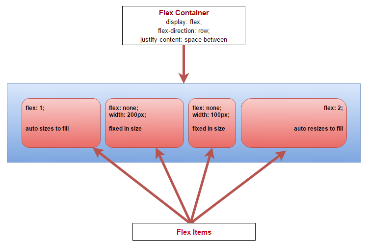
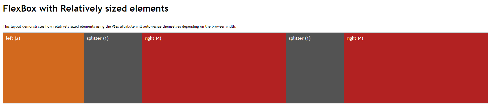
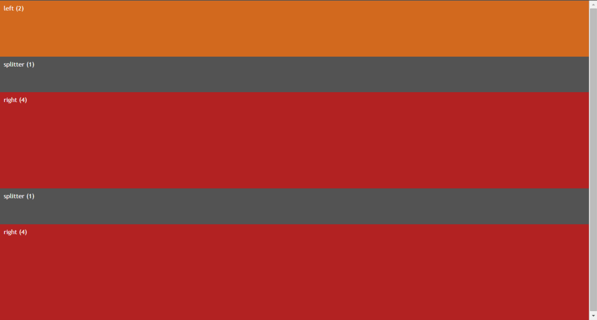
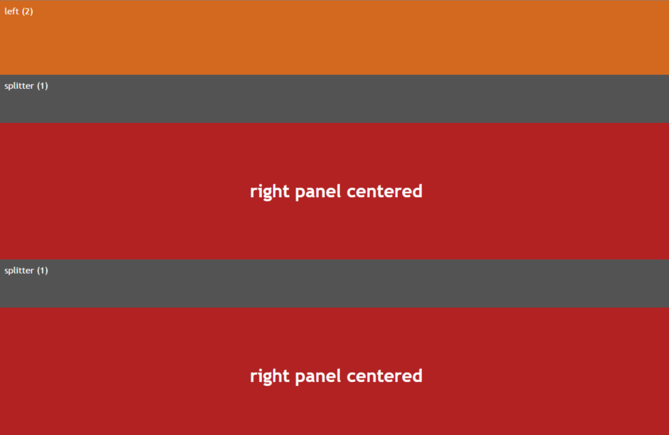
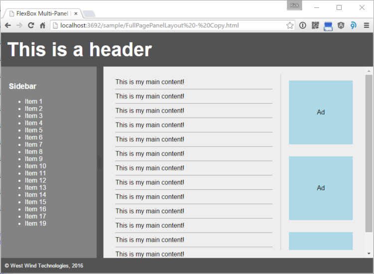
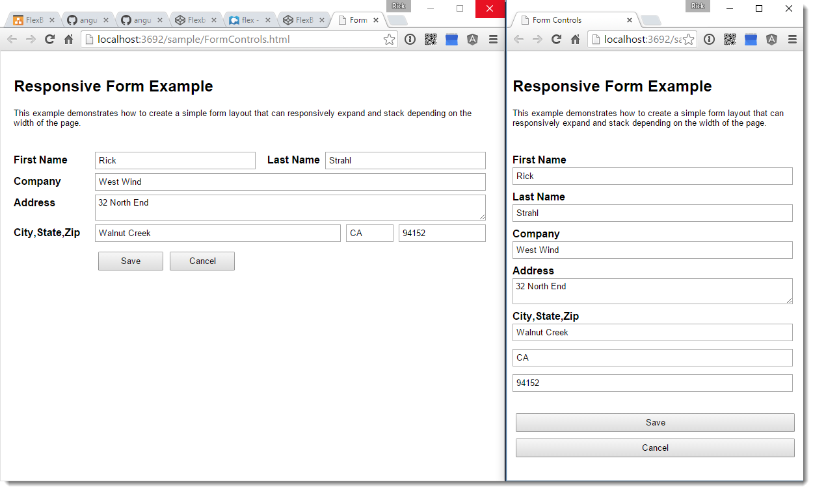

# Flexing your HTML Layout Muscles with Flexbox


<a href="http://www.codemag.com/Magazine/Issue/8b214701-fb48-42e6-9563-185acf5fa111"></a>

*<small style="display:block;margin-top: 40px;width: 400px;color: firebrick">This article was [originally published](http://www.codemag.com/Article/1603051) in [CODE Magazine Issue 2016 Mar/April](http://www.codemag.com/Magazine/Issue/8b214701-fb48-42e6-9563-185acf5fa111) and has been updated on **November 11th, 2017** with additional information</small>*

<br clear="all"/>

CSS hasn’t changed much since CSS 3 has been released, but the relatively new Flexbox module provides some much needed relief when it comes to creating complex structured layouts in HTML. Flexbox can be considered a much more flexible successor to HTML tables. In this article I’ll introduce the basic concepts of Flexbox and a few practical examples that demonstrate how to put Flexbox to use in your own HTML applications today.

Let’s face it – most of us doing Web development have struggled with multi-column layouts at sometime in our Web development. Any developer new to HTML coming from a desktop based development environment is very likely to comment immediately on the fact how difficult it is to
properly create a structured layout in HTML. While it’s always been possible to make layouts behave using various tricks and specialized workarounds, the process has never been easy.

HTML has always been very good for **document style layout** – that is, creating flowing documents where content stacks on top of the previous content. HTML thrives on flowing content that takes up as much space as is available and reflowing content around embedded floating elements automatically.

On the other hand, creation of **structured layouts** that display content in confined areas that sit side by side or need to stack in an exact order and location have been much more elusive to achieve with HTML. Trying to create paneled layouts that can stay fixed and/or dynamically resize relative to each other are not trivial to create in HTML.

Technologies to deal with structured layouts have come and gone over the years: Developers have used HTML frames, HTML tables, float based layouts, and more recently various CSS tricks and grid systems popularized by a number of CSS frameworks like Bootstrap, Foundation and
Google’s Material Design. While there have always been solutions and hacks to beat HTML into submission, it has never been an easy road as each of these technologies has limitations and requires compromises.  Even today, for many Web developers tables are the first and only tool they reach for when a structured layout is required.

It seems we’ve been struggling long enough with various hacks to create complex, structured HTML layouts.

### Flexbox to the Rescue
But that’s finally changing. With the advent of the HTML Flexbox model, HTML gains a rich box formatting engine that addresses complex layouts. You can think of Flexbox as HTML tables on steroids, without the styling limitations of tables and the ability to use any HTML  semantic tag to create a Flexbox container and child elements. You can apply Flexbox styling to any HTML element which means you can easily restyle and reflow elements independently of each other as there is no fixed container hierarchy as there is in tables. 

Flexbox makes it much easier to lay out documents that require multiple columns or need to flow complex layouts around pages by providing many  declarative attributes that describe exactly how each container and their children should size themselves, how content should align and
wrap, how much and where spacing should be applied to fill space and so on. For example, it’s easy with Flexbox to create a full page layout that stay fixed to the height of the browser window and adjust all panels within the layout when the browser resizes. Likewise, it’s pretty easy to specify that content should be centered either horizontally and vertically or both. Content inside a container can be made to stack on top of the previous element or to flow side by side and you can easily control the wrapping behavior, which makes it much easier to create responsive mobile friendly layouts that can adjust according to screen size.

Much of this was possible before with HTML without Flexbox, but it required a lot of disjointed CSS attributes to find the right invocations. Flexbox creates a new, comprehensive model using a few clearly defined attributes specific to layout tasks that can interact with each other more easily than the old HTML attributes.

##AD##

### Flexbox History
As we are building more and more interactive applications inside of the browser, it is increasingly important to control layout more easily to enable the complex interfaces we now build with HTML. User interface design still is one of the most time intensive operations in Web
application development, and anything that makes this process easier is a welcome change. Flexbox provides some much needed relief in this area as it facilitates creating complex layouts more easily using standard semantic HTML element tags.

The HTML Flexbox model is not exactly new. The initial, now outdated spec for Flexbox was released in 2009 followed by another now outdated update and was finally was replaced in 2012 by the current Flexbox specification that is now available in most browsers. It’s still a working draft in the final recommendation stage (see sidebar), but the draft has been fairly stable
for a few years now. All evergreen browsers and most reasonably recent mobile browsers now support Flexbox. The big glaring exception is Internet Explorer 9 and older which have no support and Internet Explorer 10 which has partial (but reasonably good and usable) support for Flexbox.

Although decent Flexbox browser support has been available since 2014, it seems that Flexbox really hasn’t hit the developer mainstream yet. It still feels like bleeding edge technology that hasn’t garnered wide adoption yet. This is because it’s relatively new and because Flexbox has a learning curve. The Flexbox CSS syntax is different and to use it you have to understand the basics of how the model and its relationships works. It’s not as simple as slapping a new attribute on a single HTML element and see behavior change. Flexbox deals with layouts and acts on
many elements simultaneously and therefore requires some Flexbox styling on each participating element. It’s not rocket science, but there are quite a few CSS attributes to choose from. The terminology for some these attributes and values is somewhat overlapping, so it can be a
little overwhelming at first to figure out which attributes to use. But as is often the case with new technology, you end up using a few features over and over again and the few attributes you need to master are easy to remember once you get the basic hang of how they relate to each other.

You’ll be hearing a lot more about Flexbox in the near future. Many of the updated big CSS frameworks coming out soon like Bootstrap 4.0 and Material Design from Google rely heavily on Flexbox to provide their layout features. It’s a good time to get up to speed on how Flexbox
works now. Even if you’re not using Flexbox directly some of the frameworks you might use in the future will leverage Flexbox under the covers and understanding how it works will make it easier to interact with these frameworks.

You can think of Flexbox as HTML tables on steroids, without the limitations of table styling and the ability to use any semantic HTML tags. 

### Getting Started with Flexbox
Flexbox is a CSS based container layout module. One of the big benefits of Flexbox over HTML tables is its ability to use any HTML element to define its containers and elements. You can use **div, nav, article** or any other built-in or dynamic semantic HTML tag to define your
containers and child items.

The key thing to understand about Flexbox is that it’s a container manipulation tool. It defines the overall behavior on the container and then allows element functionality to override some behavior traits of the elements that are under control of the container. Using a handful of
flexbox specific attributes, you get a ton of control how the container alignment and flow is managed.



<small>**Figure 1** – Flexbox works through containership using a flex
container and flex items. Items can control their own sizing and flow
characteristics.</small>

**Figure 1** demonstrates the containership and some of the more common
CSS attributes you’re going to see in a Flexbox layout. The container
controls the overall flow of the layout, using attributes like
**flex-wrap, align-items** and **justify-content.** The layout in Figure
1 is horizontal using **flex-direction: row** (along the *main axis*)
but Flexbox also supports **flex-direction:** **column** layouts that
formats a layout vertically (along the *cross axis*). Using these
attributes, you can control many aspects including element sizing,
wrapping and fill mode with very little CSS styling that clearly defines
the container behavior.

Individual items can control how they fit into the layout and manage
their own internal formatting using standard CSS styling. Child items
primarily use the **flex** attribute to determine their Flexbox
behavior. The **flex** attribute is a combination of the **flex-grow**,
**flex-shrink** and **flex-basis** attributes. These three attributes
determine whether the element can grow or shrink if the value is
non-zero. If the value is non-zero and the element can grow or shrink
and the value is used as a ration in relation to the other other
elements in the container. The flex-basis determines the initial size or
**auto** to use whatever the elements actual size is initially. Using
Flexbox it’s trivial to create relatively sized elements that are
recalculated on resizing and even as new elements are added to the
container. Other item attributes include **align-self** which overrides
the parent’s **align-items** setting and **order** which lets you
explicitly control the location of an element in the container’s child
collection. These are very useful if you programmatically insert and
manage elements dynamically.

Flex containers can be nested so you can create a top level container
that vertically manages elements, then use a child container to set up a
horizontal flex container inside one of the child containers. A common
example of this is a fixed window layout where you have a top level
container that manages the full height of the browser window with
header, content, footer. The content area can then have a horizontal
Flexbox layout that contains multiple panes for a nav sidebar, content
and ad sidebar. We’ll look at an example of this later in this article.

Unlike HTML tables, Flexbox can use any semantic HTML element for the
container or child elements

### The Flex Container

The flex container starts off the Flexbox hierarchy using
**display:flex** attribute. This changes the display mode and tells the
container and immediate child elements that they are using Flexbox
layout formatting. The **flex-direction** attribute controls the
horizontal (**row**) or vertical (**column**) flow of the child
elements. The default is **row** and can be omitted for horizontal
layouts. You can also specify the fill characteristics via the
**align-item** and **align-content** which define the positioning via
fill or spacing respectively, the **flex-wrap** attribute that controls
wrapping behavior or elements. In combination these attributes give you
a lot of control over how the container renders its child elements.

To demonstrate here’s a simple example of a full-width horizontal
container using some very simple HTML:

```html
<div class="panel-container">
    <nav class="panel-left">
        left
    </nav>

    <div class="splitter">
         splitter
    </div>

    <article class="panel-right">
        right
    </article>
</div>
```


To define a top level container you can do something like this (all but the first attribute are optional):

```css
.panel-container {
    display: flex;
    flex-direction: row;
  
    justify-content: space-around;
    flex-wrap: nowrap;
    align-items: stretch;
}
```


### Flex Elements

Once you have a container you can customize how the contained elements
behave inside of that container primarily using the **flex** attribute.

To demonstrate I’m using three horizontal panels that have two fixed
width panels and one auto-resizing panel:

```css
.panel-left {
    flex: none;  /* manual resize */
    width: 300px;
}
.splitter {
    flex: none; /* manual resize */
    width: 18px;
}
.panel-right {
    flex: 1; /* resizable */
}
```

The most important attribute is the **flex** attribute is a shorthand
for **flex-grow**, **flex-shrink** and **flex-basis**. The first two are
numeric values that represent relative sizes of all the child elements.
0 means the size is fixed and shouldn’t shrink or grow respectively. Any
number greater than 0 means the element can grow or shrink relative to
the other elements’ grow and shrink values. The most common values are
**0 0 auto** which specifies to keep the size fixed, or **1 1 auto**
(which is also the default if not provided) which specifies the element
will auto size itself to fill available space. When using auto for the
flex-basis, the element uses the existing size as its basis, so if you
have a fixed width for the element that is used as the base value.

If you want to express a relationship without explicit width (or height)
you can also use relative numbers that establish a ratio relationship
between the elements:

```css
.panel-left {
  flex: 2 2 auto; /*  resizable */
}

.splitter {
  flex: none; /* fixed */          
  width: 40px;
}

.panel-right {
  flex: 4 4 auto; /* resizable 2x left */
}
```

This makes the left panel (2) half the size of the right panel (4), and
the splitter panel half the size of the left panel (1). As you resize
the container that relationship stays intact. This is similar to using
percentages in table layouts except that Flexbox can recalculate the
ratios even if new elements are added to the layout. **Figure 2** shows
how this relationship renders in the browser when another **.splitter**
and **.panel-right** elements are added to the initial layout. You can
check it out online at: <http://codepen.io/rstrahl/pen/adJPeQ>.



<small>**Figure 2** – Using relative sizing in the **flex** property keeps
elements sized relatively to each other as you resize the browser window
and even if you add new elements dynamically.</small>

Although relative sizing like this is very powerful, you can also use
specifically sized layouts where some elements stay fixed and others
automatically stretch or shrink to the accommodate the new size of the
container. Using **flex: 0 0 auto** specifies that the element should
stay fixed in size while **flex: 1 1 auto** will resize. This is very
common for layouts that have a single expanding element or that are
using things like splitters that let a user resize panels.

##AD##

### Vertical Layouts
One of the most difficult layout issues to deal with in HTML
consistently, even in modern browsers, is to build a UI that
automatically stretches to fill the entire browser window and stays
properly sized as you resize the document. The age old problem with
vertical sizing in the browser is that HTML has to know the actual size
of the window from the top level container (body/html) all the way down
into the child elements. Flexbox makes this process much easier.

To create a vertical layout you can use the **flex-direction: column**
on the container, and then layer the elements to fill the height of the
container. Using the exact same layout as in Figure 2 and simply
switching the **flex-direction:column** results in a stacked layout
displayed in **Figure 3**. You can also check out the Codepen at:
<http://codepen.io/rstrahl/pen/NxjxRW>.



<small>**Figure 3** – Creating a vertical layout that fills a container is as
simple as using **flex-direction:column**.</small>

As in the horizontal layout, the vertical panels now fill the height of
the container to its maximum size using the ratios specified by in the
**flex** attribute.

To create full window height layouts that fill the entire browser window
and resize to fill the entire content area, you have to ensure that the
**html,body** elements as well as the top level flex container that
wraps the entire page, have a **height:100%** set in their CSS:

```html
html,body {
    height: 100%;
    overflow: hidden;
}
.flex-container {
    display: flex;
    flex-direction: column;
    height: 100%;          
    overflow: auto;          
}
```

This ensures the content of the items fills the entire window. Note the
**overflow:auto** in the **.flex-container**, which works around an odd
gotcha I ran into with FireFox. FireFox requires **overflow:auto** in
order to keep the panels constrained to the panel height, even though
**overflow:auto** should be the default setting. All other browsers seem
to work without this. I’ve found in a few instances where explicit
overflow settings are required so I’ve taken to being very explicit with
my overflow settings in flex containers.

### Vertical and Horizontal Content Centering

Another common difficulty in HTML is vertical centering of elements in a
container. While there is **a vertical-align** property in CSS, this
property applies only to table-cells and inline elements. It has no
effect on any other container elements.

Flexbox provides a simple solution using align-items. There are several
ways to express this:

```css
.panel-right {
    display: flex;
    align-items: center;
}
```

This implies **flex-direction:row** as that’s the default. If all you’re
after is centering this is the least CSS code you can use**.** This
might be counter intuitive because the **flex-direction** is horizontal
while align-items works on the vertical direction. This is exactly the
behavior of **align-items,** which aligns items on the perpendicular
axis.

Another slightly more verbose but maybe more obvious way to express this
same vertical centering is to use **justify-content** which aligns
content on the active flex-direction:

```css
.panel-right {
    display: flex; 
    flex-direction: column;                    
    justify-content: center;          
}
```


Both have the same effect of vertical centering the content but it’s
easier to see that centering is occurring on the column axis. To
summarize: justify-content works on the current flex-direction axis,
align-items works on the perpendicular/alternate axis. Hooray for bad
naming conventions.

The reason both of these exist is so that you can combine them to center
both vertically and horizontally. The following does just that:

```css
.panel-right {
    display: flex; 
    flex-direction: column;                    
    justify-content: center;          
}
```

Applied to the .panel-right style in the previous example **Figure 4**
shows what the centered content looks like.



<small>**Figure 4** – Centering content inside of an element can be easily done
with **justify-content** and **align-items** on any flex container.</small>

#PAGEBREAK

At this point we’ve seen most of the Flexbox attributes used, but keep
in mind there are many more combinations of these attributes that you
can apply. You can control wrapping behavior, fill behavior between
elements, whether elements stretch and fill or simply leave space at the
beginning or end – the combinations are endless.

As a summary and for a better idea of all the options available using
Flexbox syntax here’s a table that shows the Flexbox related attributes
grouped by container and child elements.

### Flexbox Container Attributes

+-----------------------------------+-----------------------------------+
| Attribute                         | Function                          |
+===================================+===================================+
| **display: flex**                 | Top level attribute that enables  |
|                                   | Flexbox formatting on the         |
|                                   | container it is applied to.       |
|                                   |                                   |
|                                   | **display:flex**                  |
+-----------------------------------+-----------------------------------+
| **flex-direction**                | Determines horizontal (row) or    |
|                                   | vertical (column) flow direction  |
|                                   | elements in the container.        |
|                                   |                                   |
|                                   | **row,column**                    |
+-----------------------------------+-----------------------------------+
| **flex-wrap**                     | Determines how content wraps when |
|                                   | the content overflows the         |
|                                   | container.                        |
|                                   |                                   |
|                                   | **wrap, nowrap, wrap-reverse**    |
+-----------------------------------+-----------------------------------+
| **flex-flow**                     | Combination of flex-direction and |
|                                   | flex-wrap as a single attribute.  |
|                                   |                                   |
|                                   | **flex-flow: row nowrap**         |
+-----------------------------------+-----------------------------------+
| **justify-content**               | Aligns content along the flex     |
|                                   | flow direction.                   |
|                                   |                                   |
|                                   | **flex-start, flex-end, center,   |
|                                   | space-between, space-around**     |
+-----------------------------------+-----------------------------------+
| **align-items**                   | Like align-content but aligns     |
|                                   | content along the perpendicular   |
|                                   | axis.                             |
|                                   |                                   |
|                                   | **flex-start, flex-end, center,   |
|                                   | stretch, baseline**               |
+-----------------------------------+-----------------------------------+
| **align-content**                 | Aligns multi-line content so that |
|                                   | multiple lines of content line up |
|                                   | when wrapping.                    |
|                                   |                                   |
|                                   | **flex-start, flex-end, center,   |
|                                   | space-between, space-around,      |
|                                   | stretch**                         |
+-----------------------------------+-----------------------------------+


##AD##

+-------------------------------------+------------------------------------------+
| Attribute                           | Function                                 |
+=====================================+==========================================+
| **flex**                            | Combination of flex-grow,                |
|                                     | flex-shrink and flex-basis rolled        |
|                                     | into a single attribute.                 |
|                                     |                                          |
|                                     | **Examples: 1 1 auto, 0 0 auto, 0        |
|                                     | 0 200px**                                |
+-------------------------------------+------------------------------------------+
| **flex-shrink\                      | Numeric value that determines how        |
| flex-grow**                         | a child element should grow or           |
|                                     | shrink. 0 means fixed size, a            |
|                                     | numeric value is used in relation        |
|                                     | to other numeric values on other         |
|                                     | sibling elements in the                  |
|                                     | container.                               |
|                                     |                                          |
|                                     | **0 – fixed size, number –               |
|                                     | relative sizing to other flex            |
|                                     | items in container**                     |
+-------------------------------------+------------------------------------------+
| **flex-basis**                      | The initial size of the element          |
|                                     | and the basis on which sizing is         |
|                                     | based                                    |
|                                     |                                          |
|                                     | **auto – uses size of element            |
|                                     | from width, pixel size – fixed           |
|                                     | size to apply**                          |
+-------------------------------------+------------------------------------------+
| **align-self**                      | Sets the alignment for the               |
|                                     | element explicitly overriding the        |
|                                     | value set by align-items on the          |
|                                     | container.                               |
|                                     |                                          |
|                                     | **auto, flex-start, flex-end,            |
|                                     | center, baseline, stretch**              |
+-------------------------------------+------------------------------------------+
| **order**                           | Sets the rendering order of the          |
|                                     | element inside of the container          |
|                                     | in ascending order                       |
|                                     |                                          |
|                                     | **numeric value**                        |
+-------------------------------------+------------------------------------------+

### A Practical Example – Full Page Panel Layout
To provide a comprehensive and practical example, let’s create a full
page layout that includes a number of nested Flexbox containers.
**Figure 5** shows a five panel layout that contains a header, a
sidebar, main content area, an ad bar and a footer. 



<small>**Figure 5** – An example of a multi-pane layout that uses multiple
nested Flexbox containers.</small>

Here's the code or you can play with the code [on CodePen](http://codepen.io/rstrahl/pen/YwZbYw).

```html
<!DOCTYPE html>
<html>
<head>
    <meta name="viewport" 
          content="width=device-width, initial-scale=1">
    <style>
        html, body {
            height: 100%;
            padding: 0;
            margin: 0;
        }        
        .flex-master {
            display: flex;
            flex-direction: column;
            flex-wrap: nowrap;

            height: 100%;
            overflow: auto;
        }
        .page-header {
            flex: none; /* fixed size */
  
            padding: 15px;
            font-size: 3em;
            font-weight: bold;            
            background: #535353;
            color: white;            
        }
        .page-content {
            flex: 1;   /* resize in container */
            overflow: auto; /* IMPORTANT for FireFox */
            
            /* new flex container for content */
            display: flex;
            flex-direction: row;                        
        }
        .sidebar-left {
            flex: none;
            background: #838383;

            padding: 20px;
            width: 200px;
            overflow: auto;
            color: white;
        }

        .splitter {
            flex: none;
            width: 17px;
            cursor: col-resize;
            background: #535353;
        }
        .content-container {
            flex: 1 1 auto;
            background: #eee;
            padding: 20px;
            width: 100%;
            overflow-y: auto;

            display: flex; /* new flex for content/ads*/
            flex-direction: row;
        }
        .main-content {
            flex: 1 1 auto; 

            width: 100%;
            padding: 10px;
        }
        .page-ads {
            flex: 0 0 auto;
            width: 180px;
            overflow: hidden;

            display: flex; /* new flex for ads */
            flex-direction: column;
        }
        .ad {
            flex: none;
            align-self: center;
            padding: 5px;
            margin: 15px;
            width: 150px;
            height: 150px;
            background: lightblue;
            overflow: hidden;

            /* center ad text */
            display: flex;
            justify-content: center;
            align-items: center;
        }

        footer {
            flex: 0 0 auto;
            background: #535353;
            color: white;
            padding: 10px;
        }
    </style>
</head>
<body>
    <div class="flex-master">
        <header class="page-header">
            This is a header
        </header>

        <div class="page-content">
            <nav class="sidebar-left">
                <h3>Sidebar</h3>
                <ul>
                    <li>Item 1</li>
                    <li>Item 2</li>
                </ul>
            </nav>
            <div class="splitter">
            </div>
            <div class="content-container">
                <article class="main-content">
                    This is my main content!
                    <hr />
                    This is my main content!
                    <hr />  …
                </article>
                <aside class="page-ads">
                    <div class="ad">
                        Ad
                    </div>
                    <div class="ad">
                        Ad
                    </div>  …
                 </aside>
            </div>
        </div>

        <footer>
            <small>&copy West Wind Technologies, 2016</small>
        </footer>
    </div>
</body>
</html>
```

Full page layouts like this that maintain their full size in the browser
are becoming more common as we are building more complex applications in
the browser. Applications, rather than content pages often require a
more fixed layout so that you can find and navigate content more easily.

The layout contains a number of nested containers:

*   Top level page container (.flex-master)
*   Contains header, .page-content and footer
*   .page-content is a new horizontal container
*   Contains .sidebar-left, .content-container
*   .content-container contains .main-content and .page-ads
*   .page-ads contains indivual ads

That’s quite a bit of container nesting that breaks down each page
section into smaller and smaller containers. Flexbox makes this
relatively easy as any child element can also act as a new Flexbox
container to its contained elements. If you’ve used WPF in .NET and the
various panel containers this approach should look very familiar.

One of the key features of this layout is that it remains fixed to the
full window size, so as you resize the window the footer stays at the
bottom and the content in the middle grows or shrinks to match the
height of the browser. As mentioned earlier the **html,body** styles are
marked for **height:100%** to ensure that the various containers can
calculate the total page size. The top level **.flex-master** also sets
its **height:100%** to fill out the entire height of the window. From
there on Flexbox’s relative or stretch sizing can fill out the window
height.

It’s important to think about the overflow characteristics for each
container and due to the funky FireFox I mentioned earlier, it’s a good
idea to explicitly specify how you’d like to have the overflow handled
in each container. For the top level container overflow should be hidden
because we don’t want to ever see a scrollbar on the document and
content really shouldn’t be overflowing anyway. The main content
container also shouldn’t have any overflow as it should fill the width
of the browser and the height between footer and header, but each of the
contained panels with the sidebar and main content should have overflow
to scroll the container for height and width.

The CSS for all of this is a bit verbose, but the HTML for the
containers and elements remains very compact and readable. While it will
never be really trivial to create multiple nested containers to create
full page layouts, Flexbox makes this a lot easier than it would be
using traditional CSS styling.

### Bonus: Adding Panel Resizing

While this has nothing to do with Flexbox, wouldn’t it be nice if you
could easily resize the sidebar and main panels using splitter like
behavior? It turns out there’s an easy way to add this functionality
using the jquery-resizable plug-in I created recently. This very small
jquery plug-in allows resizing of containers and makes it trivial to
create a resizable panel:

```html
<script src="src/jquery.min.js"></script>    
<script src="src/jquery-resizable.js"></script>
<script>
    $(".sidebar-left").resizable({
        handleSelector: ".splitter",
        resizeHeight: false
    });
</script>
```


And voila – you can now drag the black separator in **Figure 5** to
resize the left and right panels, which makes a nice addition to a
paneled layout.

### Form Layouts

Another pain point in HTML is form layout. One of the big draws of the
Bootstrap framework is its grid system, which provides responsive form
formatting and a semblance of multi-column form layouts. Flexbox can
replace much of what the grid system does with a small amount of CSS
just by using a Flexbox container around the individual form items. The
result looks similar to the HTML that you would write with Bootstrap,
but you actually get a lot more control over the elements because you’re
not actually constrained by specific grid sizes. You can get automatic
resizing of elements, but if you choose you can also give specific
sizing hints to size each grid column to a specific relative value that
is automatically recalculated by the Flexbox when the page or container
is resized.

**Figure 6** shows an example of a very simple input form that uses
Flexbox. 



<small>**Figure 6** – An example of an input form built with Flexbox formatting
can easily be made responsive.</small>

Here's the code or you can play with the code [on CodePen](http://codepen.io/rstrahl/pen/rxmjgL).

```css
<style>
.form-group {
    display: flex;
    flex-direction: row;
}

.form-group label {
    flex: none;
    display: block;
    width: 125px;
    font-weight: bold;
    font-size: 1em;
}
.form-group label.right-inline {
    text-align: right;
    padding-right: 8px;
    padding-left: 10px;
    width: auto;
}
.form-group .input-control {
    flex: 1 1 auto;
    display: block;
    margin-bottom: 10px;
    margin-right: 8px;
    padding: 4px;
    margin-top: -4px;
}
button {
    padding: 5px 15px;
    margin: 5px;
    min-width: 100px
}

@media (max-width: 768px) {
    .form-group {
        flex-direction: column;
    }
    .form-group .input-control {
        margin-top: 2px;
    }
    .form-group label.right-inline {
        text-align: left;
        padding-right: 0;
        padding-left: 0;
    }
}
</style>

<div class="form-group">
    <label>First Name</label>
    <input value="Rick" class="input-control" />

    <label class="right-inline">Last Name</label>
    <input value="Strahl" class="input-control" />
</div>

<div class="form-group">
    <label>Company</label>
    <input value="West Wind" class="input-control" />
</div>

<div class="form-group">
    <label>Address</label>
    <textarea class="input-control">32 North End</textarea>
</div>

<div class="form-group">
    <label>City,State,Zip</label>
    <input value="Walnut Creek" class="input-control" placeholder="City" style="flex: 6" />
    <input value="CA" class="input-control" 
           placeholder="State" style="flex:1" />
    <input value="94152" class="input-control" 
           placeholder="Postal Code" style="flex:2" />
</div>

<div class="form-group">
    <label>&nbsp;</label>
    <button>Save</button>
    <button>Cancel</button>
</div>
```


The key feature in this layout is that each ‘row’ is wrapped in a
container item very much like you would do in Bootstrap:

```html
<div class="form-group">
    <label>Company</label>
    <input value="West Wind" 
           class="input-control" />
</div>
```

You can then use some relatively simple styling to get the elements to
line up in each row:

```css
.form-group {
        display: flex;
        flex-direction: row;
    }
    .form-group label {
        flex: 0;
        display: block;
        width: 125px;
    }
    .form-group .input-control {
        flex: 1;
        display: block;
        margin-bottom: 10px;
    }
```


This simple CSS allows for the full row styling you see on the left.
What’s nice about this is that this existing layout works even will
additional items the list. For example, the city/state/zip row
automatically sizes multiple input boxes using relative sizing:

```html
<div class="form-group">
    <label>City/State/Zip</label>
    <input value="Clayton" 
           class="input-control" 
           style="flex: 6" />
    <input value="CA" class="input-control"
           style="flex: 1" />
    <input value="94152" 
           class="input-control" 
           style="flex: 2" />
</div>
```

The textboxes automatically stay relatively sized in the flex container
as you resize the container.

### Flexbox and Responsive Design

One big advantage that Flexbox has over HTML tables is that you can
apply Flexbox styling to any HTML element so you are not limited to the
strict structure that HTML tables must adhere to. Because of this it’s
much easier to restyle Flexbox containers and elements using media
queries and other responsive techniques.

Flexbox is just a styling mechanism which means you can add and remove it at will, and because you change the flow direction easily it’s almost trivial to go from a horizontal layout out a large display to vertical layout just by switching the **flex-direction**. Often just switch from **flex-direction:row** for wide screens to **flex-direction:column** for small screens.

For example in the form example in the previous section you can add a media query and simply flip the direction like this:

```css
@media (max-width: 768px) {
    .form-group {
        flex-direction: column;
    }
}
```

This has the effect that the form jumps to the display on the right that you see in **Figure 6**, which is a single column layout.

While it’s not always going to be quite so easy to rearrange content for different sizes, Flexbox gives you a lot of control via CSS to restyle content and automatically reflow content for responsive layouts.

FlexBox makes it much easier to create responsive designs as you can easily redefine how elements flow in a flex container.


### Flexbox and Browser Support
Flexbox is relatively new in HTML and as such works primarily in newer browsers. All the evergreen browsers (Chrome, FireFox, Edge and Opera and most mobile browsers) support Flexbox in the current version.

You can check browser support for Flexbox here:

[http://caniuse.com/\#feat=Flexbox](http://caniuse.com/#feat=flexbox)

The big issue here that Internet Explorer only supports Flexbox in Version 10 and greater and then only supports an older version of it although I found it to work well with all the content described in this
article. Luckily IE 9 and earlier market share is rapidly dropping off and many JavaScript and CSS frameworks now actively have stopped supporting these old IE versions in an attempt to drive out these ancient and standards hostile browsers.

#### Flexbox and WC3 Standards
Flexbox’s proper standards name is CSS *Flexible Box Layout Module Level 1* and it’s in the Last Call stage of the standards approval process. This means, it’s not an official WC3 standard yet, but the spec has been
stable for the last couple of years with only very minor updates and adjustments since the 2012 update. You can review the current standards document at:

* http://www.w3.org/TR/css-Flexbox

### Summary
Now that you’ve seen some of the features that Flexbox brings to the table for HTML layout, I think you’ll agree that it’s pretty exciting to see these enhancements come to HTML and CSS design. Flexbox is a very
welcome addition to HTML that provides a sorely missing structured layout engine that makes it easier to compose complex HTML layouts more easily than it has been. HTML has suffered long enough from hacks and
workarounds to build multi-column layouts that are adaptable and can take advantage of responsive design when the browser resizes.

While Flexbox technology is still relatively new and hasn’t been adopted widely yet, all major browsers have Flexbox support with the exception of IE 9 and older. Flexbox is in the Last Call stage of ratification as
a W3C standard, so it’s unlikely there will be any major changes to this spec. A number of big frameworks are betting big on Flexbox including the forthcoming BootStrap 4.0 and Google’s Material Design which are based on Flexbox concepts.

If you haven’t checked out Flexbox before, or you have and initially
dismissed it as too different or because not yet widely adopted, it’s
time to give it another good look. You won’t regret it for the time you
save in your HTML layout...

### Resources
* **[A complete guide to Flexbox](https://css-tricks.com/snippets/css/a-guide-to-Flexbox/)**  
A great reference to the available Flexbox styles and values you can use along with a graphical representation.

* **[MDN FlexBoxDocumentation](https://developer.mozilla.org/en-US/docs/Web/CSS/CSS_Flexible_Box_Layout)**  
As usual Mozilla has good official documentation on the various Flexbox attributes that’s easy to use as a reference where all flex related
attributes are linked.

* **[FlexBox Froggy Game](http://flexboxfroggy.com/)**   
An interactive game that teaches the concepts of Flexbox in a fun and very interactive way. If you've never played with Flexbox and even if you have but can't remember the unintuitive flexbox attributes, this game can get you up to speed. Recommended!

<div style="margin-top: 30px;font-size: 0.8em;
            border-top: 1px solid #eee;padding-top: 8px;">
    
    this post created and published with 
    <a href="https://markdownmonster.west-wind.com" 
       target="top">Markdown Monster</a> 
</div>