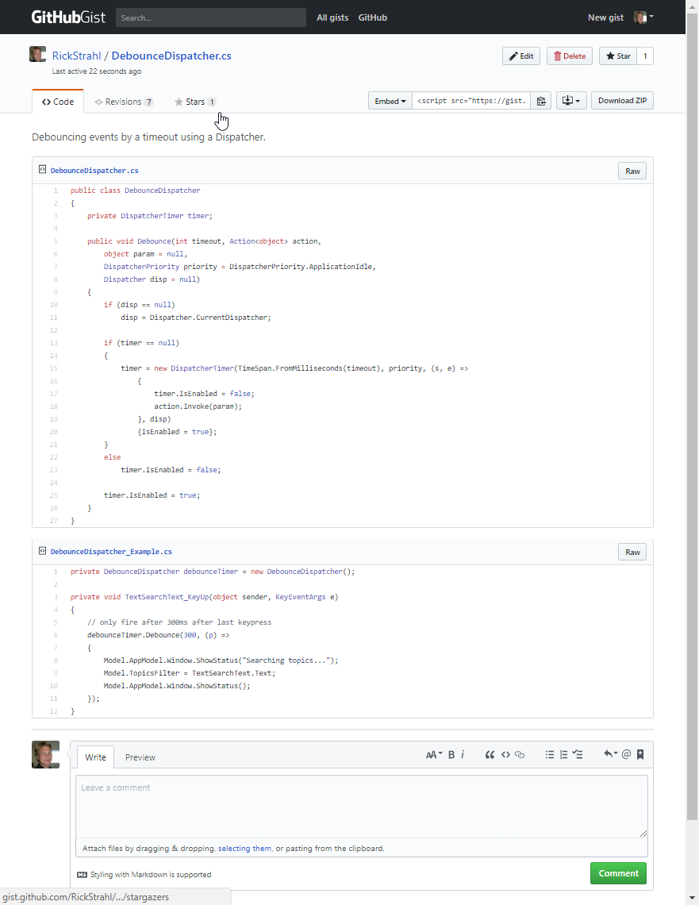
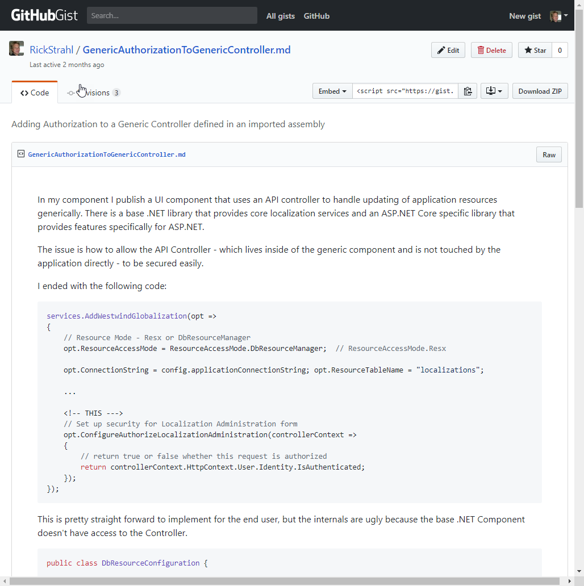
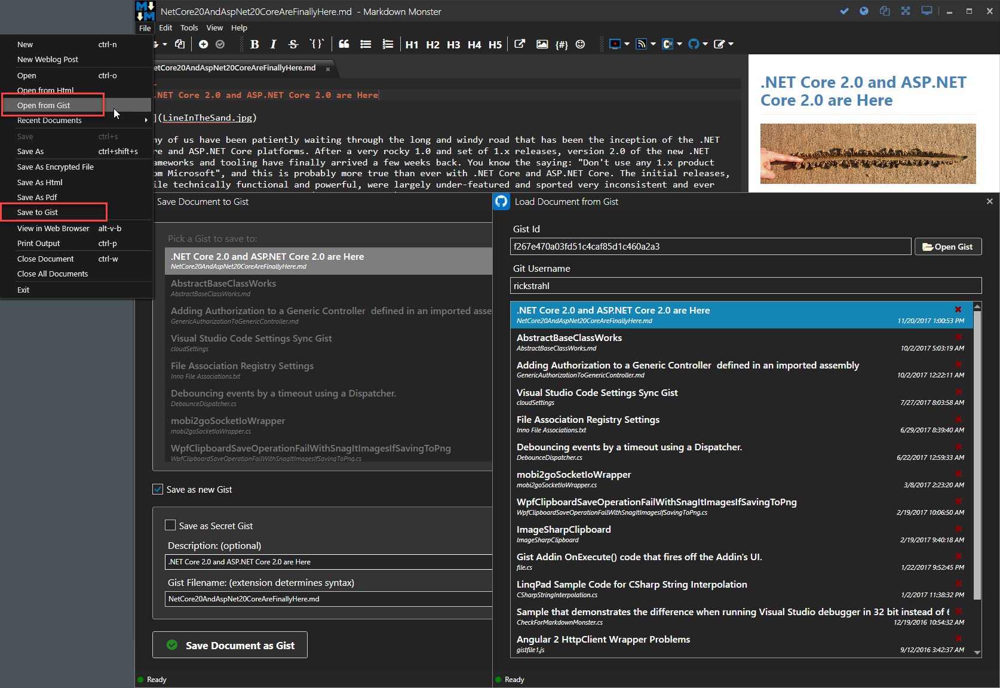

# Using Gists for General Purpose Content with Markdown

Many of you probably know that Github has a [GitHub Gist Site](https://gist.github.com) that can be used to post and share snippets of code easily. Gists are great for sharing longer code snippets on social media sites like Twitter, where you can link to a Gist for discussion. You can even associate multiple files to a single Gist so if you need to show client and server code, or want to show an implementation and example, or a whole slew of related configuration files. Each of the files can be 'associated' with a different syntax for each file which is nice:

Gists are like a single file Git Repository - Gists can be cloned and forked. There's also support for comments that allows for discussion of the code/text using the same comment system you use in Github issues.

One missing feature is support for Pull Requests - which would be a really nice addition for interactively updating content.

### Gists support Markdown
Gist as code snippets is pretty cool and powerful all by itself, but what's actually even more exciting is that Gists support **Markdown**. Yeah you probably knew that, but are you using this functionality as much as you should?

#### More Detailed Code Discussions
If you're creating Gists for discussion purposes - especially when sharing the discussion on Twitter -  I'd argue that creating a Markdown file is almost always better than creating one or more source files individually, because you can actually say something useful about the code you are sharing and frame the code in the context of the discussion (or vice versa). The comment support allows you to continue the discussion past the pointer when the Twitter conversation has scrolled off the feed.

I also like Markdown because trying to cram a description into a text box usually sucks, especially if you have multiple bits of code. With Markdown's capability of embedding code snippets with syntax highlighting, I think  it's an an infinitely more approachable way for sharing code along with explanation.

For example here's a bug I ran into and shared on Twitter via a Gist link while back:

Notice there are multiple snippets (which can all be using different syntax).

As I went through this, I updated the text and eventually ended up with a mini-blog like entry. The thought process is there as well as the solution. Because it's Markdown I can now also pick up the Markdown - as is - and stick it into my Markdown editor for a future blog post which saves some additional time.

#### Gist as Mini Blogs
Because Gists support Markdown that is turned into HTML, you can use it to create one off HTML pages that you can easily share. If you don't have a blog and you want to write up something you found during development this is a great way to put out something public. Even if you have a blog you might have content that's too small or not a good fit for a blog and you can write it as a Gist instead. Sort of a blog away from your blog :smile:

There's a difference from GitHub Issues though - you can't embed images into the document by pasting them in and having GitHub store them which is a bummer. All images you use have to be externally stored somewhere else.

#### Gists to share 'Secret' Text
Gists can also be *'secret'* which merely means the Gist isn't linked anywhere or shown in your profile. Anybody can access the Gist if the URL is known, but the URL isn't shared unless you explicitly give it out to somebody. I've found this useful in many situations where I needed to share some short lived information that wouldn't transfer over email (like emails with links to download files that are blocked for example) and Gists work just fine for that.

#### Gists for Configuration Settings
I also use Gists for storing non-sensitive configuration settings. Machine configuration scripts short registry scripts, I have them shuttled away as private gists that I reuse when paving a machine.

There are also a number of tools that store their configuration settings as Gists. There's a VS Code syncing utility that creates a shared backup configuration as Gist. Tools like BoxStarter store Chocolatey scripts to run as Gists.

Gists have a relatively easy API that is easy to integrate with so it's pretty straight forward to post and retrieve Gists from the Web.

### Gists as a shared Document Store
I use my own [Markdown Monster](https://markdownmonster.west-wind.com) as my Markdown editor and there is a [Gist Integration Addin](https://github.com/RickStrahl/GistIntegration-MarkdownMonster-Addin) which makes it very easy to open and save documents using Gist support that's directly integrated into MM.

This makes it easy to store things like Blog posts in progress in a Gist in a central location. If I want to pick up editing that post later from a different machine I can just grab the Gist, edit and save when I'm done. It works from anywhere whether I use MM or not as I can even do my edits directly on the Gist Web site.

Using a Gist also allows me to share my post with others for review or input in an easy fashion. Reviewers can fork the Gist and manually notify me of changes (merging back isn't directly supported).

Markdown Monster also allows saving individual code snippets as Gists that are then directly embedded into the Markdown document and rendered from Github:

I'm not necessarily trying to sell you on Markdown Monster here as the main winner here is the Gist process, but I bring it up because I found these  incredibly valuable additions to Markdown Monster that have changed in some ways how I work.  

> Markdown Monster also allows editing of non-Markdown code Gists, although it will only edit a single file.

### What I would love to see
As nice as Gists are, it would be really nice if there was support for Pull Requests or some easy way to pull in changes from a fork. This really would make it a killer platform for hosting blog posts and letting users make edits for typos and clarifications for example.

Image support would be awesome as well - the ability to paste images directly into the editor and have them show up is such a useful feature in GitHub Issues that I sorely miss it in Gists. I suspect this has to do with people abusing Gists in all sorts of unexpected ways, but it still would be nice if that was supported in some capacity (maybe with some image size limits).

### Summary
Gists and also other sharing sites like PasteBin are pretty awesome, but Gists to me feel immediately familiar because I already use Github and I have an account there, so it's all pretty transparent. If you haven't been using Gists (or some other code sharing site) think about how you can utilize this functionality and integrate it into your work flow. Whether it's for sharing code on social media, for storage of multi-machine access for documents, Gists are an easy way to do this. Even if you just use the online editor it's easy to create content - and very familiar if you're already using Github.

What unconventional uses are you using Gists for?

### Resources

* [GitHub Gists](https://gist.github.com/)
* [Markdown Monster Markdown Editor (for Windows)](https://markdownmonster.west-wind.com)
* [Markdown Monster Gist Integration Addin](https://github.com/RickStrahl/GistIntegration-MarkdownMonster-Addin)

    
    this post created and published with 
    <a href="https://markdownmonster.west-wind.com" 
       target="top">Markdown Monster</a> 

