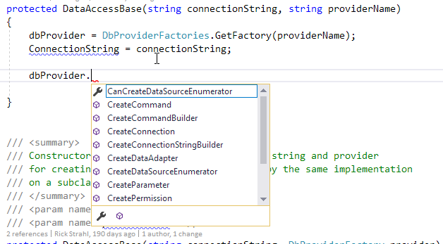

# Working around the lack of dynamic DbProviderFactory loading in .NET Core


I've been writing a lot about how nice it is to have .NET Core 2.0 and .NET Standard 2.0 support the majority of the  full framework .NET, which makes it easy to port existing full framework libraries. This post is a little different and I talk about one thing that is **not compatible** in .NET Standard/Core.

Specifically I am talking about missing support for `DbProviderFactories`, which provide support for dynamically loading a `DbProviderFactory` without having to take a dependency on the underlying provider you are loading. This to me seems an incredibly important piece of ADO.NET that is missing in .NET Core and Standard 2.0. 

Without `DbProviderFactories` there's no built-in support for using ADO.NET components without taking a dependency on the data access provider library such `System.Data.SqLite` or `System.Data.MySql` etc.)

To be clear, what I'm talking about is fairly low level, and of no concern in most application level code, because no matter what **at some point** an application has to take a dependency of the providers it wants to use. However, generic data access libraries or libraries that generically use database code with different providers typically don't know what providers might be used and so shouldn't have to take all the data provider dependencies that **might** be used.

If you're building a re-usable library that works with multiple data providers, the missing `DbProviderFactories.GetFactory()` method is a huge hole in ADO.NET and it's a pain to work around.

##AD##

### The missing DbProviderFactories in Westwind.Globalization
First a little background...

I recently updated my [West Wind Globalization library](https://github.com/RickStrahl/Westwind.Globalization) to .NET Core 2.0. I probably sound like a broken record, but I was thrilled to see that the vast majority of the code of this 10+ year old full framework library ported with only very minimal changes required. I was even able to port the base SQL Server based ADO.NET code that is used to handle the very simple database access that's required to manage localization resources with no changes.

But the full framework library uses a helper library **Westwind.Utilities** and its data access layer to provide simple ADO data access. The library internally used `DbProviderFactories.GetFactory()` to allow loading up various different data base providers by name which in turn is used by **Westwind.Globalization** to access multiple providers like Sql Server, SqLite, MySql and SqlCompact. This makes it possible to load a `DbProviderFactory` instance **without taking a reference** to the underlying provider in **Westwind.Globalization**. 

Eventually your **application** needs to take a hard dependency on the data provider you want to use, and that's fine. But inside of a generic library you definitely don't want to have to take that dependency. In full framework as long as the provider library is loaded and configured using `DbProviderFactories.GetFactory()` gives you that generic interface without the hard dependency.

In full .NET Framework you can use the following code:

```cs
var dbProvider = DbProviderFactories.GetFactory("System.Data.SqLite")

using(var connection = dbProvider.CreateConnection()) {
    connection.ConnectionString = ConnectionString;
    
    var cmd = dbProvider.CreateCommand("select * from customers",connection);
    connection.Connection.Open();
    
    cmd.CommandText = sql;
    var reader = cmd.ExecuteReader();
    
    // ... off you go 
    
    reader.Close();
}
```

If you want to use a different provider - you simply switch the first line and provide a different provider:

```
var dbProvider = DbProviderFactories.GetFactory("System.Data.MySql")
```

and the rest still works because the `DbProviderFactory` exposes most of the ADO.NET data objects via `CreateXXXX()` methods:




<small>**Figure 1** - DbProviderFactory gives access to ADO.NET objects in a provider independent way.</small>

The important thing is that the code in the data access library doesn't have to take a dependency on `System.Data.SqLite` or `System.Data.MySql`, which makes it very clean for a data access library to not have dependencies on all the individual libraries it supports. 

This all has always worked just fine on full framework.

### .NET Standard/.NET Core 2.0 - Where's my DbProviderFactories, Dude?
Unfortunately in .NET Core/Standard 2.0, the `DbProviderFactories` class is completely missing, and there's no direct replacement available to dynamically retrieve a `DbProviderFactory` dynamically based on a provider name.

I don't know what the .NET team was thinking to leave this important feature out. 

A hint of why can be found in the [DbProviderFactories class interface](https://docs.microsoft.com/en-us/dotnet/api/system.data.common.dbproviderfactories?view=netframework-4.7.1&viewFallbackFrom=netcore-2.0) which includes the `GetFactoryClasses()` method that returns a `DataTable` of available providers. There's also the issue that .NET Core doesn't have a concept of registered providers (nor classic .config configuration support), so there's no central repository that gives access to the providers. 

I would be perfectly happy if there was only a replacement for the crucial `GetFactory()` function - everything else can be worked around relatively easily or accommodated by some simple up front requirements like the parent application has to have the dependency added.

`GetFactory()` retrieves a `DbProviderFactory` using a provider name string. It assumes the provider library is registered and the assembly loaded (on .NET full at least) you can just load the provider. In .NET Core the only direct alternative is to take a hard dependency on the data provider and access the DbProviderFactory `.Instance` property directly. 

For example here's the SqLite instance:

```cs
var dbProvider = Microsoft.Data.Sqlite.SqliteFactory.Instance;
```

This works - but of course this requires that you have a reference to the `Microsoft.Data.SqLite` assembly. That's no good.

So, the alternatives I thought about:

* **Eat it and take the dependency**  
I could just add the dependencies for supported providers to my generic library, but that would seriously suck because now anybody using this 'generic' library that otherwise doesn't have any dependencies, now would have many dependencies. It also wouldn't allow for *just any* provider to work.

* **Add specialized assemblies for each provider implementation** 
One pretty common approach is to add specialized versions of the library that make the provider specific dependencies available. Something along the lines of: **Westwind.Globalization.SqLite** or **Westwind.Globalization.MySql** etc. That would work fine, but it's an administrative nightmare as each provider requires a separate project and a separate set of dependencies to keep in sync. On the plus side it guarantees the right providers are always available and loaded.

* **Hack it using Reflection**   
You can also use Reflection to dynamically access (and load if necessary) the providers. This makes the assumption that the top level application (or one of its dependencies higher up the stack) have added the required provider assemblies (ie. System.Data.SqLite or Microsoft.Data.SqLite) to the application. It also limits me to a *known* set of providers that I have to know about up front. Uncool but better than nothing.

##AD##

### Hacking it
As you might guess my chosen alternative is the last one which uses Reflection to dynamically instantiate various known providers. This code actually ended up in [Westwind.Utilities](https://github.com/RickStrahl/Westwind.Utilities) and the[ DataUtils class](https://github.com/RickStrahl/Westwind.Utilities/blob/master/Westwind.Utilities/Utilities/DataUtils.cs) as a helper function. 

For now I added the providers I immediately needed to work with, but I suppose a few additional common providers might be useful as well.

What I implemented are essentially three static methods that return a provider factory:

* `GetDbProviderFactory(string dbProviderFactoryTypename, string assemblyName)`
* `GetDbProviderFactory(DataAccessProviderTypes type)`
* `GetDbProviderFactory(string providerName)` 

Of those three, the first one is the one that does all the work of using Reflection to try and retrieve a provider based on a type name and assembly name: 

```cs
public static DbProviderFactory GetDbProviderFactory(string dbProviderFactoryTypename, string assemblyName)
{
    var instance = ReflectionUtils.GetStaticProperty(dbProviderFactoryTypename, "Instance");
    if (instance == null)
    {
        var a = ReflectionUtils.LoadAssembly(assemblyName);
        if (a != null)
            instance = ReflectionUtils.GetStaticProperty(dbProviderFactoryTypename, "Instance");
    }

    if (instance == null)
        throw new InvalidOperationException(string.Format(Resources.UnableToRetrieveDbProviderFactoryForm, dbProviderFactoryTypename));

    return instance as DbProviderFactory;
}
```

The code does three things:

* Tries to load the `Instance` property of a provider accessed dynamically
* If not found, it tries to load the providers assembly
* Tries again to the load the `Instance` property

It's ugly, but it works. The assembly load gets around the problem of the provider assembly not having loaded yet. Unlike ASP.NET Classic, ASP.NET Core does not pre-load assemblies when the application starts so unless the provider is otherwise used previously, the type is not going to be available. Loading the assembly explicitly loads the necessary dependency(s) and should then work. Incidentally this also works for full framework .NET and allows loading of providers without having to register the DbProvider in the `.config` file.

The code uses a [ReflectionUtils](https://github.com/RickStrahl/Westwind.Utilities/blob/master/Westwind.Utilities/Utilities/ReflectionUtils.cs) helper class from [WestWind.Utilities](https://github.com/RickStrahl/Westwind.Utilities) to help with accessing the static property and loading the assembly, which keeps this code simple.

### Other Helpers
The above method is the low level interface that requires that you know what assembly and class to load. In order to provide to make that a little easier I added a couple of additional methods that provide easy access or support for the old Provider Name syntax where applicable.

Since I'm already usurping the existing API, the first version uses a few known provider types through  an `Enum` to specify a provider. This certainly is a lot easier than trying to run around looking for the right provider name to use which was always a pain in the ass since there's no consistency across providers there. You can look at the implementation in the helper class.

Here's the Enum:

```cs
public enum DataAccessProviderTypes
{
    SqlServer,
    SqLite,
    MySql,
    PostgreSql,
    
#if NETFULL    
    OleDb,
    SqlServerCompact
#endif    
}
```

The first of the two methods just uses this enum to retrieve a specific `DbProviderFactory` instance. Since the provider types and assemblies are pretty much fixed this method is mostly a map to a few well-known providers:

```cs
public static DbProviderFactory GetDbProviderFactory(DataAccessProviderTypes type)
{
    if (type == DataAccessProviderTypes.SqlServer)
        return SqlClientFactory.Instance; // this library has a ref to SqlClient so this works

    if (type == DataAccessProviderTypes.SqLite)
    {
#if NETFULL
        return GetDbProviderFactory("System.Data.SQLite.SQLiteFactory", "System.Data.SQLite");
#else
        return GetDbProviderFactory("Microsoft.Data.Sqlite.SqliteFactory", "Microsoft.Data.Sqlite");
#endif
    }
    if (type == DataAccessProviderTypes.MySql)
        return GetDbProviderFactory("MySql.Data.MySqlClient.MySqlClientFactory", "MySql.Data");
    if (type == DataAccessProviderTypes.PostgreSql)
        return GetDbProviderFactory("Npgsql.NpgsqlFactory", "Npgsql");
#if NETFULL
    if (type == DataAccessProviderTypes.OleDb)
        return System.Data.OleDb.OleDbFactory.Instance;
    if (type == DataAccessProviderTypes.SqlServerCompact)
        return DbProviderFactories.GetFactory("System.Data.SqlServerCe.4.0");                
#endif

    throw new NotSupportedException(string.Format(Resources.UnsupportedProviderFactory,type.ToString()));
}
```

To provide some semblance of backwards compatibility, especially for full framework I also provide an overload for the old provider names. For full framework this method also allows loading of **any** provider using the provider name just as you could before, while in .NET Standard/Core only the supported providers work.

```cs
public static DbProviderFactory GetDbProviderFactory(string providerName)
{
#if NETFULL
    return DbProviderFactories.GetFactory(providerName);
#else
    var providername = providerName.ToLower();

    if (providerName == "system.data.sqlclient")
        return GetDbProviderFactory(DataAccessProviderTypes.SqlServer);
    if (providerName == "system.data.sqlite" || providerName == "microsoft.data.sqlite")
        return GetDbProviderFactory(DataAccessProviderTypes.SqLite);
    if (providerName == "mysql.data.mysqlclient" || providername == "mysql.data")
        return GetDbProviderFactory(DataAccessProviderTypes.MySql);            
    if (providerName == "npgsql")
        return GetDbProviderFactory(DataAccessProviderTypes.PostgreSql);            

    throw new NotSupportedException(string.Format(Resources.UnsupportedProviderFactory,providerName));
#endif
}
```

Note in order for this last method to work with full framework, any providers have to be registered in the `.config` file.

For now I just added a few 'known' providers that I actually needed to work with. It's easy enough to add additional providers (Postgres, OleDb etc.)

### Using the Function in Westwind.Globalization
Each of the Provider specific implementations in `Westwind.Globalization` implement a method called `GetDb()` that load an instance of the data access provider with a specific provider applied.

Here's is the SqLite provider.

```cs
public override DataAccessBase GetDb(string connectionString = null)
{
    if (connectionString == null)
        connectionString = Configuration.ConnectionString;

    DbProviderFactory provider = null;            
    try
    {
        provider = DataUtils.GetDbProviderFactory(DataAccessProviderTypes.SqLite);
    }
    catch { }

    if (provider == null)
        throw new System.ArgumentException("Unable to load SqLite Data Provider. Make sure you have a reference to Microsoft.Data.Sqlite (.NET Core) or System.Data.SQLite (.NET 4.5) and you've referenced a type out of this assembly during application startup.");

    var db = new SqlDataAccess(connectionString, provider);            
    db?.ExecuteNonQuery("PRAGMA journal_mode=WAL;");

    return db;
}
```

##AD##

### Mixed Targets
As you can see the code uses a bunch of framework specific compiler directives that perform different tasks depending on which platform the code compiles against. For example:

```cs
if (type == DataAccessProviderTypes.SqLite)
{
#if NETFULL
    //return DbProviderFactories.GetFactory("System.Data.Sqlite");
    return GetDbProviderFactory("System.Data.SQLite.SQLiteFactory", "System.Data.SQLite");
#else
    return GetDbProviderFactory("Microsoft.Data.Sqlite.SqliteFactory", "Microsoft.Data.Sqlite");
#endif
}
```

`NETFULL` isn't default compiler constant provided by the CSharp compiler and default project setup. Rather I explicitly specify this directive in my project, as part of my .NET SDK project.

A few definitions I tend to always create in multi-targeted projects:

* `NETFULL` - full framework
* `NETSTANDARD` and `NETCORE`  - .NET Core/Standard (mostly used interchangeably)

These are defined as compiler constants in the `.csproj` file:

```xml
<PropertyGroup Condition=" '$(TargetFramework)' == 'netstandard2.0'">
    <DefineConstants>NETSTANDARD2_0;NETCORE;NETSTANDARD;</DefineConstants>
</PropertyGroup>
<PropertyGroup Condition=" '$(TargetFramework)' == 'net45'">
    <DefineConstants>NET45;NETFULL</DefineConstants>
</PropertyGroup>
```

Note that the Visual Studio and `dotnet new` automatically create the framework targets (`NET45` and `NETSTANDARD2_0`) for the explicit targets that you use. But I find the higher level distinction between full framework and .NET Standard/Core is usually the more generic way to differentiate.

### SqLite Differences
One thing to watch out for is that Microsoft has created their own .NET Standard `Microsoft.Data.SqLite` implementation, which behaves quite differently than the `System.Data.SQLite` provider which hasn't been updated to support .NET Core/Standard. This means that different libraries are used for full framework (System.Data.SQLite) vs. .NET Standard (Microsoft.Data.SqLite).

Not only are the packages and assemblies different, but the Microsoft provider is much more low level than than the old full framework driver from the SqLite team. The Microsoft provider only exposes the minimal types that SqLite supports, so for example Dates are returned as ISO strings rather than being automatically transformed to dates.

This can bite you in unexpected ways. I ran into this with generic data object mapping from a data reader into an object and the dates in that bit of code would blow up because the mapper would expect a date instead of a string.

### On my Way
The code in this post is all I needed to get things working, but I am still baffled why Microsoft decided to not include **some way** to load a provider factory dynamically - it's a key requirement for just about **any data access** component that wants to access multiple providers without having to resort to messy workarounds.

The solution I provide here is a yucky helper, but it gets the job done and I was able to make it work in Westwind.Globalization. It's a shame that it took this much discovery effort to make it happen. Here's to hoping Microsoft changes its mind and either provides an implementation of `DbProviderFactories.GetFactory()` or some other API that makes it possible to load a provider more generically.

<div style="margin-top: 30px;font-size: 0.8em;
            border-top: 1px solid #eee;padding-top: 8px;">
    
    this post created and published with 
    <a href="https://markdownmonster.west-wind.com" 
       target="top">Markdown Monster</a> 
</div>

### Resources
* [DataUtils in Westwind.Utilities](https://github.com/RickStrahl/Westwind.Utilities/blob/master/Westwind.Utilities/Utilities/DataUtils.cs)
* [ReflectionUtils in Westwind.Utilities](https://github.com/RickStrahl/Westwind.Utilities/blob/master/Westwind.Utilities/Utilities/ReflectionUtils.cs)
* [Original GitHub Discussion on DbProviderFactories (backstory on why this hasn't been implemented)](https://github.com/dotnet/corefx/issues/4571)
* [Original DbProviderFactories discussion on GitHub](https://github.com/dotnet/corefx/issues/4571)