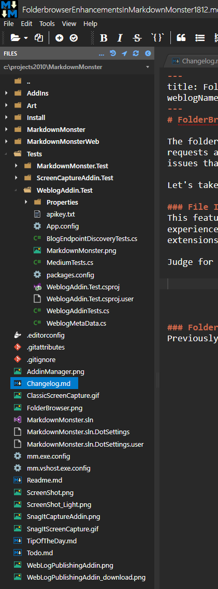
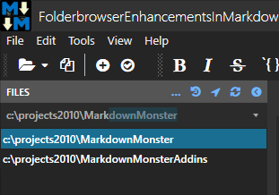
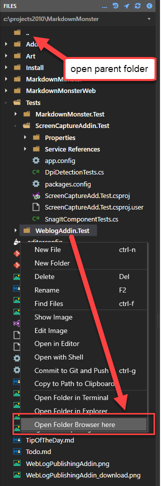
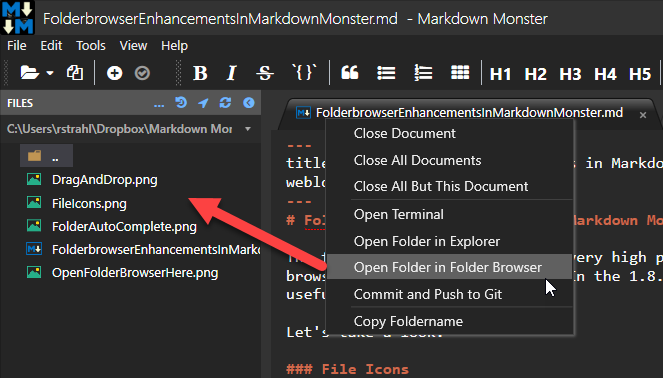
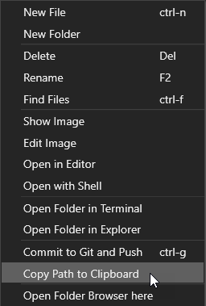
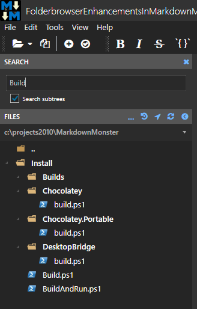

# FolderBrowser Enhancements in Markdown Monster

The folder browser may not be a very high profile feature in Markdown Monster, but there have been a surprising number of requests around the folder browser behavior and operation. In **version 1.8.12** I've done a lot of work to address a number of the issues that were brought up and added a ton of new useful features as well as cleaning up the user interface to be a bit more intuitive. 

Let's take a look.

### File Icons
This feature was actually added in 1.8.8, but it's a nice visual update to the folder browser that I think makes the user experience much nicer. By popular request I added icons to the file browser with popular file type icons for many common file extensions and especially developer file extensions. 

Judge for yourself but it makes finding files at a glance a lot easier in busy folders:

Also new are the folder tab icons and better differentiation between the active and inactive tabs.

### Folder Navigation
In the last update there have been a couple of new ways to navigate to files in addition to the original textbox and folder dialog browser ways. 

First the folder dialog is now a combobox with autocomplete that provides path completion as you type or you can use the drop down to pick a file from the path matches you've typed in:

You can also use environment variables for in the folder text box such as `%appdata%` or `%programfiles%` for example.

When inside of the folder browser file hierarchy you can now also simply double click (or use the Context menu) to drill re-open the folder browser at the selected path.

Note that there's also a new `..` folder that lets you navigate up the hierarchy to a parent directory which makes it much easier to navigate deeper trees of files. You can double-click this folder to open the Folder Browser at the parent location.

You can now also open the Folder Browser in the current document using the current document's tab:

### Drag and Drop of Images and Documents
This is not a new feature, but there are a number of improvements in the Image drag and drop support from the Folder Browser into the editor. You can easily drop images into your documents at a specific editor position. Just drag an image where you want it in the Markdown document. 

If the image is in a relative path it's simply dropped, otherwise MM prompts (optionally) to optionally copy the file to a relative location so the document is more portable.

If you drag other documents Markdown Monster will try to open them **if** they are of a registered extension from the `EditorExtensionMappings` configuration setting.

Unrelated, but you can also drag and drop images from Explorer into documents, but it's more limited in that the drop location is the previous cursor position. If possible use the folder browser as you get to precisely drop images where you want them.

### Folder Browser Performance Improvements
In this release the way the folder browser is populated has been updated to only load the current folder and dynamically load child folders **as you open them**. Previously all folders were loaded up front which could be quite slow on large folder hierarchies. You should see improved folder browser load performance in most cases.

Note that the Folder Browser can still be slow if you open folders with very large numbers of files (in excess of 500). 

### New Folder Browser Context Menu Options
The Folder Browser has a number of useful features that you can find on the context menu:

Especially useful are the options to open a Terminal or Explorer in the current or selected folder. If a file is selected you can also push that file to Git immediately assuming the folder is under source control and Git is already configured.

New in this update are **Copy Path to Clipboard**, **Open Folder Browser here and **Find in Files** (discussed next).

### Find in Files
Another new feature is the **Find in Files** feature that lets you search for files. You can press `ctrl-f` anywhere in the folder browser to bring up the **Search** pane on the folder browser. 

The folder pane by default searches in the current folder, but you can also search all sub-trees. When searching sub-trees files are shown in the entire hierarchy.

There's a gotcha with searching sub-tress though: If the folder hierarchy is very deep, this can be slow as MM has to load each folder that wasn't previously loaded. In short, use this only on reasonably sized folder structures. It would not be a good idea to do off the Root folder.

### Summary
There you have it. Lots of updates in a very specific area of Markdown Monster that is surprisingly well travelled and has generated a large amount of discussion and feature requests.

I hope these updates make using Markdown Monster more convenuent to use by providing a host of support features that are the primary reason to be using a dedicated Markdown editor in the first place.

There are still more features to be added. Namely detection of changes in the file system without having to explicitly refresh the current folder, and Git intregation. 

What's on your list for folder and file navigation? Got an idea of a missing feature - post an [issue on Github](https://github.com/rickstrahl/MarkdownMonster/issues) and if it's useful we'll add it.