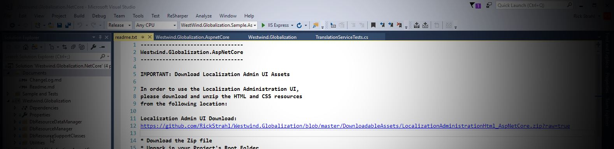
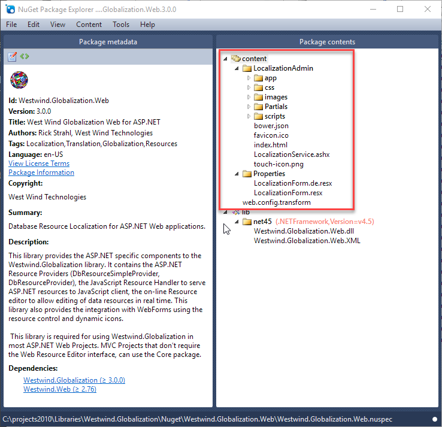
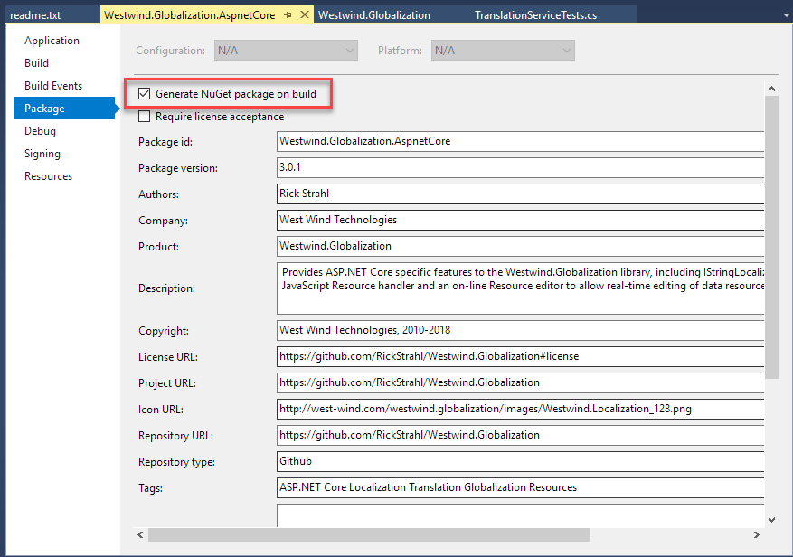
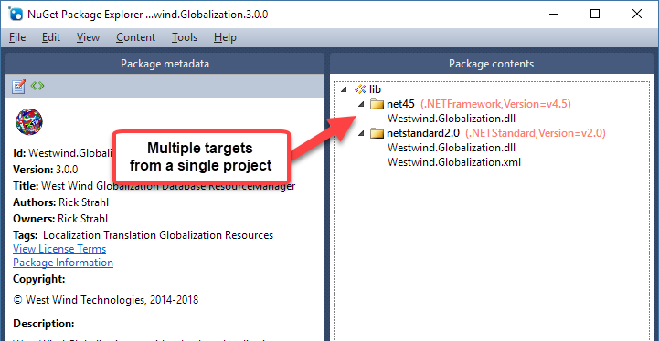
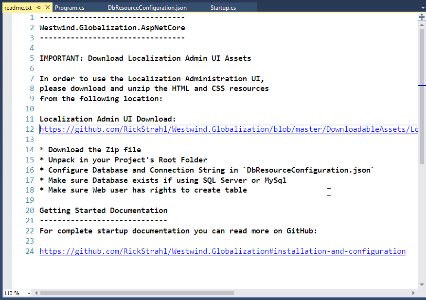
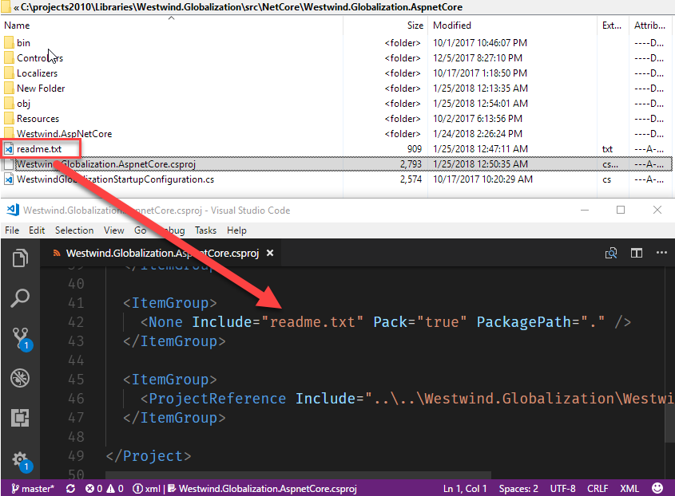

# Distributing Content and Showing a ReadMe file in a .NET Core Nuget Package

:-)



When you use NuGet with the new .NET SDK type project format, NuGet packages no longer can deploy **content** into the target project. In classic projects and full framework projects, you could add a `content` folder to your NuGet package and NuGet would install that content into projects root folder.

There are good reasons why this change and removal happened:

* Bad package etiquette - polluting projects with extra files
* NuGet wouldn't remove content added through the package (since it can be changed)
* Keeping content updated and versioned along with the package is a pain

Nevertheless, I have one package - [Westwind.Globalization.Web](https://www.nuget.org/packages/Westwind.Globalization.Web/) - where having Content shipped as part of the package is very useful. [West Wind Globalization](https://github.com/RickStrahl/Westwind.Globalization)'s Web components include a Localization Administration UI and the UI's HTML, CSS and Script was previously shipped as Content in the old NuGet package.

This still works for the full framework package:



<small>**Figure 1** - Full framework packages still support **Content** folders that are expanded when installed</small>

When I recently ported this libary to ASP.NET Core - [Westwind.Globalization.AspNetCore](https://www.nuget.org/packages/Westwind.Globalization.AspnetCore/) - I found out that I can no longer ship my Localization Admin UI via Content bundling inside of the NuGet package as the new .NET SDK projects that are required for .NET Core/Standard development no longer load the content.

##AD##

### What used to work in Classic Projects
NuGet packages for Full Framework projects can still package **Content** and **Tools** folders. 

> #### @icon-warning Content and Tools Folders do not work in .NET SDK Projects
> Just keep in mind that the following sections apply only to full framework projects. There no longer is support for these in the new .NET SDK projects and while you can have the folders, they are ignored.

#### Content
The Content folder can hold arbitrary content that's dumped into the project's root folder. You can also use some limited templating to format some limited text expressions like project name, default namespace and class names inside of text documents.

#### Tools
Additionally you can also put a Powershell script into a `Tools` folder and Visual Studio will execute that `install.ps1` script. The script has access to the Visual Studio IDE COM objects and with that you can bring up a Web browser window inside of Visual Studio to display more information, or open an external browser to show more information.

In lieu of embedding content directly this is the next best alternative. The Newtonsoft.Json package does just this and you can actually 


<small>**Figure 2** - Newtonsoft.JSON is an example of a post-installer that displays a Web Page</small>

As you can see automating Visual Studio from Powershell is a sucky affair, but it works, although only for full framework.

### .NET SDK Projects - No more Content and Tools
So in .NET Core/Standard projects which only support the new .NET SDK style project format, content or tools can no longer be distributed as part of NuGet package. Well, you can distribute it but they won't get installed.

As you probably know by now, .NET SDK projects can optionally build a NuGet package as part of the project compilation process:




<small>**Figure 3** - .NET SDK packages now allow you to generate a NuGet package for each target platform supported by the project.</small>

By default the package picks up the output binaries and xml doc files (and optionally pdb files) for library **for each of the targets defined**, which is an awesome feature if you've ever built multi-targeted projects with classic .csproj projects. For multi-targeted projects, the process of creating output and a NuGet package is drastically easier than the myriad of steps required in classic projects.

Here's an example of a multi-targeted NuGet package of Westwind.Globalization which supports .NET 4.5+ and .NET Standard:



<small>**Figure 4** - Multi-targeting in NuGet Packages from project build output is drop dead simple.</small>

But - no content.

##AD##

### Externalizing the Content
So for my ASP.NET core package **Westwind.Globalization.AspNetCore** package I no longer can distribute the `LocalizationAdmin` folder as part of the package. Instead I opted for putting the content into my GitHub repo and [offering it as a downloadable Zip file](https://github.com/RickStrahl/Westwind.Globalization/tree/master/DownloadableAssets) with instructions on how to install it. 

#### Package the Zip and Tag in Git
My build process optionally regenerates this content for each release and so gets tagged by the Git version tag applied to each release. This allows matching up NuGet releases to a specific version of the content zip file.

#### RTFM
Instructions in the Getting Started guide are usually not enough - people still come back and ask where the Localization UI dependencies can be found. Yeah it's in the install instructions, but we all know we often only skim those instructions *and I'm as guilty of that as the next guy*. Sigh.

#### In your Face: Show me the Instructions
In the end, the goal for the NuGet package is to display some sort of information to make it obvious that you still need to download the zip file if you want to use the Administration UI.

### Embedding a Readme.txt File Works!
.NET SDK projects do support embedding of a `readme.txt` file in the root folder of the package. By making a special entry into the .csproj file you can specify that the `readme.txt` file gets embedded into the package, and more importantly, the file gets displayed by Visual Studio in a tab:



<small>**Figure 5** - Getting a `readme.txt` to display for a package is fairly easy.</small>

The `readme.txt` file displays only for top level packages - if the package is referenced as a dependent package the readme doesn't display. If it's a dependency the host package needs to handle the display of any messages necessary.

To get the `readme.txt` file into the project:

* Add a `readme.txt` file into the project root
* Add a file inclusion entry with a `pack="true"` attribute into the .csproj

Use this in the `.csproj` file to include the `readme.txt`:

```xml
<ItemGroup>
   <None Include="readme.txt" pack="true" PackagePath="." />
<ItemGroup>
```



<small>**Figure 6** - Enbedding the `readme.txt` involves a custom entry in the `.csproj` file. </small>

### Summary
While it's a bummer that Content no longer works, I can see how removing that feature was probably a good idea. Even when I had my localization UI in the package for full framework, there were issues where package updates wouldn't update the files that were already there when updating. I had to delete the files then update the package to ensure to get the latest.

At least with this explicit content it's more explicit and the user installing can choose whether to keep the old files or install the new ones. The install process is a bit tedious - download and unzip, and you have to do it each time the package updates (if there are updates to the UI), but it's not unreasonable to expect this.

It would be real nice if there would be a `readme.html` or `readme.md` instead to make the content look a little more interesting but then again that's a potential security issue allowing arbitrary HTML to mine information from anybody who installs a package.

The `readme.txt` is a minimalistic compromise and with the clickable links it's reasonably easy to download the files and link to richer information as needed.

Good to go!

<div style="margin-top: 30px;font-size: 0.8em;
            border-top: 1px solid #eee;padding-top: 8px;">
    
    this post created and published with 
    <a href="https://markdownmonster.west-wind.com" 
       target="top">Markdown Monster</a> 
</div>