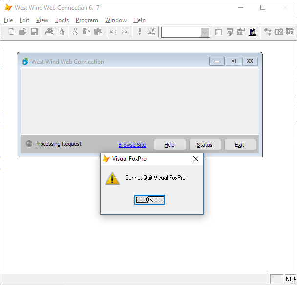
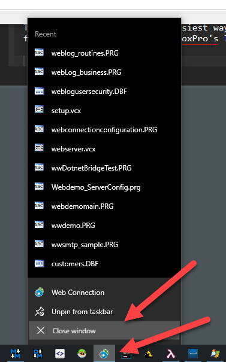
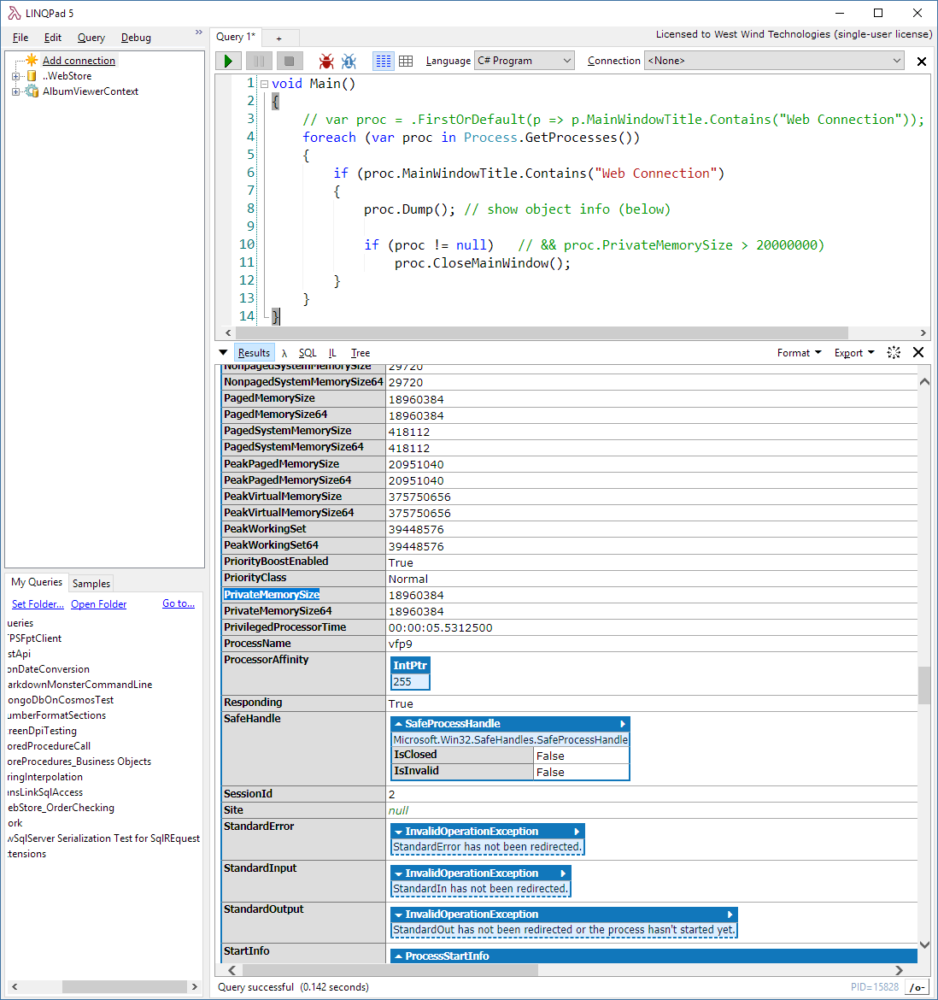
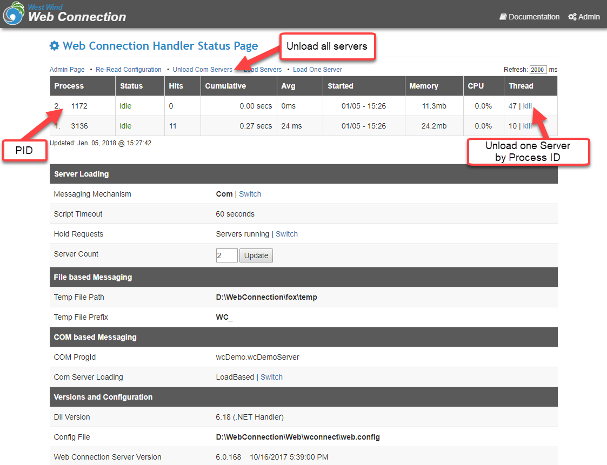

# Shutting down a file-based Web Connection Instance with Windows WM_CLOSE Messages


Recently we had a [long discussion](https://support.west-wind.com/Thread52Z0XVGKP.wwt#53N0PZGHFhttps://support.west-wind.com/Thread52Z0XVGKP.wwt#53N0PZGHF) regarding killing a specific file based instance in a [West Wind Web Connection](https://west-wind.com/webconnection) application. Not just killing actually but issuing a 'controlled' shutdown of the instance. The scenario in this post is that the customer is having an issue with an application that is leaking memory and he needed to detect the memory leakage in a particular instance and be able to shut down that instance and restart a new one.

One issue that came up as part of this thread is the idea that file based instances cannot be shutdown externally...

### File Based Shutdowns
When you run [West Wind Web Connection](https://west-wind.com/webconnection) in file based mode, Web Connection runs as a standalone FoxPro Forms application that has a `READ EVENTS` loop. The form that pops up when you run the server is the UI that holds the server in place and the READ EVENTS essentially is what keeps the application alive. When the READ EVENTS loop ends when you close the form - so does the application.

Generally speaking Web Connection file based applications can't be killed externally, short of explicitly running a Windows `TASKKILL` operation or by explicitly exiting the form.

If you've ever tried to shut down a running Web Connection application from the Windows Task bar with the **Close** command you know that that doesn't work as expected. You get the following message from the FoxPro window or your application if it's running outside of the IDE:



which is pretty annoying.

### Fixing the Shutdown Issue
There's a pretty easy workaround for this issue. As stated above the problem here is that Web Connection is sitting inside of a **READ EVENTS** loop and that's what's forcing the application to stay up when Windows close command is sent to the FoxPro application window.

What's needed to fix this is to intercept the `WM_CLOSE` operation that Windows sends to shut down the application and **explicitily** force the application to release its `READ EVENTS` loop with `CLEAR EVENTS`.

FoxPro supports hooking into Window Messages via the `BINDEVENTS()` function and to do all of this just takes a few lines of code.

To start I added a `ShutDown()` method to the `wwServer` base class. This will become part of Web Connection but if you want to implement this now you can just add the `ShutDown()` method to your `wwServer` subclass.

```foxpro
************************************************************************
*  Shutdown
****************************************
***  Function: Used to shut down a FILE BASED application
***    Assume: Has no effect on COM based applications
***            as COM servers can only be closed externally
***            by the COM reference
***    Params: Accepts Windows SendMessage parameter signature
***            parameters aren't used but can be if necessary
************************************************************************
FUNCTION Shutdown(hWnd, Msg, wParam, lParam)

IF !THIS.lComObject
    CLEAR EVENTS
    QUIT
ENDIF

ENDFUNC
*   Shutdown
```

Note that there's a check for `lComObject` in this method. This whole Windows message and remote shutdown mechanism **only works with file-based operation**. In COM it's **impossible** to shut down instances remotely short of `TASKKILL` as the COM reference from the host controls the application's lifetime.

In file based however we can respond to `WM_CLOSE` events and then call the `wwServer::Shutdown()` method which effectively clears the event loop and then explicitly quits.

Next we need to hook up the `WM_CLOSE` message handling using `BINDEVENT()`.

In its simplest form you can do in the `YourAppMain.prg` in the startup code at the very top of the PRG and wrap the `BINDEVENT()\UNBINDEVENTS()` call around the `READ EVENTS` call like this:

```foxpro
WM_CLOSE = 0x0010  && in wconnect.h or Foxpro.h
BINDEVENTS(Application.hwnd,WM_CLOSE,goWCServer,"ShutDown")

READ EVENTS

UNBINDEVENTS(goWCServer)
```

To take this a step further I added the code directly into the Web Connection `wwServer` class.

The first is at the very bottom of the `wwServer::Init()` method:

```foxpro
IF !THIS.lComObject AND _VFP.Visible
   BINDEVENT(_VFP.hWnd, WM_CLOSE, THIS, "ShutDown")
ENDIF  
```


and also in the `wwServer::Dispose()` method:

```foxpro
IF !THIS.lComObject AND _VFP.Visible
	TRY
		UNBINDEVENTS(THIS)
	CATCH
	* this may fail when shutting down an EXE but not in the IDE
	* we don't care about the failure as this shut be a shutdown operation
	ENDTRY
ENDIF
```

The latter code only fires when the form is shut down *normally* using the exit button - if the `BINDEVENT` handler actually fires the app is immediately shut down.

### Testing Operation

To test this out one of the easiest ways to do this is to use to start your Web Connection application in file mode from within Visual FoxPro's IDE and then use the Task bar icon and **Close Window** from there.



This is what generated the **Can't quit Visual FoxPro** message before, but now with the `BINDEVENT()` code in place the Web Connection server will actually shut down. Yay!

If you want to do this programmatically a very simple way to do this is using .NET Code and [LinqPad](https://www.linqpad.net/) which you can think of like the FoxPro command window for .NET. There you can easily iterate over all the processes running, check memory usage and more.



```cs
void Main()
{
    // var proc = .FirstOrDefault(p => p.MainWindowTitle.Contains("Web Connection"));
    foreach (var proc in Process.GetProcesses())
    {
        if (proc.MainWindowTitle.Contains("Web Connection"))
        {
        	proc.Dump(); // show object info (below)
        
        	if (proc != null)   // && proc.PrivateMemorySize > 20000000)
        		proc.CloseMainWindow();
        }
    }
}
```

This makes it very easy to create a tool that can remotely look for Web Connection instances that have too much memory and attempt to shut them down.

Because this is just simple .NET Code you can also run something similar using FoxPro code using [wwDotnetBridge](https://west-wind.com/wwDotnetBridge.aspx):


```foxpro
do wwDotNetBridge
loBridge = GetwwDotnetBridge()

*** Returns a ComArray instance
loProcesses = loBridge.Invokestaticmethod("System.Diagnostics.Process","GetProcesses")

*** Note most .NET Arrays are 0 based!
FOR lnX = 0 TO loProcesses.Count -1
   *** Access raw COM Interop objects
   loProcess = loProcesses.Item(lnX)
   lnMemory = loProcess.PrivateMemorySize
   
   IF ATC("Web Connection",loProcess.MainWindowTitle) > 0
       loProcess.CloseMainWindow()
   ENDIF
ENDFOR
```

`CloseMainWindow()` is the same as using the **Close Window** and it's a *soft shutdown* of the application which shuts down somewhat orderly. In order for this to work you need to be running as the same user as the window you're trying to shut down or as an Admin/SYSTEM account that can access any account's desktop.

If `CloseMainWindow()` is not enough you can also call the `Kill()` method which is a hard `TASKKILL` operation that **immediately** shuts down the application.

It's important to understand that either of these operations will cause an out of band event in FoxPro meaning it will interrupt code executing in between commands. IOW, there's no guarantee that the application will shut down after say a Web Connection request has finished. In order to do this more logic is needed to set a flag that can trigger a shutdown at the end of a request. 

### More Caveats - Top Level Forms don't receive WM_CLOSE
The above code patch fixes the **Can't quit Visual FoxPro** message, which is useful. I can't tell you how often I've cursed this during development or when shutting down Windows.

But it this approach has limitations. If you're running a FoxPro application without a desktop window active, the `WM_CLOSE` message is never properly sent to either the `_VFP` desktop or even the active FoxPro Top level form. FoxPro internally captures the WM_CLOSE event and shuts the application down before your code can interact with it.

For Web Connection this means when you're running with `Showdesktopform=On` (which runs a FoxPro top level form and hides the desktop)** the application quits without any sort of shutdown notification**. This is a problem because when this happens the application quits and doesn't clean up. In my experience this will kill the application but the EXE will not completely unload and leave behind a hidden running EXE you can see in Task Manager.

For this reason 'closing' the window is not a good idea - you have to `Kill()` the application to get it truly removed.

### What about COM Objects?
COM objects and file based servers are managed completely differently. COM Servers are instantiated as COM objects - they don't have a startup program with a READ EVENTS loop, and there's no way to 'Close' a COM server. You can't even call `QUIT` from within a COM server to kill it. `QUIT` has no effect inside of a COM server.

So how do you kill a COM Server:

* Properly release the reference
* Use TASKKILL

To properly release a reference of a Web Connection server the way to do this is to use the Administration links. You can find these links on the Admin page and you can also fire those requests using a HTTP client like `wwHttp` directly from your code.

The easiest way is to look at the links on the Admin page for COM server management:



Web Connection 6.18 introduces the ability to shutdown a specific server by process ID in COM mode. This works at the COM instance manager which looks for the specific instance in the pool, waits to shut it down and then starts a new instance to 'replenish' the pool.

However, realistically it's best to reload the pool. With Web Connection 6.17 we've made major improvements in COM server load times where instances are loaded in parallel and server loading is split out into instance loading and a Load sequence that fires on the first request. This makes it much faster to new servers and a pool reload is actually only as slow as the slowest server instance restart. So - don't be afraid to restart the entire pool of instances via the **ReleaseComServers.wc** link.

As I often point out - if you're running file based in production with Web Connection, you're missing out on many cool management features that only work in COM, like pool management, auto-recovery on crashes and now the ability to reload individual instances explicitly. 

### Summary
There are a all sorts of possibilities to manage your Web Connection instances in FoxPro and I've shown here a nice workaround that gets around the annoying issue of shutting down file based instances in development mode. It doesn't solve filebased shutdown in production scenarios at least not completely but it does offer a few more options that allow you to at least be notified of shutdown operations requested.