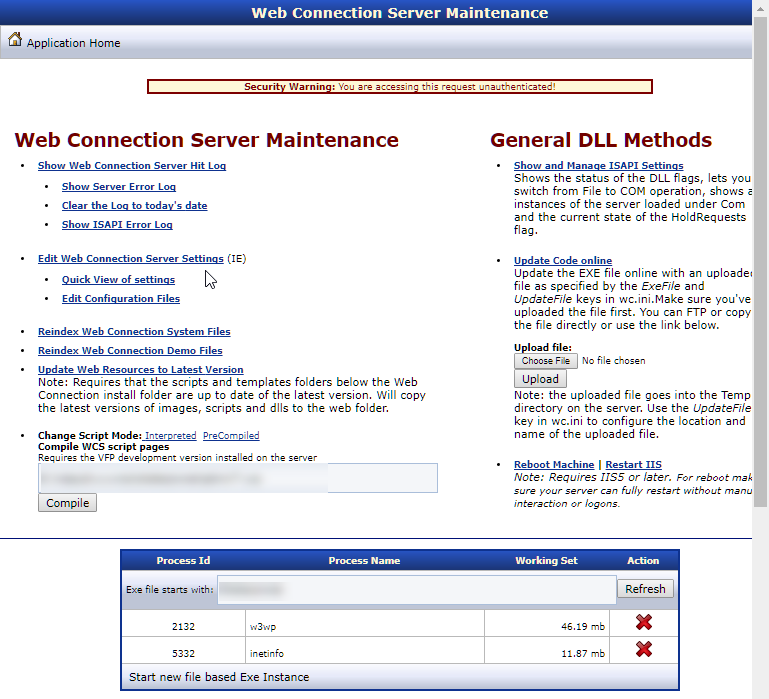
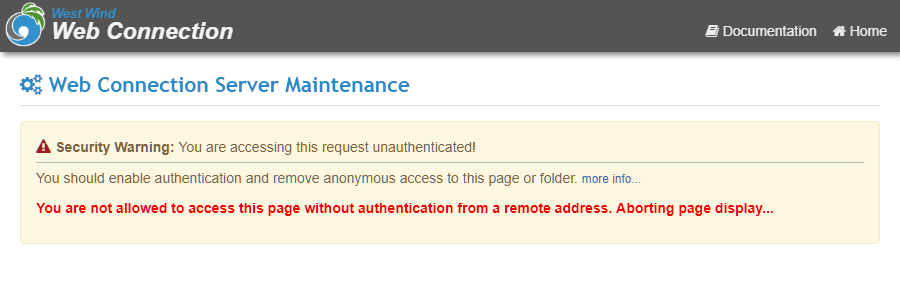
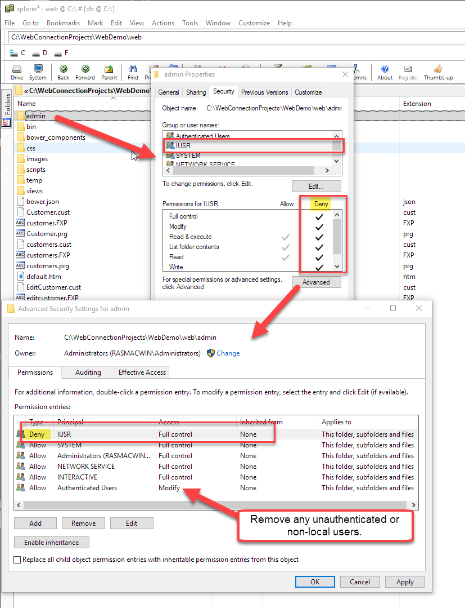

# Locking down the West Wind Web Connection Administration Page


The West Wind Web Connection Administration page is a powerful page that is the gateway to administration of the West Wind Web Connection server that is executing. But you know the saying: 

> #### With great power, comes great responsibility!

And that's most definitely true for the Admin page.

The Admin page has a very important role, but it's **crucially** important that this page is completely locked down and not accessible by non-authenticated users. 

You don't **ever** want to come to an old Web Connection Administration page on a live Web site and have it look like this:



If you see this or something similar on a live site, **the administration page is wide open for anybody to access** and that's a big problem. 

The page above comes from an actual site on the Internet and it makes me sad to see this, because you have to go out of your way to make this happen and willfully disable security. Unfortunately, this is not uncommon to see.

I was contacted of the weekend by a security researcher, Ken Pyle of [DFDR Consulting LLC](http://www.dfdrconsulting.com), who notified me that he's run into a lot of sites with this problem and he provided a number of links. 

And he's not wrong!

To be clear: Pages like this have a very obvious message that tells you what the problem is, namely that the page is not secured, so a lot of this is **shoot yourself in the foot syndrome** where somebody has **willfully ignored** the message or worse removed the associated security that gets put in place if you use the Web Connection tooling to configure a Web site.

If you install Web Connection properly either following the manual configuration guide or using the automated tools (`yourApp_ConfigureServer.prg` or Console `Web Site Configuration Wizard` in older versions) the installation will be **locked** down, by removing anonymous access for the IUSR_ and Users account, so that at least a login of some sort is required to get to the admin page.

### Changes in 6.19's Admin Page
In **Web Connection v6.19** we've made some additional simple changes to the Admin page that make it much harder to accidentally expose the admin interface on a public Web site. 

Two changes in particular:

* Links and Content no longer displayed on unauthenticated remote requests
* Removed the Process List Viewer display

If you access the page unauthenticated from any non-localhost computer and you are not authenticated you will now see:



If you do authenticate and get in the Process list shown in the previous screen shot is no longer available. Most of that functionality has been available in the Module Administration Page more specifically focused on the running application server instances.

If you can't use or upgrade to Web Connection 6.19, you can download the updated `Admin.aspx` and old `Admin.asp` pages from this zip file:

* [Download Web Connection Admin Page Updates](https://west-wind.com/files/WebConnection_AdminPage_Fixes.zip)

### Lock it down!
Regardless of this 'safe by default fix', it's extremely important that you lock down this page **by explicitly removing access rights for non-authenticated users**. 

In this post I'll show you how to do this as a refresher, but I also recommend you look at the documentation for [Securing your Web Connection Installation](https://west-wind.com/webconnection/docs/_00716r7og.htm).

### What about Web Connection Admin Links
The Admin Page is really mostly a list of links, that points at Web Connection Server operations to manage the server lifetime. These links are **also security sensitive** obviously.

But Web Connection administration requests like `ReleaseComServers.wc` or `wc.wc?__maintain~ReleaseComServers` are already locked down by default via the `AdminAccount` configuration setting in `web.config` or `wc.ini` with by default is set to `ANY` which means it requires any authenticated and refuses access by non-authenticated users. So these links are locked out by default, although - just like the Admin page - they can be unset and opened up. Don't do it - don't be the **shoot-yourself-in-the-foot** guy that unsets the setting and forgets to put it back. Always leave at least the base security in place.

### Automated Security Configuration
The biggest problem that causes the security issue is that IIS and Windows security isn't set up properly by the servers in question. If you use the Web Connection configuration tooling it automatically does the right thing and has always been doing so.

Web Connection provides tools to help you with site configuration, and these tools do the right thing for security configuration by default. We highly recommend you configure your site using the automated tools provided for this purpose which are:

* Use the [`<yourApp>_configureserver.prg` Script](https://west-wind.com/webconnection/docs/_4ls0motzs.htm) generated for your application
* The old Console **Server Configuration Wizard** (for pre 6.x applications)

Using the server configuration script is the recommended way to do this and you can customize this script with any additional configuration your application may need. By default the configuration script is compiled into your Web Connection server EXE and can be accessed with the following from a Windows Admin Prompt: 

```
YourApp.exe CONFIG
```

For more information:

* [Securing your Web Connection Site](https://west-wind.com/webconnection/docs/_00716r7og.htm)
* [The Web Connection Server Configuration Script](https://west-wind.com/webconnection/docs/_4ls0motzs.htm)

### Remove IUSR Access
While the new Admin page fixes the basic issue of allowing access to the Admin page, it's still important to revoke access to the **entire Admin folder**  for all **unauthenticated users**.

The easiest way to do this is to remove or Deny access to the `IUSR` account for the `Admin` folder in Windows:



Doing this alone will prevent access, but this is an explicit step. The new Admin page addresses the issue **if you forget to set security**, but it's still **strongly** recommended you remove `IUSR`!


### Manually Updating Admin.aspx
The 6.19 update to the Admin.aspx does two things:

* Doesn't allow Remote Access that is unauthenticated
* Removes the Process Listing Table

Let's do these steps manually.

#### Disallow Unauthenticated Remote Access
You can replace the section that shows the warning dialog in `Admin.aspx` with the following updated code that adds an additional remote site check and ends the response if the local and remote ips don't line up.

Here's the relevant code:

```html
<%  
  string user = Request.ServerVariables["AUTH_USER"];
  string remoteIp = Request.ServerVariables["REMOTE_ADDR"];
  string localIp = Request.ServerVariables["LOCAL_ADDR"];           
  if (string.IsNullOrEmpty(user))
  { 
%>
<div class="alert alert-warning">
    <i class="fa fa-exclamation-triangle" style="font-size: 1.1em; color: firebrick;">
    </i>
    <b>Security Warning:</b> You are accessing this request unauthenticated!
    <div style="border-top: solid 1px silver; padding-top: 5px; margin-top: 5px; ">
        <p>
            You should enable authentication and remove anonymous access to this page or folder.
            <small><a href="https://west-wind.com/webconnection/docs/_00716R7OG.HTM">more info...</a></small>
        </p>
        <% if(localIp != remoteIp)  { %>
        <p style="color:red; font-weight: bold">
            You are not allowed to access this page without authentication from a remote address.
            Aborting page display...
        </p>
        <% } else { %>
        <p style="color:red; font-weight: bold">
            NOTE: You are allowed to access this page, because you are accessing it from the
            local machine, but it won't work from a remote machine.
        </p>   
        <% } %>
    </div>
</div>
<% 
    if(localIp != remoteIp)
    {
        Response.End();
    }            
} 
%>
```

### Remove the Process List Table
The Machine Process List is a relic of earlier versions of Web Connection when the management features were less fleshed out. Today's Web Connection can perform these tasks much cleaner using the Module Administration page.

Remove the Process List table and edit form from `Admin.asxp` (and in a similar way in `Admin.asp`).

Remove the following:

```html
<div class="well well-sm">
        <form action='' method='POST'>
            Exe file starts with: 
        <input type='text' id='exeprefix' name='exeprefix' value='<%= this.Show %>' class="input-sm" />
            <button type='submit' class="btn btn-default btn-sm">
                <i class="fa fa-refresh"></i>
                Refresh
            </button>
        </form>
    </div>


    <table class="table table-condensed table-responsive table-striped" >
        <tr>
            <th>Process Id</th>
            <th>Process Name</th>
            <th>Working Set</th>
            <th>Action</th>
        </tr>
        <%      
            System.Diagnostics.Process[] processes = this.GetProcesses();
            foreach (System.Diagnostics.Process process in processes)
            {
        %>
        <tr>
            <td><%= process.Id%></td>
            <td><%= process.ProcessName%></td>
            <td><%= (process.WorkingSet / 1000000.00).ToString("n1") %> mb</td>
            <td><a href="admin.aspx?ProcessId=<%= process.Id %>" class="hoverbutton">
                <i class="fa fa-remove" style="color: firebrick;"></i> 
                Kill
            </td>
        </tr>
        <%
}
        %>            
    </table>
```
Also remove the block of script code on the bottom of the `Admin.aspx` page, which was used for helper purposes to the process list table above.

Again you can find the latest versions of these files in Web Connection 6.19 or you can download the updated Admin pages:

* [Download Web Connection Admin Page Updates](https://west-wind.com/files/WebConnection_AdminPage_Fixes.zip)


### Update to the Latest Version of Web Connection
If you're already on Web Connection 6.0 I highly recommend you update a version of 6.19 or later and copy the `Admin.aspx` page from the `\templates\ProjectTemplate\Web\Admin` folder into your Web Application(s).

I can't overstate this: Even if you have an application that's been running for a long time, **it's a good idea to keep up with versions** in order to take advantage of security updates and bug fixes. There are many feature improvements in newer version, but being current also means it's much easier to update to later versions. Web Connection's core engine hasn't drastically changed since Version 5.0 more than 10 years ago, so updates are almost always drop in replacements - there are only a handful of [documented breaking changes](https://west-wind.com/webconnection/docs/_s8104dggl.htm).

I realize there are a lot of very old (I ran into several 3.x applications that are 20+ years old by now), but if you have old applications running you need to be pro-active and make sure that they are still doing what they should and **that they are secure**.  Making this sort of jump to the current version is probably unrealistic, but if you're running a recent version of WWWC 5 at least updating to 6.x is relatively minor. Moving from 4 to 6 is a little more involved but still can be accomplished relatively easily with a little effort. 
If you decide to upgrade Web Connection from a previous prior to v6.0, here is a little incentive with a 10% discount coupon:

* [Web Connection Upgrade from any version](https://store.west-wind.com/product/wconnect60_up)
* Use promo code: `WCONNECT_SECURE` for 10% discount on your upgrade

Being on a recent version provides the ability to update to the most recent versions makes it much easier to keep up with changes and fixes, and you can use [the changelog](https://west-wind.com/webconnection/docs/_s8104dggl.htm) to see what's updating and what's being fixed with important and breaking changes highlighted. 

Nevertheless, I'll discuss the fix below, so if you're using a pre-6.x version of Web Connection you can manually update your `Admin.aspx` and the pre-6.0 `Admin.asp` pages.

### Resources
I want to also thank Ken Pyle for bringing this issue to my renewed attention and providing the motivation for updating the default implementation to reject unauthenticated access from remote sources by default.

Ken Pyle  
DFDR Consulting LLC  
Digital Forensics, Incident Response, Cyber Security  
www.dfdrconsulting.com

#### Links

* [Download Web Connection Admin Page Updates](https://west-wind.com/files/WebConnection_AdminPage_Fixes.zip)
* [Securing your Web Connection Application](https://west-wind.com/webconnection/docs/_00716r7og.htm)
* [IIS Configuration for Web Connection ](https://west-wind.com/webconnection/docs/_22f0xkbmq.htm)
* [The generated Server Configuration Script](https://west-wind.com/webconnection/docs/_4ls0motzs.htm)


<div style="margin-top: 30px;font-size: 0.8em;
            border-top: 1px solid #eee;padding-top: 8px;">
    
    this post created and published with 
    <a href="https://markdownmonster.west-wind.com" 
       target="top">Markdown Monster</a> 
</div>