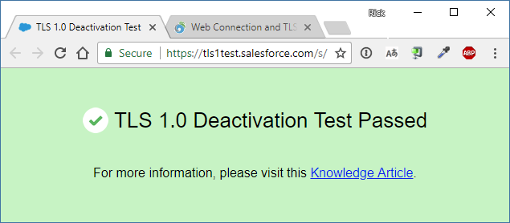
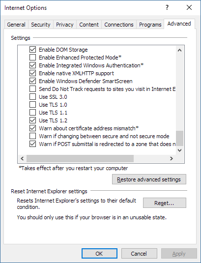

# Web Connection and TLS 1.2 Support


On February 28th, 2018 Authorize.NET discontinued support for all TLS 1.0 and 1.1 access to their APIs and only supports TLS 1.2. Not surprisingly the last few days my phone (Skype actually) has been ringing off the hook with customers frantically looking to fix a variety of TLS 1.2 issues.

TLS is the successor to the SSL protocol. TLS 1.0 and 1.1 both had theoretically possible (but very computing intensive) breaches associated with them and so they are considered compromised, and most industry groups that rely on secure standards (like Credit Card Processors obviously) now require TLS 1.2. This requirement has been long announced by many companies - years ago, but the cut off dates are now reaching maturity and Authorize.NET was just one of them that many of the customers I work were directly affected by.

### Protocol Support in Windows and what it means
Before we look at what supports which version etc. it's important to understand what 'TLS Support' means in this context. The context here really is **Windows Support** meaning that Window's internal libraries and SDKs that use the underlying Windows Security Protocol infrastucture.

This affects most Microsoft Products that run on Windows, as well as the Windows Client stack including WinInet and WinHttp which incidentally is also used by the desktop .NET framework as well as [Web Connection](https://west-wind.com/webconnection) and [West Wind Client Tools ](https://west-wind.com/WestwindClientTools.aspx) use for the its HTTP support.

> #### @icon-info-circle Non-Microsoft Browsers bypass Windows Security Protocol Libraries
> Although TLS 1.2 may not be supported by some older versions of Windows and APIs, you can still use a number of applications that have their own TLS implementations. Specifically any non-Microsoft Web Browsers like Chrome and FireFox do not use the Windows infrastructure so even on old versions of Windows you can get TLS 1.2 support using custom browsers. This works for browsers, but many other applications that run on old Windows versions **do** rely on the Windows infrastructure and those may stop working if they require TLS 1.2. 

### Windows and TLS 1.2
TLS 1.2 is relatively new and old versions of Windows didn't have native support for TLS 1.2. 

#### Built-in Support for TLS 1.2

* Windows 8.1,  Windows 10 or later
* Windows Server 2012 R2, Windows 2016 or later

These versions of Windows just work out of box with TLS 1.2 - no changes are required.

#### Configurable Support for TLS 1.2

* Windows 8
* Windows 7
* Windows Server 2012, 2008 R2

These versions can support TLS 1.2 via registry settings (for machine wide settings) or Internet Explorer Configuration of Protocols for IE and WinHttp/WinInet functionality. For more info on how to enable TLS 1.2 see below.

#### No Support for TLS 1.2

* Windows Vista
* Windows Xp
* Windows Server 2003
* Windows Server 2008

These older versions of Windows **don't have support TLS 1.2 at all** and don't have any way to make it work outside of using applications that don't use the Windows Protocols Stack. This also affects the `wwHttp` class which runs through WinInet in Web Connection or the Client Tools. 

### Checking TLS 1.2 support
If you're running a version that either supports or can be upgraded to support TLS 1.2, you should be able to check TLS 1.2 in Windows with **Internet Explorer**. If you know of a site that requires TLS 1.2 to access, you can visit that site and if TLS 1.2 support is not working you will not be able to access the site/page with anything that uses WinHttp/WinInet which includes the West Wind FoxPro HTTP tools. 

In essence you can use IE as you **canary in a coal mine** to see if you'll have problems and need to fix TLS 1.2 settings.

One such TLS 1.2 test link is:

https://tls1test.salesforce.com/s/

The page returns a Green page with a success message.



You can also hit this page with an **HTTP client**. Using wwHttp in Web Connection or the Client Tools you can do:

```foxpro
DO wwHttp   
o = CREATEOBJECT("wwHttp")
? o.HttpGet("https://tls1test.salesforce.com/s/")
? o.cErrorMsg    && Connection could not be established if TLS 1.2 is not available
```
You can check the HTML output in the page for **TLS 1.0 Deactivation Test Passed** in the output to confirm that the page worked.

If the test fails are like to get a **Connection could not be established** error and you have some work to do to fix your TLS 1.2 configuration.

### Making TLS 1.2 work in older Windows Machines
There are two places where TLS 1.2 settings can be made:

* Internet Explorer Settings (affects IE and WinInet/WinHttp)
* Registry Protocols Section

#### Internet Explorer Settings
The first and easiest way to fix settings for client libraries that are using an HTTP client using WinInet or WinHttp like wwHttp is by setting the Internet Explorer Protocols selection in the IE options.

In IE open **Internet Settings -> Advanced -> Security**  and scroll to the bottom of the list. There you can find the protocol support you want to allow.



This enables **only** TLS 1.2 support and disables all the other protocols which is the recommended approach. However, be careful with this - you may run into problems with older Web Sites that may not yet have updated to TLS 1.2 certificates. These days all new certificates issued are TLS 1.2 but some sites may still have older or client signed certificates that are not and that can break things.

> **Note:** PCI compliance requires that TLS 1.1 and 1.0 are to be turned off!

#### Protocol Registry Settings
There are also a set of Registry Settings that let you enable and disable the various protcols for client and server explicitly.

You can find these in:

```
HKLM\CurrentControlSet\Control\SecurityProviders\SCHANNEL\Protocols
```

There sub-keys for each protocol and subkeys for Client and Server. **Client** affects client libraries like Internet Explorer and WinInet, WinHTTP and by extension .NET and Web Connection. **Server** affects incoming Server connections so it affects server software like SQL Server, Exchange, IIS etc.


The values are:

**DisabledByDefault:** 0 or 1  
**Enabled:** 0 or ffffffff

and you can apply them on any of the **Client** and **Server** protocol keys.

> #### @icon-warning Be Careful Removing Protocol Support
> Removing older protocols may seem secure, but it may bite you in unexpected ways. One customer I worked with removed all non-TLS 1.2 protocols and was then unable to connect to SQL server until a post SP patch was installed because SQL Servers client connectivity wasn't able to connect via TLS 1.2. Get it working first, then dial back and **test**! Going all TLS 1.2 may require updating many old components to latest version to ensure connectivity still works.

### TLS in Web Connection and West Wind Client Tools
There are several areas where TLS support will affect you in Web Connection and the client tools:

* Using the wwHttp Class for HTTP access
* Using wwDotnetBridge with anything that accesses the Web


#### The wwHttp Class
The `wwHttp` class uses the native **WinInet** components of Windows, so all the discussion above applies directly to use of the `wwHttp` requires either a recent version of Windows or the registry hacks described in the text above.

#### wwDotnetBridge and .NET HTTP Access
.NET uses its own network stack and bypass the stock Windows behavior, but 

The full on default behavior of .NET is tied to the version of the .NET Framework that you

* **NET 4.6 and later just works**
You don’t need to do any additional work to support TLS 1.2, it’s supported by default.

* **.NET 4.5 has to specify Protocol Support**  
. TLS 1.2 is supported, but it’s not a default protocol. You need to opt-in to use it using the ServicePointManager with `ServicePointManager.SecurityProtocol = SecurityProtocolType.Tls12`.

* **.NET 4.0 and earlier does not support TLS 1.2**   
Old versions of .NET don't support TLS 1.2 explicitly but it still works **if running on .NET 4.5 or later of the runtime** and then explicitly setting `ServicePointManager.SecurityProtocol = SecurityProtocol.(SecurityProtocolType)3072` 

wwDotnetBridge 6.15 and later automatically enables the SecurityProtocol for all versions of .NET that can run Tls1.2. 

Older versions of wwDotnetBridge prior to 6.15 running on versions prior to .NET 4.62 will have to explicitly set the property:

```foxpro
loBridge = GetwwDotnetBridge()
loBridge.SetStaticProperty("System.Net.ServicePointManager","SecurityProtocol",4080)
```
### Keep Things Up To Date
I've been harping on keeping software up to date recently and this is yet another reason why it's important to not neglect upgrades and keep on running with ancient versions of OS's and tools. 

This goes for Operating Systems as well as critical server and client software. Keeping patched is extremely important and staying somewhat current with OS versions (no more than 2 OS releases behind is my rule) is critical to not be caught by surprise by something critical simply not being available. 

The same is true for server software - like Web Connection. We have a lot of customers that never went past version 4 which is now nearly 20 years old. That's a long time to be running an application and not be broken. 

This TLS 1.2 issue may be one of those things as really old OSs don't have an easy work around. 

Be diligent with your applications. This doesn't mean being on the upgrade treadmill constantly but have a lifetime management policy for your server hardware and software and **stick to it** when time is up. I see 4-5 years as the sweet spot for upgrading OS versions which also seems the treshold where you can do direct software upgrades without being required to completely reinstall.

These days this is even easier with cloud based VM and service solutions that are much quicker to deploy and restore to.

### Summary
There you have it - I thought I'd write down these notes since this issue has been a recurring theme that's affecting quite a few customers. Hopefully you find something useful here to help you make sure your applications are TLS 1.2 capable.

### Resources

* https://help.salesforce.com/articleView?id=Enabling-TLS-1-1-and-TLS-1-2-in-Internet-Explorer&type=1
* [wwHttp and TLS 1.2 Support](https://west-wind.com/webconnection/docs/_55618f5mt.htm)


<div style="margin-top: 30px;font-size: 0.8em;
            border-top: 1px solid #eee;padding-top: 8px;">
    
    this post created and published with 
    <a href="https://markdownmonster.west-wind.com" 
       target="top">Markdown Monster</a> 
</div>