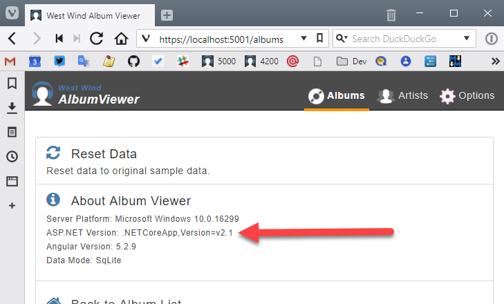
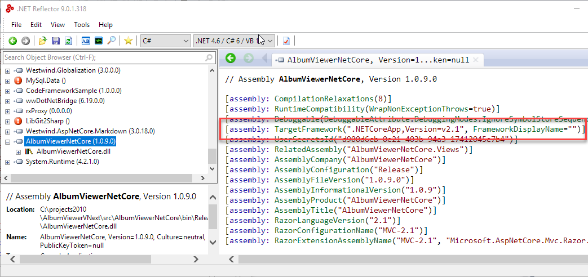

# Getting the .NET Core Runtime Version in a Running Application

One thing I like to do as part of my applications that are running is to have an information page that gives some basic information about the runtime environment the application is running under. 

For example, here's what I add to my info page in my [AlbumViewer Sample](https://github.com/RickStrahl/AlbumViewerVNext):



I find it useful especially these days with SDKs and runtimes switching so frequently that I can quickly determine what versions the application actually runs under and where it's hosted (Window/Linux/container) without having to actually look at the source code.

This should be easy right? Well, it may not be difficult, but obvious it is not.

### Getting the Runtime Version
You would think it would be easy to get runtime version information - after all the runtime is... well... it's **running**. But nooooo... Microsoft has never made it easy to get proper runtime version information that's suitable for display in an application. Hell, in full framework you had to[ resort to checking the registry and then translating magic partial version numbers](https://docs.microsoft.com/en-us/dotnet/framework/migration-guide/how-to-determine-which-versions-are-installed) to an official release version number (like 4.7.1). You know you're doing it wrong when you can't tell what version of a runtime you have installed without looking in the registry and looking at an obscure lookup table to resolve the actual version everyone expects to look at.

This trend continues in .NET Core. There's no direct API that returns a version number like 1.1, 2.0 or 2.1 etc. Because why make the obvious easy?

There are lots of APIs that **you might think would work** but they either don't return anything or return some unrelated version number like the system installed full framework version - but not the one of the actual running runtime.

I'm not going to bore with all the false starts I've had here. If you want to find the .NET Core Runtime that your application is targeting you can look at the `TargetFrameworkAttribute` in your application's startup assembly:

```cs
var framework = Assembly
    .GetEntryAssembly()?
    .GetCustomAttribute<TargetFrameworkAttribute>()?
    .FrameworkName;

var stats = new
{                
    OsPlatform = System.Runtime.InteropServices.RuntimeInformation.OSDescription,
    AspDotnetVersion = framework
};
```

It seems pretty hacky but it should be fairly reliable since every application has to have a a `TargetFramework` associated with it. This value comes from the project file:

```xml
<Project Sdk="Microsoft.NET.Sdk.Web">
  <PropertyGroup>
    <TargetFramework>netcoreapp2.1</TargetFramework>
  </PropertyGroup>
</project>
```

and the project build process turns that into an attribute attached to the startup assembly.



It's a shame that this isn't exposed somewhat more logically like the property that actually exists but is not set:

```cs
string runtime = System.Runtime.InteropServices.RuntimeInformation.FrameworkDescription;
```

Sadly that value very usefully returns `null`.

### Use the force wisely, Luke!
OK, so now you can get the version number, but you should be wary of using it for anything other than displaying it for reference information. Version numbers are not really meant to be used for feature detection or other application critical comparisons, so **use this version number only in cases where you absolutely have no other way**. I suspect this is one of the reasons the .NET teams refuse to build runtime version numbers directly into the frameworks.

Personally, I tend to use compiler directives to differentiate broad feature 'versions' - I've talked about this a bit in my previously posts on building components that [target both full framework and .NET Standard](https://weblog.west-wind.com/posts/2017/Jun/22/MultiTargeting-and-Porting-a-NET-Library-to-NET-Core-20#Framework-Specific-Differences). This works great for broad frameworks, which in most cases is all you need to differentiate for, but can also be used for more specific targets. 

### Summary
Version detection in .NET Runtimes is not obvious for most versions and there's no direct built-in way to get a friendly description of the version you're running. 

So, the above hack is it - it works. For now :-)

<div style="margin-top: 30px;font-size: 0.8em;
            border-top: 1px solid #eee;padding-top: 8px;">
    
    this post created and published with 
    <a href="https://markdownmonster.west-wind.com" 
       target="top">Markdown Monster</a> 
</div>