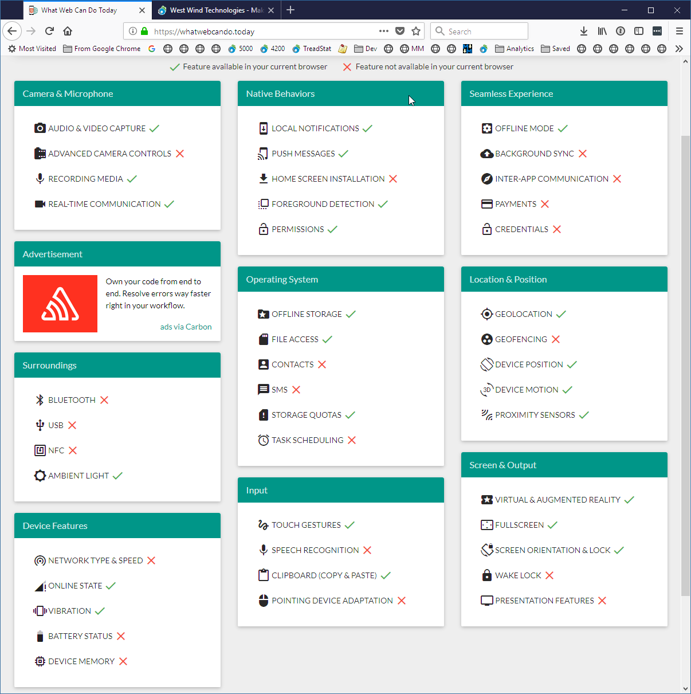

# Web Code is a solved Problem: How about fixing Web UI next?

If you're a Web developer, you probably have noticed that our industry is thriving on extremely rapid change. You step away from the Web world for a month and you come back and there are 20 new things you need to look at. The pace of change is exhilarating and frustrating both at the same time.

But these days most of the focus in front end Web development is on **code - JavaScript code** in particular. By comparison, the Web UI - HTML and CSS and the browser DOM and support features - feels like it has been **stuck in the mud** and stagnating for a long time. We now have all the advanced coding tools to do cool stuff, but it seems that **HTML and the Web Browser's feature set are really what is holding us back**.

## Code Über Alles

Most of the focus in Web Development in 'recent' years has been on the **code side of things**: JavaScript Frameworks, ever more complex build systems along with the tools that facilitate creating code efficiently have gotten all the attention. Huge improvements have been made in this space in the span of just a few short years, and it's now possible for most developers to build even very large applications in a modular and manageable fashion without having to piece together all the needed pieces themselves. There are established solutions for building Web applications from the code perspective and it's relatively approachable and consistent.

It's not so long ago that this really wasn't the case when you had to piece together your own - mostly inadequate - frameworks and hoped for the best. Today we have established frameworks and at least some general best practice guidelines for the average developer to build applications using modular development techniques.

> **Client side JavaScript code development is mostly a solved problem that isn't holding us back anymore.**

That isn't to say that we're done - there's lots that can be improved in the development process, the frameworks, and especially the build processes involved, which has spiraled out of control in complexity and size. But overall, the tools and processes to build Web applications efficiently are available and readily accessible by developers of all skill levels.

### Web Assembly - A Promise for Change?

As a result of the complexity of the JavaScript build tool chain, there's also been a movement to bring some language diversity to Web development with a push to dethrone JavaScript as the only language that can play in Web dev by way of [WebAssembly](https://webassembly.org/).

WebAssembly promises to bring alternate languages to client side Web development by providing a low level execution layer that compilers and language services can produce output for, effectively bypassing JavaScript as the execution engine. WebAssembly might help break the choke hold of the crazy complex JavaScript build systems based on a million untraceable Node modules, into more traditional compiler based approaches that produce single source output directly and offer some choices for client side code.

Whether this pans out, or is any easier and less complex remains to be seen, but considerable effort has been invested in WebAssembly as a technology by the big language players in the industry. This is something way overdue. While JavaScript has matured drastically and has become much more flexible with the ES 2015 and later releases, it's still good idea for the Web as a platform to have choices in languages usage, just as you do with other platforms. 

**A mono-culture is never a good idea for innovation**. Web Assembly brings a glimmer of hope that the mono-culture days of JavaScript are numbered.

### Coding for the Web is a Solved Problem

Putting WebAssembly aside for a moment, the progress that has been made for code based solutions using JavaScript has been nothing short of amazing. Today you have a choice of a large array of frameworks like Angular, React, VueJs, Ember, Aurelia and many more to build applications in a consistent manner. The process of doing so once you get to a working build setup is relatively easy, consistent and maintainable. 

Building JavaScript applications not so long ago used be a real Wild West experience. But today by way of frameworks and consistent approaches to modularizing applications, the process of building complex applications is much easier and more consistent. With ES 2016 modules it's now even possible to get by without frameworks, although I'd argue for bigger applications frameworks provide so much support you'd be crazy not to take advantage of their core features.

While there surely are more areas that can be improved, overall the code bit of Web application is a mostly solved problem. 

## Let's talk about HTML and the Web Browser
Ask most Web developers about the biggest pain point in Web applications today, and they will likely tell you that **Web UI is their biggest time sink**. I know this is true for me. To get an application to look right and professional, to get the common input controls that most applications need, to be able to customize or create custom controls beyond the basics, the create a well rounded responsive UI is not something that just arrives as part of a single framework or tooling.

And it sure as hell does not **come in the box** via raw HTML and CSS.

### HTML and DOM: The ugly StepChild

In my mind the weak point in Web Development now is HTML, CSS and DOM that's not keeping up with the change and ambitions we are seeing in the code space. Compared to the rapid advances we've seen in the JavaScript world, HTML, CSS and the DOM are stuck in the mud. HTML still seems like it's 90's technology, so far behind the advanced features of everything else around it.

### HTML5 was a LOOOOONG time ago
Many years ago when HTML5 arrived and it was supposed to be the panacea that was to deliver us the rich platform that would finally banish other platforms. We more or less lost the previous 10 years to no innovation in the HTML, CSS space. HTML5 was going to change all that. **HTML for everything** it was said. A new era of rapid improvements, new APIs etc was upon us. Soon we would be able to build mobile apps, talking to native APIs and find unicorns and rainbows that lead us to that pot of Gold...

Cue the record scratching off the turn-table...

HTML5 did bring a number of much needed improvements to the pitiful HTML4/XHTML standard. Semantic HTML tags and a handful of much needed DOM APIs including Geolocation, various local storage solutions, and  maybe most importantly a consistent model respected by all browsers - including at the time,  Microsoft's browser and Internet Explorer 10 and 11 in particular.

HTML5 improved Web development dramatically with more consistency and explicit rules for browser vendors to follow. But it wasn't exactly an earth shaking change or advancement of HTML. The biggest feature boosts came from CSS3 improvements with many much needed new CSS attributes. But again - most of those had been in most browsers (except IE) for years, so when all of this finally landed it was kind of a ho hum moment.

Around the same time HTML5 finally was ratified there were also a ton of new proposals for new integrations especially related around mobile device features. The future looked bright...

And then... Crickets!

This is especially troubling with all this talk about [Progressive Web Apps (PWA)](https://developers.google.com/web/progressive-web-apps/) to providing more **app like features**. While PWA has a whole new set of features that are aimed at making sure that network (via Service Workers) and home screen features can be managed better, there's little else to actually support better integration.

To make PWAs a more realistic use case for replacing native applications much needs to happen to improve browser integration with host platforms.

### HTML What have you done for me since 5.0?
Now we're 8ish years past HTML5 adoption. Look at the original HTML5 specification from ~8 years ago and honestly think about **what's changed since then**. Not much...

What can you think of?

Here are a few I can think of for UI (not anything JavaScript or code related):

* Flexbox
* CSS Grid
* Navigation and History Improvements

Crickets? Yes?

Heck, we still have only the same basic 8 input controls HTML started out with 20+ years ago. Now there's progress for 'ya.

Note I'm deliberately excluding big non-UI enhancements that are major components but don't directly affect UI:

* Service Worker (not directly UI related though)
* Web Assembly
* ES2015/2016

With the minimal UI improvements in HTML, think about were we've gone with JavaScript and in the browser code space in general in the last 8 years by comparison. 

Where have HTML, CSS and the DOM gone by comparison? Practically nowhere. The same issues we had when building applications that needed to interact with host OSs/platforms 8 years ago are no better than back then. You still can't build a decent mobile application **with just a Web browser** that interacts with native phone hardware or software APIs. To do something as simple as accessing your contacts, or sending an SMS (all with permissions of course) is still impossible. Controlling the camera or microphone beyond the very basics is still not possible anymore than it was back then. You still can't effectively save files without popping up a Save As prompt box every single freaking time, even if re-saving a file that you previously opened or saved. Camera and audio access is absolutely minimal and barely supported on some browsers.

[whatwebcando.today](https://whatwebcando.today) shows an overview of various specs supported by various browsers and the while there are lot of features listed, many of them are not widely enough adopted to be used for general purpose Web access.

There's a lot of red on this feature list and even some of the checked off items don't work in all browsers (here in FireFox):

and it's worse if you do this on mobile phones. Check out that list above on an iOS device and look at the sea of red.

But...

> **Just wait another 2 years and everything will be awesome!**

Bluetooth and USB support? Yeah right. Those are nice **experiments**, but don't expect those to be usable in all browsers the next 5 years in general purpose applications. It's same with many other APIs shown above. There are breathless articles about how wonderful this or that new **experimental** feature is, except well... you can't use because no browser actually supports it. Most of those experimental 'APIs' have been around in spec form for years and in experimental mode behind developer flags in some browsers. But released as a widely adopted standard? Not anytime soon.

And so we wait. Specifications are available and have been proposed years ago. And they sit and sit and languish.

### Change is possible: GeoLocation
Not surprisingly rapid change is possible when there is commercial interest. It happened with the browser GeoLocation API, which got into browsers very rapidly and was also ratified relatively quickly. Browser vendors had a vested interest in that technology (Google and Microsoft both have map solutions to sell and push advertising on) and so it got pushed hard and was adopted very quickly in all browsers.

GeoLocation is also a good example of how security can and should work in terms of asking for permissions in the browser, caching permissions for some time without re-prompting for a given time. Geo location just works and demonstrates that it's possible to integrate with security sensitive features without being totally obnoxious and making the tech unusable due to security limitations. 

Finally GeoLocation has also been one of the first APIs that **required use of SSL/TLS** for all API access and so has become a driver for moving forward towards a secure Web where most if not all (eventually) traffic runs over a secure connection.

In other words: **Where there is a will there's a way** and GeoLocation was one of those cases where there was a lot of will. Unfortunately, the rest of the Web APIs under review and in proposal status seem to get none of that same love. 

### Don't we have everything we need?
When it comes to HTML, I often hear - "we have everything we need in HTML" so it doesn't need to change rapidly. 

Really? There are so many shortcoming and hacks required to make even some of the most basic design features work in HTML today. If you've been doing HTML development for a while you may just have forgotten how kludgey and funky a lot of HTML behavior is, especially when it comes to more complex interactive or input components. Yes there are (often elaborate) workarounds and if you've been doing it for a while those hacks are second nature.  But **workarounds are a sign of a platform problem and not a badge of honor if you know them**.

There are lot of other small enhancements in CSS but most of those are also still a ways away, because... browser support even in evergreen browsers is not there yet. Microsoft lags behind as usual waiting for official ratification which as usual is going at a snail's pace. Chicken and egg.

> **Just wait another 2 years and everything will be awesome!**

### Doing Awesome Things? Yes, but at what Cost?
Now I realize all of this is not keeping people from doing awesome stuff on the Web. Many applications may never need integration with mobile or native features. A typical data over forms application may not need fancy UI interactions. And that's great.

Or local access to a folder and be able to save a file without constantly having to throw up a dialog. Maybe you don't need access to the mobile phone's address book, or the SMS app to send (after validating access) legit messages out of your app.  Or maybe the applications that you built don't require anything beyond using a UI framework like Bootstrap, Material Design or something more app like like KendoUi or DevExtreme etc.

But if we really want the Web to become the platform that takes over the desktop or mobile platforms and displace native applications, there's more to life than corporate forms over data applications. To realize the real promise of the Web and for things like PWA to become a real force as an application platform - those things **have to be there**. 

If we plan on using the browser as an application platform that can address the needs of modern applications, why do we continue to hobble it by not advancing the core feature set that would allow it to integrate and provide access to those same native features that native applications have access to via UI abstractions that address common use cases.

### Reinventing the Wheel over and over again

The reality is that to really build professional looking applications is very hard for the **average developer** because there's **no consistent path** for building Web UIs. Even if you choose one of the big frameworks that only gets you so far. You'll have to customize and hack your way around to fill in the gaps that a framework does not fill - which is usually quite complex due to the scattered dependencies and nested CSS styling nightmares most of these frameworks impose.

Again please understand that I'm not saying that you can't build applications with good UI, but I'm saying that the UI creation process is so fragmented that it's often difficult to make an educated choice of what tools to use or even whether to use a library or build your own. 

There's a shit-ton of wasted effort reinventing the wheel over and over by individual developers. Reusability for UI on the Web is deplorable.

I've always been a big advocate of Web technology. Most of the paid work I do revolves around Web technology. If I have a choice I much rather build applications for the Web than a native desktop or mobile app. But the longer I sit here looking at where HTML is going the more I gnash my teeth and think to myself: **Why the heck is this not ever getting better?**

I've been feeling extremely frustrated with the Web space because on almost every new project I find myself in this place of not having a straight go-to answer on  what tools to use to start a new application with. There are lots and lots of choices out there - but most of them have lots and lots of holes in them that need to be filled with time consuming busy work of reinventing that wheel.

I am getting frustrated waiting, and hearing the *just give it another 2 years and then things will be awesome* mantra. Because it never actually arrives.

## Failure of Imagination: HTML

If you're a Web developer raise your hand if you have ever struggled with putting together a UI feature that seems relatively simple **without immediately going to a UI framework**. Maybe you needed a custom formatted list box, a masked input box, or dynamic tree or something as simple as an editable  'combo box'. Without a framework there are no good to make that happen.

If you build typical Web applications for business customers like me, you probably use a UI framework like [Bootstrap](https://getbootstrap.com/), [Material Design](https://material.io/design/) or UI toolkit like [Kendo UI](https://www.telerik.com/kendo-ui), [Wijmo](https://www.grapecity.com/en/wijmo) etc. that provides you a base set of features and 'controls' (air quotes that!). I rarely have the privilege of working with a 'designer' and so the task to deal with Web UI falls on developers and so Web frameworks are usually the baseline to start from.

But when that base framework doesn't have what you need, which happens regularly to me, you have to roll up your sleeves and start building a custom control from low level DOM infrastructure or using proprietary, and usually non-trivial and unintuitive framework abstractions. The fact that customization can be difficult is not really a vendor issue, but more so that each framework has a completely different set of implementation details so if you've built a customized component for one framework you can't use it anywhere else, nor can you just port over the logic to create that component anywhere else.

Because there's essentially no component platform in the DOM only a bunch of HTML controls that have been there since the mid-nineties since the first Web browser was created, 'controls' are built through simulation of other HTML elements and those base controls. To build a serviceable combobox you draw boxes around an input control to simulate an combo box. To display a drop down list you manually draw a a popover box and position the mouse at the mouse cursor. None of these tasks individually are as straightforward as you would think either and in combination they end up a non-trivial amount of markup and code.

The basic building blocks of HTML controls are just not there to provide for more complex controls in an easy or consistent fashion.

The biggest shortcomings in HTML is the lack of forward movement in a few areas:

* Input controls. We basically still have the same 12 input controls HTML 1 had
* Integration with the browser host OS/Platform

### Input controls
The first and maybe biggest failing of HTML is that it has a pitiful set of input controls.

1. input
1. textarea
1. file (upload)
1. checkbox
1. radio
1. radiogroup
1. button
1. select
1. datalist

The `<input>` tag has quite a few additional variations for things like inputs for **password**, **date** and **datetime**, **number** and so on, although most of these are widely shunned because not all are supported on all browsers and because the more complex ones like the DatePicker are implemented in absolutely terrible ways and are not stylable.

The only even remotely complex control in native HTML is the `<select>` list control which is used for Listboxes and Dropdowns. This control is notoriously un-stylable. The API for selection handling in the list controls is so primitive it doesn't even track or allow setting the selected item(s) directly - you have to traverse the DOM children to find or mark selected items explicitly.

### No Complex Input Controls
There are no other complex input controls. There's no combobox that you can type into. There is no autocomplete control, no (usable) date picker, no editable grid or heck even a scrollable readonly grid. The List control that is available can barely be styled, so much so that most frameworks simply discard the native controls and use HTML primitives to redraw lists completely and then set values in a hidden input or list control. How silly is that in this day and age?

Not only is the set of input controls really small, but these controls have almost no functionality associated with them.

Instead we keep re-inventing the wheel over and over again for each application.

### Extensibility for the Web

The other issue that integration with native features is slow in coming and at this point it really feels like this may never actually happen. We often hear that extensibility is difficult to implement for browsers because Web applications run across many browsers, OS platforms and implementations have to be built for each platform.

But - we also know that tools like Cordova have existed for many moons now and that have made it possible to build extensions and integrations into native features. Why couldn't that sort of extensibility be built right into the browser platform itself? This alone would potentially open a whole slew of features and drive a boat load of innovation. 

**Extensibility** is a feature! 

**Security is obviously a concern** with any sort of extensibility, but that's something that browsers will have to address one way or another anyway going forward. We grant our native mobile platforms a lot of rights and yet we are supposed to feel secure when we install apps from an 'app store'.

Whatever that the native security model is, it can also be used for Web applications. Restricting behind permission prompts is the first line. If it takes some sort of registry that has some checks and review process, then so be it. But to just dismiss extensibility as something isn't going to happen stifles so many possibilities that could help drive innovation.

Again - you don't hear anything about extensibility because it is outright dismissed. Should it be? **Security is hard, but it's not an unsolvable problem**.

### HTML Layout

To this day HTML has had a plethora of different layout engines, none of which have made page level layouts that most sites are made up of even reasonably intuitive. In the old days HTML Tables were the only way, then floats and fixed or absolutely positioned came into vogue. More recently there's been [FlexBox](https://css-tricks.com/snippets/css/a-guide-to-flexbox/) which I've spent quite a bit of time with in the last few years. Flexbox works reasonably well, but it's funky syntax and inconsistent layout concepts and language, have made that technology an uphill battle. This plus the fact that broad browser support took 6 years to come to fruition just at a time when the next new thing was showing up on the radar.

That next new thing Layout engine is [CSS Grid](https://css-tricks.com/snippets/css/complete-guide-grid/). CSS Grid looks like finally there will be a standard that actually addresses most of the concerns for layout. It inherits most of the concepts of Flexbox behavior (with better syntax) plus templated and named layout sections that can be rearranged via CSS in media queries typically. CSS Grid is what Flexbox should have been really.

What's frustrating here is that both FlexBox and CSS Grid happened nearly side by side with Flexbox getting to broader adoption first. And now... well, you'll want to throw out Flexbox code and use CSS Grid instead. It took an extremely long time before Flexbox was usable on mainstream Web sites due to browser support and now it looks that everything is pivoting to CSS Grid. In the meantime frameworks were updated to use Flexbox and will have to be updated again to use CSS Grid.

> **Just wait another 2 years and everything will be awesome.**

The good news is FlexBox is pretty good with browser support now. CSS Grid works with all major evergreen browsers, but Internet Explorer - which sadly still has significant browser share - is not supported by CSS Grid.

All of this points to how bad the W3C 'design by committee' process is at bringing new features to the browser. Not only is it slow, but it's also bringing almost duplicated features that for the casual observer are not even easy to differentiate at a glance. It would have been nice to have CSS Grid and Flexbox as a single spec since there is so much feature overlap, but no - two separate but similar standards just to make things a more difficult to decide.

### Common Components
If you've ever worked with any other type of UI framework you immediately realize that HTML has a tiny API for controlling rendering and interacting with these input controls. Input controls are one thing, but even beyond that common features are not provided by HTML. There's no support for menus or even a popups. There's no high level list control that can be customized with custom templates to render specialized content. Need a tree display -  you're on your own.

Granted all of this can be done by hand. Building a tree display is not too much more work manually than it is with a native control. Except when you maybe also want to edit those else elements and track selection and add a slew of features that are expected to work in a tree. It can be done, but building controls that behave the way you expect them too **is a lot of work**. Work that usually has little to do with the business goals of an application that developers are building.

As a result of this you either have to build your own set of 'controls' (which is possible but it takes time) or you might decide to use a UI framework of some sort.

Building your own is no trivial task, because there's no API. We all know what happens when people just 'build their own' - all we have to do is look of the haphazard world of jQUery components. There are jQuery components for just about any type of functionality available, but man oh man, each and every one of these components looks different, uses it's own set of styling rules and nothing really fits together. You might want to use this component, but it doesn't play nice with the framework you're trying to plug it into. 

So much wasted time because there's no coherent standard, a very limited API that provides no constraints and essentially **encourages every one to do something different**!

### UI Frameworks
To fill this need of even the most basic UI constructs most Web developers use some sort of UI framework. Whether it's Bootstrap, Material Design, Ionic, or more component based libraries like KendoUI, Wijmo and so on. 

UI Frameworks fill that basic need, but in many cases most of these frameworks also fall short of the providing complete solutions. I use Bootstrap for most apps I work with, and it has a fairly minimal set of UI 'controls'. I typically add some custom styling or use a purchased theme (which in most cases is an absolute nightmare to customize and barely fits the title of 'theme').  

Once you get beyond the basic controls of the framework however, then the hunt is on to find a separate control that provides that functionality for the said framework. 

How many times can I either build or try to find a Bootstrap Datepicker, AutoComplete control or grid that works with each version? What if on the next project I'm using is Material Design? I get to start all over and re-integrate. Each and every time you end up searching out or building a new component and trying to integrate that into the framework of choice.

And it's not like there's any standardization amongst frameworks. For example, Bootstrap is easy to use, but extending its styling in order to integrate custom controls that fit the UI style is no walk in the park. If you end up building your own, you're likely to spend a day getting the details right. And even if you find an open source component that fits the bill, third party integrations tend to be finicky and often prone to small little bugs, because they usually tackle more ambitious controls than the simple ones packaged in the main framework in the first place.

No doubt, UI frameworks make life easier but they are not an end-all solution to the more fundamental problem, which is that HTML lacks the core design essentials to build extensible components in a meaningful and consistent way.

### Web Components

Ah yes, Web Components: the mythical solution to all of the Web's problems for the last 7 years.

Web Components sure sound promising. Always have since there was the initial discussion in the early 2011 timeframe. 

Much like application frameworks like Angular and React etc., Web Components are meant to to create small self-contained islands of UX and functionality that can be reused. Web Components are more low level and focus on raw DOM interactions for things like input or display controls, where JavaScript frameworks focus more on high level application components that contain app logic.

Web Components provide an isolated DOM space (Shadow DOM) in which controls can live so that they are not affected by CSS rules and transformations from the host page except for explicitly pulled in styling and page logic. The idea is that you can build components that will behave consistently no matter where you drop them into a page or which framework you use.

That sounds great and it **might** solve the problems I've described so far in providing a richer base line of base controls that can be reused. Even so Web Components sure could benefit from a larger set of built-in base controls to start from.

But...

> **Just wait another 2 years and everything will be awesome!**

The way things stand only Chrome has support for all the required WebComponents sub-features. Most other browsers are a sea of red:

* [Web Components on caniuse.com](https://caniuse.com/#search=Web%20Component)

  
<small>**Figure** - WebComponents all sub-features browser support summary</small>

Again, I have to ask this question: We know Web Components is a vital feature that everybody wants and the Web needs to move forward. All camps have been advocating Web Components for many years. **So, why the heck are we 7 years into this technology without even a possible adoption date in sight?**

### Custom Drawn Controls
As a result of this minimal feature set, HTML relies on custom controls that aren't really controls at all but a bunch of HTML elements laid in composition around the limited controls above meant to **mimic** real controls that live in a native operating system. 

I can just hear the cries now:

> But, but... HTML - I can draw whatever I want with HTML, right? Right?

Sure given an unlimited amount of time I'm sure you can hand code any custom control you like, but the fact is most of us don't have that time. And we especially don't have it when we are switching to the UI and JavaScript framework du jour on the first full moon of every new year.

If you need custom input controls you're also still confined by the extremely limited feature set of the few native input controls available. 

How many times have you hunted around for a DatePicker control that works with jQuery UI, then jQUery Mobile, then Bootstrap, then Material Design and then with your custom framework? The horror of it all is that even if you find something that works it usually only works **in the context of the framework it was designed for**. Throw it into a different UI context and the whole shebang no longer looks right, or worse no longer works.

Maybe you're one of the 'no frameworks' guys who builds everything by hand. That's awesome and I **really admire that** if you're sticking with it (most don't), because I have done that in years past. But at some point I realized that maintaining my own Web Framework is just too damn difficult for a single developer or even a small team to keep up and manage. And in the end it's a tough sell to clients you do work for that generally want a more standardized solution that they can find developers for.

Building UI components that display content is perhaps a reasonable endeavor. HTML is infinitely flexible with display layout but it absolutely sucks when it comes to input behavior because there are no behavior standards at all.

When you account for **behavior** you realize quickly how complex it is to build even a reasonably simple control and make it behave like a control is expected to behave. For example, think of implementing selection behavior on a hand drawn list control, or handling expansion in a hand drawn tree control - these are not trivial implementation details. You need to account for mouse and keyboard behavior, for hover, selected and selection behavior. Handle input searching. Handle multi-select. Handle accessibility, localization and the list goes on... the list goes on. None of that shit is built in.

Developers who specialize in Control development know all of these details, but the average application dev usually never gives these things a second thought - until they try to implement them themselves.

Building user friendly input controls that have common behavior, look professional, support accessibility standards, support OS shortcuts and behaviors is hard.

> Building re-usable controls is hard and it's not something that application developers should have to do. 

Yet with HTML applications application developers are often **forced to do just that** because there are no decent built-in alternatives or there are no ready made components available that match the framework they happen to be working with.

What's missing in HTML is the underlying support platform - that common object model that provides the core semantics upon which you can then reasonably build new components **in a consistent manner**.

### The unfulfilled lure of Third Parties

> "Aha", I hear you say. "Why don't use a third party control, or control framework?"

There are powerful third party frameworks available from the big framework vendors and also from smaller vendors and even some free ones. Frameworks like Kendo UI, Wijmo, DevExtreme provide huge set of controls. But - these frameworks tend to be rather expensive with often complex licensing schemes and maintenance contracts, and if you do go that route you are really buying into a specific framework's look and feel.

If the framework can serve all of your needs - that's great. But... as many controls as these frameworks often contain you may still run into some feature that's not there. When you need something above and beyond now your task is to match the look and feel and behavior of that same framework which complicates the process of custom control creation even more. 

Additionally, these frameworks implement their own object models that are often very complex to extend. While usage of frameworks is often well documented, extending them usually is not.

I also think that the extreme pricing on some of these frameworks is due to the sheer economics of competing with... free. The component vendor  companies once enjoyed wide adoption of their frameworks at more reasonable costs. Now they are fighting against the tide of free open source frameworks (like Bootstrap) that are often much less featured and provide mediocre functionality. The only way these companies can stay afloat is by charging an arm and a leg to make up for the enormous development cost and by sticking that cost to Enterprise customers with deep pockets. The little guy is pretty much priced out of the market for most of these frameworks.

This is a nasty devaluation side effect of OSS that has driven out the middle market - you now see either free (and often mediocre) or high end expensive components. There's little middle ground.

## Does it have to be this way?

I know I'm dating myself, but I come from a background of Windows desktop development long before there even was 'Web development'. Say what you will about desktop development (or even Native development for devices these days) when it comes to providing consistent APIs and tooling to make it easier to build sophisticated UIs, native apps are doing a much better job.

HTML is not like the desktop so it can't be expected to behave the same, but compared to desktop applications and APIs HTML is just very, very sparse. Some will take that as a positive, but I'm pretty sure that many are realizing that this lack of an underlying platform architecture causes a lot of the friction I describe above in the development process.

It sucks to have to continually re-invent the same thing over and over again and when you have no real baseline model on which to build a custom implementation. You can't extend functionality that isn't there in the first place, so you often have to literally build from scratch.

### Desktop Apps: APIs is what made them productive
I got my start in FoxPro, worked some in VB6 and MFC/C++ and then worked in .NET WinForms and WPF which I still use on occasion to this day for things that simply work better on the desktop - mostly tools or applications that need to interface with hardware. 

When I think back on those days one thing that stands out to me is **how easy and fast it was to develop functional UIs for these applications** due to a plethora of pre-made components, easy to use visual tools that allow easy placement and visualization of content. And maybe more importantly a well defined underlying UI API that supported creation of common controls that addressed the most common use cases.

HTML based UI development is lacking in all of these areas.

In these desktop environments you had an lots native controls that **were built in to the base framework** along with extensive tooling that allowed a rich design time experience. Controls like date pickers, comboboxes, grids, tree viewers, auto-selectors, menus, context menu, popups, even more custom things like masked input filters, validators and scroll viewers and so on were **just there** because they are part and parcel of the platform.

But even more importantly these UI frameworks came with something that HTML can only dream about: An actual **well-defined and extensible object model** that allowed you to easily extend or create new controls of your own relatively easily. Not only could you create your own controls because it was relatively easy to use base components and enhance them, but it was also relatively easy for many third parties to build third-party controls that were for sale (or in some cases free - remember this is long before OSS and free became the norm). Tons of third party controls were also available both for pay and for free.

None of that exists in HTML today. In HTML the only model you have is basically extend by composition of the limited base controls that you have.

Having a base set of components provides a more solid base line for building applications without having to run out and build or find a third party component each and every time you need even a slightly complex controls.

I often hear arguments that HTML is different than desktop because HTML layout is very fluid and that's why the model has to stay lean. 

I don't really buy that argument. WPF/UWP/XAML on Windows also uses a compositional layout model and it's quite capable of supporting a rich component API along with a base set of controls. I'm not a huge fan of WPF and XAML, but it is good example of what is possible in terms of a rich API that works both as a compositional layout engine and provides the core needed for extensibility as well as a lot of built in components.

There's no reason that HTML can't do something similar.

### HTML ain't the Desktop, Dude!
Lest you think I'm advocating building desktop applications: Not at all - I'm a Web developer at heart and I've built Web applications for nearly 25 years now. I love what the Web stands for in terms of rapid deployment and making things publicly accessible without having to manage 'installations'. These days hot reloading and live building also make the development flow very smooth and yes I wish it could be that smooth for desktop apps as well (some parts of WPF support something similar). 
But, I would like Web UI and DOM to move forward more rapidly and actually provide new functionality that seems appropriate for the types of applications that we are building today. 

> The current form of HTML/CSS feels like it's built for the platform and applications we had 10 years ago.

I also build the occasional desktop application and in fact have spent a lot of time over the last year and a half building [Markdown Monster](https://markdownmonster.west-wind.com) in WPF on the side, so I've been working both in desktop and Web applications. I invariably think to myself, "Why can't I do `<insert feature here>` on the Web?" (and also vice versa). The thing that sticks with me when doing desktop work is that if something isn't built-in it's usually relatively easy to build something that does work with relatively minimal effort. 

With HTML I dread hitting that point in any application where I need a component or UI bit that isn't built-in, because it usually means I'll go on a treasure hunt to try to find something that probably isn't going to solve my problem completely. Alternately I end up building something from scratch. Either way, I'm bound to loose a shit-ton of time doing work that has nothing to do with my problem domain. I don't mind building stuff - that's what we do, but doing it so often and with such a limited base line is what gnaws on me.

Shouldn't the 'Web Platform' have built-in support for 'platform' features so that extensibility isn't something that I have to dread?

## Ruffling Feathers

My goal is to ruffle some feathers into thinking about the future of HTML and the Web as a platform and where we want it to go. If we keep up the current pace of things as we have for the last 8 years or so we'll **continue to do the old dance**:

> **Just wait another 2 years and everything will be awesome!** 

Do we really want to be doing that? There's always the promise and more promises, but things just never seem to be moving forward...

If you are doing Web development, you can probably relate to at least a few of the pain points I'm pointing out here. Yet - it's very rare to hear people voice their concerns about these issues. 

Most of the interesting and forward thinking discussions around Web development these days is around JavaScript, not around the UI or the browser as a platform to integrate with mobile devices or desktop platforms. For all the talk of the browser 'winning' very little is happening to actually drive the browser into those places where it's actually 'not winning'.

I think that's a problem. It's clear that the Web is here to stay as the main platform for application development. But it seems that most Web developers have given up caring about what the UI platform looks like going forward. The prevailing attitude seems to center around **put up and shut up**. I'm sure there will be plenty of comments to that effect on this post.

But do you really want this to continue indefinitely:

> **Just wait another 2 years and everything will be awesome!** 

I don't think that's healthy. If there are known pain points, they should be out in the open and should be discussed. Change in this space is going to be slow no matter what, but it starts with some discussion of what is needed to drive the platform forward, and frankly I don't see much of that. 

I realize I'm making a request without being qualified to affect change myself. But I think at the very least we need to have this discussion more often: 

Where are we going with HTML and Web technologies? It really doesn't seem clear where HTML and Web dev is headed. 

### Crank it up
Am I giving up on Web Development? Of course not. And for now I also have to **put up and shut up** and continue to use what's available, because that's what I need to do to get the job done. 

But that's not what this post is about - it's not about saying Web development sucks, but realizing that it could be so much better and hopefully getting a few people to think along the same lines and post their thoughts in their own blogs or online discussions elsewhere.

The last thing I want to see is us going back to native development as the first line for development. The Web has always been the future for application development and I believe it will go all the way in the end. I believe in the Web as a platform and **I want** it to stay as the dominant platform. 

I just would like to do more with it. 

I want to see improvements to make it easier, more consistent, and more integrated to allow us to tackle those things for which you traditionally still needed to use native applications because the browser's security UI gets in the way, or because features that are there are simply not accessible to generic (or even specific) browser APIs. To write all of that off because of security is short sighted. Security is important but if that's what's holding improvements back we need to figure out ways to make the security work for us not against us.

My reason for writing this post is that I'm frustrated with the state of client side Web UI development and I'm voicing my concerns in hopes that it might spark some discussion. I know I am not the only one because I hear similar complaints from others.

But maybe I'm just in an echo chamber and I need a reality check. 

So let's hear it - do you share some of these concerns or do you feel the Web as it is is just doing fine? Leave a comment.

### Related Resources

* [Reddit Discussion](https://news.ycombinator.com/item?id=17211573)

    
    this post created and published with 
    <a href="https://markdownmonster.west-wind.com" 
       target="top">Markdown Monster</a> 

