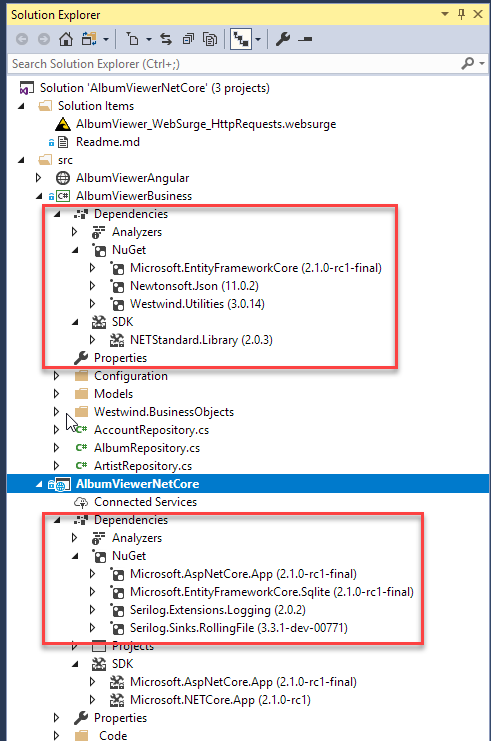
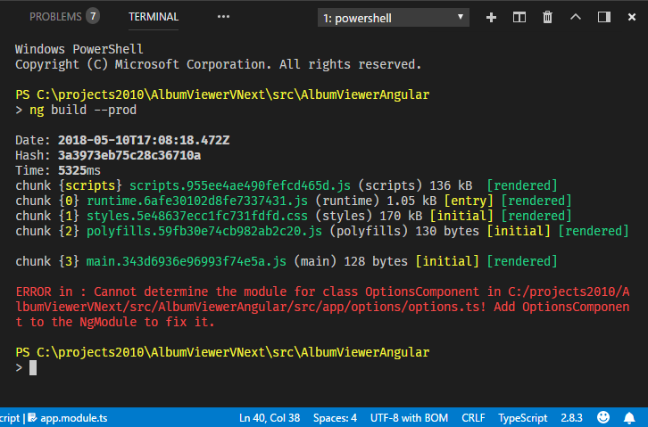
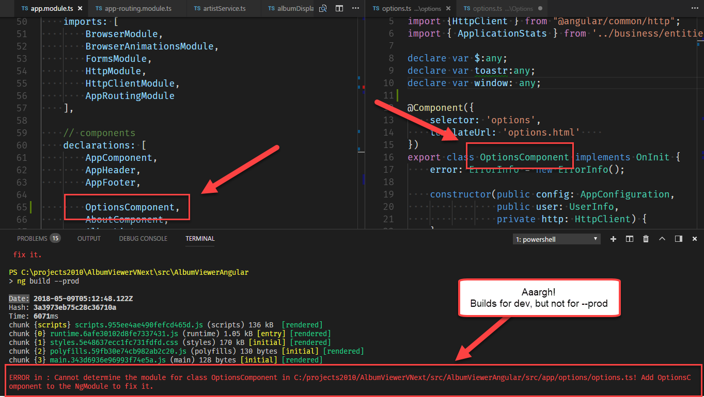
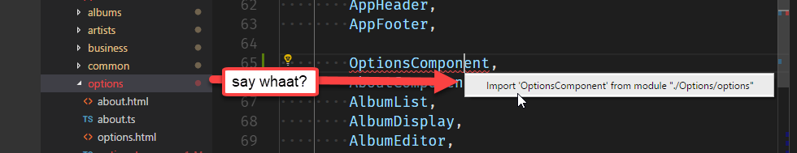

# Updating my AlbumViewer to ASP.NET Core 2.1 and Angular 6.0

I've been keeping my old AlbumViewer ASP.NET Core and Angular sample application up to date, and today I decided to take a little time to update the application to the latest ASP.NET Core 2.1 RC and Angular 6.0 bits. 

The good news is that the ASP.NET Core update was completely painless. Updating Angular from version 5.2 to 6.0 on the other hand took quite a bit more work because Angular has introduced a new way to deal with rxJs which pretty much affects all observables in the application. Additionally, i ran into a weird WebPack/Angular CLI build issue that was causing a last minute painpoint when trying to upload the application.

## Getting the Code
If you want to play with this stuff, the sample and all code is up on Github. Until ASP.NET Core 2.1 releases the code lives on a `NETCORE21` branch in Github - I'll move the code over Master when the final build of Core 2.1 is out. Final release is supposed to come out by the end of the month as was announced at Build yesterday.

* [AlbumViewerVNext GitHub Repo](https://github.com/RickStrahl/AlbumViewerVNext/tree/NETCORE21)
* [Online sample](https://albumviewer.west-wind.com)


## Upgrading to .NET Core 2.1
The upgrade to .NET Core 2.1 from 2.0 and an earlier 2.1 preview was pretty uneventful. To upgrade all that needed to happen is:

* Install the latest .NET Core SDK (RC at the time)
* Update Project References

You can grab the latest .NET Core SDK from here:

* [.NET Core Downloads](https://www.microsoft.com/net/download/all)

### .NET Core 2.1 Updates
Updating to .NET Core 2.1 from 2.0 was pretty much a no-brainer. Essentially the whole process involved installing the new .NET Core SDK and updating package references. There were **no code changes required** over the two updates I did for the preview and then to RC.

For this small project package updates basically involve going into the NuGet Package Manager for both projects and looking for out of date packages. 
The main update is the AspNetCore.

The two changes I had to make in the Web project file:

```xml
<PackageReference Include="Microsoft.AspNetCore.App" />
<PackageReference Include="Microsoft.EntityFrameworkCore.Sqlite" 
                  Version="2.1.0-rc1-final" />
```

Note that there's no explicit version specifier required as I'm using the latest version, but essentially this uses the same `2.10-rc1-final` version. 

The business project too needed an update for the EntityFramework reference:

```xml
<PackageReference Include="Microsoft.EntityFrameworkCore" 
                  Version="2.1.0-rc1-final" />
```    

Here's what this looks like in this project:



Note also that .NET Standard shows as `.NET Standard Library 2.0.3` which is the latest version. The target hasn't changed though it still shows as .Net Standard 2.0:

```xml
<TargetFramework>netstandard2.0</TargetFramework>
```

There's no direct option to configure the .NET Standard version, rather it's determined by the SDK and build tools. Apparently they are very confident there in the backwards compatibility.

### Configuration - Bleed For Me Mode
ASP.NET Core 2.1 includes a new configuration option that lets you opt in for bleeding edge changes - changes that **might** break behavior in some edge cases. The `services.AddCompatibilityVersion()` allows you to opt in to changes that might opt backwards compatbility and you can specify either a specific version that you're willing to go with or `Latest`.

```csharp
// Add framework services
services
    .AddMvc()
    .SetCompatibilityVersion(Microsoft.AspNetCore.Mvc.CompatibilityVersion.Version_2_1)
```

By default is `CompatibilityVersion.Version_2_0`.

### More Simplification
Just as a sidenote unrelated to my project: ASP.NET applications are continuing to reduce their required startup configuration and the Startup class is now down to almost nothing required to get well configured no ASP.NET app up and running:

```csharp
public class Startup
    {
        public Startup(IConfiguration configuration)
        {
            Configuration = configuration;
        }

        public IConfiguration Configuration { get; }

        // This method gets called by the runtime. Use this method to add services to the container.
        public void ConfigureServices(IServiceCollection services)
        {
            services.AddMvc().SetCompatibilityVersion(CompatibilityVersion.Version_2_1);
        }

        // This method gets called by the runtime. Use this method to configure the HTTP request pipeline.
        public void Configure(IApplicationBuilder app, IHostingEnvironment env)
        {
            if (env.IsDevelopment())
                app.UseDeveloperExceptionPage();
            else
                app.UseHsts();
            
            app.UseHttpsRedirection();
            app.UseMvc();
        }
    }
```

There's practically nothing there anymore. This is an API project so there are literally no additional features needed, but you obviously need to add things that your app requires like CORS and the appropriate Authentication mode(s). It's really nice to see lean startup class to begin with.

### Secure by default
Notice also that the default project now automatically adds HTTPS support and enables HSTS (all requests out of content have to be HTTPS) in production. The `app.UseHttpsRedirection()` middleware is a nice enhancement too - one less thing you have to remember to set explicitly.

The other change related to this this that 2.1 apps now automatically launch both HTTP and HTTPS Urls on port 5000 and 5001 respectively and the debugger now launches into the HTTPS version.

### Remove Tooling
One very welcome change in .NET Core 2.1 is that you no longer have to explicitly add development time build tools for `dotnet watch`, User Secrets or the `Entity Framework` console commands as these are now built-in and always available.


So if you have a command like this from .NET Core 2.0 or older you can remove it:

```xml
<ItemGroup>
  <DotNetCliToolReference Include="Microsoft.DotNet.Watcher.Tools" Version="2.0.0" />
</ItemGroup>
```

### Build Speed Improvements
In testing out .NET Core 2.1 on a couple of additional projects that are quite a bit larger than my sample here, the big thing that stands out is that build performance is much improved at least on Windows. Build speed now seems to be at least on par with full framework, and maybe even a little better. Even full rebuilds which were horribly slow before are now working much faster. Yay!

## Updating to Angular 6.0
Angular is keeping to bi-yearly release schedule and we're now up to Angular 6. The upgrades from version 2 all the way up to 5 have been largely uneventful when it comes to upgrades. Most updates were simply a matter of upgrading all the dependencies.

It's been while since I'd done updates so I actually did a two step update process this time around. I was running a late 4.x version, and initially jumped straight to 6.0 before it was released. However, that did not go well... Because it wasn't released yet upgrade information was a bit spotty and I didn't realize that there were going to be major changes in Angular 6.0 that would end up breaking my application rather hard.

After spending a couple of hours fighting and not finding decent docs to point me in the right direction I decided to wait until 6.0 was released. Which - in true Mr. Murphy fashion - happened the day **after I rolled back to 5.2. Argh. 

So the upgrade from 4.x to 5.24 was very quick. Moving to 6.0 took a bit longer, but after 6.0 was released there was actually decent documentation.

### ng update
One of the big new features in Angular 6.0 is support for `ng update` in the Angular CLI. `ng update` updates the angular-cli configuration `angular.json` and `package.json` files to bring up the core Angular and Angular dev time dependencies.

This worked reasonably well for me but not before I made a few funky mistakes I hope I can help you avoid.

The proper order to do the upgrade is:

* Remove the global Angular CLI     
`npm uninstall -g @angular/cli`
* Remove local Angular CLI if installed Angular CLI  (if installed)
`npm uninstall @angular/cli`
* Install the latest Angular CLI globally  
`npm install -g @angular/cli`
* Nuke the `node_modules` folder  
* Nuke the `package-lock.json file **(IMPORTANT!)**
* Run `ng update`
* `npm install` to ensure you get latest

`package-lock.json` was the one that got me - I did everything else, but because I didn't delete the `package-lock.json` file at just the right time I ended up restoring the wrong versions. It took me a few go-arounds to make sure that the final `npm install` was pulling all the right files.

Although I had trouble with it, I am really glad to see `ng update` is available now, because previously I'd go and manually create a new project and compare my old and new `package.json` and `angular.json` files and try to synchronize files. With this new functionality a lot of that is handled for me autom

### rxJs 6.0
Probably the biggest change you need to deal with in Angular 6.0 is the changeover to rxJS 6.0. Recall that rxJS is used for the `Observable` objects you use for any kind of event handling or HTTP processing. 

rxJS has always been a funky implementation and has undergone many changes in how it's referenced - the access APIs keep changing. rsJS introduces yet another backwards incompatible change that requires making syntax changes.

There are two ways you can upgrade your existing rxJS code to rxJS 6.0:

* Use the rsjx-Compat module
* Make the rxJS changes explicitly

#### rxjs-compat
`ng update` doesn't touch your rsjx code or imports in any way so if you just want your old code to work you can simply add the `rsjx-compat` module:

* `npm install --save rxjs-compat`

That's all that you need - this package basically provides the same structure as the old rxjs syntax did and then provides shims to the new functionality.

The angular folks have mentioned that `rsjx-compat` is a temporary fix and that you should try and move your code to the new syntax.

#### Manual rxjs Updates
The other option is to go through your project and explicitly update to the new syntax.

The reason for the new syntax apparently is:

* Much simpler imports for operations and operators
* Improved ability to include just what you need of the rxjs bundle

The former is a big deal and addresses one of the major beefs I've had with this library in that it was always very difficult to figure out exactly what you needed to import and the imports were basically undiscoverable. The new import syntax just has a couple of high level module paths to import from and once imported Code Completion/Intellisense can help with finding the right operators.

So here's what's required

##### Imports
Imports have been simplified and typically come only from `rxjs` or `rx/operators`.

Here's the old syntax:

```ts
import {Observable}  from 'rxjs/Observable';

import 'rxjs/Operator/map';
import 'rxjs/Operator/of';
import 'rxjs/add/operator/catch';
import 'rxjs/add/observable/throw';
```

And here is the simpler new syntax:

```ts
import {Observable, of} from "rxjs";
import {map, catchError} from "rxjs/operators";
```

The core components like `Observable` and `Subject` and some core operations like `of` are found in the `rxjs` namespace. All operators can now be retrieved from `rxjs/operators` no longer do you have to have individual imports for each operator. Yay!

Note that some operation names have changed to protect the innocent - eh, to avoid naming conflicts with reserved words in JavaScript. So `catch` becomes `catchError`, `throw` becomes `throwError` and so on.

A more complete list of changes can be found in the rxjs upgrade guide: 
* [rxjs 6.0 Upgrade Guide](https://github.com/ReactiveX/rxjs/blob/master/MIGRATION.md)

##### .pipe()
In previous versions you used chained operations to call operators. You'd combine operators like  `.filter()` and `.map()` to string together Observable operations. In rxJS 6.0 this changes to a parameter based syntax using the `.pipe()` function.

The following is code inside of a service that returns an `Observable<Album[]>` for an HTTP call to the caller.

Old Syntax:

```typescript
getAlbums(): Observable<Album[]> {
        return this.httpClient.get<Album[]>(this.config.urls.url("albums"))
            .map(albumList => this.albumList = albumList)
            .catch(new ErrorInfo().parseObservableResponseError);
    }
```

New Syntax:

```typescript
getAlbums(): Observable<any> {
    return this.httpClient.get<Album[]>(this.config.urls.url("albums"))
            .pipe(
                map(albumList => this.albumList = albumList),
                catchError( new ErrorInfo().parseObservableResponseError)
            );
}
```

The new syntax replaces chainable functions with explict function calls as parameters to the `.pipe()` function. 

`<rant>`

Now personally I think this is crazy ugly syntax and a big step back, but according to the rxJs team this is supposed to make it much easier for build tools to optimize the actual bits that are pulled from full rxJS library resulting in a much smaller footprint.

My beef with this is that rxJS now basically creates global functions that can pollute the module namespace, and you can see that by the fact that some things needed to be renamed so they could work at all and not conflict with JavaScript functions. You also lose some discovery context at the call level via code completion because there's really no call context as these functions live in the module's namespace.

That said, I can get used to this I suppose, but it still seems like some very odd decisions for a mature library to make to essentially solve a build issue. But alas it is what it is.

`</rant>`

To migrate to the new syntax is not difficult as you can see when you compare the two versions. You can usually just add the `.pipe()` function and wrap it around the operators and remove the `.` and commas. Easy but time consuming. 

The good news is in Angular the compiler catches all of these if you don't have `rxjs-compat` installed so the usage is easy to find and fix. In my smallish application this took about 10 minutes, but obviously in a larger app this will take time.

There's also a [rxjs-tslint](https://www.npmjs.com/package/rxjs-tslint) update you can grab from npm:

```
npm i -g rxjs-tslint
rxjs-5-to-6-migrate -p src/tsconfig.app.json
```

and this will try to automatically fix up the imports and change to `.pipe()` operations or offer them as fixup options in the IDE. 

I didn't have a chance to try it as my sample app is small but for larger apps this looks very useful.

### Odd WebPack Compiler Issue
I also ran into a very strange build issue in the Angular project. When I built the project initially and ran it in development mode, the app built and ran fine. No errors.

However, I would then compile with:

```
ng build --prod
```

And get this funky error:



which appears to be a Module import error. Besides the Inception like error message I double-checked to make sure that the OptionsComponent was imported in the root module:



So what the heck is going on here? It works in `development` but fails in `production` builds.

So it turns out the problem was an import in the module where **the path was not the proper case**.

The following was in my appmodule:

```ts
import {AboutComponent} from "./options/about";
import { OptionsComponent } from './Options/options';
```

Notice the second path which incorrectly uses upper case `Options`. Once I fixed the path, the code started compiling. Aarrgh...

How did I find this? [@MarkPieszak](https://twitter.com/MarkPieszak) was kind enough to hypothesize that I might have two copies of the options file. Which led me to check all places where the component was referenced and made me then find the invalid path. Found and fixed the path and... Bingo. Code builds! Thanks Mark!

But it even gets weirder from there. I usually auto-inject the modules using Visual Studio Code's `Ctrl-.` name and module resolution, and somehow that path ended up getting into the file incorrectly. So I removed the reference and then used `Ctrl-.`. To my horror I found this:



Yikes! The path clearly isn't correct here - and the path doesn't exist.

It turns out that restarting VS Code fixes this (Phew! otherwise that would just be **completely random**), but it looks like the name lookup plug-in  caches paths once it has resolved them using whatever was entered.

Nasty one that one and it took me an hour to track that single build error down. Sigh.


## Summary
In the end the Angular app built properly and ran fine. Other than the rxJs changes there were literally no other code changes required which is nice given that the codebase hasn't been touched since the last major update to Angular 4.0.

All in all, this two step update process to .NET Core 2.1 and also Angular 6.0 was relatively painless especially since I had let this app sit idle over a number of update releases.

For .NET Core 2.1 the process was a breeze, but the Angular update required a bit of work primarily to deal with the major rxjs changes. 

For now the code on Github remains on a non-master path (NETCORE21), until .NET Core 2.1 is released to RTM which apparently won't be very long.

## Resources
* [AlbumViewerVNext GitHub Repo  (NETCORE21 branch)](https://github.com/RickStrahl/AlbumViewerVNext/tree/NETCORE21)
* [AlbumViewer Sample Site](https://albumviewer.west-wind.com/albums)
* [rxjs 6.0 Upgrade Guide](https://github.com/ReactiveX/rxjs/blob/master/MIGRATION.md)
* [rxjs-lint](https://www.npmjs.com/package/rxjs-tslint)

<div style="margin-top: 30px;font-size: 0.8em;
            border-top: 1px solid #eee;padding-top: 8px;">
    
    this post created and published with 
    <a href="https://markdownmonster.west-wind.com" 
       target="top">Markdown Monster</a> 
</div>