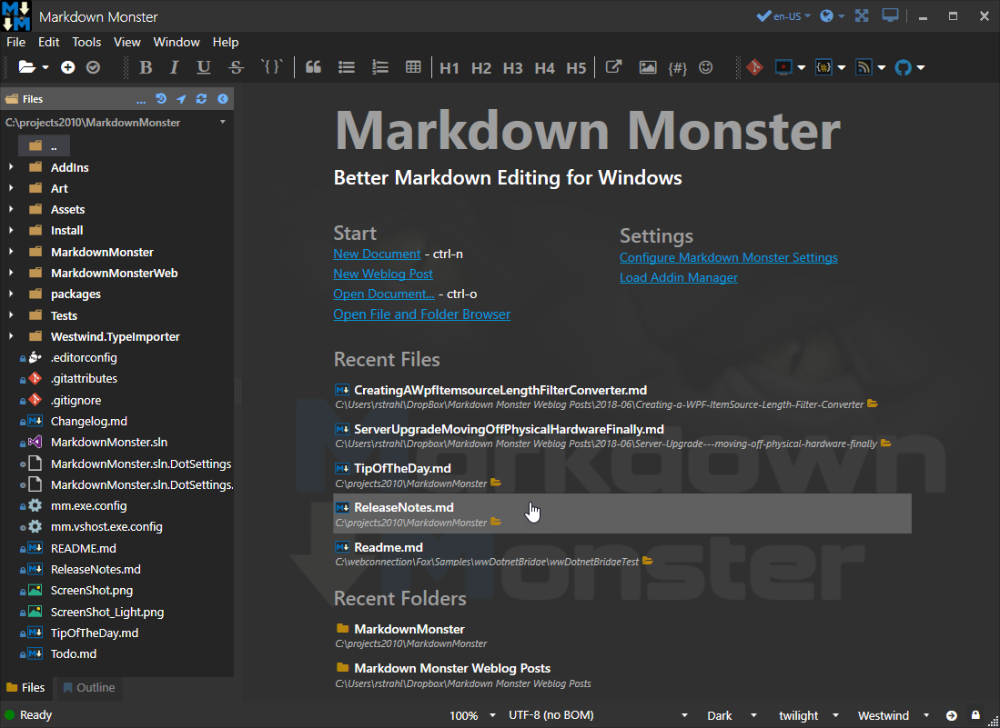

# Creating a WPF ItemsSource Length Filter Converter

The other day I was looking for a solution on how to display a WPF bound list and limit the number of items that are displayed in that list. I've run into this a few times and so I ended up creating a small filter to handle this. 

### My Use Case - A short Recent Document List
I've been working in [Markdown Monster](https://markdownmonster.west-wind.com) on updating the startup screen when there is no open document. This screen shows a few common operations, and displays a list of recent files and folders like this:



Notice the **Recent Files** and **Recent Folders** lists on the bottom. 

The underlying data for the lists is rather large and they are kept as part of the persisted user configuration settings that are held in an `ObservableCollection<string>`. The lists are used in a number of places in the UI from the recent file list drop downs and also in selection lists for file open/save locations.

On the start page there's limited screen real estate so it need to display the list with just a few items rather than the full list of recent items (which defaults to 10 but is user configurable).

## WPF and Lists
List binding in WPF is usually done via an `ItemsSource` property that takes an enumerable value to bind to. For updateable resources like my `RecentDocuments` you'd typically use an `ObservableCollection<T>` to allow for change detection on the items:

```csharp
public ObservableCollection<string> RecentDocuments 
    { get; set; } = new ObservableCollection<string>();
```

### Creating a Filtered Model Property?
One common suggestion that I found while searching around for a solution first was the typical suggestion: Use another read-only property that returns a filtered list:

```cs
public List<string> RecentDocmentShortList 
{ 
  get: 
  {
    return RecentDocuments.Take(5).ToList();
  }    
}
```

While that sort of works, using separate property like this introduces change tracking complications. While the original `RecentDocuments` are properly tracked the same is not true of the `RecentDocumentShortList`. So in order to deal with this `RecentDocuments.OnCollectionChanged` would have to be implemented to then force reloading of the list.

In short this is an ugly solution with too many side effects.

### A better way: Using Binding Converter as a Filter
WPF is very literal about how to bind values, and even simple things like binding a 'not' (inverse) expression requires a Value Converter.  A number of converters are shipped, but there are still lots of cases that are not addressed.

Luckily it's relatively easy to create a Binding Converter in WPF, which is simply a class that have `Convert` and `ConvertBack` methods. A  `ConverterParameter` can be applied and so you can capture or bind a value to the converter.

So for this use case I want to build a converter that takes in an `ItemsSource` as an `IEnumerable` and then filters it by the size parameter and returns the result.

Here's what this `ItemsSourceCountFilterConverter` looks like:

```csharp
public  class ItemsSourceCountFilterConverter : IValueConverter
{
    public object Convert(object value, Type targetType, object parameter, CultureInfo culture)
    {
        var val = value as IEnumerable;
        if (val == null)
            return value;

        int take = 10;
        if (parameter != null)
            int.TryParse(parameter as string, out take);

        
        if (take < 1)
            return value;
        var list = new List<object>();

        int count = 0;
        foreach (var li in val)
        {
            count++;
            if(count > take)
                break;
            list.Add(li);
        }
        return list;
    }

    public object ConvertBack(object value, Type targetType, object parameter, CultureInfo culture)
    {
        throw new NotImplementedException();
    }
}
```

To use this converter I can now apply the converter to an `ItemSource` binding:

```xml
<ItemsControl ItemsSource=
    "{Binding Configuration.RecentDocuments,
    Converter={StaticResource ItemSourceCountFilterConverter},
    ConverterParameter=5}" />
```    

The `ConverterParameter` is the list length that is passed in. 

The code retrieves the list, checks for the parameter and then filters the list and returns a IEnumerable.  Note that I don't have to return an `ObservableCollection<T>` in order for the binding to work. The actual binding is still against the full RecentDocuments list, but whenever values changes the converter is fired and so the filtered list is automatically updated in time and is always in sync.

The one downside to this approach is that the `ConverterParameter` has to be a static value - it can't be a dynamic binding, so it's hard to make the value user configurable. For my use cases this works just fine because this is likely to be a scenario where I explicitly need something to be a certain size which is why the list is filtered in the first place.

### Convert This, Sucka!
The way bindings work in WPF can be very tedious especially when compared to the much more dynamic bindings that you often see in JavaScript frameworks where common language syntax can often be used to affect formatting and binding behavior. WPF on the other hand is very stodgey and only binds to exactly what you tell it, with no easy dynamic formatting or value conversions.

I still feel like I just know enough WPF to be dangerous :smile:, but if there's one thing I've learned it's that converters are your friend. It usually isn't the first solution that comes to mind, but often they are the simplest and quickest way to affect display or binding behavior in an easy way. This is certainly the case with this `ItemsSourceCountFilterConverter` - I went down quite a few other paths before settling on this simple and easily reusable implementation. 

Hopefully some of you find this useful...

<div style="margin-top: 30px;font-size: 0.8em;
            border-top: 1px solid #eee;padding-top: 8px;">
    
    this post created and published with 
    <a href="https://markdownmonster.west-wind.com" 
       target="top">Markdown Monster</a> 
</div>