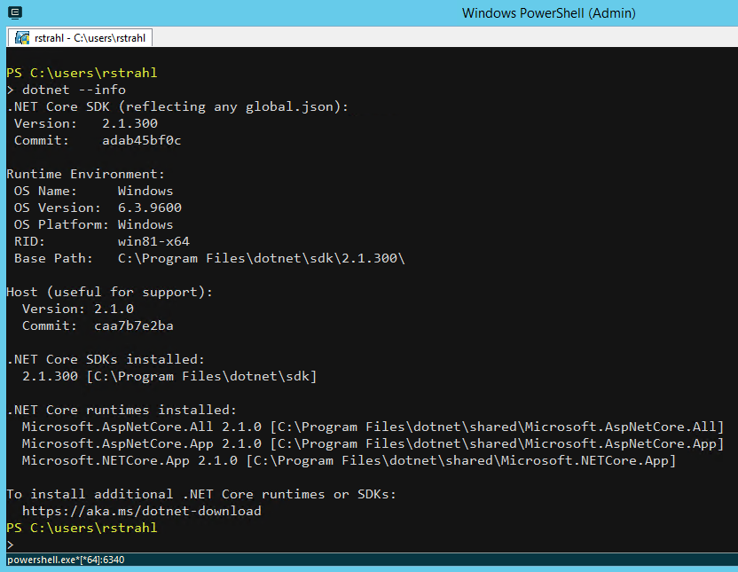
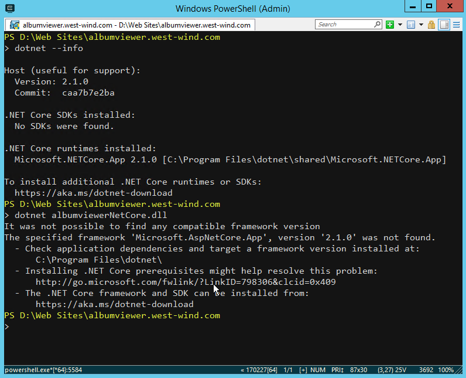
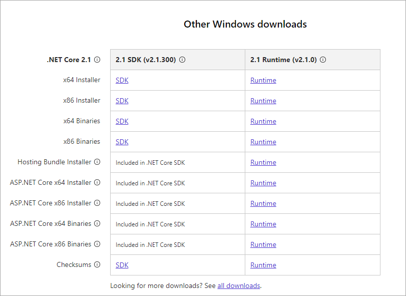

# Which .NET Core Runtimes do you need?


.NET Core has a number of different runtime downloads that you can grab to install the runtimes and the SDK. It's not immediately obvious what you need, so since I just went through this myself and had a discussion with a few folks at Microsoft (thanks [@DamianEdwards](https://twitter.com/DamianEdwards?lang=en) and [@RowanMiller](https://twitter.com/RowanMiller10)). I thought I'd summarize if for nothing else than my own reference in the future since I seem to forget what I figured for the last release :-).

### Checking what's installed
The first thing you should probably know is what versions of the runtime and SDKs you have installed, if any. The easiest way to do this is to run the following from a command prompt:

```
dotnet --info
```

If that doesn't work and you get an error, it means that .NET Core is not installed at all. `dotnet.exe` installs as part of a runtime install and puts itself on the path so you should be able to do `dotnet --info` if it is installed.

> `dotnet.exe` installs with a runtime install, but it only provides **core features** to provide info to **run** and application and provide info about the install: `dotnet mydll.dll` and `dotnet --info`. To build, publish or do anything else you need to install the SDK.

If .NET Core is installed `dotnet --info` produces the following output (here with the SDK installed):


The output tells you:

* The installed SDK version
* The active runtime version that's running this `dotnet` command
* A list of all installed runtimes and SDKs

It's important to understand that you can have **multiple runtimes and multiple SDKs installed** and each project can use a different one. The runtime is determined by your project's runtime specifier in the .csproj file:

```xml
<TargetFramework>netcoreapp2.1</TargetFramework>
```  

The SDK is either the last globally installed SDK which is the default, or you can explicitly override the SDK in a `global.json` placed in the **solution root folder**. The following explicitly forces my project to use the last RC SDK, instead of the RTM version:

```json
{
  "sdk": {
    "version": "2.1.300-rc.31211"
  }
}
```

Generally, there should be no need to use a specific lower SDK version as the SDK is backwards  compatible and can compile various versions of .NET Core application back to v1.0. IOW, it's OK to use the latest SDK in almost all cases.

## Downloadable Runtimes available
Let's get back to the downloadable installs. There are a number of different things you can download that install .NET Core:

* .NET Core Runtime
* .NET Core SDK
* .NET Core Hosting Bundle
* Visual Studio

### Visual Studio
If you're on a Windows you're very likely to be using Visual Studio and if you have the latest version of Visual Studio installed you are likely to have the latest SDK, runtime as well as the required IIS hosting components installed.

If you're using Visual Studio you typically only need to update the components below if you need to target a specific version of .NET Core that is not already installed. If you're doing active development, the most likely scenario is that you'll be upgrading to the latest version anyway which is most likely going to match what Visual Studio installed.

### .NET Core SDK - Install for a Dev Machine
The SDK is meant for non-Visual Studio build and management tasks. That's for command line use or if you're not on Windows specifically. The SDK basically provides what you need for a development setup to build and run .NET Core and all dependencies. The SDK is the largest download and it contains everything you need for a given platform.

Effectively it installs the `dotnet.exe` build tools along with support components. The SDK also installs a fixed version of the .NET Runtime with it which is required to run the SDK tooling. In other words if you download the latest SDK you typically also get the latest runtimes and you don't have to install the matched runtimes separately.

The versions are .NET Core SDK 2.1.300 and .NET Runtime 2.1.0 as shown in the figure above.

Here's what you see after a clean install of the .NET SDK:



#### What it contains

* Specific version of the .NET Core Runtime (ie. 2.1.0)
* ASP.NET Runtime Packages (Microsoft.AspNetCore.App/All)
* Specific version of the .NET Core SDK Tools (ie. 2.1.300)
* The IIS Hosting Components on Windows
* Platform specific install (ie. x64)

#### When to install

* On development machines (all you need typically)
* On a server or container where you need to run `dotnet` to build/publish etc. commands
* On a server if the server builds the application 

### .NET Core Runtimes
The .NET Core Runtimes are the smallest self-contained and specific component and contain the absolute minimum to **run** just .NET Core on a specific platform. 


Note it a runtime install **does not include the ASP.NET Core meta package** runtime dependencies, so if your application references `Microsoft.AspNetCore.App` or `Microsoft.AspNetCore.All` you have to seperately download the ASP.NET Core package. However, if you explicitly reference all ASP.NET Core Nuget packages rather than using the meta packages, those packages are deployed as part of your application and it can run with just the runtime.

Essentially you are trading installation package size vs. a runtime pre-install requirement.

The runtime alone has no support for `dotnet.exe` beyond running and info, so you can't build or publish - whatever you use the runtime for has to be a completely pre-compiled and be able to run **as is**.

Here's what you see after a clean install: 



Note that with just the Runtimes, running an ASP.NET Core application fails...

#### What it contains
* Specific Runtime for the given platform (ie 2.1.0 for x64)
* **Does not** include the ASP.NET Runtimes!

#### When to use
* For production installs **that include all dependencies**
* For installs that do not use the ASP.NET Meta packages


### ASP.NET Core Installer
This package basically installs the missing ASP.NET Runtime meta packages that the base .NET Core Runtime package described in the previous step is missing.

Basically this installs support for the ASP.NET Core meta packages.

#### What it contains
* The ASP.NET Runtime Meta Packages
* Microsoft.AspNetCore.App 
* Microsoft.AspNetCore.All

#### When to use
* When you need ASP.NET Meta Packages 
* Install ontop of a raw .NET Core Runtime install

### .NET Core Windows Hosting Pack
As you can see so far the SDK and Runtimes by themselves are usually not the right tool for deployed applications because they don't include everything you need and for this reason - at least on Windows there's a special **Hosting Pack** download that contains everything you need to run an ASP.NET Core application on Windows.

This is perhaps the most confusing of the packages available because the naming doesn't really describe what it provides. You can think of this package as **EVERYTHING** except the `dotnet` SDK tools. This package installs both 32 and 64 bit runtimes, the ASP.NET Core Runtimes as well the IIS hosting components on Windows.

If you need the SDK tools you're better of just installing the SDK **instead of this package**.

> #### Non-Windows Installs
> The Windows Hosting pack is specific to Windows and there are no commensurate bundles for Linux or the Mac. On Linux/Mac you can use the SDK download for Dev machines, and .NET Core Runtime + ASP.NET Core Runtimes for typical installations.

#### What it includes
* 32 bit and 64 .NET Core Runtimes
* ASP.NET Runtime Packages (Microsoft.AspNetCode.App/All)
* IIS Hosting Components

#### When to use

* When deploying on Windows Servers and using IIS
* Includes both 64 and 32 bit runtimes
* Includes ASP.NET Core Meta Packages
* Includes the IIS Hosting dependencies
* When you don't need the `dotnet` SDK tooling

### Download Sizes
To give a quick perspective of what each of these three different SDKs look like (on Windows) in terms of size, here's a screen shot of all three packages:


### Download Page
That's a lot of options and frankly every time I install or update a version I forget what exactly I should install.

Microsoft recently updated the download page to make things a little bit easier to understand.



Note the info icons and the **included in .NET Core SDK** notes, which highlights that if you install the SDK you pretty much get everything.

## Summary
To summarize what works best for Windows installs:

**For Server Installs**

* Windows: Use the Windows Server Hosting Bundle
* Mac/Linux: Install .NET Core Runtime + ASP.NET Core Runtimes

**For Development Machines**

* Install the SDK
* or on Windows: Visual Studio

**For absolutely minimal .NET Core Installs**

* Install the Runtime only

If you also use the ASP.NET Runtime Meta packages

* Install the ASP.NET Runtimes

Hope this helps some of you out.

<div style="margin-top: 30px;font-size: 0.8em;
            border-top: 1px solid #eee;padding-top: 8px;">
    
    this post created and published with 
    <a href="https://markdownmonster.west-wind.com" 
       target="top">Markdown Monster</a> 
</div>