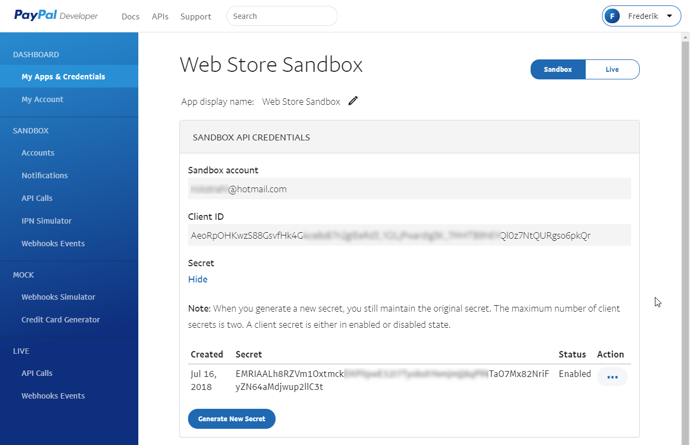
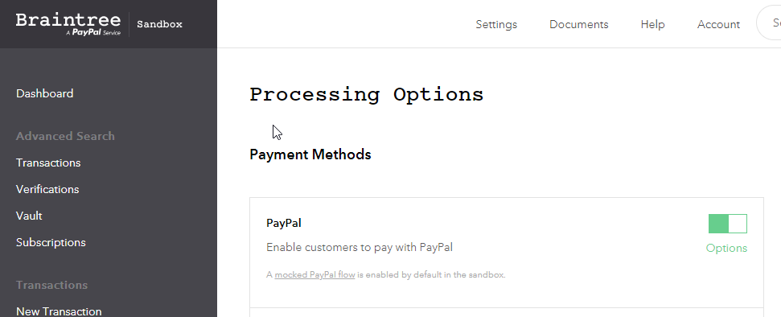
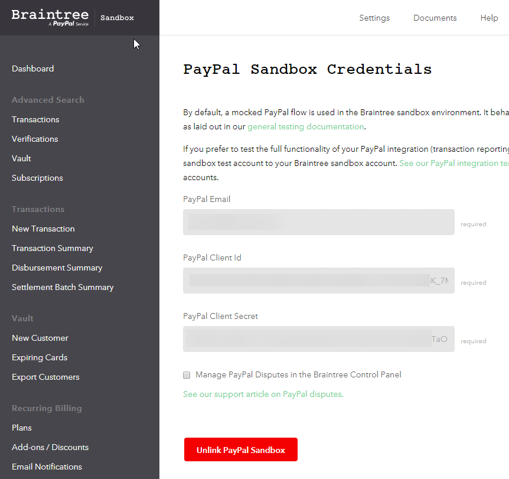
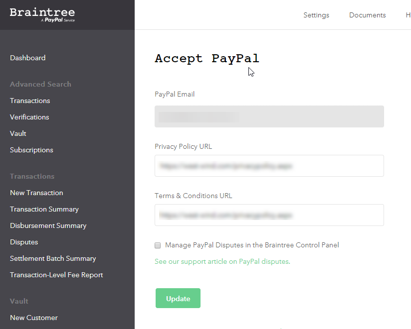

# Braintree Hosted Integration in ASP.NET

I just spent a frustrating day re-integrating Braintree's hosted integration into an existing application. I've been using BrainTree's server based APIs for many years with their older tokenization APIs for PCI compliance but the ever stricter PCI compliance rules pretty much require that now you use one of their hosted solutions.

### What the Hell is a Host Solution?
Hosted solutions for providers basically run the actual credit card data entry part on the provider's servers rather than your own. 

There are a number of common ways you can accept and process the actual credit card information:

* Pure Server Side Processing
* Tokenization of Credit Card Data
* Fully processor hosted forms

Pure server side processing is generally not recommended any more, especially for smaller businesses that don't have the resources to go through through full PCI Audits. 

The idea of Tokenization and Hosted Forms is to ensure that the credit cards that your customers enter never actually touch your server, but rather you pass this information directly to the Processors Web site for tokenization, which can then be passed to the server without giving away the actual credit card information.

#### Server Side Processing
If you've done Credit Card processing as long as I have (going on 25 years now) you probably remember starting out with purely server side processing. Back then there were no PCI requirements and hacking servers also wasn't quite as sophisticated as the client side tools to facilitate many of these hacks didn't even exist then. Correspondingly getting a merchant account in those old days went mainly through a handful of big providers and it was expensive and difficult to actually qualify for a credit card account.

Server side processing captures all of the Credit Card information and passes it to the server for processing. The process is easy to understand and conceptualize, but it essentially leaves you with **full responsibility for the credit card info** provided by the user. 

The processing itself is easy to do because the process is 100% synchronous - you submit a form, grab the card info, and then push the order and credit card information to Merchant Processor for validating the card. 

Today however this process is not considered very PCI compliant. It's still an option but to qualify you have to go through full PCI compliance testing to ensure your entire network infrastructure is secure. For most small businesses this is a prohibitively expensive and unrealistic process. Heck even for larger institutions the security requirements are extremely strict and go all the way down to the network stack. 

Some of the stuff in these PCI compliance rules are downright ridiculous (most of the network infrastructure compliance), while others like the data storage requirements make very good sense. 

Up until a few years ago I used raw server processing myself because that's basically all that was available. It's only been in the last 8 or so years that server hosted and tokenization features have become available to allow offloading some to the sensitive card processing to the Card Processors.

As you might expect there are lots of opportunities to break security protocols in this process and all the responsibility lies at the feet of the merchant if something goes wrong and the site gets compromised or if data is breached in some other way. For this reason this sort of processing is generally not considered safe any longer and unless you plan on going through lengthy PCI compliance testing and mucho $$$ probably something you should avoid.

#### Tokenization
Somewhat more recently most credit card processors have provided a client side mechanism for tokenizing Credit Card information. The idea is that rather than sending Credit Card information directly 

### Hooking up Sandbox Paypal Integration
In order to use PayPal with BrainTree you have to link an account. For Sandbox accounts log into the [PayPal developer portal](https://developer.paypal.com) and then go to **My Apps and Credentials** then **Rest API Credentials**:

There generate a new set of API keys for your **Sandbox Account** and eventually your **Live Account**:

This dialog generates a client id and a secret that are required on the BrainTree end. These keys are only required for linking your Braintree and Paypal accounts.

On the BrainTree end go to **Settings -> Processing -> PayPal -> Options** :

and then enter the credentials you created on the PayPal site.

#### Production - different Settings
For production the settings I used were different - rather than prompting for those keys used in the Sandbox I only had to provide the account email and a couple of links for Privacy Policy and Terms of Service **which have to exist** on your site.

Not really sure why the Sandbox appears to be more strict than the live site, but... I've given up questioning anything that PayPal does as logical :grinning:

In order to test PayPal properly you really new **two PayPal SandBox accounts**: One that is the seller account, and one that you can use to actually purchase something with. PayPal will not let you use the same developer Sandbox account place an order and it also won't allow a real PayPal account (even though the flow is mocked up anyway). Super lame, but again... it's freakin' PayPal: They've only been doing this for 20 years and I'm sure nobody's ever run into this problem...

