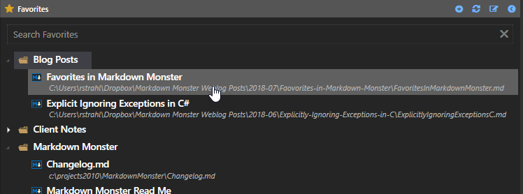
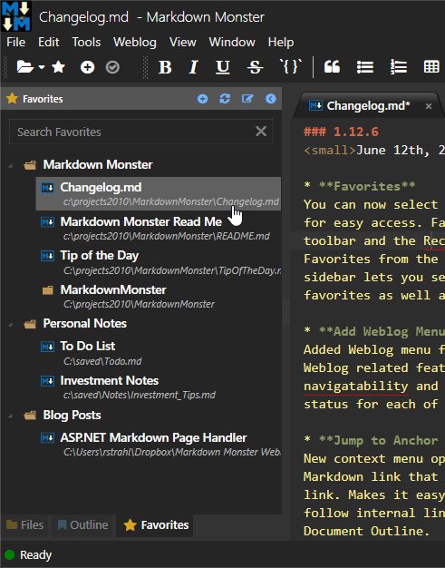
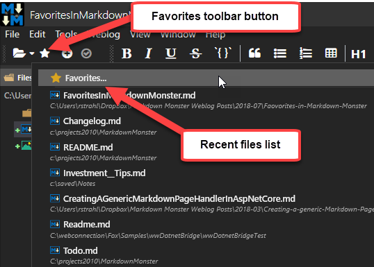
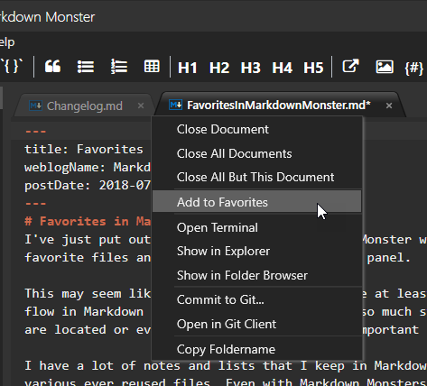
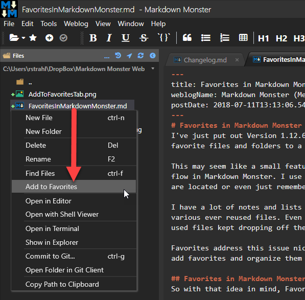
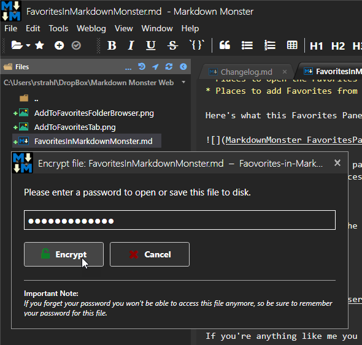

# Favorites for better Document Management in Markdown Monster

I've just put out Version 1.12.6 of [Markdown Monster](https://markdownmonster.west-wind.com) which includes a new feature: **Favorites** which lets you pin favorite files and folders to a new favorites side panel.

This may seem like a small feature, but for me at least this was one of the last missing pieces in my document management work flow in Markdown Monster. I use Markdown for so much stuff these days that it's becoming difficult to keep track of where files are located or even just remembering what's important :grinning:.

Using favorites you can add any kind of file (not just Markdown Files) or folders to the favorites list. 

I have a lot of notes and lists that I keep in Markdown files and one of the biggest annoyances has been to keep track of the various ever reused files. Even with Markdown Monsters configurable and optionally very long recent files list, I find that often when working on a project I open so many Markdown files in a single project that the Recent List often becomes useless and many of my frequently used files that I really want to track keep dropping off these lists and I then end up having to try and remember where they live.

Favorites address this issue nicely by allowing me to keep my often reused files linked in one place along with an easy way to add favorites and organize them into groups via drag and drop. Favorites are obviously nothing new, but most document editors oddly don't have this super useful feature built-in.

## Favorites in Markdown Monster
So with that idea in mind, I added Favorites to Markdown Monster's UI. There are three parts:

* The Favorites Panel to add/edit/find and navigate Favorites
* Places to open the Favorites Panel from
* Places to add Favorites from

Here's what this Favorites Panel looks like:

You can access the favorites panel either from the @icon-star toolbar button or from the **Recent Files Menu dropdown** which is accessible from multiple places:

You can add Favorites from the Tab Context menu of the active tab:

or from the folder browser:

## Lists, Lists Everywhere There's Lists
If you're anything like me you probably manage a number of lists:

* Various ToDo lists
* Meeting notes
* Phone log notes
* Blog posts or post/article ideas
* Client project notes and credentials
* etc.

Most of these types of files I use constantly, but even though they are frequently used, they often fall of Markdown Monster's **Recently Used** list. Having a single place to go to to find files I frequently use makes it much more likely for me to use Markdown keeping track of things especially like Meeting notes or client errata that I need.

### Related Feature: Encrypted Markdown Files
Another related useful feature of Markdown Monster is its **ability to create encrypted files** that are password protected. This allows me to store sensitive information like logon credentials in Markdown files securely. This feature is available from the **File -> Save As Encrypted File** menu option and writes out the file in an encrypted format that is password protected.

To open the file again you have to provide a password. 

## Summary
Favorites are not a very glamorous marquee feature, but it is a very useful one, especially over time as more files are accumulated and you use Markdown more and more. Having an easy way to store common file links and being able to quickly access them is a huge feature if you manage a lot of files in disparate locations. I know for me, although I just started using it this is already a big time saver and has increased my use of Markdown for common tasks that previously seemed too tedious because of the file location issues.

So if you're using Markdown Monster check out the new Favorites feature and see if it can't make you more productive using Markdown.

    
    this post created and published with 
    <a href="https://markdownmonster.west-wind.com" 
       target="top">Markdown Monster</a> 

