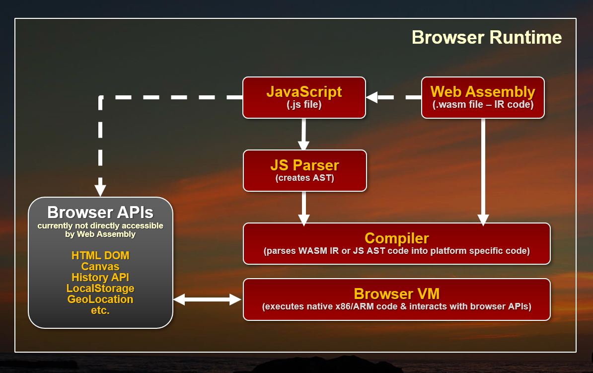

# Re-assembling the Web with Web Assembly and Blazor

The Web has been powered by a single language on the client since the very beginnings of the Web as a platform. JavaScript started as an overly simplistic scripting language in the first Mozilla browsers and very slowly evolved over the years to become what is now the most widely used programming language anywhere. 

In recent years with the advent of ES2015 and later, and many infrastructure tools like Babel and WebPack using JavaScript has become a considerable more capable language and evolved into a complete platform able to handle even very large code bases. Unfortunately the complexity for the infrastructure too has increased with ever more crazy and byzantine build systems to build even simple applications. With JavaScript it seems the simpler the programming model gets, the more complex the build system and tooling becomes.

## Re-Assembly
There are a lot of developers that would much rather use something else - anything else - than JavaScript to build Web applications. I myself have made peace with JavaScript years ago, but while I use it daily and feel reasonably proficient with it, I would definitely welcome other options to build Web applications with.

I personally think that to be a platform on par with desktop or mobile OS's the browser shouldn't be tightly coupled to the JavaScript mono-culture. There should be a way that the runtime and programming environment can be defined at a lower level, just like other platforms so that many different languages and frameworks can be used. Wouldn't it be nice if there was a browser based assembly language that abstracts browser specific hardware and still is as close to the raw hardware as possible?

This isn't just about 'language' either. JavaScript's insane build structure required for all major frameworks these days is a crazy house of cards that seems to break anytime you step away for more than a few days. Other platforms have skinned that cat in other and potentially more efficient ways. 

### Web Assembly brings Language Choices
A relatively new technology called **Web Assembly** speaks to just that scenario. It has opened up the possibility to compile code that isn't necessarily JavaScript into low level byte code Web Assembly Modules (WASM) that Web Browsers can directly execute without having to parse a source file.

Web Assembly allows exploring alternatives to JavaScript syntax and different build processes, and that is something that has been sorely lacking in Web Development in the last 10+ years. Lack of alternatives is what has led us down this path of ever increasing complexity piling on more and abstractions and dependencies and Web Assembly hopefully will break this Stranglehold by providing different models to approach Web development. It opens the browser as a platform in ways that we probably haven't imagine yet.

Web Assembly is a parallel technology to JavaScript and exists side by side with the JavaScript runtime in the Web Browser VM. **Figure XX** shows how both JavaScript and Web Assembly are processed. Rather than parsing JavaScript into executble code, Web Assembly Modules (WASM) contain lower level assembly-language like intermediate code that can be produced by compilers of other languages. WASM code doesn't need to be parsed like JavaScript since it is already byte code that has resolved into execution ready byte code. WASM code can be expressed in text format and deals with instructions at the register, stack and memory level. This platform agnostic byte code is then compiled compiled into native code for the appropriate computer platform (x86 or ARM) and executed by on the specific  Browser platform. This can be advantageous for creating very high performance computational code which can be highly optimized for performance and can execute considerably faster than JavaScript code both in terms of loading and runtime execution.



<small>**Figure XX** - Web Assembly sits side by side with JavaScript </small>

### Blazor - One way to .NET on the Web
But even more interesting than performance is the possibility of using Web Assembly to bootstrap higher level runtimes that can then execute higher level languages like .NET code. This is exactly that Microsoft's **Blazor framework** takes. 

Blazor uses a **Mono** compiled version of the .NET Runtime compiled to a WASM module to execute .NET Standard modules as shown in **Figure XX**. `mono.wasm` is a browser customized version of the Mono .NET Runtime compiled to Web Assembly that allows for bootstrapping .NET Standard assemblies and executing of .NET code. 

Blazor then sits on top of the core runtime and implements the Razor engine used as an entry point to the .NET Code that can be processed inside of pages. You can do most of the things you normally do in .NET such as importing and referencing additional .NET Standard assemblies and instantiate classes and execute code in them.  


<small>**Figure XX** - How Blazor use the Mono Runtime to execute .NET Code. Browser APIs currently have to be accessed through JavaScript interop</small>

One thing that sticks out in this implementation is that rather than compiling every bit of .NET code your application runs to WASM, only the Mono Runtime is compiled as a WASM module. All the Blazor framework and your application code is loaded as plain old .NET assemblies that are executed through Mono.

This all sounds incredibly complicated, but from the developer perspective of building an application the process is actually super simple: You create Razor pages with C# code inside of it and it just works the way you would expect it to. You can reference your own or third party assemblies via NuGet and take advantage of a large chunk of .NET CLR functionality. It's pretty impressive to see this work.

### Caveat Emptor
But before we get swept away how cool the prospect of running .NET code in the Browser is: Blazor is still considered **in the prototype stage**. It works and the functionally shows a lot of promise, but there also a number of limitations in its current stage.

Blazor is a very specific use case, namely an HTML framework similar to something like Angular, Vue etc. for rendering Razor pages on the client side. It is **not** a generic engine to execute .NET code in the browser as the .NET code you execute is tightly coupled to the Blazor framework. There are ways to call .NET code from JavaScript directly, but you still need to have the Blazor bootstrapping in place in order for that to work. In other words you currently can't really separate Blazor from the raw .NET code execution. Don't confuse Blazor with a new Silverlight, as Blazor serves a completely different use case.

Currently there's a bit of overhead for all of this magic Blazor provides. You have to load a sizable WASM module, plus the JavaScript loader and interop handler code that has to be loaded into the browser for each page. These are not outrageously large especially when compared against full frameworks like Angular, Ember or Aurelia, but the payload is not small and has to be loaded on startup.

There are also some serious limitations in Web Assembly that require quite a bit of JavaScript interop in order to access the DOM or other Web APIs. Data support for parameters and return values is also limited to numbers and pointers at the moment which require additional conversion in order to pass strings and references between JavaScript and Web Assembly. Both of these issues have a negative impact on performance of Web Assembly.

As a result, in these early versions of Blazor don't expect performance miracles or even performance that is on par with modern JavaScript frameworks. That will change as Web Assembly gets better DOM integration and type/reference support in the future and the Mono team continues to work on optimizing the WASM version of the Mono Runtime. There are also many optimizations that can be made in the Razor stack and with pre-rendering that are already being worked on in Blazor but aren't in the preview releases yet. 

It's too early for Blazor to be worrying about performance. At this point it's about proving this model as a viable platform for building complete Web applications and given this early stage the feature functionality is impressive even if performance is not yet.

The good news is that Blazor and Mono are changing quickly. The bad news is that Web Assembly is part of the W3C Spec process, so don't expect changes to come rapidly on that front. The needed improvements for DOM/API access and reference type support are being worked on but currently there's no official arrival date for these crucial feature that could improve performance significantly.

In short, it is very early days for both Web Assembly and Blazor and Microsoft explicitly states that Blazor is **not intended for production use!** It is very likely that a lot of the infrastructure and syntax is going to change significantly in the future. You've been warned...

## More Background on Web Assembly
The key to everything I've described above is executing non-JavaScript code in the browser is Web Assembly. Web Assembly is relatively new browser tech, but it's now supported in the latest versions of all major browsers as shown in **Figure XX**. It's notable that Internet Explorer is not supported by Web Assembly or Blazor at the moment.


**Figure 2** - Web Assembly Support in Web Browsers (source: [Mozilla MDN](https://developer.mozilla.org/en-US/docs/WebAssemblyhttps://developer.mozilla.org/en-US/docs/WebAssembly))

So what is Web Assembly? In simple terms Web Assembly provides a byte code level execution engine that can be targeted by compilers from other languages and so allows execution of non-JavaScript code.

### Byte Code Representation -  Native Execution
Web Assembly Modules (WASM) can be created by compilers that target a WASM output target. Today the most common WASM compilation platform is C/C++ using an Emscripten and an LLVM module that can output WASM code. There is also work in process with Mono to produce static compilation of .NET code to WASM although currently Blazor uses a different approach of use Mono as a hosted runtime via WASM to execute/interpret .NET code at runtime.

WASM modules are made up of binary content called **Intermediate Representation** or IR which is assembly-like byte code. This low level byte code is then loaded and compiled by the Web Assembly loader into processor specific native code that is executed by the Browser's VM. The IR code is not processor specific and it's the job of the Web Assembly engine to create the appropriate x86 or ARM native code for the specific Browser VM to execute.

WASM modules can be loaded from JavaScript in the browser using a set of WebAssembly APIs. Eventually the goal is to be able to load WASM modules using `<script src="myapp.wasm" type="module"></script>` syntax, with loaded module using the same module loader used by EcmaScript 2016 and later. For Blazor use this doesn't really matter as all the Web Assembly interaction is performed internally by the Blazor JavaScript framework that's responsible for loading the Mono WASM module and interactive with via JavaScript shims.

One of the original use cases for Web Assembly is to have high performance C++ built modules that can be called from JavaScript and execute many times faster than the same code in JavaScript. Performance is a good reason for Web Assembly, but another great use case is to build frameworks that can facilitate hosting of other language runtimes inside of the browser. Microsoft's **Blazor** using .NET is just one example of this using the Mono .NET runtime in the browser to allow loading and executing code in .NET Standard assemblies, but there are many other languages that are taking similar approaches (see https://github.com/appcypher/awesome-wasm-langs).

With the advent of WebAssembly the browser runtimes can now load and run two types of code — JavaScript and WebAssembly as side by side technologies.

### Web Assembly limitations
All this certainly sounds very promising, but Web Assembly is relatively new Browser technology and in its current state has a couple of big limitations.

### No access To the HTML DOM and APIs
Currently Web Assembly has no way to directly access the browser's DOM or APIs, so in order to interact with HTML page content, Canvas or any Browser API, Web assembly has to use interop with JavaScript. A function inside of WASM is essentially a self-contained block of code that is isolated from the environment it's hosted in. Think of it as a static function where all dependencies have to be passed in or maintained within the internal context. 

This makes WASM ideal for code centric scenarios where performance is important or where HTML or the DOM aren't even involved directly. Game engines for example, may use their own rendering logic in memory to handle the heavy lifting for of creating and updating UI, but then still have to rely on the JavaScript interop to actually move the final content to the HTML DOM, Canvas or WebGL in the Browser to display the results.

JavaScript interop is the key that currently lets Web Assembly interact, and it's a bottleneck to WASM's otherwise superior native performance.

### Numeric Parameters and Return Values Only
Web Assembly functions currently support only various numeric types as parameters. There's no support for strings or references or any other non-numeric type. Any type of data has to be passed to Web Assembly functions via pointers to buffers. In the real world this means a lot of serialization and copying of data has to be done to move data between JavaScript and Web Assembly.

Most frameworks that run ontop of Web Assembly provide JavaScript shims to make the parameter thunking between JavaScript and WASM easier, but this is relative slow and makes for clunky interfaces.

There are proposals that will improve this interaction in the future, but for now these limitations exist.

While these issues are pretty major, they have (slow) workarounds for now with some extra code gymnastics and slow interop with JavaScript via shims. Both of these issues can be bstracted and hidden by Frameworks like Blazor as we'll see, but the interop performance tax is a real issue.

## Blazing ahead with Browser based Razor Pages
Blazor is a framework that sits on top of Web Assembly and gets it's name from using Razor style templates in the Browser. Behind the scenes Blazor uses a single Web Assembly module which is a WASM targeted version of the Mono .NET Runtime. Mono is a flavor of the .NET runtime that underlies the various Xamarin platforms as well as many flavors of Linux, Mac and small devices. WASM is yet another custom target for the Mono runtime that allows execution of .NET Standard assemblies and code. This Mono WASM version is customized and kept as small as possible for the browser environment. 

What this means is that once the Mono WASM module is loaded you can execute code in plain old .NET Standard 2.0 compatible assemblies directly inside of a browser. There's obviously a bit of setup required to bootstrap the runtime, and Blazor provides that bootstrapping mechanism in addition to the HTML framework using Razor Pages. 

The Mono WASM module supports .NET Standard 2.0 where it makes sense but will throw **NotSupported** exceptions for features that don't work. I had no issue importing several of my own utility libraries from NuGet and accessing a number of utility methods from them in my Blazor code. How cool is that?

Blazor works by:

* Using a compiled Mono (Interpreted) .NET Runtime as a WASM module
* Using Mono to load standard .NET Assemblies
* Executing .NET code through the Mono Runtime
* Updating the Browser DOM via JavaScript interop
* Capturing JavaScript events and re-rendering based on DOM events

User code then executes based on these concepts:

* The Blazor framework is implemented in C# code
* All .NET Code is executed by the Mono Runtime
* User .NET Code is executed via Mono
* Razor Templates convert to .NET classes that execute via Mono

If you look at the output of a 'compiled' Blazor application as shown in **Figure XX** you'll see the `mono.wasm` module along with the `mono.js` loader. Neither of these files is  small


<small>**Figure XX** - Output from a Blazor project actually runs .NET Standard 2.0 assemblies</small>

Note that there are no `.cshtml` template files sent to the browser. All Razor pages, as well as any loose C# files you create to reference support classes and logic are compiled and shipped as code to the client in the `BlazorDemo.dll` file.


You can also see a `bin` folder with a bunch of core .NET Runtime assemblies are loaded alongside your user code (`BlazorDemo.dll` in **Figure XX**). 


<small>**Figure XX** - Network sizes for the Blazor runtime is not small but also not excessive</small>

Neither of these files are small so running a Blazor app will have at least a 800k payload at the moment plus any of the runtime and user code assemblies that your Razor code.

## Blazor 101
In this article I'll keep my example very short and simple to give you an idea how some interesting Blazor features work. This is more to get a feel for the overall concepts than the specific details which are very likely to be out of date soon as Blazor evolves.

### What do you need?
To give Blazor you're going to need to install a couple of things:

* .NET Core 2.1 SDK
* Visual Studio 2017.7 + Blazor Language Service Extension
* Or you can use the `dotnet` command:

```csharp
dotnet new -i Microsoft.AspNetCore.Blazor.Templates
dotnet new blazor -o BlazorSample
cd BlazorSample
dotnet run
```

If you create a new project either in Visual Studio using the new .NET Core Blazor project template or using `dotnet new` you get a small sample project that has a couple of simple data pages that demonstrate simple bindings. I'll use this basic project and add some functionality to it to demonstrate some interesting things you can do.

You can find this very sample on Github at:

https://github.com/rickstrahl/Blazor_Playground

I also recommend you read the [Getting Started](https://blazor.net/docs/get-started.html) document which gives you a good starting point.

### ASP.NET Core by Default but not Required
The stock Blazor project runs as an ASP.NET Core project so you have a Web Server to run and test your application with locally. However, ASP.NET Core is not required to the final application. The final output from the Blazor is a Web HTML folder that contains the compiled binaries, WASM module, support script files plus any image, css, font etc. assets your application need.


When you open the default project in Visual Studio, **Figure XX** shows what it looks like.


<small>**Figure XX** - </small>

There's a lot to learn just from the project structure, which should look familiar if you've built an ASP.NET MVC application before. You have a `Pages` and `Shared` folder which hold the application's UI views and components. The files use the same Razor `.cshtml` format and are functionally very similar to MVC's version of Razor, but it's not the same. There are a number of differences. The key aspect of mixing code and HTML however remains, what's changed is mostly the directives that drive the application.


### Blazor is an HTML Framework
The first thing you need to understand is that Blazor is an HTML framework that's centered around Razor views which act as components. Like many other modern frameworks like Angular, React, Vue and so on, Blazor uses the concept of components that can be combined to build more complex components and each Razor View represents a component.

There are a few different types of components you can create:

* **@Page** - a routable page or sub-view
* **Layout** - a Layout page into which `@Body` content is loaded 
* **Component** - an embeddable component. Can also be used like a Partial

A `@Page` component as the name suggests is a component that acts as a top level component that is view or page and typically is associated with a route. 

At it's simplest you can create a new page like this:

```html
@page "/hellobasic"

<h1>Hello @name, from Blazor</h1>

@if (!string.IsNullOrEmpty(Name))
{
    <div class="alert alert-info">
        @SayHello(Name), time is<br/>
        <i class="oi oi-clock"></i>
        <small><i>@DateTime.Now.ToString("MMMM dd @ H:mm:ss")</i></small>
    </div>
}

@functions {    
    string name = "Rick";
    
    string SayHello(string name) {
        return $"Welcome back, {name}.
    }
}    
```

The output generated from this simplest of pages (along with an extra button for the next example) is shown in **Figure XX**.


<small>**Figure ** - A basic Razor Page executing on the client </small>

The `@Page` directive identifies the this View a as a page and you can specify a route on this directive. This maps to an Attribute route that is then recognized by the Blazor engine to access this page.

Razor Pages are made up of HTML templates mixed with C# code prefixed by `@`. You can use `@expression()` or embed full code blocks `@{ <code> }` just as you would expect from Razor in MVC or Pages. Additionally you can add a `@functions` section to the template that add allows adding of methods and properties that can then be referenced in the document.

The bindings on the page are 'live' and when a value is changed inside of code on the page the view is updated to reflect that. Change tracking kicks in when browser events fire - ie. when you click a button, press a key or any number of other events occur. You can attach event handlers to controls and these handlers and their handler invocation cause the UI to be refreshed.

### Event Handling
You can handle client side script events and route them to functions in your code.

```html
<button class="btn btn-primary" 
        onclick="@IncrementCount">
    Increment Count: 
    <b class="green-text">@currentCount</b>
</button>
 
 @functions {
     int currentCount
     ... 
     
     void IncrementCount() => currentCount++;
 }
 ```

This code adds a button with a click handler that updates the counter displayed on the button as shown in **Figure XX** above.

Note that you can map events simply by pointing at a handler with the proper signature which in case of the click handler is a method with `MouseEventArgs`. Alternately you can also directly handle an event inline with a `Action` instance which allows you to reference in-scope variables for example inside of a loop structure.

```html
<div onclick="@(()=> AddTodo(todoItem) )">
```

### Non UI 'Events'
Change tracking in Blazor is triggered by Browser events, but sometimes you might need to explicitly refresh the UI from code that triggers a change from within your .NET code. .NET can fire internal events and even run simulated multi-threading and timers.

In the example above you may notice that when you click the **Increment Count** button, not only does the Count change, but also the date displayed in the alert box above it. This because the UI basically re-renders on the button click event and the change in the value.

Assume for a minute that we want to see the date updated in real time every second to display the updated time. This can be done with a timer using code like this inside of `@functions{}`:

```csharp
protected override Task OnInitAsync()
{
    var timer = new System.Timers.Timer();
    timer.Elapsed += (s, ev) =>
    {
        this.StateHasChanged();
    };
    timer.Interval = 1000;
    timer.Start();

    return base.OnInitAsync();
}
```

Blazor components contain life cycle events and `OnInitAsync()` is one that you can use to fire code when the component is first loaded. In this example, I set up a timer and simply fire it every second and explicitly for `this.StateHasChanged()` which forces the UI to refresh. This has the effect that the time displayed is now updated every second even when no browser event is fired.

> #### @icon-info-circle DateTime Format Issues
> Due to a bug in Mono, DateTime values in Blazor **always display as UTC** even when using `.ToLocalTime()`. The problem is that timezone handling is currently not working in Mono but this will be fixed in future versions.

### Layout Page
You probably noticed that the Hello page shows more HTML layout than what this sample displays. This HTML is rendered as part of the Layout page.

The Layout page for the sample is very simple:

```html
@inherits BlazorLayoutComponent

<div class="sidebar">
    <NavMenu />
</div>

<div class="main">
    <div class="content px-4">
        @Body
    </div>
</div>
```

The key point in this layout are the `@inherits BlazorLayoutComponent` (likely to change) which identifies this as a Layout page, and the `@Body` directive which specifies where the content goes.

To use the Layout you can use the `@layout` directive either in a specific page or by a `_ViewImports.cshtml` file by specifying the layout page type. Note that this is different than MVC where you specify the view - here you specify the type name.

### Components
The lowest level UI element is a component which is simply a `.cshtml` file that can be embedded into a page. Notice the `<NavMenu>` tag in the Layout above - that's actually a component that contains sub component logic.

Components are richly supported in the developer tooling. You can create properties (`[Parameter]`) which are strongly typed and can be mapped from attributes to properties.

Here's a simple component that takes the live time display logic I previously showed and creates a compoennt from it:

```html
<div class="alert alert-secondary mt-4" role="alert">
    <div>@Message</div>

    <i class="oi oi-clock"></i>&nbsp;
    <b style="font-size: 2.5em;">
        @Time.ToString(FormatString)
    </b>
</div>

@functions {
    [Parameter]
    string FormatString { get; set; } = "HH:mm:ss"; // Demonstrates how a parent component can supply parameters

    [Parameter]
    string Message { get; set; }

    DateTime Time { get; set; } = DateTime.Now;

    protected override Task OnInitAsync()
    {
        var timer = new System.Timers.Timer();
        timer.Elapsed += (s, ev) =>
        {
            Console.WriteLine("Updateing timer");
            Time = DateTime.Now;
            this.StateHasChanged();
        };
        timer.Interval = 1000;
        timer.Start();

        return base.OnInitAsync();
    }
}
```

This component abstracts the 1 second timer and the display logic for displaying the time component in the UI. To add the component to the page is very simple now:

```html
<TimeDisplayComponent 
    Message="Timing is everything!"
    FormatString="HH:mm:ss" />
```

Figure XX shows what it looks like added to the Hello page:


<small>**Figure XX** - The time component can update the UI independent of its parents</small>

Components are very powerful and easily created so much like Partials in MVC you want to use components to isolate behavior into the the smallest manageable units to avoid creating monolithic pages or components. It's much better to break out functionality into smaller units of work that are easier to reason about.

### A simple Todo List


### Hello Blazor
As I said I'm using the stock Blazor template and simply add a couple of new requests (and removing some of the stock ones).


### Things to watch out for
Blazor is still a prototype and as such there are many things that don't work. You can find out a lot of the issues by checking out the [GitHub issues](github.com/aspnet/Blazor/issues).

Just working through my own experimentation here are some of common things I ran into:

#### Update UI with `StateHasChanged()`
If you perform operations that require a binding refresh that's outside of a standard browser event operation, make sure to call `StateHasChanged()` to let Blazor know that it needs to recheck bindings and update the UI.

#### No Debugging Support - Use Console.WriteLine()
In this early build of Blazor, there's no debugging support so you can't step through code as you run the application. Debugging is a high priority for future releases but it's not there yet and for now the best to debug live code is by using `Console.WriteLine()` which writes output into the Browser's Console window.

#### TimeZones are broken in Mono
In the current version DateTime values always default to UTC time with no clean way other than explicitly forcing the time offset by adding or subtracting the offset.

#### Event Binding is Fixed
Currently Blazor supports only specific event bindings for **bind=** operation. For example, the `<input>` bind operation fires `onchange()` rather than `onkeypress()` and there's no easy way to change this. As a workaround you can explicitly bind events like `onkeypress()` but that obviously requires more code. In the future there will be support for specific event binding syntax and more options on how bind events operate.


### What's generated
If you want a look behind the scenes of how Blazor works at the .NET level you can peek into the client bin folder and check out your user assemblies. As mentioned earlier


<small>**Figure XX** - Razor Components render HTML and code into C#</small>

### Web Assembly is not all about the DOM
It's important to understand that **Blazor is just one way to implement a framework on top of Web Assembly**. Blazor explicitly interacts with the HTML DOM to defer all of its rendering and event handling. However, this is not a requirement.

Because Web Assembly allows executing raw machine code inside of the Browser sandbox, it's possible to create entirely new applications that might not even use the HTML DOM at all. Final display output can be mapped directly to HTML Canvas or WebGL for example which is the most likely path that high performance and graphics intensive applications like games will take to produce high video frame-rate Web content. No DOM required.

This same approach also allows for completely separate layout engines that are not based on HTML. One could imagine for example a XAML based output engine that directly renders to screen which would be more akin to something like Silverlight. I can't imagine that Microsoft isn't thinking about something along these lines for making UWP or Xamarin Forms apps work in a platform independent way inside of the Browser.

In the future it's quite easy to imagine that this sort of low level interface might bring a new renaissance of new UI frameworks that aren't based around HTML based UI - for better or for worse. After all we've been stuck in the HTML centric mindset for well over 10 years now, and the slow progress on the HTML/CSS UI  front may drive innovation into different places given the opportunity of a new platform that gives many more options for generating output to the screen.

Another interesting alternative for .NET developers is [Ooui](https://github.com/praeclarum/Ooui). Ouii provides a WebSocket based communication framework that lets you programmatically define a UI and controls rendered and passing events back over a WebSocket connection. Ouii has UI models both for DOM based layout as well as a Xamarin forms based layout that renders into HTML.

### Where are we?
It's easy to get excited around this technology. Blazor's development model certainly feels very comfortable with a relatively small learning curve that allows you to jump right in. Even better it sidesteps all the JavaScript build framework craziness that goes along with HTML based frameworks like Angular, React, Vue and so on.

As for Blazor, using compiled .NET code that can take advantage of compile time validation of code, using rich tooling for project wide refactoring, and having nice integrated tooling and the ability to use standard .NET components opens up a world of possibilities that simply weren't an option before.

On the flip side this is a framework from Microsoft. Microsoft has been known to try stuff and then abandon things. A framework like Blazor is also very likely to fight an adoption battle because it is a Microsoft product even if it is 100% open source. In my view, Microsoft has a commitment problem when it comes to client frameworks and Blazor very much needs a strong driving force to succeed both in terms of features and achieving 'hearts and minds'.

It's also important to understand that for the most part this is **experimental software**. Vendors are still trying to figure out how to best integrate solutions like this into existing browser based UI. Web Assembly is still growing up and there are big holes in terms of JavaScript and DOM interactivity that Blazor relies on. Web Assembly is currently lacking the ability to directly access the DOM, so all rendering and event handling has to indirectly go through JavaScript. This means performance overhead, and maybe even more critically ugly and somewhat limited code in order for Web Assembly and JavaScript to talk to each other. Much of the interop is hidden internally in the Blazor framework, but at the edges if your code needs to interop - and it will - it's pretty ugly.

These issues are well known and they are already on the list of things to be addressed in Web Assembly, but we are not there yet. 


What all this means is that anything Web Assembly based in the near future is going to be a rapidly changing target. **Microsoft specifically says not to use Blazor for production projects**, but I'm sure some people will just ignore that and do it anyway. Just realize that features and APIs are bound to change drastically before it becomes a stable production ready tool if at all. There has been no definite confirmation on whether Blazor is headed to become a real supported product, although it seems likely given all the interest that has been expressed around the overall concept and the speed with which this initial framework and tooling has come together. But it's all still open to interpretation by Microsoft.

### Experiment!
So, if all of this sounds exciting to you, consider using current versions of Blazor to learn about Web Assembly and get a feel for what it's like to use .NET code to write your front end code. It has a very different feel from JavaScript based development which feels both familiar and unfamiliar at the same time. While you may not be able to build production ready code with this stuff yet, it helps to check out the technology and get a feel for what non-JavaScript based development might look like. Give it a try...


