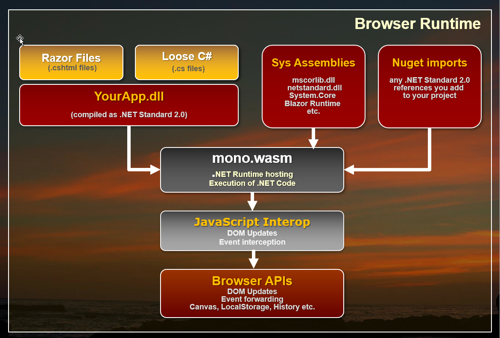
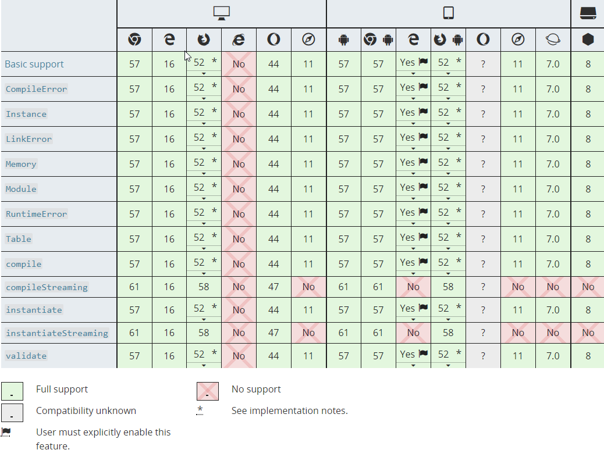
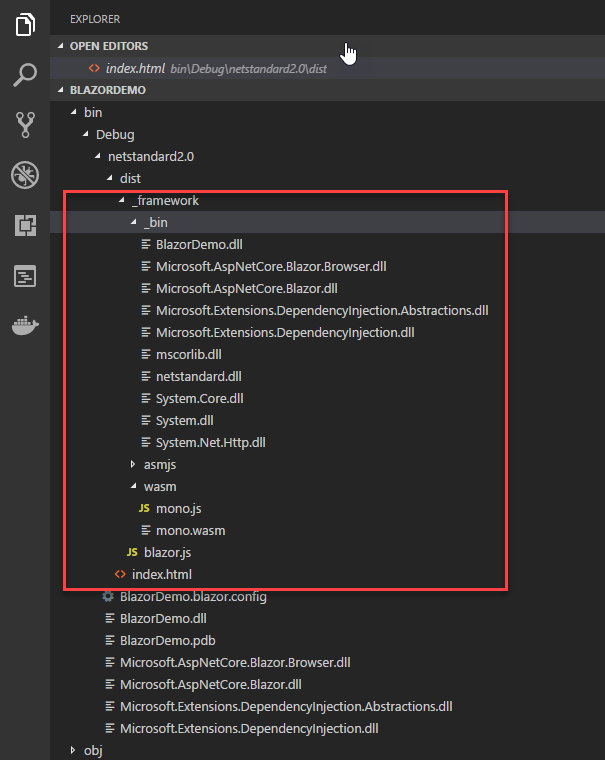
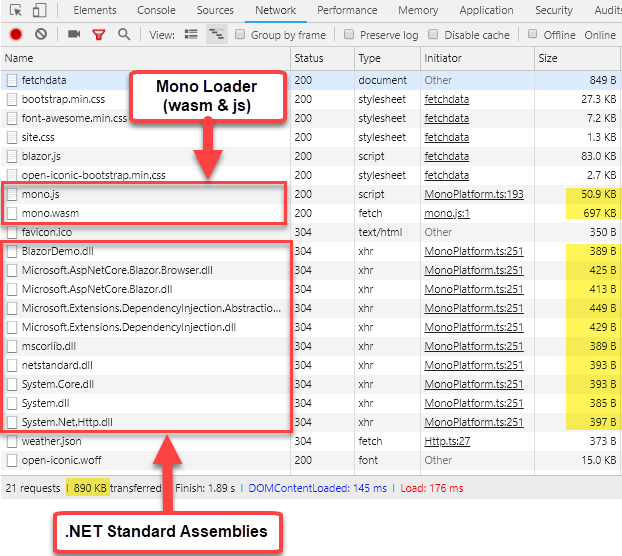
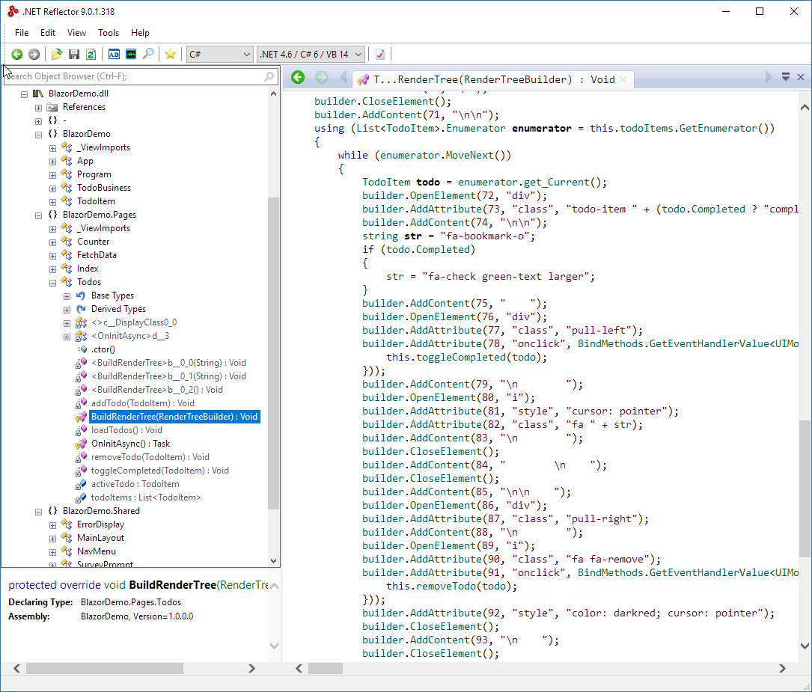

# Re-assembling the Web with Web Assembly and Blazor

The Web has been powered by a single language on the client since the very beginnings of the Web as a platform. JavaScript started as an overly simplistic scripting language in the first Mozilla browsers and very slowly evolved over the years to become what is now the most widely used programming language anywhere. 

In recent years with the advent of ES2015 and later, and many infrastructure tools like Babel and WebPack using JavaScript has become a considerable more capable language and evolved into a complete platform able to handle even very large code bases. Unfortunately the complexity for the infrastructure too has increased with ever more crazy and byzantine build systems to build even simple applications. With JavaScript it seems the simpler the programming model gets, the more complex the build system and tooling becomes.

## Re-Assembly
There are a lot of developers that would much rather use something else - anything else - than JavaScript to build Web applications. I myself have made peace with JavaScript years ago, but while I use it daily and feel reasonably proficient with it, I would definitely welcome other options to build Web applications with.

I personally think that to be a platform on par with desktop or mobile OS's the browser shouldn't be tightly coupled to the JavaScript mono-culture. There should be a way that the runtime and programming environment can be defined at a lower level, just like other platforms so that many different languages and frameworks can be used. Wouldn't it be nice if there was a browser based assembly language that abstracts browser specific hardware and still is as close to the raw hardware as possible?

This isn't just about 'language' either. JavaScript's insane build structure required for all major frameworks these days is a crazy house of cards that seems to break anytime you step away for more than a few days. Other platforms have skinned that cat in other and potentially more efficient ways. JavaScript works today, but at the very least Web Assembly will allow exploring other alternatives and different processes and that is something that has been sorely lacking in Web Development in the last 10+ years.

### Web Assembly brings Language Choices
A relatively new technology called **Web Assembly**, and `asm.js` before it, speak to just that scenario. It has opened up the possibility to compile code that isn't necessarily JavaScript into low level byte code Web Assembly Modules (WASM) that Web Browsers can directly execute without having to parse a source file.

Web Assembly is a parallel technology to JavaScript and exists side by side with the JavaScript runtime in the Web Browser VM. Rather than using JavaScript to produce the byte code to execute code, Web Assembly Modules (WASM) contain lower level assembly-language intermediate code that can be produced by compilers of other languages. WASM code doesn't need to be parsed like JavaScript since it is already byte code that has resolved all the language logistics. Rather it takes the byte code and compiles into native code for the appropriate computer platform (x86 or ARM). This can be advantageous for creating very high performance computational code, that can potentially be optimized and execute considerably faster than JavaScript code both in terms of loading and runtime execution.

### Blazor - One way to .NET on the Web
But even more interesting than performance, is the possibility of using WASM to bootstrap higher level runtimes that can then execute all sorts of different kinds of languages. Like say the .NET Runtime, which is exactly what Microsoft's **Blazor framework** does. 

Blazor uses a Mono compiled version of the .NET Runtime as a WASM module to execute .NET Standard modules as shown in Figure 1. `mono.wasm` is the small version of the Mono .NET Runtime compiled to Web Assembly and it allows for the bootstrapping .NET Standard assemblies and execute code in them. Blazor then sits on top of the core runtime and implements the Razor engine used as an entry point to the .NET Code that can be processed inside of pages. You can do most of the things you normally do in .NET such as importing and referencing additional .NET Standard assemblies and instantiate classes and execute code in them. 

<small>**Figure XX** - How Blazor use the Mono Runtime to execute .NET Code. Browser APIs currently have to be accessed through JavaScript interop</small>

One thing that sticks out in this implementation is that rather than compiling every bit of .NET code your application runs into WASM, only the Mono Runtime is compiled as a WASM module. All the Blazor framework and your application code is loaded as plain old .NET assemblies that are executed through Mono.

This all sounds incredibly complicated, but from the developer perspective of building an application the process is actually super simple: You create Razor pages with C# code inside of it and it just works the way you would expect it to. You can reference your own or third party assemblies via NuGet and take advantage of a large chunk of .NET CLR functionality. It's pretty impressive to see this work.

### Caveat Emptor
But before we get swept away how cool the prospect of running .NET code in the Browser is: Blazor is still considered **in the prototype stage**. It works and the functionally shows a lot of promise.

But Blazor is a very specific use case, namely an HTML framework similar to something like Angular, Vue etc. for rendering Razor pages on the client side. It is not a generic engine to execute .NET code in the browser as the .NET code you execute is tightly coupled to the Blazor framework. There are ways to call .NET code from JavaScript directly, but you still need to have the Blazor bootstrapping in place in order for that to work. In other words you currently can't really separate Blazor from the raw .NET Runtime execution. Don't confuse Blazor with a new Silverlight, as Blazor serves a completely different use case.

Currently there's a bit of overhead for all of this magic Blazor does. You have to load a sizable WASM module, plus the JavaScript loader and interop handler code that has to be loaded into the browser for each page. There are also some serious limitations in Web Assembly that require quite a bit of JavaScript interop in order to access the DOM or other Web APIs. Data support for parameters and return values is also limited to numbers and pointers at the moment which require additional conversion in order to pass strings and references between JavaScript and Web Assembly. Both of these issues have a negative impact on performance of Web Assembly.

As a result, in these early versions of Blazor don't expect performance miracles or even performance that is on par with modern JavaScript frameworks. That will change as Web Assembly gets better DOM integration and type/reference support in the future and the Mono team continues to work on optimizing the WASM version of the Mono Runtime. But since Web Assembly is part of the W3C Spec process don't expect changes to come quickly either.

In short, it is very early days for both Web Assembly and Blazor and Microsoft explicitly states that Blazor is **not intended for production use!** It is very likely that a lot of the infrastructure and syntax is going to change significantly in the future. You've been warned...

## More Background on Web Assembly
The key to everything I've described above is executing non-JavaScript code in the browser is Web Assembly. Web Assembly is relatively new browser tech, but it's now supported in the latest versions of all major browsers as shown in Figure 2. The one big omission here is Internet Explorer, although IE is supposed to be supported via an older `asm.js` technology that can polyfill for Web Assembly.

**Figure 2** - Web Assembly Support in Web Browsers (source: [Mozilla MDN](https://developer.mozilla.org/en-US/docs/WebAssemblyhttps://developer.mozilla.org/en-US/docs/WebAssembly))

In simple terms Web Assembly provides a byte code level execution engine that can be targeted by compilers from other languages and so allows execution of non-JavaScript code. As to how other languages can execute there are a few different ways that can work, and I'll show native compilation here and indirect execution via runtime as Blazor does.

### Byte Code Representation -  Native Execution
Web Assembly Modules (WASM) can be created by compilers that target a WASM output target. Today the most common WASM compilation platform is C/C++ using an LLVM module that can output WASM code. .NET has work in process with Mono for static compilation. Mono already supports a WASM module that does runtime interpretation of .NET code and that's what Blazor uses today, but in the future static Ahead of Time Compilation (AOT) may be supported for optimized binary module output.

A WASM module output is called **Intermediate Representation** or IR which is assembly-like byte code. This byte code is then loaded and compiled by the Web Assembly loader into processor specific native code that is executed by the Browser's VM. The IR code is not processor specific and it's the job of the Web Assembly engine to create the appropriate x86 or ARM native code that the browser VM can execute.

WASM modules can be loaded from JavaScript in the browser using a set of WebAssembly APIs. One of the original use cases for Web Assembly is to have high performance C++ built modules that can be called from JavaScript and execute many times faster than the same code in JavaScript. Performance is a good reason for Web Assembly, but another great use case is to build frameworks that can facilitate hosting of other language runtimes inside of the browser. Microsoft's **Blazor** using .NET is just one example of this using the Mono .NET runtime in the browser to allow loading and executing code in .NET Standard assemblies, but ther are many other languages that are taking similar approaches (https://github.com/appcypher/awesome-wasm-langs).

Web Assembly Module code is similar to .NET IL in that it provides low-level byte code directives which can then be quickly compiled into native code that can execute in browsers as modules. Again this is similar to the way .NET assemblies actually contain IL byte code that is compiled into native code by the JIT at runtime. 

The final output of Web Assembly is a binary WASM module of byte code that can be loaded into the browser dynamically using various loader commands in JavaScript.

With the advent of WebAssembly the browser runtimes can now load and run two types of code — JavaScript and WebAssembly as side by side technologies.

### Web Assembly limitations
All this certainly sounds very promising, but Web Assembly is relatively new Browser technology and as such has a number of big limitations.

#### No access To the HTML DOM and APIs
Currently Web Assembly has no way to directly access the browser's DOM or APIs, so in order to interact with HTML page content, Canvas or any Browser API, Web assembly has to use interop with JavaScript. A function inside of WASM is essentially a self-contained block of code that is isolated from the environment it's hosted in. Think of it as a static function where all dependencies have to passed in or maintained within the internal context.

This makes WASM ideal for code centric scenarios where performance is important or where HTML or the DOM aren't even involved directly. Game engines for example, may use their own rendering logic in memory to handle the heavy lifting for of creating and updating UI, but then still have to rely on the JavaScript interop to actually move the final content to the HTML DOM, Canvas or WebGL in the Browser to display the results.

JavaScript interop is the key that currently lets Web Assembly interact, and it's a bottleneck to WASM's otherwise native performance.

#### Numeric Parameters and Return Values Only
Web Assembly functions currently support only various numeric types as parameters. There's no support for strings or references or any other non-numeric type. Data has to be passed to Web Assembly functions via pointers to buffers. 

Most frameworks that run ontop of Web Assembly provide JavaScript shims to make the parameter thunking between JavaScript and WASM easier, but even so this introduces a clunky layer of non-intuitive indirect execution functions.

Also keep in mind that although Web Assembly is 

There are proposals that will improve this interaction in the future, but for now these limitations exist.

Another use case for Web Assembly, and one that the ASP.NET Team uses with Blazor, is to provide a language runtime in the browser and then use that runtime to execute code. In a nutshell, Blazor hosts a .NET Runtime using Mono compiled to Web Assembly to execute .NET code that runs Razor to generate HTML output that is rendered into the DOM. There is a lot of shimming of JavaScript to interact with the DOM, but the core processing of .NET code in Razor pages is handled by directly executing code in .NET assemblies using the Mono .NET Runtime.

While these are pretty major, they can be worked around they do require some extra code gymnastics and slow interop with JavaScript via shims. Both of these issues can be somewhat abstracted and hidden by Frameworks like Blazor as we'll see, but the interop tax is real. Performance of code that needs to update the browser DOM is not particularly fast.

####  Supports only numeric parameters and return values

### Blazing the Way with Blazor
Blazor is a framework that sits on top of Web Assembly. It uses a single WASM module which is a WASM targeted version of the Mono runtime. Mono is a flavor of the .NET runtime that underlies the various Xamarin platforms as well as many flavors of Linux, Mac and small devices. Mono is available for tons of platforms and WASM is yet another custom target that it can be compiled into.

So using Blazor, rather than compiling all code you write to WASM modules, only the Mono .NET runtime is compiled into a WASM module. Essentially, a single module provides .NET Runtime support, which then in turn can load .NET assemblies and execute .NET code. 

What this means is that once the Mono WASM module is loaded you can execute code in plain old .NET Standard 2.0 compatible assemblies directly inside of a browser. There's obviously a bit of setup required to bootstrap the runtime, and Blazor provides that bootstrapping mechanism in addition to the HTML framework using Razor Pages. 

Blazor works by:

* Using a compiled Mono (Interpreted) .NET Runtime as a WASM module
* Using Mono to load standard .NET Assemblies
* Executing .NET code through the Mono Runtime
* Updating the Browser DOM via JavaScript interop
* Capturing JavaScript events and re-rendering based on DOM events

User code then executes based on these concepts:

* The Blazor framework is implemented in C# code
* All .NET Code is executed by the Mono Runtime
* User .NET Code is executed via Mono
* Razor Templates convert to .NET classes that execute via Mono

If you look at the output of a 'compiled' Blazor application as shown in **Figure 2** you'll see the `mono.wasm` module along with the `mono.js` loader. Neither of these files is  small

<small>**Figure 2** - Output from a Blazor project actually runs .NET Standard 2.0 assemblies</small>

You can also see a `bin` folder with a bunch of core .NET Runtime assemblies are loaded alongside your user code (`BlazorDemo.dll` in Figure 2). 

<small>**Figure 3** - Network sizes for the Blazor runtime is not small but also not excessive</small>

Neither of these files are small so running a Blazor app will have at least a 1.9mb payload at the moment plus any of the runtime and user code assemblies that your Razor code.

Your code can import other .NET Standard 2.0 assemblies and those too can execute as part of your client side application.

Currently the Mono runtime is used in interpreted mode to execute .NET code. This runtime is smaller and easier to implement and more flexible to deal with dynamic code which is the reason that it's used for these early prototype versions. In the future it's quite likely that a statically compiled version of a .NET Runtime runtime will take its place if this project catches on for the long term.

### More Web Assembly
While this is quite possible and there are already tons of languages that can compile down to Web assembly, 

# EXPLANATION SECTION

### What's generated
If you want a look behind the scenes of how Blazor works at the .NET level you can peek into the client bin folder and check out your user assemblies. As mentioned earlier

<small>**Figure XX** - Razor Components render HTML and code into C#</small>

### Web Assembly is not all about the DOM
It's important to understand that **Blazor is just one way to implement a framework on top of Web Assembly**. Blazor explicitly interacts with the HTML DOM to defer all of its rendering and event handling. However, this is not a requirement.

Because Web Assembly allows executing raw machine code inside of the Browser sandbox, it's possible to create entirely new applications that might not even use the HTML DOM at all. Final display output can be mapped directly to HTML Canvas or WebGL for example which is the most likely path that high performance and graphics intensive applications like games will take to produce high video frame-rate Web content. No DOM required.

This same approach also allows for completely separate layout engines that are not based on HTML. One could imagine for example a XAML based output engine that directly renders to screen which would be more akin to something like Silverlight. I can't imagine that Microsoft isn't thinking about something along these lines for making UWP or Xamarin Forms apps work in a platform independent way inside of the Browser.

In the future it's quite easy to imagine that this sort of low level interface might bring a new renaissance of new UI frameworks that aren't based around HTML based UI - for better or for worse. After all we've been stuck in the HTML centric mindset for well over 10 years now, and the slow progress on the HTML/CSS UI  front may drive innovation into different places given the opportunity of a new platform that gives many more options for generating output to the screen.

Another interesting alternative for .NET developers is [Ooui](https://github.com/praeclarum/Ooui). Ouii provides a WebSocket based communication framework that lets you programmatically define a UI and controls rendered and passing events back over a WebSocket connection. Ouii has UI models both for DOM based layout as well as a Xamarin forms based layout that renders into HTML.

### Where are we?
It's easy to get excited around this technology. Blazor's development model certainly feels very comfortable with a relatively small learning curve that allows you to jump right in. Even better it sidesteps all the JavaScript build framework craziness that goes along with HTML based frameworks like Angular, React, Vue and so on.

As for Blazor, using compiled .NET code that can take advantage of compile time validation of code, using rich tooling for project wide refactoring, and having nice integrated tooling and the ability to use standard .NET components opens up a world of possibilities that simply weren't an option before.

On the flip side this is a framework from Microsoft. Microsoft has been known to try stuff and then abandon things. A framework like Blazor is also very likely to fight an adoption battle because it is a Microsoft product even if it is 100% open source. In my view, Microsoft has a commitment problem when it comes to client frameworks and Blazor very much needs a strong driving force to succeed both in terms of features and achieving 'hearts and minds'.

It's also important to understand that for the most part this is **experimental software**. Vendors are still trying to figure out how to best integrate solutions like this into existing browser based UI. Web Assembly is still growing up and there are big holes in terms of JavaScript and DOM interactivity that Blazor relies on. Web Assembly is currently lacking the ability to directly access the DOM, so all rendering and event handling has to indirectly go through JavaScript. This means performance overhead, and maybe even more critically ugly and somewhat limited code in order for Web Assembly and JavaScript to talk to each other. Much of the interop is hidden internally in the Blazor framework, but at the edges if your code needs to interop - and it will - it's pretty ugly.

These issues are well known and they are already on the list of things to be addressed in Web Assembly, but we are not there yet. 

What all this means is that anything Web Assembly based in the near future is going to be a rapidly changing target. **Microsoft specifically says not to use Blazor for production projects**, but I'm sure some people will just ignore that and do it anyway. Just realize that features and APIs are bound to change drastically before it becomes a stable production ready tool if at all. There has been no definite confirmation on whether Blazor is headed to become a real supported product, although it seems likely given all the interest that has been expressed around the overall concept and the speed with which this initial framework and tooling has come together. But it's all still open to interpretation by Microsoft.

### Experiment!
So, if all of this sounds exciting to you, consider using current versions of Blazor to learn about Web Assembly and get a feel for what it's like to use .NET code to write your front end code. It has a very different feel from JavaScript based development which feels both familiar and unfamiliar at the same time. While you may not be able to build production ready code with this stuff yet, it helps to check out the technology and get a feel for what non-JavaScript based development might look like. Give it a try...

