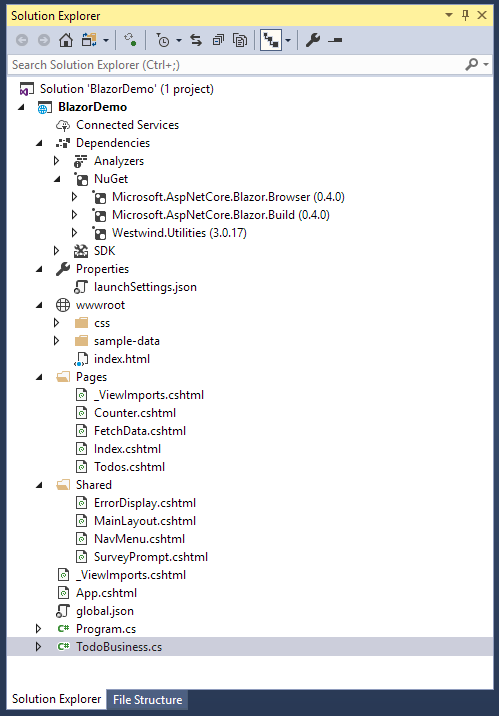
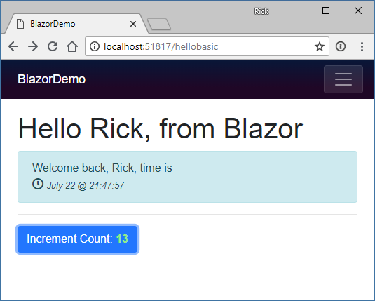
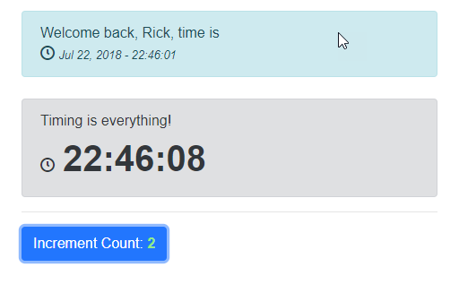
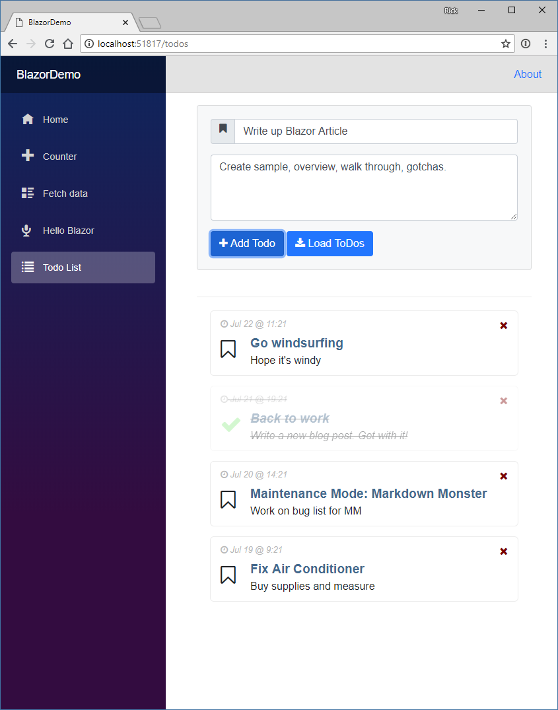
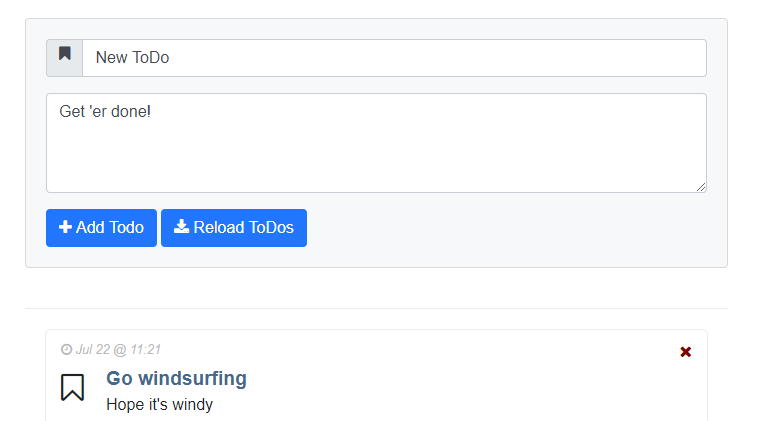

# Web Assembly and Blazor

The Web has been powered by a single language on the client since the very beginnings of the Web as a platform. JavaScript started as an overly simplified scripting language in the first Netscape browsers and slowly evolved over the years to become what is now the most widely used programming language anywhere. 

In recent years with the advent of ES2015 and later versions, and many infrastructure tools like Babel and WebPack, using JavaScript has become a much more capable language that has evolved into a complete platform that can handle even very large code bases. Unfortunately the complexity for the infrastructure too has increased with ever more crazy and byzantine build systems to build even simple applications. With JavaScript it seems the simpler the programming model gets, the more complex the build system and tooling becomes.

## Re-Assembly
There are a lot of developers that would much rather use something else - anything else - than JavaScript to build Web applications. I myself have made peace with JavaScript years ago, but while I use it daily and feel reasonably proficient with it, I would definitely welcome other options to build Web applications with.

I personally think that to be a platform on par with desktop or mobile OS's the browser shouldn't be tightly coupled to the JavaScript mono-culture. There should be a way that the runtime and programming environment can be defined at a lower level, just like other platforms so that many different languages and frameworks can be used. Wouldn't it be nice if there was a browser based assembly language that abstracts browser specific hardware and still is as close to the raw hardware as possible?

This isn't just about 'language' either. JavaScript's insane build structure required for all major frameworks these days is a crazy house of cards that seems to break anytime you step away for more than a few days. Other platforms have skinned that cat in other and potentially more efficient ways. 

### Web Assembly brings Language Choices
A relatively new technology called **Web Assembly** speaks to just that scenario. It has opened up the possibility to compile code that isn't necessarily JavaScript into low level byte code Web Assembly Modules (WASM) that Web Browsers can directly execute without having to parse a source file.

Web Assembly allows exploring alternatives to JavaScript syntax and different build processes, and that is something that has been sorely lacking in Web Development in the last 10+ years. Lack of alternatives is what has led us down this path of ever increasing complexity piling on more and abstractions and dependencies and Web Assembly hopefully will break this Stranglehold by providing different models to approach Web development. It opens the browser as a platform in ways that we probably haven't imagine yet.

Web Assembly is a parallel technology to JavaScript and exists side by side with the JavaScript runtime in the Web Browser VM. **Figure XX** shows how both JavaScript and Web Assembly are processed. Rather than parsing JavaScript into executble code, Web Assembly Modules (WASM) contain lower level assembly-language like intermediate code that can be produced by compilers of other languages. WASM code doesn't need to be parsed like JavaScript since it is already byte code that has resolved into execution ready byte code. WASM code can be expressed in text format and deals with instructions at the register, stack and memory level. This platform agnostic byte code is then compiled compiled into native code for the appropriate computer platform (x86 or ARM) and executed by on the specific  Browser platform. This can be advantageous for creating very high performance computational code which can be highly optimized for performance and can execute considerably faster than JavaScript code both in terms of loading and runtime execution.


<small>**Figure 1** - Web Assembly sits side by side with JavaScript </small>

### Blazor - One way to .NET on the Web
But even more interesting than performance is the possibility of using Web Assembly to bootstrap higher level runtimes that can then execute higher level languages like .NET code. This is exactly that Microsoft's **Blazor framework** takes. 

Blazor uses a **Mono** compiled version of the .NET Runtime compiled to a WASM module to execute .NET Standard modules as shown in **Figure XX**. `mono.wasm` is a browser customized version of the Mono .NET Runtime compiled to Web Assembly that allows for bootstrapping .NET Standard assemblies and executing of .NET code. 

Blazor then sits on top of the core runtime and implements the Razor engine used as an entry point to the .NET Code that can be processed inside of pages. You can do most of the things you normally do in .NET such as importing and referencing additional .NET Standard assemblies and instantiate classes and execute code in them.  


<small>**Figure 2** - How Blazor use the Mono Runtime to execute .NET Code. Browser APIs currently have to be accessed through JavaScript interop</small>

One thing that sticks out in this implementation is that rather than compiling every bit of .NET code your application runs to WASM, only the Mono Runtime is compiled as a WASM module. All the Blazor framework and your application code is loaded as plain old .NET assemblies that are executed through Mono.

This all sounds incredibly complicated, but from the developer perspective of building an application the process is actually super simple: You create Razor pages with C# code inside of it and it just works the way you would expect it to. You can reference your own or third party assemblies via NuGet and take advantage of a large chunk of .NET CLR functionality. It's pretty impressive to see this work.

### Caveat Emptor
But before we get swept away how cool the prospect of running .NET code in the Browser is: Blazor is still considered **in the prototype stage**. It works and the functionally shows a lot of promise, but there also a number of limitations in its current stage.

Blazor is a very specific use case, namely an HTML framework similar to something like Angular, Vue etc. for rendering Razor pages on the client side. It is **not** a generic engine to execute .NET code in the browser as the .NET code you execute is tightly coupled to the Blazor framework. There are ways to call .NET code from JavaScript directly, but you still need to have the Blazor bootstrapping in place in order for that to work. In other words you currently can't really separate Blazor from the raw .NET code execution. Don't confuse Blazor with a new Silverlight, as Blazor serves a completely different use case.

Currently there's a bit of overhead for all of this magic Blazor provides. You have to load a sizable WASM module, plus the JavaScript loader and interop handler code that has to be loaded into the browser for each page. These are not outrageously large especially when compared against full frameworks like Angular, Ember or Aurelia, but the payload is not small and has to be loaded on startup.

There are also limitations in Web Assembly that require quite a bit of JavaScript interop in order to access the DOM or other Web APIs as Web Assembly cannot access the DOM or APIs directly. Data support for parameters and return values is also limited to numbers and pointers at the moment, which requires additional conversion in order to pass strings and references between JavaScript and Web Assembly. Both of these issues have a negative impact on performance.

As a result, in these early versions of Blazor don't expect performance miracles or even performance that is on par with modern JavaScript frameworks. That will change as Web Assembly gets better DOM integration and type/reference support in the future and the Mono team continues to work on optimizing the WASM version of the Mono Runtime. There are also many optimizations that can be made in the Razor stack and with pre-rendering that are already being worked on in Blazor but aren't in the preview releases yet. 

It's too early for Blazor to be worrying about performance. At this point it's about proving this model as a viable platform for building complete Web applications and given this early stage the feature functionality is impressive even if performance is not yet.

The good news is that Blazor and Mono are changing quickly. The bad news is that Web Assembly is part of the W3C Spec process, so don't expect changes to come rapidly on that front. The needed improvements for DOM/API access and reference type support are being worked on but currently there's no official arrival date for these crucial feature that could improve performance significantly.

In short, it is very early days for both Web Assembly and Blazor and Microsoft explicitly states that Blazor is **not intended for production use!** It is very likely that a lot of the infrastructure and syntax is going to change significantly in the future. You've been warned...

## More Background on Web Assembly
The key to everything I've described above is executing non-JavaScript code in the browser is Web Assembly. Web Assembly is relatively new browser tech, but it's now supported in the latest versions of all major browsers as shown in **Figure XX**. It's notable that Internet Explorer is not supported by Web Assembly or Blazor at the moment.


**Figure XX** - Web Assembly Support in Web Browsers (source: [Mozilla MDN](https://developer.mozilla.org/en-US/docs/WebAssembly))

So what is Web Assembly? In simple terms Web Assembly provides a byte code level execution engine that can be targeted by compilers from other languages and so allows execution of non-JavaScript code.

### Byte Code Representation -  Native Execution
Web Assembly Modules (WASM) can be created by compilers that target a WASM output target. Today the most common WASM compilation platform is C/C++ using an Emscripten and an LLVM module that can output WASM byte code. There is also work in process with Mono to produce static Ahead of Time (AOT) compilation of .NET code to WASM although currently Blazor uses a different approach of use Mono as a hosted runtime via WASM to execute/interpret .NET code at runtime.

WASM modules consist of binary content called **Intermediate Representation** (IR) which is assembly-like byte code. This low level byte code is then loaded and compiled by the Web Assembly loader into processor specific native code that is executed by the Browser's VM. The IR code is not processor specific and it's the job of the Web Assembly engine to create the appropriate x86 or ARM native code for the specific Browser VM to execute.

WASM modules can be loaded from JavaScript in the browser using a set of WebAssembly APIs. Eventually the goal is to be able to load WASM modules using `<script src="myapp.wasm" type="module"></script>` syntax, with loaded module using the same module loader used by EcmaScript 2016 and later. For Blazor use this doesn't really matter as all the Web Assembly interaction is performed internally by the Blazor JavaScript framework that's responsible for loading the Mono WASM module and interactive with via JavaScript shims.

One of the original use cases for Web Assembly is to have high performance C++ built modules that can be called from JavaScript and execute many times faster than the same code in JavaScript. Performance is a good reason for Web Assembly, but another great use case is to build frameworks that can facilitate hosting of other language runtimes inside of the browser. Microsoft's **Blazor** using .NET is just one example of this using the Mono .NET runtime in the browser to allow loading and executing code in .NET Standard assemblies, but there are many other languages that are taking similar approaches (see https://github.com/appcypher/awesome-wasm-langs).

With the advent of WebAssembly the browser runtimes can now load and run two types of code — JavaScript and WebAssembly as side by side technologies.

### Web Assembly limitations
All this certainly sounds very promising, but Web Assembly is relatively new Browser technology and in its current state has a couple of big limitations.

* **No access To the HTML DOM and APIs**
Currently Web Assembly has no way to directly access the browser's DOM or APIs, so in order to interact with HTML page content, Canvas or any Browser API, Web assembly has to use interop with JavaScript. A function inside of WASM is essentially a self-contained block of code that is isolated from the environment it's hosted in. Think of it as a static function where all dependencies have to be passed in or maintained within the internal context. JavaScript Interop is required to access DOM and APIs.

* **Numeric Parameters and Return Values Only**
Web Assembly functions currently support only numeric types as parameters. There's no support for strings or references or any other non-numeric type. Any type of data has to be passed to Web Assembly functions via pointers to array buffers. In the real world this means a lot of serialization and copying of data has to be done to move data between JavaScript and Web Assembly.

While these issues are pretty major, they have (slow) workarounds with some extra code gymnastics and interop with JavaScript via shims. Both of these issues are abstracted and hidden by frameworks like Blazor as we'll see, but the interop performance tax is a real issue.

These issues are well known and will be fixed in future versions but for now current frameworks have to work around these issues.

## Blazor: Browser based Razor Pages
Blazor is a framework that sits on top of Web Assembly and gets its name from using **Razor** templates in the **Browser**. Behind the scenes Blazor uses a single Web Assembly module which is a WASM targeted version of the Mono .NET Runtime. Mono is a flavor of the .NET runtime that underlies the various Xamarin platforms as well as many flavors of Linux, Mac and small devices. WASM is yet another custom target for the Mono runtime that allows execution of .NET Standard assemblies and code. This Mono WASM version is customized and kept as small as possible for the browser environment. 

What this means is that once the Mono WASM module is loaded you can execute code in plain old .NET Standard 2.0 compatible assemblies directly inside of a browser. There's obviously a bit of setup required to bootstrap the runtime, and Blazor provides that bootstrapping mechanism in addition to the HTML framework using Razor Pages.

The Mono WASM module supports .NET Standard 2.0 where it makes sense but will throw **NotSupported** exceptions for features that don't work. I had no issue importing several of my own .NET Standard utility libraries from NuGet and accessing a number of utility methods from them in my Blazor code. How cool is that?

Blazor works by:

* Using a compiled Mono (Interpreted) .NET Runtime as a WASM module
* Using Mono to load standard .NET Assemblies
* Executing .NET code through the Mono Runtime
* Updating the Browser DOM via JavaScript interop
* Capturing JavaScript events and re-rendering based on DOM events

User code then executes based on these concepts:

* The Blazor framework is implemented in C# code
* All .NET Code is executed by the Mono Runtime
* User .NET Code is executed via Mono
* Razor Templates convert to .NET classes that execute via Mono

If you look at the output of a 'compiled' Blazor application as shown in **Figure XX** you'll see the `mono.wasm` module along with the `mono.js` loader. Neither of these files is  small


<small>**Figure XX** - Output from a Blazor project actually runs .NET Standard 2.0 assemblies</small>

Note that there are no `.cshtml` template files sent to the browser. All Razor pages, as well as any loose C# files you create to reference support classes and logic are compiled and shipped as code to the client in the `BlazorDemo.dll` file.

You can also see a `bin` folder with a bunch of core .NET Runtime assemblies are loaded alongside your user code (`BlazorDemo.dll` in **Figure XX**). 


<small>**Figure XX** - Network sizes for the Blazor runtime is not small but also not excessive</small>

Neither of these files are small so running a Blazor app will have at least a 800k payload at the moment plus any of the runtime and user code assemblies that your application creates.

### Blazor 101
In this article I'll keep my examples very simple to give you an idea how Blazor features work. This is more to get a feel for the overall concepts than the specific implementation details which are very likely to change as this technology is in its very early stages.

All the code I talk about here uses **Blazor 0.2**.

### What do you need?
To give Blazor you're going to need to install a couple of things:

* .NET Core 2.1 SDK
* Visual Studio 2017.7 + Blazor Language Service Extension
* Or you can use the `dotnet` command:

```csharp
dotnet new -i Microsoft.AspNetCore.Blazor.Templates
dotnet new blazor -o BlazorSample
cd BlazorSample
dotnet run
```

If you create a new project either in Visual Studio using the new .NET Core Blazor project template or using `dotnet new` you get a small sample project that has a couple of simple data pages that demonstrate simple bindings. I'll use this basic project and add some functionality to it to demonstrate some interesting things you can do.

You can find this very sample on Github at:

https://github.com/rickstrahl/Blazor_Playground

I also recommend you read the [Getting Started](https://blazor.net/docs/get-started.html) document which gives you a good starting point.

### ASP.NET Core by Default but not Required
The stock Blazor project runs as an ASP.NET Core project so you have a Web Server to run and test your application with locally. However, ASP.NET Core is not required to the final application. The final output from the Blazor is a Web HTML folder that contains the compiled binaries, WASM module, support script files plus any image, css, font etc. assets your application need.


When you open the default project in Visual Studio, **Figure XX** shows what it looks like.



<small>**Figure XX** - </small>

There's a lot to learn just from the project structure, which should look familiar if you've built an ASP.NET MVC application before. You have a `Pages` and `Shared` folder which hold the application's UI views and components. The files use the same Razor `.cshtml` format and are functionally very similar to MVC's version of Razor, but it's not the same. There are a number of differences. The key aspect of mixing code and HTML however remains, what's changed is mostly the directives that drive the application.


### Blazor is an HTML Framework
The first thing you need to understand is that Blazor is an HTML framework that's centered around Razor views which act as components. Like many other modern frameworks like Angular, React, Vue and so on, Blazor uses the concept of components that can be combined to build more complex components and each Razor View represents a component.

There are a few different types of components you can create:

* **@Page** - a routable page or sub-view
* **Layout** - a Layout page into which `@Body` content is loaded 
* **Component** - an embeddable component. Can also be used like a Partial

A `@Page` component as the name suggests is a component that acts as a top level component that is view or page and typically is associated with a route. 

At it's simplest you can create a new page like this:

```html
@page "/hellobasic"

<h1>Hello @name, from Blazor</h1>

@if (!string.IsNullOrEmpty(Name))
{
    <div class="alert alert-info">
        @SayHello(Name), time is<br/>
        <i class="oi oi-clock"></i>
        <small><i>@DateTime.Now.ToString("MMMM dd @ H:mm:ss")</i></small>
    </div>
}

@functions {    
    string name = "Rick";
    
    string SayHello(string name) {
        return $"Welcome back, {name}.
    }
}    
```

The output generated from this simplest of pages (along with an extra button for the next example) is shown in **Figure XX**.



<small>**Figure ** - A basic Razor Page executing on the client </small>

The `@Page` directive identifies the this View a as a page and you can specify a route on this directive. This maps to an Attribute route that is then recognized by the Blazor engine to access this page.

Razor Pages are made up of HTML templates mixed with C# code prefixed by `@`. You can use `@expression()` or embed full code blocks `@{ <code> }` just as you would expect from Razor in MVC or Pages. Additionally you can add a `@functions` section to the template that add allows adding of methods and properties that can then be referenced in the document.

The bindings on the page are 'live' and when a value is changed inside of code on the page the view is updated to reflect that. Change tracking kicks in when browser events fire - ie. when you click a button, press a key or any number of other events occur. You can attach event handlers to controls and these handlers and their handler invocation cause the UI to be refreshed.

### Event Handling
You can handle client side script events and route them to functions in your code.

```html
<button class="btn btn-primary" 
        onclick="@IncrementCount">
    Increment Count: 
    <b class="green-text">@currentCount</b>
</button>
 
 @functions {
     int currentCount
     ... 
     
     void IncrementCount() => currentCount++;
 }
 ```

This code adds a button with a click handler - `onclick="@IncrementCount"` - that updates the counter displayed on the button as shown in **Figure XX** above.

Note that you can map events simply by pointing at a handler with the proper signature which in case of the onclick handler is a method with `MouseEventArgs`. Alternately you can also directly handle an event inline with a `Action` instance. This is very useful because it allows you to reference in-scope variables for example inside of a loop structure:

```html
@foreach(var todoItem in todoItems) {
<div class="todo-item">
    <a onclick="@(()=>RemoveTodo(todoItem))">
       Remove
    </a>
</div>
}
```

### Non UI Events
Change tracking in Blazor is triggered by Browser DOM events, but sometimes you need to explicitly refresh the UI from code that triggers a change from within your .NET code. .NET can fire internal events and even run simulated multi-threading and timers.

In the example above you may notice that when you click the **Increment Count** button, not only does the Count on the button change, but also the date displayed in the alert box above updates which is sort of weird UI behavior. It updates only when you click. This because the UI basically re-renders on the button click event and the change in the value but it doesn't update when the time changes.

If I want the time to change each second I can use a timer in .NET and **force** a UI change by adding a timer that forces the UI to rebind:

```csharp
protected override Task OnInitAsync()
{
    var timer = new System.Timers.Timer();
    timer.Elapsed += (s,ev)=>this.StateHasChanged();
    timer.Interval = 1000;
    timer.Start();
    return base.OnInitAsync();
}
```

Blazor components contain life cycle events and `OnInitAsync()` is one that you can use to fire code when the component is first loaded. In this example, I set up a timer and simply fire it every second and explicitly for `this.StateHasChanged()` which forces the UI to refresh. This has the effect that the time displayed is now updated every second even when no browser event is fired.

> #### @icon-info-circle DateTime Format Issues
> Due to a bug in Mono, `DateTime` values in Blazor **always display as UTC** even when using `.ToLocalTime()`. The problem is that timezone handling in Mono is currently not working, but this bug will be fixed in future versions.

### Layout Page
You probably noticed that the Hello page shows more HTML layout than what this sample displays. This HTML is rendered as part of the Layout page.

The Layout page for the sample is very simple:

```html
@inherits BlazorLayoutComponent

<div class="sidebar">
    <NavMenu />
</div>

<div class="main">
    <div class="content px-4">
        @Body
    </div>
</div>
```

The key point in this layout are the `@inherits BlazorLayoutComponent` (likely to change) which identifies this as a Layout page, and the `@Body` directive which specifies where the content goes.

To use the Layout you can use the `@layout` directive either in a specific page or by a `_ViewImports.cshtml` file by specifying the layout page type. Note that this is different than MVC where you specify the view - here you specify the type name.

### Components
Notice the `<NavMenu>` tag in the Layout page above. That's actually a component that contains the HTML and hide and show logic to show the sidebar nav menu.

Components are the lowest level UI element in Blazor. Components are simply `.cshtml` file. Any .cshtml you create has a matching class and that class component becomes available as an HTML tag to pull in the component. So the `NavMenu.cshtml` page becomes a `<NavMenu>` component you can embed into another page or component.

Components are similar to MVC Partials, but they are much more powerful as you can pass values to the component. Inside of a component's implementation you can mark properties with a `[Parameter]` attribute that let the property access attribute values set on the host page/component. The values don't have to be strings - they can be any .NET value or reference which makes it very easy to pass data from parent to client.

Here's a simple component that takes the time display logic I showed in the Hello page and creates a compoennt from it:

```html
<div class="alert alert-secondary">
    <div>@Message</div>
    <i class="oi oi-clock"></i>&nbsp;
    <b style="font-size: 2.5em;">
        @Time.ToString(FormatString)
    </b>
</div>

@functions {
    [Parameter]
    string FormatString { get; set; } = "HH:mm:ss"; // Demonstrates how a parent component can supply parameters

    [Parameter]
    string Message { get; set; }

    DateTime Time { get; set; } = DateTime.Now;

    protected override Task OnInitAsync()
    {
        var timer = new System.Timers.Timer();
        timer.Elapsed += (s, ev) =>
        {
            Time = DateTime.Now;
            this.StateHasChanged();
        };
        timer.Interval = 1000;
        timer.Start();

        return base.OnInitAsync();
    }
}
```

This component abstracts the 1 second timer and the display logic for displaying the time component in the UI. To add the component to the page is very simple now:

```html
<TimeDisplayComponent 
    Message="Timing is everything!"
    FormatString="HH:mm:ss" />
```

Figure XX shows what it looks like added to the Hello page:



<small>**Figure XX** - The time component can update the UI independent of its parents</small>

I removed the host page's timer code, and now only the timer component's time value is updated which is why Figure XX shows two different times.

Components are very powerful and easily created so much like Partials in MVC you want to use components to isolate behavior into the the smallest manageable units to avoid creating monolithic pages or components. It's much better to break out functionality into smaller units of work that are easier to reason about.

### What's generated
If you want a look behind the scenes of how Blazor works at the .NET level you can peek into the client bin folder and check out your user assemblies. Razor views are compiled into code that holds both the static template content and the code for your embedded expressions, code blocks and `@function` directives. **Figure XX** shows the generated code for the HTML content of the template.


<small>**Figure XX** - Razor Components render HTML and code into C#</small>

## A simple Todo List
Lets go through another example that's a little more involved and deals with a little more data: The venerable ToDo list SPA sample. **Figure XX** shows the finished sample application:



<small>**Figure xx** - The ToDo samples demonstrates more of the .NET features</small>

### Client C# Business Logic
One of the really nice things in Blazor is that you can create standalone .NET classes that isolate your business logic. Plain classes that can even reference classes in other .NET Standard assemblies imported via Nuget.

I'm going to start with a pseudo business object, created in a separate class. I'll start out with static data, then later pull that same data from JSON data over the Web.


Let's start simple by creating a new `TodoBusiness.cs` class with a static list of `TodoItem` object, so I have something to display. **Listing XX** shows both the business and data clases:

```cs
namespace BlazorDemo
{

public class TodoBusiness
{
    public static List<TodoItem> Todos { get; set; } = new List<TodoItem> {
        new TodoItem { 
          Title = "Go windsurfing", 
          Description = "Hope it's windy" 
        },
        new TodoItem { 
            Title = "Back to work", 
            Description = "Write a new blog post. Get with it!" 
        },
        ...
    };
}    

public class TodoItem
{
    public DateTime Entered { get; set; }
    public string Title { get; set; }
    public string Description { get; set; }
    public bool Completed { get; set; }

    public TodoItem()
    {
        Entered = DateTime.Now;
    }
}

}
```

### Creating a Razor Page to display Todo Items
This hardcoded list of Todo Items gives us a list that we can work with to display the Todo item list. To do this, let's create a new Razor Page called `TodoItems.cshtml`. The tooling in Visual Studio currently doesn't work for this so the easiest is to simply copy one of the existing pages as shown in **Listing XX**.

```html
@page "/todos"

<link href="/css/todos.css" rel="stylesheet" />
<div class="container">
    <div class="todo-container">
        @foreach (var todo in 
                  todoItems.OrderByDescending(td => td.Entered))
        {
        <div class="todo-item @(todo.Completed ? "completed" : "")">
    
            <div class="pull-right">
                <i class="fa fa-remove"
                   onclick="@(()=> removeTodo(todo))"
                   style="color: darkred; cursor: pointer"></i>
            </div>
            
            <div class="todo-entered">
                <i class="fa fa-clock-o"></i> @(todo.Entered.ToString("MMM dd @ H:mm"))
            </div>
            
            <div class="pull-left" onclick="@(()=> toggleCompleted(todo) )">
                <i class="fa @(todo.Completed ? "fa-check green-text larger" : "fa-bookmark-o")"
                   style="cursor: pointer; font-size: 2em; margin-top:7px;">
                </i>
            </div>
    
            <div class="todo-content">
                <div class="todo-header">
                    @todo.Title
                </div>
                <div>
                    @todo.Description
                </div>
            </div>
        </div>
        }
    
    </div>
</div>
```

```cs
@functions {
    TodoItem activeTodo = new TodoItem();
    List<TodoItem> todoItems = new List<TodoItem>();
    
    protected override async Task OnInitAsync()
    {
        await loadTodos();
    }

    async Task loadTodos()
    {
        Console.WriteLine("Loading Todos");
        todoItems = TodoBusiness.Todos;
    }
    
    // Event handler has to match signature
    async Task reload(MouseEventArgs ev) => loadTodos();
}
```
<small>**Listing XX** - Looping through a list of Todo Items</small>

There's a lot happening in this code so lets break down some of the highlights. The core bit of code deals with displaying a list of items and the code uses `@foreach(var todo in todoItems)` to do it. Note that you can use LINQ to easily filter the list or order the list as I've done here for demonstration purposes. Normally I would put the filtering and order logic probably into the 'business' logic. More on that later.

The page contains properties that can be treated like the component's state. If you only have a couple of things you can store the state as properties here, or if you have a more complex it's probably a good idea to create a separate `TodoListModel` class and attach all the display state there.

I'm 'loading' the business objects in the `OnInitAysnc()` method which is fired when the component starts up. Note that the component stays loaded

Inside of the `foreach()` loop the `todo` object is in scope and can be used for other expressions to display things like `@todoItem.Title`. One of the nice things with Razor is that you also get to take advantage of the string formatting built into .NET, so you can format dates nicely like `todoItem.Entered.ToString("MMM dd, yy - HH:mm")` for example. These are things that are often a pain in JavaScript and provided by frameworks, but here it just comes naturally as part of the core .NET language which highlights one of the big plus points for using .NET in the first place. You have access to the core framework.

Even better: You can also add NuGet packages that support .NET Standard 2.0. For example, I can add my own `Westwind.Utilities` package to my project and then change the date display to:

```cs
@Westwind.Utilities.TimeUtils.FriendlyDate(todo.Entered, showTime: true)
```

to display something like Today @ 2:30pm.

### Formatting
One advantage of Razor is that it is fairly terse in allowing expressions. Coming from Angular I'm familiar with things like `ngClass` that lets you specify conditional JSON for classes to display. Frameworks like Angular use pseudo code to describe a number of 'command attributes' like `ngClass` to handle operations like this, but with Razor you can actually use real code. Remember that Razor pages are actually turned into compiled .NET class code so you can do something like this:

```html
<i class="fa @(todo.Completed ?
    "fa-check green-text larger" : 
    "fa-bookmark-o")"
```

to conditionally add CSS classes and styles. Maybe not quite as readable as `ngClass` but much more flexible because you are dealing with real code.

### Browser Event Handling
Blazor allows you to attach event handlers to browser events that it knows about. Currently a fixed list of events is used, but in the future you will be able to bind to any event including custom events raised from JavaScript or your Blazor components.

Events can be handled in two ways:

* Providing a Function Pointer (delegate)
* Providing an Action

The former looks like this:

```html
<button class="btn btn-primary"
        onclick="@reload">
    Load ToDos
</button>
```                

`reload` in this case is a method in the page that has to match a Mouse Event handler delegate:

```
async Task reload(MouseEventArgs ev) => loadTodos();
```

Alternately, you can also use an Action method directly attached to the event handler which allows you to pass any other context objects:

```html
<div class="pull-left" 
     onclick="@(()=>toggleCompleted(todo))">
```

Note that you can pass the proper context to the toggleCompleted method which can now be super simple:

```cs
void toggleCompleted(TodoItem todo)
{
    todo.Completed = !todo.Completed;
}
```    

Updating the `Completed` property updates the underlying `todoItem` and the event triggers a UI refresh so the page is immediately updated and the Todo item is displayed as a completed item with CSS styling applied for the `completed` CSS class.

Likewise to remove an item is as simple as passing

```html
<i class="fa fa-remove"
   onclick="@(() => removeTodo(todo))">
</i>
```    

and the corresponding handler method:

```cs
void removeTodo(TodoItem todo) =>
    todoItems.Remove(todo);
``` 

This behavior is very similar to the way frameworks like Angular work but it makes for a very easy way to work with events and pass proper context between components and event handlers.

### Handling User Input
Let's add the ability to add new Todo items to the list, which is also very easy to do. First lets add another property to our page called `activeTodo` which is the todo displayed in the editor:

```cs
TodoItem activeTodo = new TodoItem() {
    Title = "New ToDo", 
    Description = "Get 'er done!" 
};
```

The form in **Listing XX** above the Todo list can then display and add new items in an editable input. 

```html
<div class="card bg-light">
<form name="form1" id="form1">
    <div class="form-group">
        <div class="input-group">
            <span class="input-group-prepend">
                <i class="fa fa-bookmark input-group-text"></i>
            </span>
            <input type="text" class="form-control"
                   id="name" name="name"
                   bind="@activeTodo.Title"
                   placeholder="Enter the title for this ToDo"
                   required />
        </div>
    </div>

     <div class="form-group">
        <textarea class="form-control"
                  id="description" name="description"
                  style="height: 100px"
                  bind="activeTodo.Description"
                  minlength="10"
                  placeholder="Enter the description for this placeholder"
                  required></textarea>
    </div>

    <button class="btn btn-primary" type="button"
            onclick="@(() => addTodo(activeTodo) )">
        <i class="fa fa-plus"></i> Add Todo
    </button>
    <button class="btn btn-primary" type="button"
            onclick="@reload">
        <i class="fa fa-download"></i>
        Reload ToDos
    </button>
</form>
</div>
```    

**Figure XX** shows what this form looks like:


<small>**Figure XX** - Entering a new Todo item</small>

The key feature of the input form in **Listing XX** is the `bind=` directive in the input controls, which bind the text in the textbox to a model value. 

```html
<input id="name" required 
    bind="@activeTodo.Title"   />
```

As you enter a new value and move off the field the value updates the underlying `Title` property. Currently Blazor's binding features are limited and bind to specific properties, value and onchange for the `<input>` in this case. Work is underway to provide a more dynamic binding model that will let you bind to any DOM property and event.

### Reloading Todos from an Http Url
If you look at the `Reload` button on the sample, you'll note that currently reloading doesn't appear to be doing anything. That's because the Todo list is a static list of objects and reloading actually just re-assigns the same list of object. In other words, nothing really happensin the current code.

To make this mildly more interesting lets load the Todo items from a URL via HTTP. To do this I'll change the business object to use the `HttpClient` to retrieve todo items from a static URL on the site.

```cs
public class TodoBusiness
{
    public static List<TodoItem> Todos { get; set; } 
    private HttpClient _httpClient;

    public TodoBusiness(HttpClient httpClient)
    {
        _httpClient = httpClient;
    }

    public async Task<List<TodoItem>> LoadTodos()
    {            
        Todos = await _httpClient.GetJsonAsync<List<TodoItem>>("/sample-data/todos.json");            
        return Todos;         
    }
}
```

To use this class now in the Todo page component I have to make a few changes to ensure I can get access to the HttpClient instance.

I can use dependency injection to get a reusable instance of the HttpClient object with this directive:

```
@inject HttpClient Http
```

HttpClient is one of the default injected components available to inject into any page and component. To use the injected HttpClient I can now pass it into the `loadTodos()`:

```cs
// Important: List cannot be null!
List<TodoItem> todoItems = new List<TodoItem>();

protected override async Task OnInitAsync()
{
    await loadTodos();
}
async Task loadTodos()
{
    var busTodos = new TodoBusiness(Http);
    todoItems = await busTodos.LoadTodos();
}
```

With this code in place the Reload button now properly reloads the original set of todos from the server.

### Using Dependency Injection Instead
A better way to handle the `TodoBusiness` is by adding it to dependency injection during the browser application's startup:

```cs
static void Main(string[] args)
{
    var serviceProvider = new BrowserServiceProvider(services =>
    {
        services.AddTransient<TodoBusiness>();                
    });
    new BrowserRenderer(serviceProvider).AddComponent<App>("app");
}
```

This ensures that `HttpClient` is always passed to the constructor when injected. To inject the business object into the page and use it I can use:

```cs
@inject TodoBusiness TodoBusiness
```

and to use it:

```cs
async Task loadTodos()
{
    var busTodos = TodoBusiness;
    todoItems = await busTodos.LoadTodos();
}
```

### JavaScript Interop
The white elephant in the room with Blazor is: How do I interact directly with the browser if I can't do what I need to via Razor templates? Blazor is a self-contained framework that completely abstracts away the DOM from your code. You can use HTML templates, and Razor code, but that's as close as you can get to the raw DOM.

The idea of Blazor as it is with other frameworks is that you should be using the framework as much as possible to manage the UI and **not** resort to falling back to raw DOM updates. In this way the platform for rendering can potentially be changed without having to change your code. 

Nevertheless sometimes you will need to call back into JavaScript to accomplish some task in the browser or to access Browser APIs that aren't available to Razor. For this scenario there are interop helpers available that allow you to call into JavaScript from Blazor and call into Blazor from JavaScript. The former is likely the more common scenario, to affect changes in the DOM that can't be otherwise handled, but the reverse process is often required if you need to shuttle data backs from an asynchronous call to the .NET code.

This is a fairly involved topic that requires a bit of explanation and lots of little details that are too long to cover here, but I'll refer you to a great topic on the [Learn Blazor site](https://learn-blazor.com/architecture/interop/) which provides the basics and a more involved sample that uses these Reflection like APIs to do Interop. 

There's also an `Interop.cshtml` sample page and additional JavaScript code in `index.html` of the sample that you can play around with.

Keep in mind that this stuff in particular is very likely to change drastically as Web Assembly gains the ability to directly interact with the DOM. Once that's in place, it's very likely that Blazor will have high level DOM abstractions access the DOM and to provide an easier way to pass data back and forth.

* [JavaScript Interop on Learn Blazor](https://learn-blazor.com/architecture/interop/)


## Missing Pieces
Now that you've seen some of the promise that Blazor brings to using .NET in the Browser it's time to put on the brakes and point at some issues you need to deal with.

### It's a Prototype
I know I mentioned this before but the current releases of blazor are previews/prototypes/early alphas or whatever you want to call it. **It is not production code** and while Blazor is quite functional I really wouldn't recommend you start building anything production with it. **It will change** - drastically most likely. 

### No Debugging
Currently there's no support for debugging in Blazor meaning you can't start Visual Studio or VS Code and 'run' your application by stepping through. Remember this code runs in the browser through Web Assembly and you are running interpreted .NET code which is an extremely long dev pipeline with no help from the browser tools to provide tooling. 

Microsoft has indicated that this is a priority features and as I write this there have been a few Twitter posts from the usual suspects talking about early rough implementations of a .NET client side debugger. 

In the meantime you don't have a lot of options for runtime debugging of code. The best way I've found is to use `Console.WriteLine()`, which writes its output to the JavaScript browser console. Unfortunately you are limited to string values. You can't see full object dumps, but you can use `JsonUtils.Serialize()` to turn objects to string and dump them as JSON to the JavaScript console or the screen

### .NET Standard But Not All of it
So the WASM Mono implementation supports .NET Standard 2.0 and it will load and execute any assembly built to that. However, there are many things that .NET Standard does that simply don't work and so there are quite a few things that might throw `NotSupported` exceptions.

### Dates, Oh those JavaScript Dates
We all know that JavaScript dates suck and that's reflected in the Mono WASM module at the moment in that Dates seem to not work very well for many things. Currently dates are always in UTC format with no way in .NET to turn them into local dates. The real issue here is that TimezoneInfo is not working properly so everything related to TimeZone's isn't working.

This also has some side effects. For example I was trying to load JSON.NET to get formatted JSON output from my objects for debugging, but that failed due to some obscure date conversion errors. I had to stick with `JsonUtils.Serialize()` and unformatted output.

This is likely to get resolved in future versions, but it just demonstrates that this is preview software not ready for production.


### Web Assembly is not all about the DOM
It's important to understand that **Blazor is just one way to implement a framework on top of Web Assembly**. Blazor explicitly interacts with the HTML DOM to defer all of its rendering and event handling. However, this is not a requirement.

Because Web Assembly allows executing raw machine code inside of the Browser sandbox, it's possible to create entirely new applications that might not even use the HTML DOM at all. Final display output can be mapped directly to HTML Canvas or WebGL for example which is the most likely path that high performance and graphics intensive applications like games will take to produce high video frame-rate Web content. No DOM required.

This same approach also allows for completely separate layout engines that are not based on HTML. One could imagine for example a XAML based output engine that directly renders to screen which would be more akin to something like Silverlight. I can't imagine that Microsoft isn't thinking about something along these lines for making UWP or Xamarin Forms apps work in a platform independent way inside of the Browser.

In the future it's quite easy to imagine that this sort of low level interface might bring a new renaissance of new UI frameworks that aren't based around HTML based UI - for better or for worse. After all we've been stuck in the HTML centric mindset for well over 10 years now, and the slow progress on the HTML/CSS UI  front may drive innovation into different places given the opportunity of a new platform that gives many more options for generating output to the screen.

Another interesting alternative for .NET developers is [Ooui](https://github.com/praeclarum/Ooui). Ouii provides a WebSocket based communication framework that lets you programmatically define a UI and controls rendered and passing events back over a WebSocket connection. Ouii has UI models both for DOM based layout as well as a Xamarin forms based layout that renders into HTML.

## Where are we?
It's easy to get excited around this technology. Blazor's development model certainly feels very comfortable with a relatively small learning curve if you're already familiar with .NET and Razor.Even better it sidesteps all the JavaScript build framework craziness that goes along with HTML based frameworks like Angular, React, Vue and so on. Microsoft provides a fairly simple development environment where you compile and run, or publish with small set of compiled assemblies getting distributed.

There are also some downsides to this model. Everything that is in Razor templates is compiled C# code, meaning that in order to make even a minor change you have to recompile your application. This is no different than other frameworks like Angular, but it nevertheless makes this technology a two step process where compilation is required for any changes.

On the flip side using compiled .NET code that can take advantage of compile time validation of code, using rich tooling for project wide refactoring, and having nice integrated tooling and the ability to use standard .NET components opens up a world of possibilities that simply weren't an option before. Blazor templates work in Visual Studio and give you most of the development time support you're used to when building server side Razor applications.

On the flip side this is a framework from Microsoft. Microsoft has been known to try stuff and then abandon things. A framework like Blazor is also very likely to fight an adoption battle because it is a Microsoft product even if it is 100% open source. In my view, Microsoft has a commitment problem when it comes to client frameworks and Blazor very much needs a strong driving force to succeed both in terms of features and achieving 'hearts and minds'. But a lot has changed at Microsoft in recent years and time will tell how well they can build and support a client side product of this scope. 

It's also important to understand that for the most part this is **experimental software**. Vendors are still trying to figure out how to best integrate solutions like this into existing browser based UI. Web Assembly is still growing up and there are big holes in terms of JavaScript and DOM interactivity that Blazor relies on. Web Assembly is currently lacking the ability to directly access the DOM, so all rendering and event handling has to indirectly go through JavaScript. This means performance overhead, and maybe even more critically ugly and somewhat limited code in order for Web Assembly and JavaScript to talk to each other. Much of the interop is hidden internally in the Blazor framework, but at the edges if your code needs to interop - and it will - the code is pretty ugly.

These issues are well known and they are already on the list of things to be addressed in Web Assembly, but we are not there yet. What all this means is that any tool that uses Web Assembly is going to be a rapidly changing target. **Microsoft specifically says not to use Blazor for production projects**, but I'm sure some people will just ignore that and do it anyway. Just realize that features and APIs are bound to change drastically before it becomes a stable production ready tool if at all. There has been no definite confirmation on whether Blazor is headed to become a real supported product, although indications from Microsoft clearly indicate that they are serious of pursuing this avenue. 

There's huge potential to for this technology to have wide ranging effects on the Microsoft eco-system perhaps even providing a path to building cross-platform capable applications that can run on many platforms in the browser, on the desktop and on mobile.

We'll have to wait and see how that all turns out.

## Summary
It's really cool to finally see some real noise around Web Assembly that aims at breaking the JavaScript mono-culture in the Browser. Blazor certainly feels very comfortable to .NET developers and it gets a lot of things related to HTML frameworks right. In a lot of ways Blazor feel more natural than any of the other big frameworks. Part of this is the very code centric approach, the ability to use .NET classes **and** also pull in a lot of .NET Standard compliant code on the client side.

On the flip side, this technology is not anywhere near ready. There are big missing features in Web Assembly, which are going to take a while to get addressed and then take more time to actually make it into browsers. The good news is that most browser vendors are eager to make Web Assembly work, so once the specs are worked out and in recommendation stage, browsers are likely to be close behind with implementations.

Blazor too is still discovering what works and what doesn't and frankly Microsoft doesn't have a great track record with client side frameworks. The good news here is that Blazor is different in that it is not based around JavaScript and Microsoft can leverage their skill in building .NET based frameworks and awesome tooling with Blazor.Given the short time since it was initially announced and put out I'd say Blazor has come a long way and it's actually mostly functional. But it's definitely not ready to be used in production any time soon due to performance, missing features and a number of bugs in the runtime. It's just a matter of time before these issues are resolved, but it's a waiting game.

So as exciting as all of this new tech is, don't get too excited because I think it'll be quite a while before there's a stable and fully functional version of Blazor and Web Assembly that we can use in production. 

It's not quite time to throw out the JavaScript baby with the bathwater yet. But in the meantime we can think about the possibilities that Web Assembly and Blazor can deliver. Get involved, play with the technology, report bugs and help out with discussions about features that you think you need.


