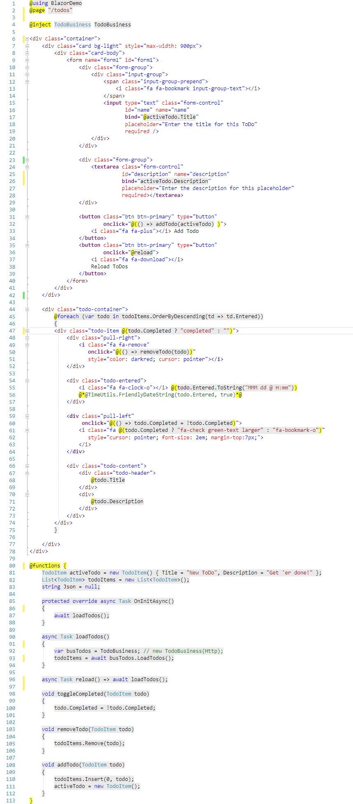
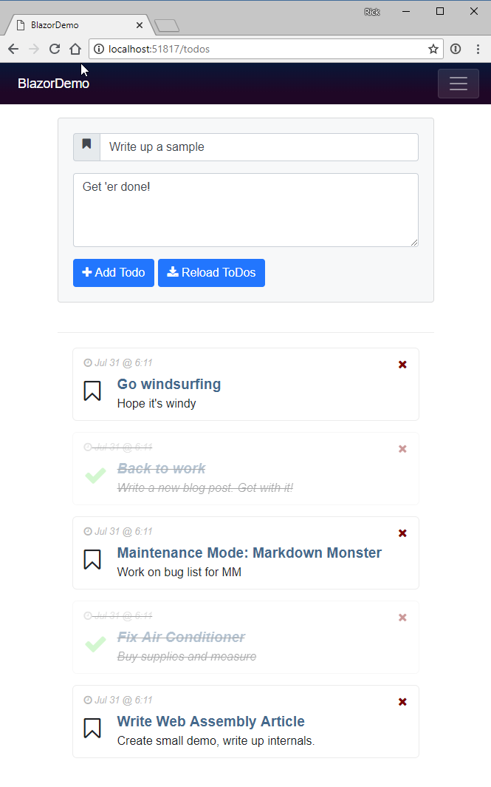

# Web Assembly and Blazor: Re-assembling the Web

 

<small>*this post contains contains a subset from the forthcoming [CoDe Magazine](https://code-magazine.com) article in the September/October issue*</small>

The Web has been powered by a single language on the client since the very beginnings of the Web as a platform. JavaScript started as an overly simplified scripting language in the first Netscape browsers and slowly evolved over the years to become what is now the most widely used programming language anywhere. A lot has changed and in recent years JavaScript has gotten a lot more powerful with many much needed improvements added in ES2015 and later, as well as improvements in build tools that have made it possible to build and manage even very large code bases.

Unfortunately this very same evolution also has resulted in an ever more complex build process and byzantine build systems. With JavaScript it seems the simpler the programming model gets, the more complex the build system and tooling becomes.

## Time out!
There are a lot of developers that would much rather use something else - anything else - than JavaScript to build Web applications. I myself have made peace with JavaScript years ago, but while I use it daily and feel reasonably proficient with it, I would definitely welcome other options to build Web applications with. It sure would be nice to break out of the JavaScript mono-culture that we've had in Web Development for the last 15+ years.

This isn't just about 'language' either. JavaScript's insane build systems required for all major frameworks these days is a house of cards that seems to break anytime you step away for more than a few days. Other platforms have skinned that cat in other and potentially more efficient ways that are easier and more integrated without the brittleness that seems to come part and parcel for JavaScript development.

##AD##

## Re-Assembling the Web
The emergence of **Web Assembly** is starting to bear fruit to change the JavaScript mono-culture. It has opened up the possibility to compile code that isn't necessarily JavaScript into low level byte code Web Assembly Modules (WASM) that Web Browsers can directly execute without having to parse a source file.

Web Assembly allows exploring alternatives to JavaScript syntax and different build processes. In my eyes, the lack of alternatives is what has led us down this path of ever increasing complexity and piling on more and more abstractions and dependencies. Web Assembly has the potential to break this stranglehold by providing different models to approach Web development. It opens the browser as a platform in ways that we probably haven't even imagined yet.

Web Assembly is a parallel technology to JavaScript and exists side by side with the JavaScript runtime in the Web Browser's Runtime. It also shares the Browser Sandbox's security context so unlike plug-ins of old, Web Assembly can't access computer hardware or OS features. Web Assembly **is not a new Silverlight** in that respect. Web Assembly relies on the same browser runtime that JavaScript relies on.  


<small>**Figure 1** - Web Assembly sits side by side with JavaScript </small>

**Figure 1** shows how both JavaScript and Web Assembly are processed. Rather than parsing JavaScript into executable code, **Web Assembly Modules (WASM)** contain lower level assembly-language like intermediate code that can be produced by compilers of other languages. WASM code doesn't need to be parsed like JavaScript since it is already byte code that has resolved into execution ready code. WASM is a binary code format that deals with instructions at the stack and memory level. Push things onto the stack, call an operation to perform an arithmetic operation or call a function pointer with the stack set to 'pass' values. It's **platform-agnostic byte code** that is then **compiled into native code** for the appropriate computer platform (x86 or ARM) and executed by the specific  Browser platform. This can be advantageous for creating very high performance computational code which is highly optimized for performance and can execute considerably faster than JavaScript both in terms of initial load time and runtime execution.

### Blazor: One way to .NET on the Web
But even more interesting than performance is the possibility of using Web Assembly to bootstrap higher level runtimes that can then execute higher level languages like .NET code. This is exactly the approach that Microsoft's **Blazor framework** takes.

Blazor uses a **Mono** compiled version of the .NET Runtime compiled to a WASM module to execute .NET Standard 2.0 code as shown in **Figure 2**. `mono.wasm` is a browser customized version of the Mono .NET Runtime compiled to Web Assembly WASM module that allows for bootstrapping .NET Standard assemblies and execution of .NET code. 

Blazor then sits on top of this core runtime and implements the Razor engine which is used as an entry point to the .NET Code that can be processed inside of Razor pages. In addition Blazor also supports **JavaScript -> .NET** and **.NET -> JavaScript** Interop by way of the Blazor JavaScript framework's system features.

Using the Mono + Blazor in this way you can do most of the things you normally do in .NET such as importing and referencing additional .NET Standard assemblies and instantiate classes and execute code in them.


<small>**Figure 2** - Blazor uses the Mono Runtime to execute .NET Code. Browser APIs currently have to be accessed through JavaScript interop.</small>

Currently Blazor uses Mono as an interpreter of .NET code which essentially allows loading and execution of .NET DLL assemblies. Rather than compiling every bit of .NET code your application runs to WASM, only the Mono Runtime is a pre-compiled WASM module. Mono then handles the execution of all .NET code loaded from these .NET Standard assemblies. 

This all sounds incredibly complicated, but from the developer perspective of building an application, the process is actually surprisingly simple: You create Razor pages and components with C# code inside of them and it just works the way you would expect it to.

Blazor hides the complexity of the runtime bootstrapping and .NET code execution, and provides a familiar .NET and Razor Pages like development experience that runs entirely inside of the Browser on the client side! You can even reference your own or third party assemblies via NuGet and take advantage of a large chunk of .NET CLR functionality. It's pretty impressive to see this work.

### Caveat Emptor
But before we get swept away by how cool the prospect of running .NET code in the Browser is: Blazor is still considered **in the experimental stage**. It works and the functionally shows a lot of promise, but there also a number of limitations in its current stage.

#### Blazor is an HTML Framework
Blazor is a very specific use case, namely an HTML framework similar to something like Angular, Vue etc. for rendering Razor pages on the client side. It is **not** a generic engine to execute .NET code in the browser as the .NET code you execute is tightly coupled to the Blazor framework. It's possible to do this via the Mono WASM runtime, but Blazor is not meant as a generic .NET Runtime Engine. It's an HTML framework and the runtime features exposed via JavaScript interop are more of a side effect required for the internals of the framework and special cases where you need to interact between JavaScript and .NET code.

#### Overhead
There's a overhead for all of this magic Blazor provides. You have to load a sizable WASM module, plus the JavaScript loader and interop handler code that has to be loaded into the browser for the application. These are not outrageously large especially when compared against full SPA frameworks like Angular, Ember or Aurelia, but the payload is not small and has to be loaded on startup. In my initial tests the simple sample app I'm loading here is loading ~1.1mb of code content on first load. Currently your Blazor app code compiles into a single assembly so you take a load hit for your entire app on startup. Startup speed currently is noticeably slow.

This is likely to change especially if the promise of Ahead of Time Compilation (AOT) comes to fruition which promises to compile only the code you actually reference into native WASM modules that are directly executed. This would likely use similar technnology as the CoreRT tree shaking compiler that can output just the code actually by the application both from the CLR and your user code which has to possibility to produce very small output. This is not new - JavaScript frameworks are doing this today via WebPack - but this is an important aspect for Web applications that have different load requirements than server or desktop applications.

#### Web Assembly Limitations
There are also limitations in Web Assembly. Web Assembly currently has no support for direct DOM and Browser API access. Instead WASM has to rely on JavaScript interop to update the DOM or any other Browser APIs like Canvas, SVG, WebGl or even built in APIs like History, Location, LocalStorage etc. All of these require JavaScript interop today, which again is not very fast in comparison to native WASM compiled code.

Data support for parameters and return values is also limited to numbers and pointers at the moment, which requires additional conversion in order to pass strings and references between JavaScript and Web Assembly. 

#### Performance
As a result, in these early versions of Blazor **don't expect performance miracles or even performance that is on par with modern JavaScript frameworks**. That will change as Web Assembly gets better DOM integration and type/reference support in the future and the Mono team continues to work on optimizing the WASM version of the Mono Runtime. There are also many optimizations that can be made in the Razor stack with pre-rendering that are already being worked on in Blazor but aren't in the preview releases yet. 

It's too early for Blazor to be worrying about performance. At this point it's about proving this model as a viable platform for building complete Web applications and given this early stage the feature functionality is impressive even if performance is not yet.

### Things they are a Changin'
The good news is that Blazor and Mono are changing quickly and we can expect rapid improvements on that front. Both the Mono and Blazor teams are doing amazing work making improvements and kicking the ball forward.

The bad news is that Web Assembly is part of the W3C Spec process, so don't expect changes to come rapidly on that front. The needed improvements for DOM/API access and reference type support are being worked on but currently there's no official arrival date for these crucial features that could improve performance significantly.

In short, it is very early days for both Web Assembly and Blazor and Microsoft explicitly states that **Blazor is not intended for production use yet!** It is very likely that a lot of the infrastructure and syntax is going to change significantly in the future. You've been warned...

##AD##

## Web Assembly
The key to everything I've described above is executing non-JavaScript code in the browser using Web Assembly. Web Assembly is relatively new browser tech, but it's now supported in the latest versions of all major browsers as shown in **Figure 3**. It's notable that Internet Explorer is not supported by Web Assembly or Blazor at the moment.


**Figure 3** - Web Assembly Support in Web Browsers (source: [Mozilla MDN](https://developer.mozilla.org/en-US/docs/WebAssembly))

Web Assembly in general has a fallback mechanism via an `asm.js` polyfill which essentially allows WASM module execution via a code based compiler and execution engine. Via browser feature detection code can switch between the asm.js based execution vs native Web Assembly execution. Blazor will support this, but currently it appears to not work as I wasn't able to get IE to run my sample app.

### Byte Code Representation -  Native Execution
Web Assembly Modules (WASM) can be created by compilers that target a WASM output target. Today the most common WASM compilation platform is C/C++ using an Emscripten and an LLVM processor that can output WASM byte code. Other languges are supported and .NET is among them currently via Mono. Blazor uses a Mono Interpreter implementation that loads standard .NET DLLs in the browser and executes them at runtime interpreted mode. There is also work in process with Mono to produce static Ahead of Time (AOT) compilation of .NET code to WASM although currently Blazor uses a different approach of use Mono as a hosted runtime via WASM to execute/interpret .NET code at runtime.

WASM modules consist of binary content called **Intermediate Representation** (IR) which is assembly-like byte code. This low level byte code is then loaded and compiled by the Web Assembly loader into processor specific native code that is executed by the Browser's VM. The IR code is processor-agnostic and it's the job of the Web Assembly engine to create the appropriate x86 or ARM native code for the specific Browser VM to execute.

WASM modules can be loaded from JavaScript in the browser using a set of WebAssembly specific APIs. Eventually the goal is to be able to load WASM modules using `<script src="myapp.wasm" type="module"></script>` syntax, with loaded module using the same module loader used by EcmaScript 2016 and later and providing exports for functionality exposed in the module. For Blazor use this doesn't really matter as all the Web Assembly interaction is performed internally by the Blazor JavaScript framework that's responsible for loading the Mono WASM module and interactive with via JavaScript shims. Your Blazor application code doesn't touch Web Assembly directly.

One of the original use cases for Web Assembly is to have high performance C++ built modules that can be called from JavaScript and execute many times faster than the same code in JavaScript. Performance is a good reason for Web Assembly, but another great use case is to build frameworks that can facilitate hosting of other language runtimes inside of the browser. **Blazor** use of .NET is just one example of this using the Mono .NET runtime in the browser to allow loading and executing code in .NET Standard assemblies, but there are many other languages that are taking similar approaches (see https://github.com/appcypher/awesome-wasm-langs).

With the advent of WebAssembly the browser runtimes can now load and run two types of code — JavaScript and WebAssembly as side by side technologies.

### Web Assembly limitations
All this certainly sounds very promising, but Web Assembly is relatively new Browser technology and in its current state has a couple of big limitations.

* **No access To the HTML DOM and APIs**
Currently Web Assembly has no way to directly access the browser's DOM or APIs, so in order to interact with HTML page content, Canvas or any Browser API, Web assembly has to use interop with JavaScript. A function inside of WASM is essentially a self-contained block of code that is isolated from the environment it's hosted in. Think of it as a static function where all dependencies have to be passed in or maintained within the internal context. JavaScript Interop is required to access DOM and APIs.

* **Numeric Parameters and Return Values Only**
Web Assembly functions currently support only numeric types as parameters. There's no support for strings or references or any other non-numeric type. Any type of data has to be passed to Web Assembly functions via pointers to array buffers. In the real world this means a lot of serialization and copying of data has to be done to move data between JavaScript and Web Assembly.

While these issues are pretty major, they have (slow) workarounds with some extra code gymnastics and interop with JavaScript via shims. Both of these issues are abstracted and hidden by frameworks like Blazor, but the interop performance tax is a real issue.

These issues are well known and will be addressed in future versions of Web Assembly but for now current frameworks have to work around these issues by using JavaScript interop and type conversions.

## Blazor: Browser based Razor Pages
Blazor is a framework that sits on top of Web Assembly and gets its name from using **Razor** templates in the **Browser**. Behind the scenes Blazor uses a single Web Assembly module which is a WASM targeted version of the Mono .NET Runtime. Mono is a flavor of the .NET runtime that underlies the various Xamarin platforms as well as many flavors of Linux, Mac and small devices. WASM is yet another custom target for the Mono runtime that allows execution of .NET Standard 2.0 assemblies and code. This Mono WASM version is customized and kept as small as possible for the browser environment. 

It's important to understand that Mono leverages the browser runtime to provide the .NET runtime functionality. What this means is that many of the things that are painful in JavaScript like dates and floating point only math aren't magically 'fixed' by running .NET. Under the covers Mono uses the same runtime and so has to work with those same core limitations to build on top of.

Blazor is bootstrapped as part of a main component - `<app>` typically - which is embedded into a launch page similar to the way you do in a framework like Angular. A Blazor app has a `Main()` function and `Startup()` method, very much like an ASP.NET Core app to configure Dependency Injection Services and configure the startup environment which is fired when that initial `<app>` model is loaded into an HTML page.

One thing to understand is that Blazor is first and foremost an HTML framework not a generic .NET execution engine. The core feature of Blazor is a component based HTML framework somewhat akin to JavaScript frameworks like Angular, Aurelia, Ember and so on. Blazor provides a familiar .NET experience for building Razor pages. Like Razor on the server, Blazor pages are parsed into C# classes that are executed by the Mono runtime. 

Although Blazor is closely tied to this Razor model of operation, those Razor HTML template components can then reference other .NET code from loose classes you create as part of the project, or from assemblies in other projects in your solution or from assemblies in NuGet packages you add to your application. What this means it's quite easy to break out business logic into separate classes, projects or NuGet packages that can be referenced from Razor pages. Because you can import .NET Standard 2.0 assemblies and NuGet packages it's also quite possible to share the same code on both the client and server. For example, it would be quite useful to have business validation logic that can be executed both on the server **and** client.

In a nutshell: Blazor makes it possible to execute .NET code in the browser, in much the same way you'd expect it to if you were building other .NET type application.

### Behind the Scenes
Behind the scenes **uses** the Mono .NET Runtime, to execute the code that is responsible for running the Blazor .NET framework. This framework knows how to parse Razor pages into C# classes, compile and execute them. Those classes then can reference other C# code which can live in loose .NET code files or .NET Assemblies or NuGet packages.

If this sounds just like server side MVC or Razor Pages you are getting the idea. Blazor uses many of the exact same concepts that MVC and Razor Pages use, although the Blazor syntax for various Razor `@` keywords are a little different. I find the disparity a little puzzling and a case of "just 'cause", but it's a relatively minor thing on the grand scale of things.

Blazor bootstraps .NET (Mono)  as part of the first Razor component (`<app>` typically) that is created. Once inside of a component Razor and C# code is used to execute code and bring in dependencies like classes and code from other .NET Standard assemblies via NuGet.

### What does a Blazor look like?
This post isn't about how Blazor pages work so I won't go into detail - I'll cover that in the CoDe article - but I want to show a few small examples that demonstrate what the code looks like for reference here.

The following is a sample Razor page that displays a Todo list along with an entry form to add new Todo items:



It looks something like this when it runs:



Let's go over the key features in the Razor page:

#### Well known Razor Syntax
A Razor Page is a special kind of top level component that can have an associated route as indicated by the `@page "/todo"` header. This page also renders into a **Layout** page, which is configured in `_ViewImports.cshtml` and specifies via `@layout MainLayout` which in turn points at `MainLayout.cshtml`. The layout page contains the base HTML header and page chrome. This should be familiar if you've used Razor before with MVC or Razor Pages.

#### Blazor Pages are Classes of IComponent
Blazor Razor Pages implement IComponent and inherit from base constructs in the Blazor framework. So Page has a `.Layout` property  which unlike its Razor server counterpart excepts a type rather than a view path.

As you can see inside the page code, you can use Razor `@expression` and `@{<code block}` syntax to execute C# code inline of the Razor template. There's also a `@function{ }` block that allows adding of properties, fields, events and methods to the class as the class header.

At the end of the day, Razor templates represent **C# code** - Blazor compiles Razor components into a class that contains both the static HTML and the embedded C# code. A component is rendered when the component is instantiated or when values change and the component needs to be refreshed. In this case the page is executed and the expressions and code blocks let you use the full power of C# and any available classes and components you create or import into your Blazor project.

#### Input Data Binding
For input fields you can use a `bind=` clause to two-way bind a component/model value to the form control. Currently binding maps to a particular attribute - `value` for text boxes and textareas, `checked` for checkboxes and radios, `selectedIndex` for select tags and so on. In the future Blazor will allow binding directives that allow binding to any control attributes and events using `binding-<property>` syntax.

#### Events
Events can be bound in two ways: Via event delegates that have to match an explicit signature or via Action delegates that allow you to pass in scope values to the handler. Because you can use inline C# code in Razor you can do things like this easily:

```html
<div onclick="@(() => removeTodo(todo)")
```

or even more direct code:

```html
<div onclick="@(() => todo.Completed = !todo.Completed)">
```

#### List Iteration
Iteration can be easily handled with standard C# code and `@foreach(){ ... }` and you can use the full power of C# code here including LINQ to filter the list of items.

#### Databinding Refreshes
Blazor provides automatic databinding so when values in the component change the rendered output is updated. Change detection works of the standard Browser event cycle, so when known events occur Blazor checks to see if values have changed and re-render the view.

#### External Classes
Another thing to notice is that this code uses an external "business" object `TodoBusiness`. This very simple business object defines logic to load the initial list of Todo's from an HTTP url, and the code is implemented in a separate class in the project. 

```cs
public class TodoBusiness
{
    public static List<TodoItem> Todos { get; set; }
    
    private HttpClient _httpClient;

    public TodoBusiness(HttpClient httpClient)
    {
        _httpClient = httpClient;
    }
    
    public async Task<List<TodoItem>> LoadTodos()
    {            
        Todos = await _httpClient.GetJsonAsync<List<TodoItem>>("/sample-data/todos.json");            
        return Todos;         
    }
}
```

#### Dependency Injection
Blazor supports dependency injection and just like ASP.NET code I can set up DI to have this object injected:

```cs
public void ConfigureServices(IServiceCollection services)
{
    services.AddTransient<TodoBusiness>();
}
```

and then inject an instance into my `@page` component.

```
@inject TodoBusiness TodoBusiness
```

which makes the TodoBusiness object available in the @page code:

```cs
todoItems = await TodoBusiness.LoadTodos();
```

#### Accessing NuGet Packages
I can also import NuGet packages and use functionality in imported classes. For example, I imported [Westwind.Utilities](https://www.nuget.org/packages/Westwind.Utilities/) and then used 

```cs
@Westwind.Utilities.TimeUtils.FriendlyDateString(todo.Entered, showTime: true)
````

This is just a few of the features that Blazor provides, but even from this limited sampling you can probably see that Blazor looks very similar feels very natural compared to its server based Razor brethen.

##AD##

### How Blazor Works
Blazor works by:

* Using a compiled Mono (Interpreted) .NET Runtime as a WASM module
* Using Mono to load standard .NET Assemblies
* Executing .NET code through the Mono Runtime
* Updating the Browser DOM via JavaScript interop
* Capturing JavaScript events and re-rendering based on DOM events

User code then executes based on these concepts:

* The Blazor framework is implemented in C# code
* All .NET Code is executed by the Mono Runtime
* User .NET Code is executed via Mono
* Razor Templates convert to .NET classes that execute via Mono

If you look at the output of a 'compiled' Blazor application as shown in **Figure 4** you'll see the `mono.wasm` module along with the `mono.js` loader. There's also `blazor.js` that is the boot loader for mono and that provides all the interop features required to interact with the DOM.


<small>**Figure 4** - Output from a Blazor project actually laods and runs .NET Standard 2.0 assemblies</small>

Note that there are no `.cshtml` template files sent to the browser. All Razor pages, as well as any loose C# files you create to reference support classes and logic are **compiled into** the `BlazorDemo.dll` file that is downloaded to the client.

You can also see a `bin` folder with a bunch of core .NET Runtime assemblies are loaded alongside your user code (`BlazorDemo.dll` in **Figure 5**). 


<small>**Figure 5** - Network sizes for the Blazor runtime is not small but also not excessive</small>

None of these files are small so running a Blazor app will have at least a 1mb payload at the moment plus any of the runtime and user code assemblies that your application creates.

### What's generated
If you want a look behind the scenes of how Blazor works at the .NET level you can peek into the client bin folder and check out your application's assembly - BlazorDemo.dll in this case. Razor views are compiled into code that holds both the static template content and the code for your embedded expressions, code blocks and `@function` directives. **Figure 6** shows the generated code for the HTML content of the template.


<small>**Figure 6** - Razor Components render HTML and code into C#</small>

## Missing Pieces
Now that you've seen some of the promise that Blazor brings to using .NET in the Browser it's time to put on the brakes and point at some issues you need to deal with.

### It's Experimental
I know I mentioned this before but the current releases of Blazor are previews/prototypes/early alphas or whatever you want to call it. **It is not production code** and while Blazor is quite functional I really wouldn't recommend you start building anything production with it. **It will change** - drastically most likely. 

### No Debugging
Currently there's no support for debugging in Blazor meaning you can't start Visual Studio or VS Code and 'run' your application by stepping through. Remember this code runs in the browser through Web Assembly and you are running interpreted .NET code which is an extremely long dev pipeline with no help from the browser tools to provide tooling. 

Microsoft has indicated that this is a priority features and as I write this there have been a few Twitter posts from the usual suspects talking about early rough implementations of a .NET client side debugger. 

In the meantime you don't have a lot of options for runtime debugging of code. The best way I've found is to use `Console.WriteLine()`, which writes its output to the JavaScript browser console. Unfortunately you are limited to string values. You can't see full object dumps, but you can use `JsonUtils.Serialize()` to turn objects to string and dump them as JSON to the JavaScript console or the screen

### .NET Standard But Not All of it
So the WASM Mono implementation supports .NET Standard 2.0 and it will load and execute any assembly built to that. However, there are things that .NET Standard 2.0 supports that simply don't work and so there are quite a few things that might throw `NotSupported` exceptions. 

Some examples: Pinvoking a native call clearly is not going to work in the browser, even if you are running on Windows. File system operations are another example since the browser effectively has no real file system. 

### Dates, Oh those JavaScript Dates
We all know that JavaScript dates suck and that's reflected in the Mono WASM module at the moment in that Dates seem to not work very well. Currently dates are always in UTC format with no easy way in .NET code to turn them into local dates. The real issue here is that `TimezoneInfo` is not working properly so everything related to TimeZone's including date display isn't working properly as a result.

This also has some side effects. For example I was trying to load JSON.NET to get formatted JSON output from my objects for debugging, but that failed due to some obscure date conversion errors. I had to stick with `JsonUtils.Serialize()` and unformatted output.

This is likely to get resolved in future versions, but it just demonstrates that this is preview software not ready for production.

## Web Assembly is not all about the DOM
It's important to understand that **Blazor is just one way to implement a framework on top of Web Assembly**. Blazor explicitly interacts with the HTML DOM to defer all of its rendering and event handling. However, this is not a requirement.

Because Web Assembly allows executing raw machine code inside of the Browser sandbox, it's possible to create entirely new applications that might not even use the HTML DOM at all. Final display output can be mapped directly to HTML Canvas or WebGL for example which is the most likely path that high performance and graphics intensive applications like games will take to produce high video frame-rate Web content. No DOM required.

This same approach also allows for completely separate layout engines that are not based on HTML. One could imagine for example a XAML based output engine that directly renders to screen coordinates on the Canvas rather than the DOM,  which would be more akin to something like Silverlight. I can't imagine that Microsoft isn't thinking about something along these lines for making UWP or Xamarin Forms apps work in a platform independent way inside of the Browser.

In the future it's quite easy to imagine that this sort of low level interface might bring a new renaissance of new UI frameworks that aren't based around HTML based UI - for better or for worse. We've been stuck in the HTML centric mindset for well over 10 years now, and the **painfully slow progress** on the HTML/CSS UI front may drive innovation into different directions given a new high performance platform that providers for alternate output generation techniques and layout systems. 

There are already other .NET based alternatives to Blazor that provide some ideas:

* [Ooui](https://github.com/praeclarum/Ooui)  
Ouii provides a WebSocket based communication framework that lets you programmatically define a UI and controls rendered and passing events back over a WebSocket connection. Ouii has UI models both for DOM based layout as well as a Xamarin forms based layout that renders into HTML.

* [Uno](https://github.com/nventive/Uno)  
Uno is XAML based implementation that attempts to bring UWP application rendered into browser by mapping XAML code into HTML.

These solutions work by mapping various desktop based layout engines to HTML which frankly removes some of the real benefits that XAML provides which is its rich stylable layout engine.  I think the real bang for the buck in the future may come from completely new layout engines that bypass HTML/CSS and  directly write to Canvas to display output. We shall see where this leads us.

## Where are we?
So, it's easy to get excited around this technology. Blazor's development model certainly feels very comfortable with a relatively small learning curve if you're already familiar with .NET and Razor.

#### Downsides
There are also some downsides to this model though. Everything that is in Razor templates is compiled C# code, meaning that in order to make even a minor change you have to recompile your application. This is no different than other frameworks like Angular, but it nevertheless makes this technology a two step process where compilation is required for any changes. Currently there's no live reload functionality and you have to manually recompile non-Razor code while Razor code can auto-recompile on page refreshes. 

#### Great Tooling out of the Gate
On the flip side using compiled .NET code that can take advantage of compile time validation of code, using rich tooling for project wide refactoring, and having nice integrated tooling and the ability to use standard .NET components opens up a world of possibilities that simply weren't an option before. 

Blazor templates work in Visual Studio and give you most of the development time support you're used to when building server side Razor applications. Support for other editors is not there yet (specifically VS Code), but is a stated priority to get better support on that front.

#### Web Assembly Growing Pains
It's also important to understand that for the most part this is **experimental software**. Vendors are still trying to figure out how to best integrate solutions like this into existing browser based UI. Web Assembly is still growing up and there are big holes in terms of JavaScript and DOM interactivity that Blazor relies on. Web Assembly is currently lacking the ability to directly access the DOM, so all rendering and event handling has to indirectly go through JavaScript. This means performance overhead, and maybe even more critically ugly and somewhat limited code in order for Web Assembly and JavaScript to talk to each other. Much of the interop is hidden internally in the Blazor framework, but at the edges if your code needs to interop - and it will - the code is pretty ugly.

These issues are well known and they are already on the list of things to be addressed in Web Assembly, but we are not there yet. 

## Is this Viable?
The big question that I think we all have to ask is this: Is using something other than JavaScript a viable alternative to established frameworks? Does Blazor actually solve a problem that needs to be solved? After all there are tons of sophisticated and powerful JavaScript frameworks out there already and you can build large applications with them.

I was pretty cynical going into playing with Blazor for a number of reasons. The main concern  was that if you need to interop with JavaScript or the DOM directly, it's very likely that that interface is going to be pretty ugly. And it seems pretty likely that most serious Web Applications have to do this at some point to integrate with specific components.

### Blazor is a Web SPA framework
As it turns out, Blazor can go a long way without requiring you to have to go 'outside' of the box. For application related features and typical UI components Blazor can easily work without requiring anything external to interface with. There is JavaScript interop support, so it is also possible to interact with external JavaScript/HTML components if you need them, but that process is frankly quite ugly and for the most part should be avoided.

Building Razor components is also very, very easy and intuitive so it's easy to build functionality on your own, or in short order find examples of others who end up building easily resuable components. This is going to take time but if Blazor as a platform moves forward I'm certain that tons of components will follow very quickly.

After playing with Blazor for a bit, it's really easy to get hooked. Working in .NET using the Visual Studio language tooling, using the terse but readable Razor syntax with raw C# code, just makes things considerably easier than any JavaScript framework I've ever used. Of course I'm somewhat biased, but at the same time I have spent the last 10 years working in JavaScript as well as .NET.

I obviously haven't built anything of substance, but building small components and support classes is quick and easy using standard .NET IDE tooling. No need for a CLI to provide you with templated output - just create files and go. It all feels so much easier and more natural than the JavaScript complexity that I've been dealing with in the last few years.

### Web Infrastructure - Can you get away from it?
In the commments a number of people (especially the [first comment from Muhammed](https://weblog.west-wind.com/posts/2018/Jul/31/Web-Assembly-and-Blazor-Reassembling-the-Web#880383)) raised the valid point that you can't easily get away from the Web support infrastructure that is entirely built on NPM tooling.

Even if you can get away from coding in JavaScript with Blazor and you can use C# and Razor you want to use, you still end up having to run much of the support tooling using NPM and the rest of the build infrastructure. If you need Sass, CSS and HTML compression, PWA support and so many other tools that are available you still end up depending on NPM and likely a massive pile of support packages. 

It's very unlikely that Microsoft can or would replace that part of the Web which makes up a lot of the client side development pain.

### Build without Fear
That said, the build process feels much simpler and more robust. I've really struggled with JavaScript's build systems primarily because there's so much shit getting loaded that I have no control over and no idea what it even does. With Blazor there are a handful of system dependencies at runtime and a standard SDK to build my project - nothing else. I don't have to worry about 100's of thousands of NPM dependencies or 100+ megs of support files per project and a aberrant version breaking the entire build.  Runtime size of the .NET code isn't small but compared to most other major frameworks it's not overly huge either. And this is of course before any sort of optimization process or AOT compilation has been applied by Blazor in its current experimental stage. 


### Integration
But perhaps the biggest kicker for me is the fact that I can actually reuse most of my existing support code I've built in .NET and import it via .NET Standard 2.0 assemblies and NuGet packages. That opens up a huge feature set of support functionality that doesn't have to be reinvented.  And I can use my own utility libraries as is or perhaps create new versions that drop dependencies for those things that are irrelevant in Web Assembly. 

So, yes I'm quite excited of where this technology is taking us. At the same time though I realize that it's not going to happen quickly. I think a lot of things are required to make Web Assembly and Blazor a real contender with the big frameworks in the JavaScript space. It'll take time...

### Microsoft vs. Microsoft
Another thing to consider here is viability in comparison to other frameworks and tooling and what is considered Web development proper today. Web Assembly is very disruptive in that it can potentially shatter the single development model that we've been dealing with for years. It means more choices, but that also means more decisions to make on what tools to choose in the future. It's potentially making an already fragmented development model even more fragmented. Is that something we really want?

In addition, Blazor is a framework from Microsoft. Microsoft has been known to try new stuff and then abandon it. A framework like Blazor is also very likely to fight an adoption battle because it’s a Microsoft product, **even if it is 100% open source**. 

In my view, Microsoft has had a commitment problem in the past when it comes to client frameworks both on the desktop and certainly in the browser. In the browser Microsoft has usually played catch up. But Blazor offers a unique opportunity to actually be up on the competition and I think for once this platform and the fact that Microsoft can leverage an existing .NET eco-system actually could work to their advantage.

Blazor very much needs a strong driving force to succeed both in terms of features and achieving critical mass to become a challenger to the status quo JavaScript frameworks that exist today. Without a significant push towards wide adoption, this technology is a potential dead end. I've already seen many very negative comments from outside of the .NET community disparaging this effort, most of which is based on bad assumptions. Nevertheless, perception is important and Microsoft and the .NET community in general has to make an effort to bring this disruptive technology into the mainstream in order for it to succeed. As a niche product it's almost certainly bound to wither and die a slow and painful death.

As I mentioned I was skeptical about Blazor, but I found it to be a joy to work with both in terms of actual language and execution and maybe even more so because the tooling is so relatively simple compared to what you have to deal with in the JavaScript world. But this will be a much, much harder sell for developers that are not already familiar with the .NET stack. In order to overcome that, Blazor will have to be an absolute top notch solution both for runtime implementation and developer tooling.

But... no pressure guys :-) 

## Summary
It's really cool to finally see some real noise around Web Assembly that aims at breaking the JavaScript mono-culture in the Browser. Blazor certainly feels very comfortable to .NET developers and it gets a lot of things related to HTML frameworks right. In a lot of ways Blazor feel more natural than any of the other big frameworks. Part of this is the very code centric approach, the ability to use .NET classes **and** also pull in a lot of .NET Standard compliant code on the client side.

On the flip side, this technology is not anywhere near ready. There are big missing features in Web Assembly, which are going to take a while to get addressed and then take more time to actually make it into browsers. The good news is that most browser vendors are eager to make Web Assembly work, so once the specs are worked out and in recommendation stage, browsers are likely to be close behind with implementations.

Blazor too is still discovering what works and what doesn't and frankly Microsoft doesn't have a great track record with client side frameworks. The good news here is that Blazor is different in that it is not based around JavaScript, and Microsoft can leverage years of .NET language and tooling experience to build a better mouse trap with Blazor. I was skeptical of the whole concept, but after playing with Blazor for a bit, I have to say I **really like** this model of building Web code. It just makes sense - but then I'm biased as a .NET developer.

But as exciting as all of this new tech is, don't get too excited because I think it'll be quite a while before there's a stable and fully functional version of Blazor and Web Assembly that we can use in production. 

It's not quite time to throw out the JavaScript baby with the bathwater yet. But in the meantime we can think about the possibilities that Web Assembly and Blazor can deliver. Get involved, play with the technology, report bugs and help out with discussions about features that you think you need.

<div style="margin-top: 30px;font-size: 0.8em;
            border-top: 1px solid #eee;padding-top: 8px;">
    
    this post created and published with 
    <a href="https://markdownmonster.west-wind.com" 
       target="top">Markdown Monster</a> 
</div>