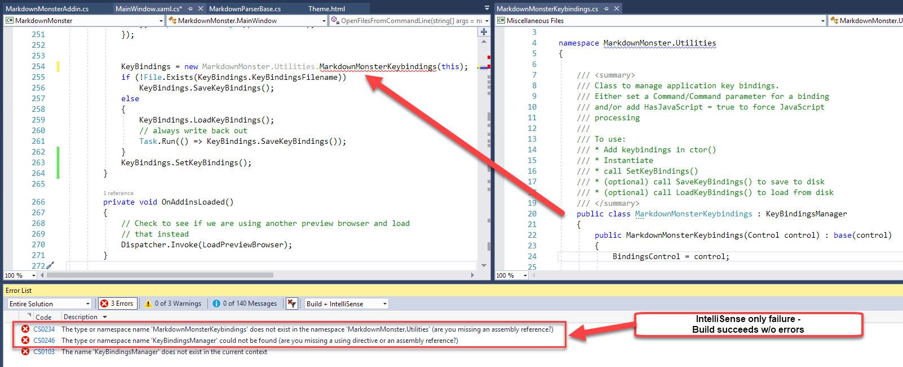
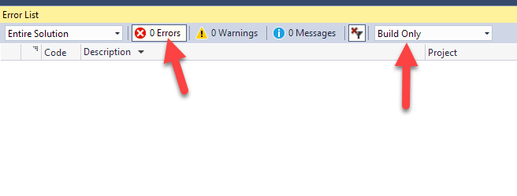

# Fixing Visual Studio Intellisense Errors

It's always fun when Visual Studio (ie [@drunkvs](https://twitter.com/drunkvs)) can't recite the alphabet backwards: The code below builds just fine when running through the compiler, but Visual Studio displays Intellisense errors in the Error Window and in the code with underlined squiggles:

The actual build of the code succeeds, but Intellisense is flagging several classes as missing **even though they clearly exist** and clearly compile properly.

### IntelliSense is High!
So IntelliSense sometimes goes off the rails and if you see errors in your project that don't make sense, first check to see if the errors are related to Intellisense. 

Notice the drop down in the error list that lets you see **Build + Intellisense** which, in the case above produces 3 errors, but no errors if I just show **Build Only**:

Note the **Intellisense** error drop down is a new feature so you may not see it in older versions of Visual Studio. Not sure when it arrived but it was in one of the late VS 2015.x updates.

### Clearing up Intellisense
There's usually a simple solution when IntelliSense decides to sleep one off:

**Delete the `.vs` folder**

The `.vs` folder holds solution related temp data including the `.suo` file that caches intellisense and some debug data. That folder also holds Web site configuration data for Web projects and a few other things. It's safe to delete this folder - Visual Studio recreates it when it's missing.

Older versions of Visual Studio (prior to VS 2015) didn't have a separate folder and dumped that same information into files in the solution's root folder. 

In these older versions you can fix Intellisense issues by deleting the Solution's `.suo` file. Deleting the `.vs` folder in newer version nukes the `.suo` file which is responsible for cached IntelliSense and also some cached Debug data. When VS acts up and reports whacky errors that seem wrong, the burning down the  `.suo` file is a nice quick thing to try first. 

To do this:

* Shut down VS
* Nuke the `.vs` folder or the `.suo` file
* Restart VS

The `.suo`  file contains cached IntelliSense data and once that file is off, no amount of recompilation or clearing the project is going to help. Nuke the `.suo` file. or in VS 2015 or later the `.vs` folder and get back to sanity.

### Compiler Errors?
I haven't run into this problem very frequently but when it does happen it's usually quite vexing resulting (for me at least) in a flurry of deleting output folders.

I have a standard set of steps I tend to go through when I get **compiler errors** that are wrong. Well, usually **it's me who's wrong, not the compiler** but on occasion I get to be right and **the compiler is really wrong**.

If you have errors that show under the `Build Only` dropdown, then the issue isn't Intellisense.

This has gotten a lot better, but for a while invalid compiler errors were a big problem with the **.NET SDK projects** (.NET Core / .NET Standard) and in those cases the solution for me usually is (and still occasionally is):

* Delete the `obj` folder completely
* Delete the `bin` folder completely

While Visual Studio's `Clean` project feature is supposed to address this, Clean will only clean up files the project knows about. If you've removed or renamed assemblies there may still be left over files in project output folders and deleting them cleans out the project completely.

This often fixes odd left over file issues that can cause strange compilation behavior. I never really considered Intellisense failure previously because Visual Studio didn't differentiate compiler and IntelliSense Errors (or more accruately I didn't notice the dropdown). I'd see errors in the Error list, yet my project would compile successfully, which was even more confusing.

### Back to the Straight And Narrow
It's nice that Visual Studio now explicitly shows these errors separately as **Build** and **Intellisense** errors, so you can take the sepearate actions to clean up this mess. In the past when the errors weren't separated it was even more confusing with compiles succeeding, but the error list showing errors.

Now as to the cause of any of these errors? @drunkvs has some cleaning up to do after the barf fest of the previous night...