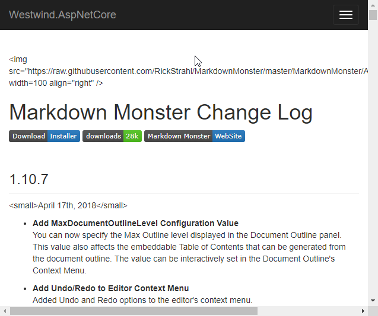

# Markdown and Cross Site Scripting


A while back I posted some ASP.NET Core Markdown related components in a [Westwind.AspNetCore.Markdown](https://github.com/RickStrahl/Westwind.AspNetCore/tree/master/Westwind.AspNetCore.Markdown) library along with a couple of posts that describe how these various components are created:

* [Creating an ASP.NET Core Markdown TagHelper and Parser](https://weblog.west-wind.com/posts/2018/Mar/23/Creating-an-ASPNET-Core-Markdown-TagHelper-and-Parser)
* [Creating a generic Markdown Page Handler using ASP.NET Core Middleware ](https://weblog.west-wind.com/posts/2018/Apr/18/Creating-a-generic-Markdown-Page-Handler-using-ASPNET-Core-Middleware)

The [code is on Github](https://github.com/RickStrahl/Westwind.AspNetCore/tree/master/Westwind.AspNetCore.Markdown) and one of the most common issues reported relate to how to deal with **XSS Vulnerabilities**.

### Markdown and HTML
Markdown by its nature supports HTML as part of a Markdown document so it's perfectly legal to do something like this:

```markdown
### It's all Roses and Cauliflowers
Rose colored glasses are in **on** mode...

<div class="alert alert-success">
  <b>Reminder</b>: You are awesome!
</div>

### <i class="fa fa-bomb"></i> Objects are closer than they appear
```

Markdown is really a superset of HTML in that it allows embedding of raw HTML, which is great **should you really need it**. To keep your Markdown documents clean however, it's best to **not use HTML** in your Markdown. But there are a few use cases where I resort to embedding HTML, such as for images that require sizing or aligment for example.

##AD##

#### <i class="fa fa-bomb" style="color: slategrey; font-size: 1.9em"></i> Objects are closer than they appear
Having **an out** for those situations when Markdown is too limited is great, but this also means you need to treat rendered HTML from Markdown **just like you would raw HTML** in terms of security!

> ##### <i class="fa fa-warning" style="color: darkgoldenrod;"></i> Markdown User Input
> If you accept user input as Markdown, treat the resulting HTML just as you would treat raw HTML input. This means the generated HTML output requires HTML Sanitation.

### Script and XSS
First things first:

> There's nothing in the Markdown spec that says that the HTML generated from a Markdown document has to be safe from cross site scripting attacks.

Markdown is just a markup language that happens to render HTML output. There's no tooling directly associated with Markdown the spec and there are no rules about how HTML should handle dangerous code. 

The rules are basically this:

> If it's legal HTML, it's legal Markdown

And so using stock Markdown you can pretty much do all the same evil stuff you can with HTML. There are some mitigations and I'll talk about that in a minute.

HTML support and even dangerous script support is usually fine; **if** you use Markdown to write a document you publish, you manage static site content or even application generated text. If you control the content that's being published it's pretty safe to run raw Markdown converted to HTML because... **it's your content** and you probably know where your Markdown has been.

But if you get your Markdown content from user generated input: **Watch out**.

Users and more importantly untrusted bad actors will try to exploit any input form that's out on the open internet and try to hack into it. So if you accept Markdown from your users as input, **be sure to treat the Markdown as you would raw HTML** and sanitize the post generation HTML as you would with raw HTML.

If you're using the tools I describe here, there are some basic mitigations built in. If you use different Markdown tools you likely have to write your own HTML Sanitation or use another library to handle making the content safe(r).

To illustrate my point here is some perfectly valid but dangerous Markdown:

```markdown
### Hack me

<script>
 alert('gotcha');
</script>
```

This Markdown will render an alert box when turned into HTML. Obviously it's very easy from here to **do evil** at will. This is **bad**.

Here's another beauty that's not so obvious:

```markdown
<div style="padding: 20px; opacity: 0;height: 20px;" onmouseout="alert('Gotcha!')"></div>
```

Now hover over the `<div>` tag in the rendered HTML. Nice huh?

## Westwind.AspNetCore.Markdown HTML and Script Removal Options
If you're using the aforementioned West Wind Markdown library there are a few built-in options that help mitigate some of the XSS dangers by removing some of the most obvious scenarios which are `<script>`,`<iframe>`,`<form>`,`<object>`,`<embed>` tags, `javascript:` directives and an `onXXX=` event handlers on HTML tags.

Full HTML Sanitation of user input is complicated and requires a dedicated library or utility (I've written about a [rudimentary HtmlSanitizer and the challenges here](https://weblog.west-wind.com/posts/2012/Jul/19/NET-HTML-Sanitation-for-rich-HTML-Input)), so the library does not even attempt to do it all. 

But it does provide a couple of options that allow you to tackle the problem. 

You can:

* Disable HTML Passthrough in the Markdown Parser
* Use the `StripScriptTags` Property or Parameter

##AD##

### Diabling raw HTML in the Markdown Parser
The `Westwind.AspNetCore.Markdown` library uses the popular [MarkDig](https://github.com/lunet-io/markdig) Markdown parser by default. MarkDig works by using a parsing pipeline that plugs in custom parsers that handle specific Markdown features. One of the built-in pipeline builders is the `.DisableHtml()` builder which as the name suggests doesn't leave raw HTML in the output and encodes the HTML as text instead. 

To add this requires some startup configuration in `Startup.ConfigureServices()`:

```cs
services.AddMarkdown(config =>
{
    // Create custom MarkdigPipeline 
    // using MarkDig; for extension methods
    config.ConfigureMarkdigPipeline = builder =>
    {
        builder
            .UseEmphasisExtras(Markdig.Extensions.EmphasisExtras.EmphasisExtraOptions.Default)
            .UsePipeTables()
            // ... more builders added
            
            // *** DISABLE HTML HERE
            .DisableHtml();
    };
});
```

`.DisableHtml()` causes script tags and all other HTML to be treated as text and they are HTML Encoded. So make sure you don't have any raw HTML in your markdown for this to work.

Here's what happens when you use `.DisableHtml()` with a document that **has some (valid) HTML tags**:



Note this is a **global** option that affects **all** Markdown operations including the parser, TagHelper and Page Handler.

Generally I don't recommend this option for anything but user processed markdown as for site specific Markdown you almost always have a few things that require HTML tags. It's a very blunt tool, but it can work if you only use Markdown for user input processing. It does not work if you need to have some content that strips HTML and others that does not since this is a base Parser setting on the cached parser (unless you explicitly create one for each request)

### Use the SanitizeHtml Option
The various components and static methods each have the ability to trigger a script tag filter which is fired after the HTML has been generated. A couple of RegEx expressions are used to remove `<script>` and other execution and loading tags `<a href='javascript:'>` and `onXXX` events on HTML elements.

#### Markdown.Parse()
The `Markdown.Parse()` and `Markdown.ParseHtml()` methods both include a `stripScriptTags` parameter which is `false` by default:

```cs
public static string Parse(string markdown, 
                           bool usePragmaLines = false, 
                           bool forceReload = false, 
                           bool sanitizeHtml = false) 
{...}

public static HtmlString ParseHtmlString(string markdown, 
                                         bool usePragmaLines = false, 
                                         bool forceReload = false, 
                                         bool sanitizeHtml = false)
{...}       
```

**Note**: The default behavior is to leave script code **as is**, so if you use the static functions script stripping is an **opt-in operation**.

#### Markdown Tag Helper
The Markdown TagHelper has a `strip-script-tags` attribute that is `true` by default. The TagHelper automatically removes script tags by default. The tag helper is often used for handling user input and for this reason uses a different default than the other components. Set the attribute to `false` to force the tag helper to explicitly include scripts.

##### Markdown Page Handler
By default the Markdown Page Handler **renders script as is**. In most cases pages are static and usually under the control of the Web site and meant to replace potentially large HTML pages which in some cases may need to include script. 

To strip script tags you can set the `StripScriptTags` flag on the folder configuration instance:

```cs
var folderConfig = config.AddMarkdownProcessingFolder(
			"/docs/",
			"~/Pages/__MarkdownPageTemplate.cshtml");
folderConfig.StripScriptTags = true;
```

##AD##

## Markdown Parser Logic for Removing Script Tags
Let's take a look under the hood to see how the library removes script tags. The Markdown Parser is implemented using an IMarkdownParser interface. The implementation then has a base implementation from which custom parsers can inherit. One of those post parsers is the `ParseScript()` method which is optionally triggered by the configuration options mentioned earlier.

The base method responsible for handling the script stripping is this pretty simple using a several **RegEx** expressions:

```cs
static string HtmlSanitizeTagBlackList { get; } = "script|iframe|object|embed|form";

static Regex _RegExScript = new Regex($@"(<({HtmlSanitizeTagBlackList})\b[^<]*(?:(?!<\/({HtmlSanitizeTagBlackList}))<[^<]*)*<\/({HtmlSanitizeTagBlackList})>)",
RegexOptions.IgnoreCase | RegexOptions.Multiline);

// strip javascript: and unicode representation of javascript:
// href='javascript:alert(\"gotcha\")'
// href='&#106;&#97;&#118;&#97;&#115;&#99;&#114;&#105;&#112;&#116;:alert(\"gotcha\");'
static Regex _RegExJavaScriptHref = new Regex(
    @"<[^>]*?\s(href|src|dynsrc|lowsrc)=.{0,20}((javascript:)|(&#)).*?>",
    RegexOptions.IgnoreCase | RegexOptions.Singleline);

static Regex _RegExOnEventAttributes = new Regex(
    @"<[^>]*?\s(on[^\s\\]{0,20}=([""].*?[""]|['].*?['])).*?(>|\/>)",
    RegexOptions.IgnoreCase | RegexOptions.Singleline);

/// <summary>
/// Sanitizes HTML to some of the most of 
/// </summary>
/// <remarks>
/// This provides rudimentary HTML sanitation catching the most obvious
/// XSS script attack vectors. For mroe complete HTML Sanitation please look into
/// a dedicated HTML Sanitizer.
/// </remarks>
/// <param name="html">input html</param>
/// <param name="htmlTagBlacklist">A list of HTML tags that are stripped.</param>
/// <returns>Sanitized HTML</returns>
public static string SanitizeHtml(string html, string htmlTagBlacklist = "script|iframe|object|embed|form")
{
    if (string.IsNullOrEmpty(html))
        return html;

    if (!string.IsNullOrEmpty(htmlTagBlacklist) || htmlTagBlacklist == HtmlSanitizeTagBlackList)
    {
        // Replace Script tags - reused expr is more efficient
        html = _RegExScript.Replace(html, string.Empty);
    }
    else
    {
        html = Regex.Replace(html,
                                $@"(<({htmlTagBlacklist})\b[^<]*(?:(?!<\/({HtmlSanitizeTagBlackList}))<[^<]*)*<\/({htmlTagBlacklist})>)",
                                "", RegexOptions.IgnoreCase | RegexOptions.Multiline);
    }

    // Remove javascript: directives
    var matches = _RegExJavaScriptHref.Matches(html);
    foreach (Match match in matches)
    {
        if (match.Groups.Count > 2)
        {
            var txt = match.Value.Replace(match.Groups[2].Value, "unsupported:");
            html = html.Replace(match.Value, txt);
        }
    }

    // Remove onEvent handlers from elements
    matches = _RegExOnEventAttributes.Matches(html);
    foreach (Match match in matches)
    {
        var txt = match.Value;
        if (match.Groups.Count > 1)
        {
            var onEvent = match.Groups[1].Value;
            txt = txt.Replace(onEvent, string.Empty);
            if (!string.IsNullOrEmpty(txt))
                html = html.Replace(match.Value, txt);
        }
    }

    return html;
}
```

### Performance
So as I mentioned previously I had built an HTML Sanitizer a long while back that used HTML Agility Pack to manually parse the document. Now there's also a maintained version of a [HTML Sanitizer](https://github.com/mganss/HtmlSanitizer) that's much more full featured and will handle many more edge cases. Both of these are more reliable, but it comes at a cost - there's overhead in this processing as you have to load the document into the HTML parser, then walk the entire document and check each element and attribute. This is memory and CPU intensive and definitely has some overhead.

It depends entirely on how you use Markdown in your document. If you capture markdown and immediately parse it into HTML and save that with your data probably won't care about performance since it's a one time shot. Even if you have sizable Markdown and you simply display a single page that's probably Ok. But if you have multiple Markdown fragments on a page, or as I do in Markdown Monster refresh Markdown Monster whenever the cursor stops typing, you want the markdown conversion to happen as fast as possible. RegEx processing tends to be a lot quicker as it's relatively straight forward string parsing.

So Feedback is welcome in perhaps optimizing this string and RegEx based parsing as a midling solution.

The code for the [rudimentary HTML Sanitation lives here on GitHub](https://github.com/RickStrahl/Westwind.AspNetCore/blob/master/Westwind.AspNetCore.Markdown/Utilities/StringUtils.cs#L183). I'm fully aware this isn't a complete XSS solution, but it at least addresses the most common and obvious use cases. 

Also if anybody has a experience based recommendation for a good, **fast and actively developed** XSS Sanitation library for .NET please leave a comment. I've been using my own home grown HtmlSanitizer I created a long while back and it's served me well enough to date.

## Summary
Wouldn't it be nice if the Internet was still all roses and unicorns and we wouldn't have to worry about bad actors sniffing out security holes within a few hours of an application going live. Alas, such is the world we live in...

XSS scripting is serious business and Markdown doesn't natively protect you from it. If you're using Markdown with your own maintained content or static content, script tag and XSS injections are probably not that important to worry about.

If you however capture user input and display that user input, make sure you have a plan on how to deal with script attacks. The `Westwind.AspNetCore.Markdown` package has a few options to make this easier via disabling HTML altoghether or by explicitly using options to strip script tags from Markdown content which hopefully provides the best of both worlds.


### Resources
* [Creating an ASP.NET Core Markdown TagHelper and Parser](https://weblog.west-wind.com/posts/2018/Mar/23/Creating-an-ASPNET-Core-Markdown-TagHelper-and-Parser)
* [Creating a generic Markdown Page Handler using ASP.NET Core Middleware ](https://weblog.west-wind.com/posts/2018/Apr/18/Creating-a-generic-Markdown-Page-Handler-using-ASPNET-Core-Middleware)
* [Old post on .NET HTML Sanitation for rich HTML Input](https://weblog.west-wind.com/posts/2012/Jul/19/NET-HTML-Sanitation-for-rich-HTML-Input)
* [Westwind.AspNetCore.Markdown Project on Github](https://github.com/RickStrahl/Westwind.AspNetCore/tree/master/Westwind.AspNetCore.Markdown)
* A full featured .NET Html Sanitizer: [Html Sanitizer](https://github.com/mganss/HtmlSanitizer)

<div style="margin-top: 30px;font-size: 0.8em;
            border-top: 1px solid #eee;padding-top: 8px;">
    
    this post created and published with 
    <a href="https://markdownmonster.west-wind.com" 
       target="top">Markdown Monster</a> 
</div>