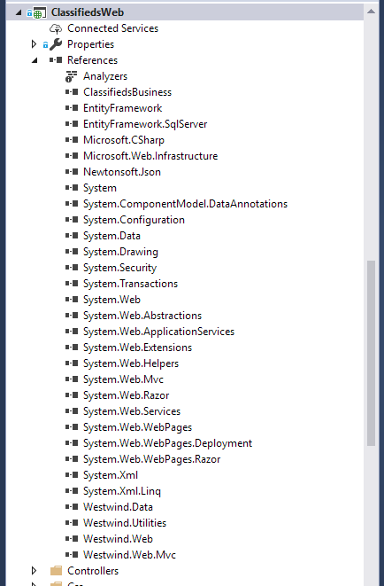

# Updating ASP.NET MVC Projects from Older Versions
Once again I'm working on an old project and moving it from an old version ASP.NET MVC (version 4), to the latest version of MVC (version 5.2x at this time). Moving between major versions of MVC has always been a big hassle - there are invariably things that get broken by the new versions, but the biggest issues usually have to do with assembly versions getting out of sync, and the project and support files getting out of whack.

Recent versions of full framework MVC are a bit better about upgrades, which has been helped by recent NuGet versions doing a better job of resolving dependencies and properly placing the appropriate assembly redirects into the `.config` files.

This post serves mostly as a **Note to Self** to come back to when I need to do this again, as I seem to hit the same walls repeatedly.

## Assembly and NuGet Hell
When you upgrade an MVC project you invariable have to upgrade a shit pile of NuGet package dependencies. Half the stuff that's installed with MVC isn't really required at runtime and I usually decrappify my installs once they get close to release. However when updating all the bloat comes back - and now with even less of an idea what dependencies are actually required at runtime.

My trimmed down version of a running project that works looks something like this:

which has a lot of additional depedencies removed.

## Upgrading
The actual upgrade process for me usually involves:

* upgrade all ASP.NET MVC NuGet Packages
* upgrade additional NuGet Packages
* fix Package Dependency Errors
* fix runtime Dependency Errors
* fix Intellisense Issues (`.config` file references)

### NuGet Package Upgrades
The first step is to update the ASP.NET NuGet packages. I tried to update just the MVC related packages first before also updating other project dependencies. Some like like **Newtonsoft.json** will update as part of the MVC Upgrade.

I usually start with the **Microsoft.Aspnet.Mvc** package which pretty much has dependencies on everything else MVC needs, plus **EntityFramework**. Thankfully I updated this particular project a 5 years or so ago to v4, so updates here went reasonably smoothly.

### Removing JavaScript Packages
It's funny to look at this project though and see the various JavaScript frameworks loaded as Nuget packages which was all the rage back then but, by now is really discouraged. 

So one thing to do is remove the various JavaScript packages and either just add them manually to my `scripts` folder in the project, or add the appropriate **NPM** packages and re-reference the scripts from there (or a build process).

In this old project I simply removed the NuGet packages and now manage the scripts directly in the scripts folder:

