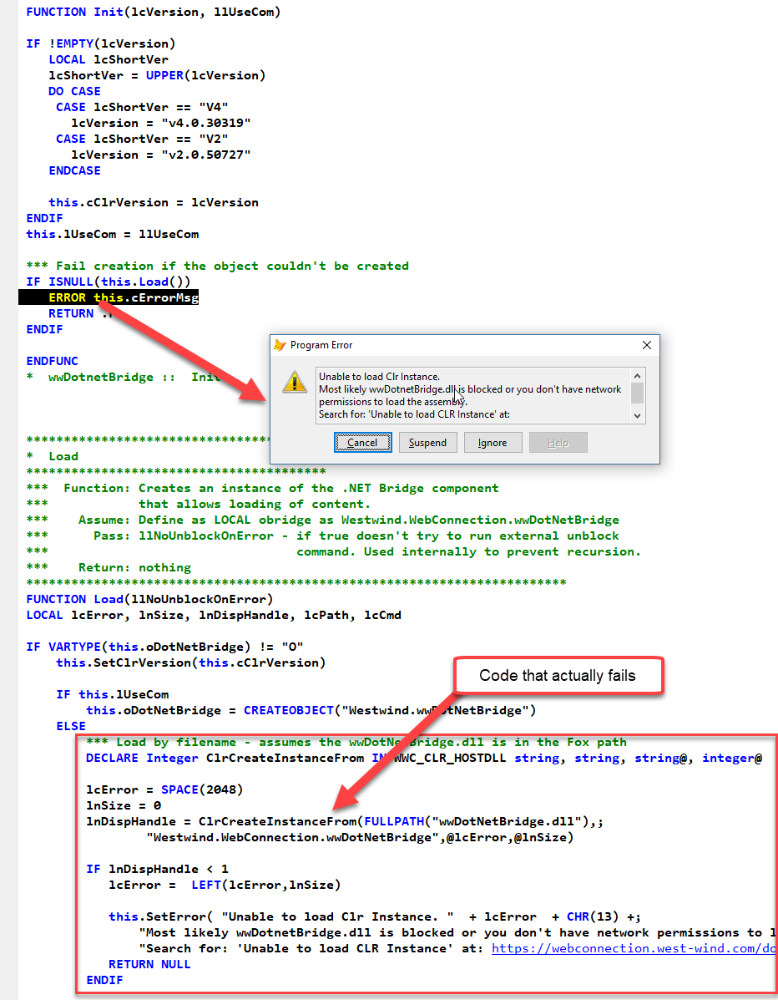

# Fixing Windows Downloaded File Blocks and wwDotnetBridge
This is kind of a 'good to know' technical post that discusses some backround information around [wwDotnetBridge](https://github.com/RickStrahl/wwDotnetBridge) and one of the biggest issues with using it. In this post I'll talk about **Windows Download File Blocking** due to Zone Identifier marking, along with a solution on **how to programmatically unblock files** easily, the fix for which will start showing up in version 6.22 of **wwDotnetBridge** going forward.

If you arrived here and don't know what wwDotnetBridge is, it's a bridge interface for accessing .NET from FoxPro without requiring COM instantiation. wwDotnetBridge hosts the .NET Runtime in FoxPro and provides a Proxy wrapper that can create instances of objects, call static methods, handle events, access generic members, deal with arrays and collections efficiently and provides a ton of helpers to access features of .NET that COM Interop can't.

Glowing features aside, in this post I'm talking about the **#1 problem that surrounds wwDotnetBridge** which is the dreaded **Windows File Blocking Issue**. This issue is caused by files downloaded from the Internet either directly or in a Zip file that Windows has marked as **Blocked**. 


A blocked file cannot be loaded into .NET over an AppDomain boundary, which in turn causes wwDotnetBridge to fail to load the .NET Runtime properly. It's a big fail and while there are easy solutions, to date I hadn't been able to automate it away. That is until today - I'm happy to say that I've found a solution to this problem. Better late than never :smile:

### What's the Problem? Blocked files and wwDotnetBridge
For wwDotnetBridge blocked files are a big problem, because if you download wwDotnetBridge from [Github](https://github.com/RickStrahl/wwDotnetBridge) or from [West Wind Client Tools](https://west-wind.com/WestwindClientTools.aspx) you are downloading a Zip file which when unzipped creates - you guessed it - **blocked DLL files**.

### What File Blocking Does
This is a 'protection' feature of Windows, which associates a Zone Identifier stream with a given file name using something known as [Alternate Data Streams (ADS)](https://www.bleepingcomputer.com/tutorials/windows-alternate-data-streams/). When you download a file to your Downloads folder and that adds the Zone Identifier alternate data stream in `yourfile.dll:Zone.Identier`. If you download a Zip file, the contents of the Zip file - any executables - are marked as well. Once the zone identifier exists it's moved along with the file if you copy it to another location on the local drive. This is all handled by the file system.

How that Zone indicator is used is up to the host application. It turns out FoxPro doesn't care about it and I can reference a `DECLARE` DLL and it works just fine. For example, even when marked as 'blocked', wwIPStuff.dll works just fine in FoxPro without first unblocking.

However, the **.NET Runtime** as part of hte bootstrapping process **does care about Zone Identifiers**, so when wwDotnetBridge passes `wwDotnetBridge.dll` to the .NET Runtime/AppDomain as the runtime entry point assembly, it checks the Zone Identifier and refuses to load the dll.

### What Blocking looks like with wwDotnetBridge
When wwDotnetBridge is run with a blocked wwDotnetBridge.dll file you will get an error. Running this most basic code:

```foxpro
DO wwDotnetBridge
loBridge = GetwwDotnetBridge()
loBridge.GetDotnetVersion()
```

will fail with an **Unable to load CLR Instance** error in the `Load()` method like this:



Note that this particular returns no error in `lcError` because the runtime that normally returns an error is not actually loaded yet. Instead wwDotnetBridge provides an error message with the most likely scnearios and a link to the docs.

In order to get wwDotnetBridge to run `wwDotnetBridge.dll` first has to be unblocked - which has been the cause of innumerable support requests.

#### Blocked only for Downloaded Files Or Downloaded Zip Archives
Note that this error occurs **only if running a downloaded wwDotnetBridge.DLL** either directly or inside of a ZIP file. So it happens with the [GitHub](https://github.com/RickStrahl/wwDotnetBridge) and [West Wind Client Tools](https://west-wind.com/WestwindClientTools.aspx) zip files, but it does not with [Web Connection](https://webconnection.west-wind.com) and [Html Help Builder](https://helpbuilder.west-wind.com) because both of these tools use an installer which never flags these files with the Zone Identifier responsible for the blocked files.


### Unblocking - Powershell
It turns out that unblocking is a common administration task in Windows and Powershell has a dedicated commandlet for it:

```powershell
PS> unblock-file -Path '.\wwDotnetBridge.dll'
```

You can run that command and it will unblock the DLL and the error goes away. It's not an Administrative task either so even a standard user can run this command. Easy, but not exactly automatic.

I played around with this by running load, checking for a specific error and if I see it unblocking using the PowerShell command from within FoxPro:

```foxpro
lcPath = FULLPATH("wwdotnetbridge.dll")
lcCmd = [powershell "Unblock-File -Path '] + lcPath + ['"]
RUN /N7 &lcCmd 
```

While this works to unblock the file, this process is slow (shelling out) and once unblocked I still have to quit FoxPro or my application to see the newly unblocked DLL - a retry to reload still fails in the same VFP session. So while it works I still see at least one initial failure.

Close but no cigar.

### Unblocking - Deleting the Zone Stream
After a bit of research it turns out that there's a more direct way to unblock a file which involves deleting a special file in the Windows file system. This **Alternate Data Stream** can't be deleted using FoxPro's `ERASE FILE` so we have to use the Windows API `DeleteFile()` function instead. Easy enough:

```foxpro
*** Remove the Zone Identifier to 'Unblock'
DECLARE INTEGER DeleteFile IN WIN32API STRING		  			  			
DeleteFile(FULLPATH("wwDotNetBridge.dll") + ":Zone.Identifier")

*** To be extra sure - unblock other dependencies
DeleteFile(FULLPATH("newtonsoft.json.dll") + ":Zone.Identifier")
DeleteFile(FULLPATH("markdig.dll") + ":Zone.Identifier")
```

**Et voila!**

**This code clears the Zone Identifier** which is responsible for the Block on the file.

Deleting **effectively unblocks the dll** and if the identifier doesn't exist `DeleteFile()` quietly fails. And because it's a Windows API call it's also relatively fast - quick enough that I can run it every time wwDotnetBridge is instantiated just to be sure the zone identifier isn't present.

So now that code is called as part of the load sequence in wwDotnetBridge which should do away with the blocked DLL issue for good. Yay!

### What about other blocked DLLs
Please note that the only DLL affected is `wwDotnetBridge.dll`. `wwIPStuff.dll` and `Newtonsoft.json.dll` and `markdig.dll` **work fine without unblocking**. The reason is `wwDotnetBridge.dll` is initial .NET DLL loaded containing the `wwDotnetBridge` type when the .NET Runtime is bootstrapped in this code:

```foxpro
lnDispHandle = ClrCreateInstanceFrom(FULLPATH("wwDotNetBridge.dll"),;
				"Westwind.WebConnection.wwDotNetBridge",@lcError,@lnSize)
```

Depending on your security setup you may still have to set `LoadFromRemoteSources` in your config file. I generally recommend you **always** add the following in a `yourapp.exe.config` and in your `vfp9.exe.config` (in the VFP install folder) to make .NET behave like other Win32/64 applications when it comes to network access:

```xml
<?xml version="1.0"?>
<configuration>
  <runtime>
      <loadFromRemoteSources enabled="true"/>
  </runtime>
</configuration>
```


The `ClrCreateInstanceFrom()` in `wwIpStuff.dll` basically loads the .NET runtime, creates a new AppDomain, then loads the `wwDotnetBridge` .NET type from `wwDotnetBridge.dll` into it over AppDomain boundaries. This crossing of AppDomain boundaries before .NET policies are applied at this system level is what likely triggers the error in the first place.

### A Big Load Of My Back!
This Windows file blocking has been a major thorn in my side and one of the sticking points around wwdotnetbridge adoption. As a new user when you're just kicking the tires the last thing you want to see is a nasty unspecific error on first launch. Even though this problem is prominently documented, most people don't look at the documentation carefully so it's easy to miss this.

Now, with this feature added to the latest wwDotnetBridge (not quite released yet) it should be much easier to get started with wwDotnetBridge regardless where the installed version comes from.