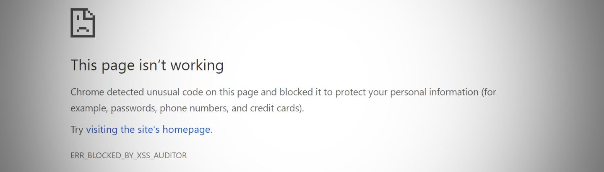
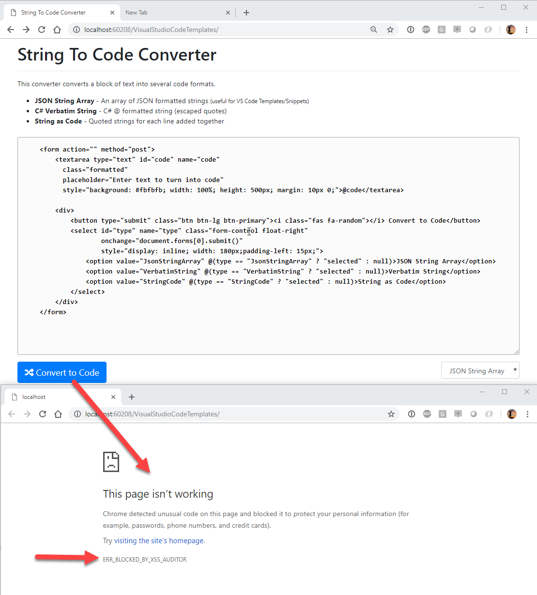
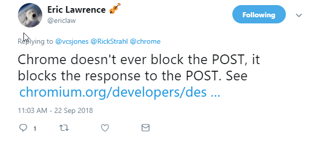

# Getting around Chrome POST XSS Protection



I've been working on a small string conversion utility for turning strings into various code formats. Specifically, I've been writing a number of Visual Studio Code templates and VS code requires that templates are formatted into a JSON String Array, which means strings have to be split into lines with each line properly JSON formatted. This is a huge pain when creating large templates - especially HTML templates that contain lots of quotes that need to be encoded. 

Long story short I threw together a simple Web Page <a href="https//samples.west-wind.com/StringToCodeConverter/" target="_blank">String to Code Converter</a> that handles this conversion (and a couple of others).

## That Pesky XSS Protection
As you might expect my goal for these VS Code Templates was to create Code Snippets/Templates that could be quite large, HTML templates to be specific. So while creating an HTML template that includes an HTML form and some input fields I ran into a nasty error message in Chrome:



The error is:
**ERR_BLOCKED_BY_XSS_AUDITOR**

Starting with Chrome 57, Chrome has started implementing an agressive XXS protection mechanism that prevents certain things from being posted to the server. 

There's a lot of debate of whether this functionality belongs in the browser or not and in fact other modern browsers do not implement an XSS Auditor any more. At this point Chrome seesm to be only one that triggers this. FireFox and Edge run the requests no problem without the header.

One important point to note is:



> @icon-info-circle ### XSS or not Chrome Posts the data
> Chrome does not prevent POSTing of the data to the server, but it **prevents sending a response** when the XSS Protection triggers.

Thanks to [Eric Lawrence](https://twitter.com/ericlaw) for pointing that out.

## Working around XSS Protection
Although currently this is a browser specific feature implemented by Chrome, it turns out there are some standards based protections built into the HTTP spec that allow for this. 

Specifically there is a [X-XSS-Protection header](https://developer.mozilla.org/en-US/docs/Web/HTTP/Headers/X-XSS-Protection) that allows to tell the browser how to handle XXS protection. A value `0` turns off the protection.

So in my simple Web page (an ASP.NET WebPages (cshtml) page) I can simply do this to get the page to work:

```cs
Response.Headers.Add("X-XSS-Protection", "0");
```

Et voila, the form gets posted without browser complaints.

### ASP.NET Server Request Validation
While I'm here it's worth mentioning that server too is likely to reject this request. In ASP.NET WebPages the easy workaround is to use the `Request.Unvalidated` object to handle picking up the 'unsafe' request data:

```cs
var code = Request.Unvalidated.Form["code"];
```

This allows bypassing ASP.NET Request validation.

For WebForms you can use:

```html
<@ Page validateRequest="false" %>
```

In MVC you can use the `[ValidateInput(false)]` attribute on controller actions to prevent validation:

```cs
[ValidateInput(false)]
public ActionResult Convert(CodeRequest request) 
{ ... }
```

If you're accessing raw `Request` data you can use this in MVC:

```cs
var rawComment = Request.Unvalidated().Form["code"];
```
#### IIS - HttpRuntime Settings
Ontop of that IIS also screws with request validation, and it often does so before ASP.NET gets control at all.

It's a good idea to turn that off in web.config and revert to the old behavior that delegated this functionality to the framework rather than the Web server itself:

```xml
<httpRuntime requestValidationMode="2.0"/>
```

Otherwise IIS fails the request before it ever hits the ASP.NET instance.


## Summary
Request validation generally is a good idea - except on those very few occasions when it's not :-). Definitely a problem when doing something like I am in this case which is posting code that almost always would trigger validation. But it can also bite you in regular business scenarios when somebody posts some legitamite angle brackets as part of text input. Rare, but it happens and it's usually hard to catch this initially as this becomes a runtime error.

Luckily there are workarounds. The `X-XXS-Protection` header solves Chromes XSS Auditor and  various request validation options exists for server side code to be very specific about when you want to allow request validation to be bypassed.

## Resources
* [X-XSS-Protection Header (MDN)](https://developer.mozilla.org/en-US/docs/Web/HTTP/Headers/X-XSS-Protection)
* [Request Validation Changes in ASP.NET](https://weblog.west-wind.com/posts/2010/Aug/19/RequestValidation-Changes-in-ASPNET-40)
* [Request Validation in ASP.NET](https://msdn.microsoft.com/en-us/library/hh882339%28v=vs.110%29.aspx?f=255&MSPPError=-2147217396)