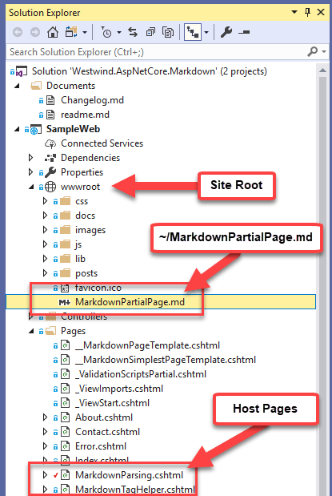

# Updating my Markdown Tools with Markdown from Files and URLs

It's been a while since I've been working on my Markdown tools, but last week I was back in content update mode on my Web site updating a bunch of ancient sites to something a little more modern. And as is often the case - a whole lot of rewriting of content is taking place. 

I've previously described that I ended up creating a couple of Markdown controls for both classic ASP.NET WebForms and MVC as well as ASP.NET Core. Both provide roughly the same features to either style of ASP.NET from Markdown parsing to an embeddable Markdown control or TagHelper, which provide a number of useful Markdown features for ASP.NET. 

My original goal for these tools was to allow me to integrate Markdown text into existing HTML based pages using either an ASP.NET Core TagHelper or a WebForms server control. The end result were a couple of generic Markdown helper libraries that ended up with a few additional tools:

* [Westwind.AspnetCore.Markdown](https://github.com/RickStrahl/Westwind.AspNetCore.Markdown)
* [Westwind.Web.Markdown](https://github.com/RickStrahl/Westwind.Web.Markdown)

For the original base features you can either look at the links above or check out these previous posts which go into more detail and talk about the implementations.

* [Creating an ASP.NET Core Markdown TagHelper and Parser](https://weblog.west-wind.com/posts/2018/Mar/23/Creating-an-ASPNET-Core-Markdown-TagHelper-and-Parser)
* [Creating a generic Markdown Page Handler using for ASP.NET Core Middleware](https://weblog.west-wind.com/posts/2018/Apr/18/Creating-a-generic-Markdown-Page-Handler-using-ASPNET-Core-Middleware)
* [A literal Markdown Control for ASP.NET WebForms](https://weblog.west-wind.com/posts/2017/Sep/13/A-Literal-Markdown-Control-for-ASPNET-WebForms)

## Features
Both the ASP.NET and ASP.NET Core libraries have a similar feature set and provide the following to their appropriate ASP.NET Platforms:

* Raw Markdown Parsing
   * `Markdown.Parse()`
   * `Markdown.ParseFromFile()`
   * `Markdown.ParseFromUrl()`
   * `HtmlString` and `async` versions of the above
 * Markdown Islands
   * Markdown **TagHelper** on ASP.NET Core MVC
   * Markdown **WebForm Server Control** for WebForms
 * Markdown Page Handler
   * Serve Markdown files from the file system as HTML
   * Simply drop Markdown files into a folder
   * Uses a template wrapper for Markdown content

## What's new
So the recent updates include a number of new features for the ASP.NET Core library:

* Markdown from File and URL for Parser and TagHelper
* Replacable Markdown Parser (via `IMarkdownParserFactory`)
* Simplified configuration for the MarkDig implementation


### Markdown From Files on Disk
One very useful new feature is the ability to specify Markdown content from a file rather than statically embedding Markdown as text into a page. For content creation it's not uncommon to have a nicely designed page, with a large section of text that is mostly simple formatted text. Again back to things like contact pages, marketing pages, terms of conduct etc. which all need to render within the context of your site with nice layout, but still need a lot of text.

The base TagHelper allows abstracting the content into Markdown text which makes it easier to edit the text. However, if the block is large that gets unwieldy too, mainly because most HTML editors have no notion of Markdown formatting and will try to be **extra helpful** with their HTML expansions. For small blocks of Markdown this is fine, but for a lot of text, it's nice to be able to externalize that Markdown into a separate file **that can be edited in a proper Markdown aware editor**.

You can now do this either with the ASP.NET Core TagHelper or the `Markdown.ParseFromFile()` helper function.

 For the ASP.NET Core TagHelper this looks like this:

```html
<div class="mainbody">
          
	
	<h3>A better Markdown Editor and Weblog Publisher for Windows</h3>
	
	... other marketing layout drivel

	<!-- Feature list is very simple --->
    <div class="mainbody-container">
    	<markdown Filename="~/MarkdownMonsterFeatures.md"></markdown>
    </div>
            
    <footer>
    	... footer stuff
    </footer>
</div>
```

The TagHelper loads the Markdown from disk and renders it into HTML and you can now edit the markdown file separately from the HTML document.

Alternately you can also use the Markdown helper using one of the following methods:

* Markdown.ParseFromFile()
* Markdown.ParseHtmlStringFromFile()
* Markdown.ParseFromFileAsync()
* Markdown.ParseHtmlStringFromFileAsync()

You can do this in code:

```cs
var html = Markdown.ParseHtmlFromFile("~/MarkdownPartialPage.md")
```

or directly inside of a Razor page:

```html
<div class="sample-block">
    @await Markdown.ParseHtmlStringFromFileAsync("~/MarkdownPartialPage.md")
</div>
```

Page paths can be either **relative to the Host Page** or use **Virtual Path Syntax** (using ~/ for the root). Note these paths are site relative so they refer to the `wwwroot` folder of the ASP.NET core site:



This is another image  that is totally inline.


> #### @icon-warning File Rendering loads Resources as *Host Page Relative*
> Any relative links and resources - images, relative links - **relative to the host page** rather than to the Markdown document. Make sure you take into account paths for any related resources and either ensure they are relative to the host page or use absolute URLs.


### Loading from URL
Very similar in behavior to loading Markdown files from disk, the new URL loading feature supports loading Markdown from a URL. There are also TagHelper and Helper Functions 

```html
<div class="mainbody">
          
	
	<h3>A better Markdown Editor and Weblog Publisher for Windows</h3>
	
	... other marketing layout drivel

	<!-- Feature list is very simple --->
    <div class="mainbody-container">
    	<markdown URL="~/MarkdownMonsterFeatures.md"></markdown>
    </div>
            
    <footer>
    	... footer stuff
    </footer>
</div>
```