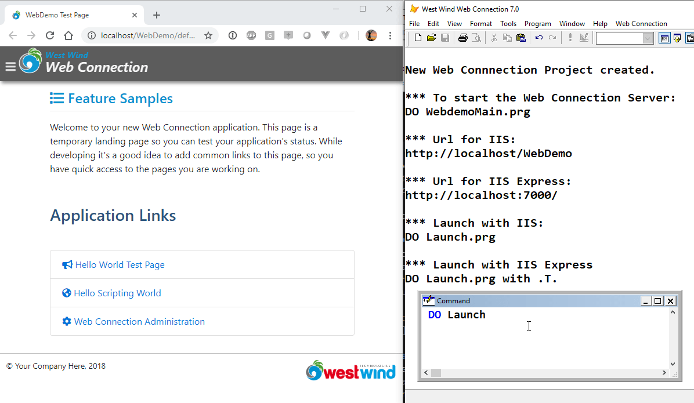
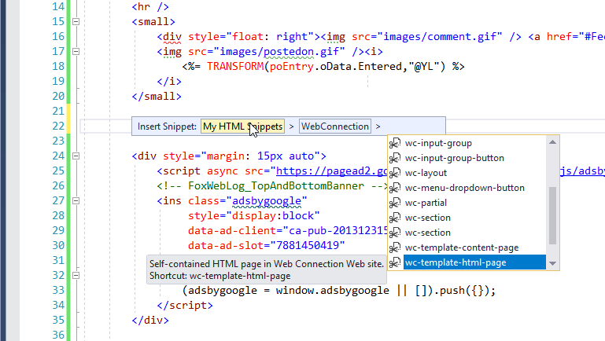
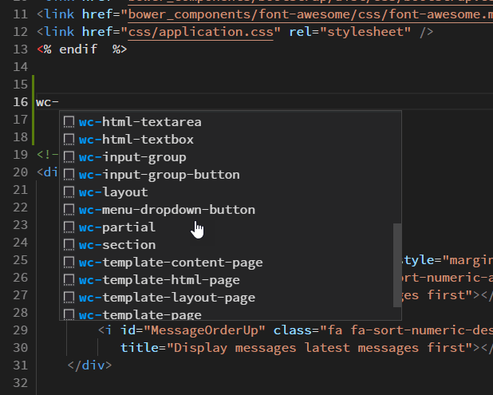
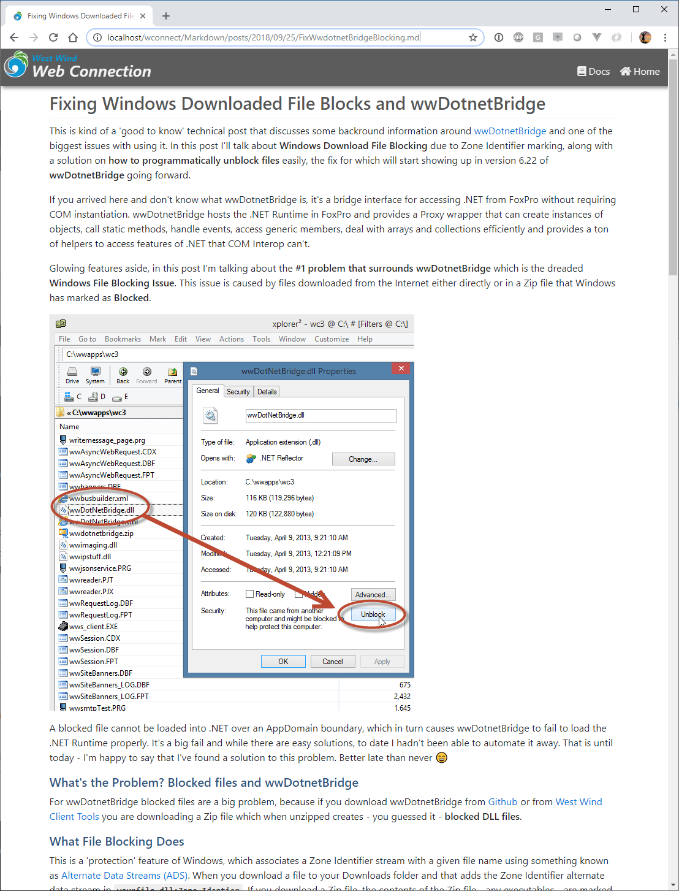
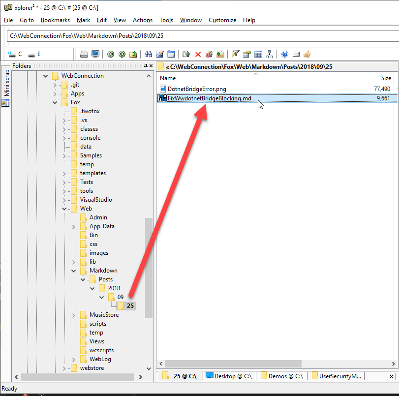

# West Wind Web Connection 7.0 has been released


The final build of Web Connection 7.0 was released today and is available for download now. You can grab the latest shareware version from the Web Connection Web site:

* [Web Connection Site](https://webconnection.west-wind.com)

Upgrades and full versions are available in the store:

* [Upgrade Web Connection](https://store.west-wind.com/product/wconnect70_up)
* [Purchase Web Connection](https://store.west-wind.com/product/wconnect70)

Also released today is the User Security Manager for Web Connection which is an add on that handles user account authentication and and profile management:

* [User Security Manager for Web Connection](https://webconnection.west-wind.com/UserSecurityManager)

### Big Release
Web Connection 7.0 is a major update that includes many enhancements and optimizations. 

Here's a list of all that has changed and been added:

* [What's new in Web Connection](https://webconnection.west-wind.com/docs/_s8104dggl.htm)

What follows is a **lot more detail** on some of the enhancements if you are interested.

### Focus on Streamlining and Consolidation
This release continues along the path of **streamlining relevant features and making Web Connection easier to operate during development and for deployment**. As most of you know Web Connection is a very mature product that has been around for nearly 25 years now (yes the first Web Connection release shipped in late 1994!) and there is a lot of baggage from that time that is no longer relevant. A lot of stuff has of course been trimmed over the years and this version is no different. 

This release consolidates a lot of features and removes many libraries that hardly anyone uses - certainly not in new project - by default. The libraries are still there (in the `\classes\OldFiles` folder), but they are no longer loaded by default.

The end result is a leaner installation package of Web Connection (down to 20 megs vs. 35 megs) and considerably smaller base applications (down to ~700k vs 1.1meg).

### Removing VCX Casses in favor of PRG Classes
One thorn in my personal side, has been that Web Connection included a few VCX classes, specifically several VCX classes that don't really need to be visual. `wwSql`, `wwXml`, `wwBusiness` and `wwWebServer` all **were**  visual classes that have now been refactored into PRG classes.

This is a **breaking change** that requires changing `SET CLASSLIB TO` to `SET PROCEDURE TO` for these classes using a Search and Replace operation. 

`wwBusiness` is a special case as it can and often was used with Visual Classes for subclassing. So, `wwBusiness.vcx` still exists in the `OldFiles` folder, but there's a new `wwBusinessObject` class and `wwBusinessCollectionList` class that replaces it. If you already used PRG based business object subclasses then it's a simple matter of replacing the `SET CLASSLIB TO wwBusiness` with `SET PROCEDURE TO wwBusinessObject` and replacing `AS wwBusiness` with `AS wwBusinessObject`. 

For visual classes you can either continue to use the VCX based `wwBusiness` class, or - better perhaps - extract the code of each class to a PRG file using the Class Browser and deriving classes off `wwBusinessObject`. For visually dropped classes that were dropped on a form or container that code would also need to be replaced with `THISFORM.AddProperty(oBusObject,CREATEOBJECT("cCustomer"))` and so on.

[VCX Class to PRG Class Migrations](https://webconnection.west-wind.com/docs/_5c915obhg.htm)

### Bootstrap 4 and FontAwesome 5
Other highlights in this update include getting the various support frameworks up to date.

Web Connection 7.0 ships with Bootstrap 4 and FontAwesome 5 (free) support which updates the original versions shipped in Web Connection 6 more than 4 years ago. This is one thing that's troublesome in Web applications: Client side frameworks change frequently and as a result anything that depends on them - including a tool like Web Connection - also has to update. This process is not difficult but it is time consuming as there are a handful of places in the framework (mainly the `wwHtmlHelpers`) where there are dependencies on some of these UI framework specific features.

That said, having upgraded 3 different applications to Bootstrap 4 and FontAwesome 5 I can say that the process is relatively quick **if you decide to upgrade**. 95% of the work is search and replace related, while the remaining 5% is finding specific UI constructs and updating them (mainly related to change in Bootstrap 4's use of **Card** vs. panels, wells, tooltips etc.).

While it's a **nice to have feature** to upgrade to the latest version of UI frameworks and keep up to date with new styles and UI framework features, it's also important to understand that you don't have to upgrade to the new UI Frameworks. If you have an app that runs with Bootstrap 3/FontAwesome 4 you can continune to use those older UI frameworks - using Web Connection 7.0 isn't going to break your application. 

[Migration from Bootstrap 3 to 4 in the documentation](https://webconnection.west-wind.com/docs/_5c9165cos.htm).

### Project Management Improvements
One of the most important focal points of this update and many changes since v6.0  have been around making Web Connection Projects easier to create, run, maintain and deploy.  Web Connection 7.0 continues to make things easier and quicker and hopefully more obvious for someone just getting started.

#### Fast Project Creation - Ready to Run
To give you some perspective here, I use the project system constantly when I need to test something out locally. When I see a message on the message board with a question to some feature it's often easier for me to just create a new project quickly and push in a few changes than even pull a demo project and add features. Creating a new project takes literally a minute and I have a running application.

There's a new `Launch.prg` file that is generated that automates launching a project consistently, regardless of which project you're in.

The process now literally is:

* Use the Console
* Run the New Project Wizard
* `DO Launch.prg`

The browser is already spun up for you and additional instructions on how to launch either IIS or IIS Express are displayed on the screen.



`Launch.prg` is a new file generated by the new project wizard which basically does the following:

* Calls `SetPaths.prg` to set the environment
* Opens the browser to the IIS or IIS Express Url
* If running IIS Express launches IIS Express
* Launches your Web Connection Server instance  
using `DO <yourApp>Main.prg` 

You can do this to launch with **IIS**:

```foxpro
DO Launch
```

which opens the application at `http://localhost/WebDemo` (or whatever your virtual is called).

To launch for **IIS Express**:

```foxpro
DO Launch with .T.
```

which is a flag that launches IIS Express and changes the URL to `http://localhost:7000`. This is a configurable script so you can add other stuff to it that you might need at launch time.

Here's what this script looks like for the WebDemo project.

```foxpro
********************************************
FUNCTION Launch
***************
LPARAMETER llIISExpress

CLEAR

*** Set Environment
*** Sets Paths to Web Connection Framework Folders
DO SETPATHS

lcUrl = "http://localhost/WebDemo"

IF llIISExpress
   *** Launch IIS Express on Port 7000
   DO CONSOLE WITH "IISEXPRESS",LOWER(FULLPATH("..\Web")),7000
   lcUrl = "http://localhost:7000"
ENDIF

*** Launch in Browser
DO CONSOLE WITH "GOURL",lcUrl
? "Running:" 
? "DO Launch.prg " + IIF(llIISExpress,"WITH .T.","")
?
? "Web Server used:"
? IIF(llIISExpress,"IIS Express","IIS")
?
IF llIISExpress
   ? "Launched IISExpress with:"
   ? [DO console WITH "IISExpress","..\Web",7000]
   ?
ENDIF

? "Launching Web Url:" 
? lcUrl
? 
? "Server executed:"
? "DO WebdemoMain.prg"

*** Start Web Connection Server
DO WebdemoMain.prg
```

This makes it really easy to launch consistently, and for any project and whether you are running with full IIS or IIS Express.

Even if you're running an old project I encourage you to add a `Launch.prg` for an easier launch experience. I've been doing this for years but manually, and now that process is automated.

`Launch.prg` also prints out to the desktop what it's doing. It tries to be transparent so you don't just see the black box but you can see the actual commands and steps to get your app up and running easily and to allow you launch even if you don't use `Launch.prg`. The goal is to help new users understand what's actually going on while at the same time making things much easier and more consistent to run.

### BrowserSync.prg - Live Reload for Server Code
BrowerSync is a NodeJs based tool that can automatically reload the active page in the Web browser when you make a change to a file in your Website. The idea is that you can much more quickly edit files in your site - especially Web Connection Scripts or Templates - and immediately see the change reflected in the browser **without having to explicitly navigate or refresh the browser**. 

Using BrowserSync you can have your code and a live browser window side by side and as you make changes and save, you can immediately see the result of your change reflected in the browser. It's a very efficient way to work.

When you create a new project, Web Connection now creates a `BrowserSync.prg` that's properly configured for your project. Assuming [browser-sync](https://browsersync.io/) is installed, this file will:

* Launch Browser Sync on the Command Line
* Navigate your browser to the appropriate site and port
* Start your FoxPro server as a PRG file (`DO yourAppMain.prg`)

There's more information on what you need to install BrowserSync in the documentation:

[Using BrowserSync during Development to Live Reload Changes](https://webconnection.west-wind.com/docs/_5cc1a6ads.htm)


### New Project Automatically Create a GIT Repository
If Git is installed on the local machine the new Project Wizard now automatically sets up Git Repository and makes an initial commit. New projects include a FoxPro and Web Connection specific `.gitignore` and `.gitattributes` file.

This is very useful especially if you just want to play around with a project as it allows you to make changes to the newly created project and then simply rollback to the original commit to get right back to the original start state.

It's also quite useful for samples that update existing applications. For example, I recently created the User Security Manager and using the intial commit and the after integration Git lets you see very easily **exactly what changes** the update integration Wizard makes to get the new project running.

As a side note, Web Connection projects are very Git friendly since they typically don't include VCX files. With the v7.0 changes away from VCX wwBusiness, the last vestige of visual classes has been removed. If you use visual classes you'll need some additional tooling like  [FoxBin2Prg](https://github.com/fdbozzo/foxbin2prg) to convert visual classes to text that Git can work with for comparison and merging.

### Code Snippets for Visual Studio and Visual Studio Code
Another big push in this release has been to improve integration into Development IDE's. Web Connection 7 now ships with a number of Intellisense code snippets for Visual Studio and Visual Studio Code. In both development environments you now have a host of code snippets that start with `wc-` to help inject common Web Connection Html Helpers as well as common HTML and Bootstrap constructs and full page templates (ie. `wc-template-content-page`). 

In Visual Studio:



And in Visual Studio Code:



The Visual Studio Add-in also has a number of enhancements that allow hooking up an alternate code editor to view your process class code (I use Visual Studio Code for that these days).

* [Visual Studio Integration Features](https://webconnection.west-wind.com/docs/_1o101avi1.htm)
* [Visual Studio Code Integration Features](https://webconnection.west-wind.com/docs/_5c818pfe7.htm)

### Fixing a Script Page Path Dependency
Another highlight for me is that Web Connection Script pages that use Layout pages no longer hard code the script page path into the script page. This fixes a long standing issue that caused problems when you moved script files and specifically compiled FXP files between different locations. 

In v7.0 the hard coded path is no longer present which means you can now compile your script pages on your dev machine and ship them to the server without worry about path discrepancies. 

The old code used to do this sort of thing:

The result of this was that you'd get content page PRG files that had something like this:

```foxpro
LOCAL CRLF
CRLF = CHR(13) + CHR(10)

 pcPageTitle = "Customers - Time Trakker" 

 IF (!wwScriptIsLayout)
    wwScriptIsLayout = .T.
    wwScriptContentPage = "c:\webconnectionprojects\timetrakker\web\Customers.ttk"
    ...
ENDIF
```

The hard coded path is now replaced by a variable that is passed down from the beginning of the script processing pipeline which is ugly from a code perspective (a non-traceable reference basically), but clearly preferrable over a hardcoded path generated at script compilation time.

It's a small fix, but one that actually has caused a number of mysterious failures for many people that was difficult to track down because it would tell you that the script was not found even though the path presumably was correct.

So yes, this a small but **very satisfying fix**...

### Markdown Improvements
There are also a number of improvements related to Markdown processing in Web Connection. You probably know that Web Connection ships with a `MarkdownParser` class that has a `Markdown()` method you can use to parse Markdown into HTML. The `MarkdownParser` class provides additional control over what features load and what processing options are applied, but in essence all of that provides basic Markdown parsing features.

Web Connection 7.0 adds default support HTML Sanitation of the generated HTML content. Markdown is a superset of HTML so it's possible to embed script code into Markdown, and `SanitizeHtml()` is now hooked into the Markdown processor by default to strip out any script tags, JavaScript events and `javascript:` urls.

`SanitizeHtml()` is now also available as a generic HTML sanitation method in wwUtils - you can use it on any user captured HTML input to strip script code.

Web Connection 7.0 also includes a couple of new Markdown Features:

* Markdown Islands in Scripts and Templates
* Markdown Pages that can just be dropped into a site

#### Markdown Islands
Markdown Islands are blocks of markdown contained inside of a `<markdown></markdown>` block and is rendered as Markdown.

You can now do things like this:

```html
<markdown>
   Welcome back <%= poModel.Username %>

   ### Your Orders
   <% 
      SELECT TOrders 
      SCAN
   %>
      **<%= TOrders.OrderNo %>** - <%= FormatValue(TOrders.OrderDate,"MMM dd, yyyy") %>
   <% ENDSCAN %>
</markdown>
```

You can now embed script expressions and code blocks inside of Markdown blocks and they will execute. 

Note that there are some caveats: Markdown blocks are expanded **prior to full script parsing** and any Markdown that is generated is actually embedded as static text into the page. The script processor then parses the rendered markdown just like it does any other HTML markdown on the page.

#### Markdown Pages
Markdown Pages is a new feature that lets you drop any `.md` file into a Web site and render that page as HTML content in your site - using the default 

This is a great feature for quickly creating static HTML content like documentation, a simple blog, documents like about or terms of service pages and so on. Rather than creating HTML pages you can simple create a markdown document and drop it into the site and have it rendered as HTML.

For example, you can simply drop a Markdown file of a blog post document into a folder like this:

http://west-wind.com/wconnect/Markdown/posts/2018/09/25/FixWwdotnetBridgeBlocking.md

which results in a Web page like this:



All that needs to happen to make that work is dropping a markdown file into a folder along with its dependent resources:



You can customize how the Markdown is rendered via a `Markdown_Template.wcs` script page. By default this page simply renders using nothing more than the layout page as a frame with the content rendered inside of it. But the template is customizable. 

Here's what the default template looks like:

```html
<%
    pcPageTitle = IIF(type("pcTitle") = "C", pcTitle, pcFilename)
%>
<% Layout="~/views/_layoutpage.wcs" %>

<div class="container">
    <%= pcMarkdown %>
</div>


<link rel="stylesheet" href="~/lib/highlightjs/styles/vs2015.css">
<script src="~/lib/highlightjs/highlight.pack.js"></script>
<script>
    function highlightCode() {
        var pres = document.querySelectorAll("pre>code");
        for (var i = 0; i < pres.length; i++) {
            hljs.highlightBlock(pres[i]);
        }
    }
    highlightCode();
</script>
```

Three values are passed to this template:

* **pcTitle** - the page title (parsed out from the document via YAML header or first # header)
* **pcFileName** - the filename of the underlying `.md` file
* **pcMarkdown** - the rendered HTML from the Markdown text of the file


### Authentication and Security  Enhancements
Security has been an ongoing area of improvement in Web Connection. Security is hard no matter what framework you use and Web Connection is no exception. Recent versions have gained many helper methods that make it much easier to plug in just the component so of the authentication system that you want to hook into or replace. 

In this release the focus has been in making sure that all the authentication objects are in a consistent state when you access them. If you access `cAuthenticatedUser`, `lIsAuthenticated`, `cAuthenticatedUsername`, `oUserSecurity` and `oUser` and so on, Web Connection now makes sure that the current user has been validated. Previously it was left up to the developer to ensure that either `Authenticate()` or `OnCheckForAuthentication()` was called to actually validate the user and ensure the various objects and properties are set.

In v7.0 when you access any of these properties an automatic authentication check is performed that ensures that these objects and values are properly checked **before you access them** without any explicit intervention by your own code.

Another new feature is auto-encryption of passwords when the `cPasswordEncryptionKey` is set. You can now add non-encrypted passwords into the database and the next time the record is saved it will automatically encrypt the passwords. This allows an admin user the ability to add passwords without having to pre-hash them and it also allows legacy user security tables to automatically update themselves to encryption as they run.

### New User Security Manager Addin Product


In parallel with the release of Web Connection 7.0 I'm also releasing a separate product, the [User Security Manager for Web Connection](https://webconnection.west-wind.com/UserSecurityManager) which provides a complete user authentication and basic user management process as an addin Web Connection process class. The addin process class takes over all authentication operations besides the core authentication which is shared between your application process class(es).

The Security Manager is a drop in process class which means all the logic and code related to it is completely seperate from your application's process class(es). All authentication operations like sign in, sign out, account validation, password recovery, profile creationg and editing and user management are all handled completely independently.

In addition the library provides the base templates for enhanced login, profile editing, password recovery, account validation and the user manager. These templates are standard Web Connection script pages and they are meant to be extended if necessary with your own custom fields that relate to your user accouts.

You can find out more on the USer Security Manager Web site:

[User Security Manager for Web Connection](https://webconnection.west-wind.com/UserSecurityManager/)

### What about breaking changes?
As I mentioned whenever these large upgrades become due we spend a bit of time to find the balance between new features, refactoring out unused features and breaking backwards compatibility.

Given the many enhancements and features in this v7.0 release the breaking changes are minimal, and for the most part require only simple fixes.

The core areas are:

* Bootstrap and FontAwesome Updates in the Templates
* VCX to PRG Class Migrations
* Deprecated classes

Out of those the HTML Bootstrap update is easily the most severe - the others are mostly simple search and replace operations with perhaps a few minor adjustments.

There's a detailed topic in the help file that provides more information on the breaking changes:

[Breaking Changes: Web Connection 7.0 from 6.x](https://webconnection.west-wind.com/docs/_5c915tm2t.htm)

### More and more
There's still more and to see a complete list of all the changes that have been made check out the change log:

[Web Connection Change Log](https://webconnection.west-wind.com/docs/_s8104dggl.htm)

### Summary
As you can see there's a lot of new stuff, and a lot of exciting new functionality in Web Connection 7.0. I'm especially excited about the project related features and easier launching of applications, as well as BrowserSync, which I've been using for the last month and which has been a big productivity boost.

So, check out Web Connection 7.0 and find your favorite new features.

<div style="margin-top: 30px;font-size: 0.8em;
            border-top: 1px solid #eee;padding-top: 8px;">
    
    this post created and published with 
    <a href="https://markdownmonster.west-wind.com" 
       target="top">Markdown Monster</a> 
</div>