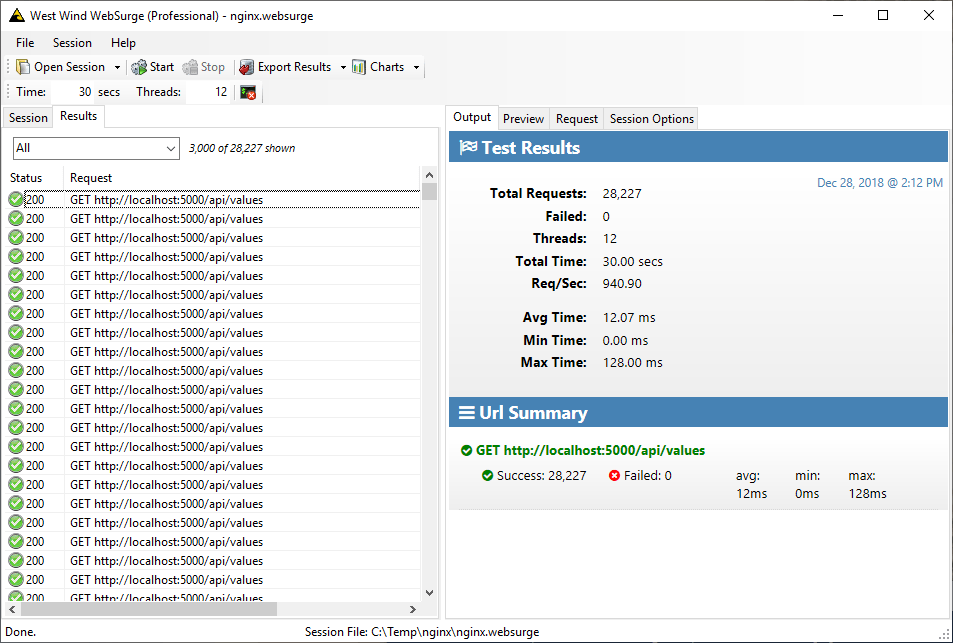

# Don't let ASP.NET Core Console Logging Slow your App down

Earlier today I put my foot in my mouth on Twitter by running a quick and dirty perf test application to check out a question from a customer, without properly setting up configuration.

[](https://twitter.com/RickStrahl/status/1078793072492797953)

Specifically I ran my application directly out of the Release folder **without first publishing** and while that works to run the application, it doesn't copy over the configuration files. Since there was no configuration, ASP.NET Core started the console app without any explicit logging overrides and I got the default Console logging configuration which **produced a crap-ton of Console log messages** which in turn slowed the application under load to a crawl.

How slow? Take a look:



<small>**Figure 1** - Load testing with `Information` Console: **940 req/sec**</small>


<small>**Figure 2** - Load testing with `Warning` Console: **37,000+ req/sec**</small>

* With Logging (Information): **<1k req/sec**
* Without Logging (Warning): **37k+ req/sec**

Yup, that's nearly a 40x difference in these admittedly small do-nothing requests. Even with the async logging improvements in .NET Core 2.x Console logging is very, very slow when it is set to `Information` or worse `Debug`. The default ASP.NET Core default if there's no configuration at all is `Information`. Not cool! 

Luckily the default templates handle setting the Log level to `Warning` in production, but the raw default is still a headscratcher.

> **Moral of the story**: Make sure you know what your Console logger is doing in your application and make sure it's turned down to at least `Warning` or off in production apps.

##AD##

### Operator Error: Missing Configuration
My error was that I tried to be quick about my test, simply compiling my tiny project and running it out of the **Release** folder. That works, but it's generally not recommended for an ASP.NET Core application. 

ASP.NET Core applications **should be published**  with `dotnet publish` which creates a self contained folder structure that includes all the dependencies and support files and folders that are needed for the application to run. In Web applications that tends to be the `wwwroot` folder, the runtime dependency graph and configuration files.

In this case specifically `dotnet publish` copies the `appsettings.json` configuration file(s) which is what I was missing to get the default Console `Information` logging behavior. 

The default `dotnet new` template for Production (appsettings.json) sets the default logging level to `Warning`:

```json
{
  "Logging": {
    "LogLevel": {
      "Default": "Warning"
    }
  }
}
```

which is appropriate for Production at runtime. And this works fine producing only console output on warnings and errors which should be relatively rare.

Here's the bummer though: 

> #### @icon-info-circle ASP.NET Core's default logging level is `Information`
> By default if you don't apply explicit configuration (configuration file, environment vars, manual etc.), it will log a `Information` level messages which equals a ton of crap that you are unlikely to care about in the console or any other logging source in production.

## Overriding Logging Behavior in ASP.NET Core
Logging is an important part of any application and ASP.NET Core introduces very nice logging infrastructure that is useful out of the box and allows for powerful extensibility via clearly defined and relatively easy to implement interfaces.

### The Console Logger
One of the provided logging providers is the **Console Logger** which outputs logging information to the terminal. This is very useful during development as you can see exception information and log your own status information to the console for easy tracing and debugging.

It can also be useful in production. Even if you normally run your application behind a proxy normally it's possible to spin up the application from a terminal and potential check for terminal output directly. This can be especially useful for debugging startup errors. I've had to do that on a few occasions with IIS hosted applications because IIS failed to connect due the app not spinning up properly on the host.

Otherwise, realistically a Console logger is not the most useful thing in Production. The default configuration creates a Console logger regardless of configuration and there's no easy way to just remove a single logger. Rather you have to rebuild the entire logging configuration yourself (which is not that difficult but not all that obvious).

##AD##

### Console Logging is Very Slow
The problem with Console logging is that logging to the console is dreadfully slow at least on Windows as I showed above. In the past the biggest issue was that the Console (using `System.Console.WriteLine()`) is a sequential blocking call and under load that blocking is enough to seriously slow down request processing. 

In .NET Core 2.0 and later improvements were made to provide a queue in front of the console and asynchronously log in a background thread writing out to the actual Console. Although that improved performance some the queue itself is also blocking so there's overhead there as well and performance still is quite slow potentially throttling request throughput.

### Default Logging Configuration
The good news is if you create new ASP.NET Core 2.x project the default configuration for production does the right thing by setting the logging level to `Warning` in `applicationsettings.json`:

```json
{
  "Logging": {
    "LogLevel": {
      "Default": "Warning"
    }
  }
}
```

The development version in `applicationsettings.Development.json` is more liberal and writes a lot more logging output:

```json
{
  "Logging": {
    "LogLevel": {
      "Default": "Debug",
      "System": "Information",
      "Microsoft": "Information"
    }
  }
}
```

Logging levels are incremental so Trace logs everything, Warning logs Warning, Error and Critical, and None logs... well none. 

* Trace
* Debug
* Information
* Warning
* Error
* Critical
* None

So far so good.

What if you have no `applicationsettings.json` and no other configuration overrides? In this case the default is `Information` meaning a lot of logging happens to Console and this is how I ended up with this post.

## Turning Off Console Logging
You can turn off console logging in a number of ways:

* appsettings.json
* custom logging configuration
* removing the console log provider

### Using Configuration
The easiest way to get control over your Console logging is to simply turn down your Logging volume by setting the logging level to `Warning` or `Error`. Any lower than that - `Information` or `Debug` - should really just be used during development or in special cases when you need to track down a hard to find bug. In Production there should rarely be a need to do information/debug level logging.

Any changes you make to the configuration settings either in `appsettings.json` or any other configuration providers like environment variables, affects all Logging providers that are configured. By default ASP.NET Core configures `DebugLogger`, `ConsoleLogger` and `EventSourceLogger`. Any logging level settings affect all of these providers by default.

Using the configuration settings in `appsetting.json` and setting to `Warning` was enough to get my scrappy test application to run at full throttle closer to the 37k request/sec.

### Where does Default Logging Configuration come from
The default logging configuration originates in the ASP.NET Core's default configuration which is part of the  `WebHost.CreateDefaultBuilder()` configuration during the host startup in `program.cs`:

```cs
public static IWebHostBuilder CreateWebHostBuilder(string[] args) =>
                WebHost.CreateDefaultBuilder(args)
                .UseStartup<Startup>();
```                

You can take a look at what the default builder does by source stepping (or decompiling) `WebHost.CreateDefaultBuilder()`. The relevant logging configuration code in the default `WebHost` looks like this:

```csharp
.ConfigureLogging((Action<WebHostBuilderContext, ILoggingBuilder>) ((hostingContext, logging) =>
      {
        logging.AddConfiguration((IConfiguration) hostingContext.Configuration.GetSection("Logging"));
        logging.AddConsole();
        logging.AddDebug();
        logging.AddEventSourceLogger();
      }))
```
##AD##

### Overriding the Default Logging Configuration
If that default setup doesn't suit you you can clear everything out and configure your own logging stack from scratch by doing something like the following in your  `Startup.ConfigureServices()` method:

```csharp
public void ConfigureServices(IServiceCollection services)
{
    services.AddLogging(config =>
    {
        // clear out default configuration
        config.ClearProviders();

        config.AddConfiguration(Configuration.GetSection("Logging"));
        config.AddDebug();
        config.AddEventSourceLogger();
        
        if(Environment.GetEnvironmentVariable("ASPNETCORE_ENVIRONMENT") == EnvironmentName.Development) 
        {
        	config.AddConsole();
        }
    });

    ... 
}
```

There are no `config.RemoveProviderXXX()` functions - once created the logging configuration has to be cleared and effectively rebuilt completely, and since the default config sets this up, any changes pretty much require this type of code.

You can control the logging levels via configuration, but you can't add or remove providers that way, so if you need custom providers or want to remove provider like say the Console provider in production you have to do it in code.

## Summary
What I've covered here is probably an odd edge case that you may never see, but it's one that can bite you when you're not paying attention. It's a good reminder that Console logging can have a big performance hit for little benefit. There are more efficient ways to log and other than for on site debugging there's not much use for console logging in the first place at least running in production.

Ah, the little consolations in life... they always come back to bite 'ya!