---
title: Marking up the World with Markdown and FoxPro
abstract: This post contains my session notes for the Southwest Fox 2018 session **Marking up the World with Markdown**. This article provides an overview of what Markdown is and why it is useful for generic writing tasks as well as for integration into FoxPro or Web applications. Markdown is immensely popular these days as a text entry format and in this post you learn how you can easily use it from your own FoxPro and more importantly why you might want to use it in the first place.
categories: FoxPro
keywords: Markdown, FoxPro, Web Connection
weblogName: Web Connection Weblog
postId: 946
postDate: 2018-12-17T13:43:50.3344962-10:00
---
# Marking up the World with Markdown and FoxPro


<div style="font-size: 0.875em;margin-bottom: 30px; margin-top: 10px;">

*prepared for:*  [Southwest Fox 2018](http://www.swfox.net/)  
*October 1st, 2018*

</div>
  
Markdown has easily been one of the most influential technologies that have affected me in the last few years. Specifically it has changed how I work with documentation and a number of documents both for writing and also for text editing and content storage inside of applications.

Markdown is a plain text representation of HTML typically. Markdown works using a relatively small set of easy to type markup mnemonics to represent many common document centric HTML elements like bold, italic, underlined text, ordered and unordered lists, links and images, code snippets, tables and more. This small set of markup directives is easy to learn and quick to type in any editor without special tools or applications.

In the past I've been firmly planted in the world of rich text editors like Word, or using a WYSIWYG editor on the Web, or for Blog Editing using something like Live Writer which used a WYSIWYG editor for post editing. When I first discovered Markdown a number of years ago, I very quickly realized that rich editors, while they look nice as I type, are mostly a distraction and often end up drastically slowing down my text typing. When I write the most important thing to me is getting my content onto the screen/page as quickly as possible and having a minimal way to do this is more important than seeing the layout transformed as I type. Typing text is oddly freeing, and with most Markdown editors is also much quicker than using a rich editor. I found that Markdown helped me in a number of ways to improve my writing productivity.

Pretty quickly I found myself wishing most or all of my document interaction could be via Markdown. Even today I often find myself typing Markdown into email messages, comments on message boards and even into Word documents where it obviously doesn't work.

> For me Markdown was highly addictive. I wanted Markdown in all the places!

Today I write most of my documentation for products and components using Markdown. I write my blog posts using Markdown. The West Wind Message Board uses Markdown for messages that users can post. I enter product information in my online store using - you guessed it - Markdown. This document you're reading now, was written in Markdown as well.

I work on three different documentation tools and they all use Markdown, one with data stored in FoxPro tables, the others with Markdown documents on disk. Heck I even wrote a popular Markdown Editor called [Markdown Monster](https://markdownmonster.west-wind.com) to provide an optimized editing experience, and it turns out I'm not alone in using Markdown with some cool support features that I can build myself because Markdown is a non-proprietary format that can be easily enhanced because it's easy to simple inject text into a text document.

<div style="page-break-after: always;"></div>

## What is Markdown?
I gave a brief paragraph summary of Markdown above. Let me back this up with a more thourough discussion of what Markdown is. Let's start with a quick look at what Markdown looks like here inside of a Markdown editor that provides syntax highlighting for Markdown:

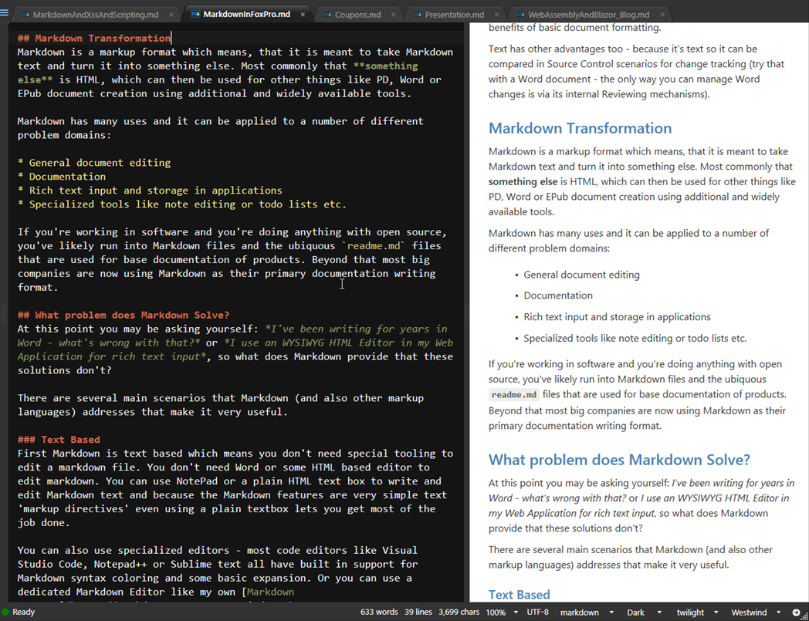

There are of course many more features to Markdown, but this gives you an idea what Markdown content looks like. You can see that the Markdown contains a number of simple formatting directives, yet the document you are typing is basically text and relative clean. Even so you are looking at the raw Markdown which includes **all** of the formatting information.

And this is one of the big benefits of Markdown: You're working with text using the raw text markup format while at the same time working in a relatively clean document that's easy to type, edit and read. In a nutshell: There's no magic hidden from you with Markdown!

Let's drill into what Markdown is and some of the high-level benefits it offers:

### HTML Output Based
Markdown is a plain text format that *typically* is rendered into HTML. HTML is the most common output target for Markdown. In fact, Markdown is a superset of HTML and you can put **raw HTML** inside of a Markdown document.

However there are also Markdown parsers that can directly create PDF documents, ePub books, revealJS slides and even WPF Flow Layout documents. How Markdown is parsed and used is really up to the Parser that is used to turn Markdown into something that is displayed to the user. Just know that the initial assumption is that they output is HTML. For the purpose of this document we only discuss Markdown as an HTML output renderer.

Although Markdown is effectively a superset of HTML - it supports raw HTML as part of a document - Markdown is not a replacement for HTML content editing in general. Markdown does great with large blocks of text based such as documentation, reference material, or on Web sites for informational content like About pages, Privacy Policies and the like that are mostly text. Markdown's markup can represent many common writing abstractions like bold text, lists, links, images etc. but the markup itself outside of raw HTML doesn't have layout support. IOW, you can't easily add custom styling, additional HTML `<div>` elements and so on. Markdown is all about text and few most-used features appropriate for text editing.

### Plain Text
One of the greatest features of Markdown is that it's simply plain text. This means you don't need a special editor to edit it. Notepad or even an Editbox in FoxPro or a `<textarea>` in a Web application is all you need to edit Markdown. It works **anywhere**!

If you need to edit content and want to create HTML output, Markdown is an easy way to create that HTML output by using a Markdown representation of it as plain text. Markdown is text centric so it's meant primarily for text based documents.

Markdown offers a great way to edit content that needs to display as HTML. But rather than editing HTML tag soup directly, Markdown lets you write mostly plain text with only a few easy to remember markup text "symbols" that signify things like bold and italic text, links, images headers and lists and so on. The beauty of Markdown is that it's very readable and editable as plain text, and yet can still render nice looking HTML content. For editing scenarios it's easy to add a previewer so you can see what you're typing without it getting in the way of your text content.

> Markdown makes it easy to represent text centric HTML output as easily typeable, plain text.

### Simplicity
Markdown is very easy to get started with, and after learning less than a handful of common Markdown markup commands you can be highly productive. Most of the mark up directives feel natural because a number of them have already been in use in old school typesetting solutions for Unix/Dos etc. For the most part content creation is typing plain text with a handful of common markup commands - bold, italic, lists, images, links are the most common -  mixed in.

### Raw Document Editing
With Markdown you're always editing the raw document. The big benefit is **you always see what the markup looks like** because you are editing the raw document not some rendered version of it. This means if you use a dedicated Markdown Editor that helps embedding tags for you **you can see the raw tags that are embedded** as is. This makes it easy to learn Markdown because even if you use editor tooling you immediately see what that tooling does. Once you get familiar, many markdown 'directives' are quicker to simply type inline rather than relying on hotkeys or toolbar selections.

### Productivity  
Markdown brings big productivity gains due to the simplicity involved in simply typing plain text and **not having to worry about formatting while writing**. To me (and many others) this can't be overstated. I write a lot of large documents and this this is a s a minimalist approach. But to me this greatly frees my mind from unneeded clutter to focus on the content I'm trying to create.

### Edit with any Editor or Textbox
Because Markdown is text, you don't need to use a special tool to edit it - any text editor, even NotePad will do, or if you're using it in an application a simple textbox does the trick in desktop apps or Web apps. It's also easy to enhance this simple interface with simple convenience features and because it's just plain text it's also very easy to build custom tooling that can embed complex text features like special markup, equations or publishing directives directly into the document. This is why there is a lot of Markdown related tooling available.

### Easy to Compare and Share
Because Markdown is text it can be easily compared using Source Control tools like Git. Markdown text is mostly content, unlike HTML so source code comparisons aren't burdened by things HTML tags or worse binary files like Word.

### Fast Editing
Editing Markdown text tends to be very fast, because you are essentially editing plain text. Editors can be bare bones and don't need to worry about laying out text as you type, slowing down your typing speed. As a result Markdown editors tend to feel very fast and efficient without keyboard lag. Most WYSIWYG solutions are dreadfully slow for typing (the big exception being Word because it uses non-standard keyboard input trapping).

### Developer Friendly
If you're writing developer documentation one important aspect is adding syntax colored code snippets. If you've used Word or a tool that uses a WYSIWYG HTML editor you know what a pain it can be for getting properly color coded code into a document.

Markdown has native support for code blocks as part of Markdown syntax which allows you to simply paste code into the document as text and let the Markdown rendering handle how to display the syntax. The generated output for code snippets uses a commonly accepted tag format:

```html
<pre><code class="language-html">
lcId = SYS(2015)
</code></pre>
```

There are a number of JavaScript libraries that understand this syntax formatting and easily can turn this HTML markup in syntax highlighted code. I use [highlightJS](https://highlightjs.org/) - more on that later.

## Markdown Transformation
Markdown is a markup format which means, that it is meant to take Markdown text and turn it into something else. Most commonly that **something else** is HTML, which can then be used for other things like PD, Word or EPub document creation using additional and widely available tools.

Markdown has many uses and it can be applied to a number of different problem domains:

* General document editing
* Documentation
* Rich text input and storage in applications
* Specialized tools like note editing or todo lists etc.

If you're working in software and you're doing anything with open source, you've likely run into Markdown files and the ubiquitous `readme.md` files that are used for base documentation of products. Beyond that most big companies are now using Markdown as their primary documentation writing format.

## What problem does Markdown Solve?
At this point you may be asking yourself: *I've been writing for years in Word - what's wrong with that?* or *I use an WYSIWYG HTML Editor in my Web Application for rich text input*, so what does Markdown provide that these solutions don't?

There are several main scenarios that Markdown (and also other markup languages) addresses that make it very useful.

### Text Based
First Markdown is text based which means you don't need special tooling to edit a markdown file. You don't need Word or some HTML based editor to edit markdown. You can use NotePad or a plain HTML text box to write and edit Markdown text and because the Markdown features are very simple text 'markup directives' even using a plain textbox lets you get most of the job done.

You can also use specialized editors - most code editors like Visual Studio Code, Notepad++ or Sublime text all have built in support for Markdown syntax coloring and some basic expansion. Or you can use a dedicated Markdown Editor like my own [Markdown Monster](https://markdownmonster.west-wind.com).


## Using Markdown in FoxPro
In order to use Markdown in any environment you need to use a Markdown parser that can convert Markdown into HTML. Once it's in HTML you need to use the HTML in manner that is useful. For Web applications that usually is as easy as embedding the HTML into a document, but there are number of different variations. 

In desktop applications you often need a WebBrowser control or external preview to see the Markdown rendered in a useful way.

### Markdown Parsing for FoxPro
The best option for Markdown Parsing for FoxPro is to use one of the many .NET based Markdown parsers that are available. I'm a big fan of the [MarkDig Markdown Parser](https://github.com/lunet-io/markdig) because it includes a ton of support features like Github flavored Markdown that is generally used, various table formats, link expansion, auto-id generation and fenced code blocks out of the box. Markdig is also extensible so it's possible to create custom extensions that can be plugged into Markdigs Markdown processing pipeline.

To access this .NET component from FoxPro I'm going to use wwDotnetBridge. There are a couple of different ways to deal with Markdown parsing, but lets start with the simplest which is just to use the built-in 'just do it' function that Markdig itself provides:

```foxpro
do wwDotNetBridge
LOCAL loBridge as wwDotNetBridge
loBridge = GetwwDotnetBridge()
loBridge.LoadAssembly("Markdig.dll")

TEXT TO lcMarkdown NOSHOW
# Markdown Sample 2
This is some sample Markdown text. This text is **bold** and *italic*.

* List Item 1
* List Item 2
* List Item 3

Great it works!

> ### @icon-info-circle Examples are great
> This is a block quote with a header

Here's a quick code block

```foxpro
lnCount = 10
FOR lnX = 1 TO lnCount
   ? "Item " + TRANSFORM(lnX)
ENDFOR
ENDTEXT

lcHtml = loBridge.InvokeStaticMethod("Markdig.Markdown","ToHtml",lcMarkdown,null)
? lcHtml
RETURN
```

#### Markdown Output
This is the raw code to access the Markdig dll and load it, then call the `MarkDig.Markdown.ToHtml()` function to convert the Markdown into HTML. It works and produces the following HTML output:

```html
<h1>RAW MARKDOWN WITH Markdig</h1>
<p>This is some sample Markdown text. This text is <strong>bold</strong> and <em>italic</em>.</p>
<ul>
<li>List Item 1</li>
<li>List Item 2</li>
<li>List Item 3</li>
</ul>
<p>Great it works!</p>
<blockquote>
<h3>Examples are great</h3>
<p>This is a block quote with a header</p>
</blockquote>
```

which looks like this:

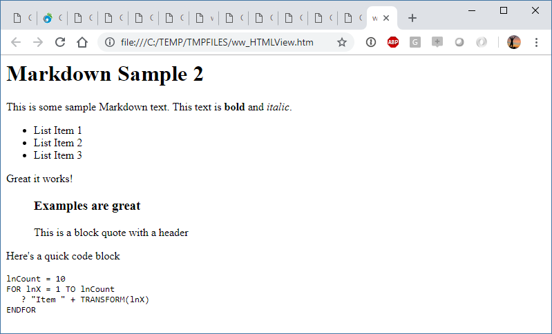

Keep in mind that Markdown rendering produces an **HTML Fragement** which doesn't look very nice because it's just HTML without any formatting applied. There's no formatting for the base HTML, and the code snippet is just raw text. To make this look a bit nicer we need to apply some formatting.

Here's that same HTML fragment rendered into a full HTML page with [Bootstrap](http://getbootstrap.com/docs/4.1/getting-started/introduction/), [highlightJs](https://highlightjs.org/) and a little bit of custom formatting applied:

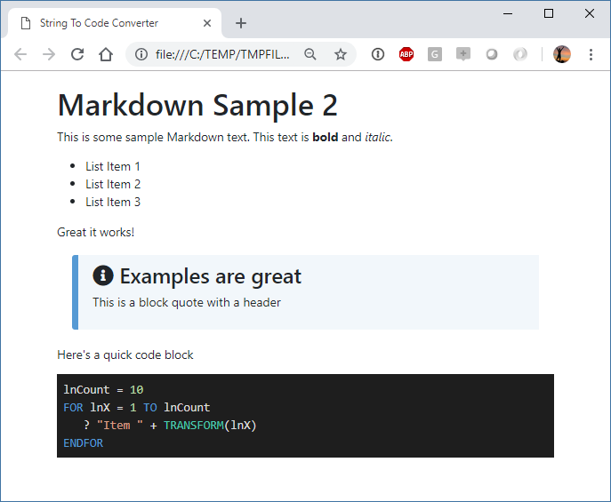

This looks a lot nicer. The idea of this is to use a small template and merge the rendered HTML into it. Here's some code that uses a code based template (although I would probably store the template as a file and load it for customization purposes):

Here's the template:

```html
<!DOCTYPE html>
<html>
<head>
    <title>String To Code Converter</title>
    <link href="https://unpkg.com/bootstrap@4.1.3/dist/css/bootstrap.min.css" rel="stylesheet" />
    <link rel="stylesheet" href="https://use.fontawesome.com/releases/v5.3.1/css/all.css">
    <style>
        body, html {
            font-size: 16px;
        }
        body {
            margin: 10px 40px;
        }
        blockquote {
		    background: #f2f7fb;
		    font-size: 1.02em;
		    padding: 10px 20px;
		    margin: 1.2em;
		    border-left: 9px #569ad4 solid;
		    border-radius: 4px 0 0 4px;
		}
        @media(max-width: 600px) 
        {
            body, html {
                font-size: 15px !important;
            }
            body {
                margin: 10px 10px !important;                
            }
        }
    </style>
</head>
<body>
	<div style="margin: 20px 5%">
		<%= lcParsedHtml %>
	</div>
	
	<script src="https://weblog.west-wind.com/scripts/highlightjs/highlight.pack.js" type="text/javascript"></script>
	<link href="https://weblog.west-wind.com/scripts/highlightjs/styles/vs2015.css" rel="stylesheet" type="text/css" />
	<script>
		function highlightCode() {
		    var pres = document.querySelectorAll("pre>code");
		    for (var i = 0; i < pres.length; i++) {
    		    hljs.highlightBlock(pres[i]);
	    	}
		}
		highlightCode();
	</script>	
</body>
</html>
```

and here is the code that parses the Markdown and merges into the template. Notice the `<%= lcParsedHtml %>` tag that is responsible for merging the parsed HTML into the template

```foxpro
DO MarkdownParser

TEXT TO lcMarkdown NOSHOW
# Markdown Sample 2
This is some sample Markdown text. This text is **bold** and *italic*.

* List Item 1
* List Item 2
* List Item 3

Great it works!

> ### @icon-info-circle Examples are great
> This is a block quote with a header

ENDTEXT

lcParsedHtml = Markdown(lcMarkdown,2)
? lcParsedHtml

lcTemplate = FILETOSTR("markdownpagetemplate.html")

*** Ugh: TEXTMERGE mangles the line breaks for the code snippet so manually merge
lchtml = STRTRAN(lcTemplate,"<%= lcParsedHtml %>",lcParsedHtml)
showHtml(lcHtml)
```

> ### Beware of TEXTMERGE
> FoxPro's `TextMerge` command can have some odd side effects - when using `<< lcParsedHtml >>` in the example above, `TEXTMERGE` mangled the line breaks running text together instead of properly breaking lines based on the Markdown `\n` linefeed only output. When merging output from an Markdown parser into an HTML document, explicitly replace the content rather than relying on `TEXTMERGE`.

#### Using the underlying Parsing
The `Markdown()` function is very easy and it uses a cached instance of the parser so the Markdown object doesn't have to be configured for each use. If you want a little more control you can the underlying `MarkdownParser` class directly. This is a little more verbose but gives a little more control.

```foxpro
TEXT TO lcMarkdown NOSHOW
This is some sample Markdown text. This text is **bold** and *italic*.

* List Item 1
* List Item 2
* List Item 3


<script>alert('Gotcha!')</script>
Great it works!

> ####  Examples are great
> This is a block quote with a header
ENDTEXT

loParser = CREATEOBJECT("MarkdownParser")
loParser.lSanitizeHtml = .T.
lcParsedHtml = loParser.Parse(lcMarkdown)

? lcParsedHtml
ShowHtml(lcParsedHtml)
```

There's also a `MarkdownParserExtended` class that adds a few additional features, including support for FontAwesome Icons via `@icon-icon-name` syntax and special escaping of `<%= %>` which are removed from the document before the Markdown Parser runs so it doesn't interfere with the parser.

#### Sanitizing HTML
Because Markdown is a superset of HTML, you should treat all Markdown captured from users as dangerous.

Let me repeat that:

> #### User Captured Markdown has to be Sanitized
> Any user input you capture from users as Markdown that will be displayed on a Web site later should be treated just like raw HTML input - it should be considered dangerous and susceptible to Cross Site Scripting (XSS) Attacks.

You might have noticed the code above that does:

```foxpro
loParser.lSanitizeHtml = .T.
```

which enables HTML sanitation of the Markdown before it is returned. This flag force `<script>` tags, `javascript:` directives and any `onXXXX=` events to be removed from the output HTML. This is the **default setting** and it's always what's used when you call the `Markdown()` function. 

Sanitation should usually be on which is why it's the default, but there are a few scenarios where it makes sense to have this flag off. If you are in full control of the content you might have good reason to embed scripts. For example, I use Markdown for Blog posts and occasional I link to code my own snippets on [gist.github.com](https://gist.github.com), which requires `<script>` tags to embed the scripts. 

If the content you create is controlled, then this not a problem. In this case I'm the only consumer. If you use Markdown for product descriptions in your product catalog, and the data is all internally created then it's probably safe to allow scripts. But even so - if you don't have scripts, don't allow them. Better safe than sorry - always!

### Static Markdown in Web Connection
In addition to the simple Markdown Parsing, if you're using Web Connection there are a couple of useful features built into the framework that let you work with Markdown content.

* **Static Markdown Islands in Scripts and Templates**
* **Static Markdown Pages**  

If you're building Web sites you probably you probably have a bit of static content. Even if your site is mostly dynamic, almost every site has a number of static pages, or a bunch content that is just text like disclaimers or maybe some page level help content. Markdown is usually much easier to type than HTML markup for this lengthy text.

#### Markdown Islands 
Web Connection Scripts and Templates support a special `<markdown>` tag. Basically you can embed a small block of Markdown into the middle of a larger Script or Template:

```html
<markdown>
	> ##### Please format your code
	> If your post contains any code snippets, you can use the `<\>` button
	> to select your code and apply a code language syntax. It makes it 
	> **much easier** for everyone to read your code.
</markdown>
```

This can be useful if you have an extended block of text inside of a greater page. For example you may have a download page that shows a rich HTML layout for download options, but the bottom half of the page, has disclaimers, licensing and other stuff that's mostly just text (perhaps with very little HTML mixed in which you can do inside of Markdown). Here's that example:

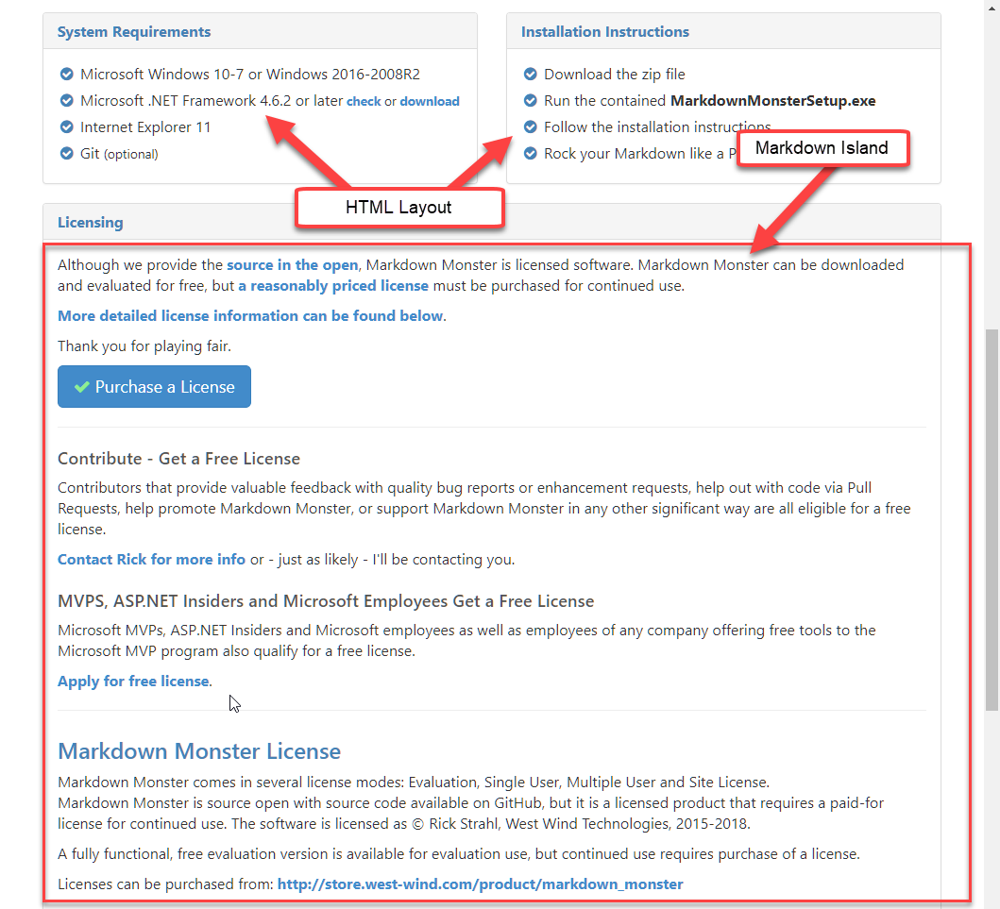

#### Static Markdown Pages
Sometimes you simply want to add a static page that is all or mostly text. Think about your About page, privacy policy, licensing pages etc. There are other more dynamic use cases as well. For example, you might want to create blog entries as Markdown Pages and simply store them on the server by dropping the page into a folder along with its related assets.

As of Web Connection 6.22 you can now drop a `.md` file into a folder and Web Connection will serve that file as an HTML document.

There's a new `.md` script map that Web Connection adds by default. For existing projects you can add the `.md` scriptmap to your existing scriptmaps for your site and then update the wwScripting class from your Web Connection installation.

There's also a new `~/Views/MarkdownTemplate.wcs`, which is a script page into which the Markdown is rendered. Web Connection then generically maps any incoming `.md` extension files to this template and renders the Markdown into it.

The template can be extremely simple:

```html
<%
    pcPageTitle = IIF(type("pcTitle") = "C", pcTitle, pcFilename)
%>
<% Layout="~/views/_layoutpage.wcs" %>

<div class="container">
    <%= pcMarkdown %>
</div>
```

This page simply references the master Layout page and then creates a bootstrap container into which the markdown is rendered. There are two variables that are passed into the template `pcMarkdown` and `pcTitle`. The title is extracted from the document either by looking for a Yaml `title` header:

```markdown
---
title: Markdown in FoxPro
postId: 432
---
# Markdown in FoxPro
Markdown is... and blah blah blah 
```

or for the first `# Header` element towards the top of the document (first 1500 chars).

Once the scriptmap and template are in place you can now simply place a `.md` document into the site's folder structure and it'll be served as HTML when referenced via the browser.

For the following example, I took an existing blog post I'd written in Markdown Monster as a Markdown file.  I set up a folder structure for blog posts that include parts for paths and simply dropped the existing Markdown file and its associated images inot that folder:

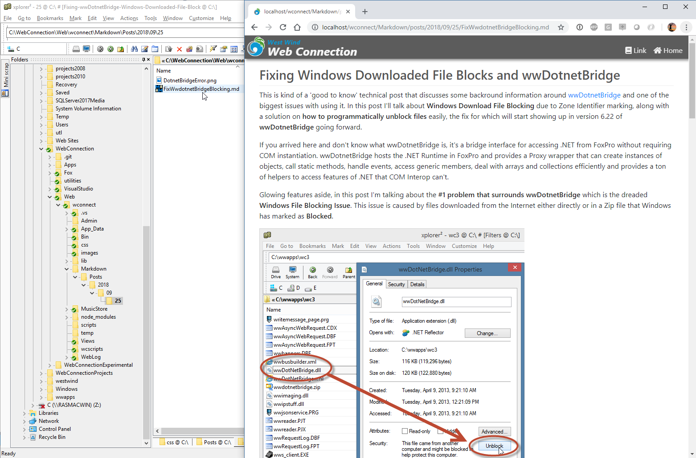

And voila - I can now access this file at the specified URL:

```text
https://localhost/wconnect/Markdown/posts/2018/09/25/FixwwDotnetBridgeBlocking.md
```

The folder structure provides the URL sections that fixes the post uniquely in time which is common for Blog posts. This is an easy way to add a blog to a Web site without much effort at all. Simply write Markdown as a file and copy it to the server. For bonus points integrate this with Git to allow posts to be edited and published using Git.

## Using Markdown in Applications
Let's look at a few examples how I use Markdown in my own applications.

### West Wind Support Message Board
In a Web Application it's easy to use Markdown and just take the output and stuff it into part of your rendered HTML page.

For example, on my message board I let users enter Markdown for messages that are then posted and displayed on the site:

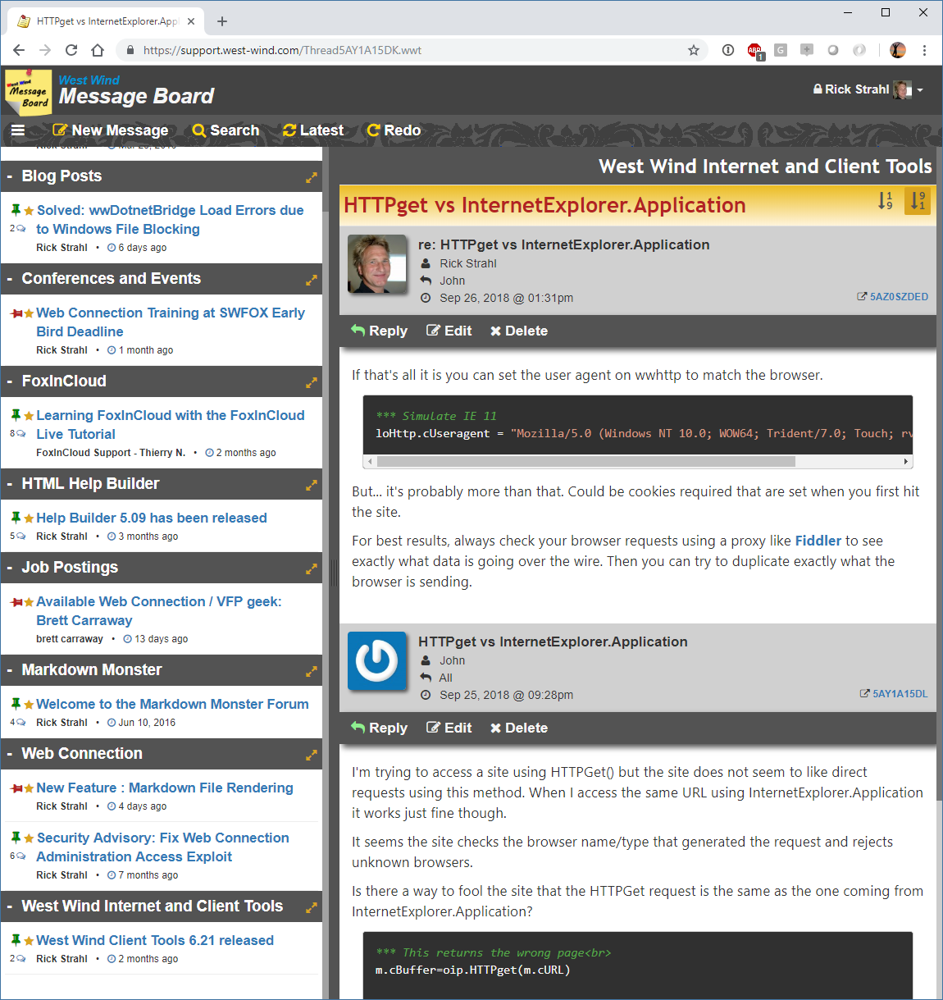

The message board is available as a Web Connection sample site on GitHub:

* [West Wind Message Board Source on GitHub](https://github.com/RickStrahl/West-Wind-Message-Board)

The site displays each thread as a set of messages, with each message displaying it's own individual Markdown content. This is a Web Connection application that uses a templates.

The Process class code just retrieves all the messages into a cursor from a business object and then uses Script Page to render the output:

```foxpro
FUNCTION Thread(lcThreadId)
LOCAL loMsgBus

pcMsgId = Request.QueryString("msgId")

loMsgBus = CREATEOBJECT("wwt_Message")
lnResult = loMsgBus.GetThreadMessages(lcThreadId)

IF lnResult < 1
   Response.Redirect("~/threads.wwt")
   RETURN
ENDIF

PRIVATE poMarkdown
poMarkdown = THIS.GetMarkdownParser()

Response.GzipCompression = .T.

*** Don't auto-encode - we manually encode everything
*** so that emojii's and other extendeds work in the
*** markdown text
Response.Encoding = ""
Response.ContentType = "text/html; charset=utf-8"

Response.ExpandScript("~/thread.wwt")
```

This retrieves a list of messages that belong to the thread and the template loops through them and displays Markdown for each of the messages (simplified):

```html
<%
    pcPageTitle = STRCONV(subject,9) + " - West Wind Message Board"
    pcThreadId = Threadid
%>
<% Layout="~/views/_layoutpage.wcs" %>

<div class="main-content">
    ...  page header omitted
    
    <div class="thread-title page-header-text" style="margin-bottom: 0;">
        <%: TRIM(Subject) %>
    </div>

    <!-- Message Loop -->
    <%
    lnI = 0
    SCAN
       lnI = lnI + 1
    %>
    
    <div id="ThreadMessageList">              
        <article class="message-list-item" data-id="<%= msgId %>" data-sort="<%= lnI %>">
            
            ... header omitted
            
            <!-- Render the Message Markdown here -->
            <div class="message-list-body">
                <%=  poMarkdown.Parse(Message,.T.) ) %>
            </div>
        </article>
    </div>
    <% ENDSCAN %>
</div> 
```

Note that I'm not using the Markdown function directly, as I'm doing some custom setup and I also want to explicitly force the output to UTF-8 as part of the parsing process (the `.T.` parameter). The reason I'm using a custom function is that I need to explicitly strip out `<% %>` scripts before rendering so that they don't get executed as part of user input. I also want all links to automatically be opened in a new window called `wwt` by having a target added to each and every link tag.

In short I need a customized parser and the generic `Markdown()` function doesn't quite provide what I need, so I implement my own version that is customize to my needs. 

```
PROTECTED FUNCTION GetMarkdownParser()
LOCAL loMarkdown

PUBLIC __wwThreadsMarkdownParser
IF VARTYPE(__wwThreadsMarkdownParser) = "O"
   loMarkdown = __wwThreadsMarkdownParser
ELSE
	loMarkdown =  CreateObject("MarkdownParserExtended")
	loMarkdown.lFixCodeBlocks = .T.
	loMarkdown.cLinkTarget = "wwt"
	__wwThreadsMarkdownParser = loMarkdown
ENDIF

RETURN loMarkdown
ENDFUNC
```

This is very similar to what `Markdown()` does internally, but customized to my own needs. It still caches the parser instance in a global variable so it doesn't have to be recreated for each and every serving which improves performance.

#### Entering Markdown
The message board also captures Markdown text when users write a new message:


The data entry here is a simple `<textarea></textarea>`. As mentioned Markdown is just text, so a `<textarea>` works just fine. 

```html
<textarea id="Message" name="Message"
        style="min-height: 350px;padding: 5px; 
        font-family: Consolas, Menlo, monospace; border: none;
        background: #333; width: 100% ; color: #fafafa"
        ><%= Request.FormOrValue('Message',poMsg.Message) %></textarea>
```

I simply changed the color scheme to use black on white just to make it more 'terminal like' (I happen to like dark themes if you haven't noticed :-)).  There is also logic to insert special Markdown into the textbox [via selections using JavaScript](https://github.com/RickStrahl/West-Wind-Message-Board/blob/master/web/scripts/WriteMessage.js#L265) and key shortcuts, but that's just a bonus.

The text is previewed as you type on the client side using a JavaScript component ([marked Js](https://github.com/markedjs/marked)) that simply redisplays as the user types a message. Oddly enough - people still seem to screw up posting code constantly, even though the buttons are pretty prominent as the is the message below. Go figure.


### Using Markdown for Inventory Item information
A common use case for Markdown is to use it even in desktop applications that need to handle rich information. For example, in my Web Store I use Markdown for the item descriptions that are displayed in the store. I also have an offline application that I primarily use to manage my orders and inventory. The inventory form allows me to enter markdown text as plain text. There's a simple preview button that lets me simply see the content in the default browser. 

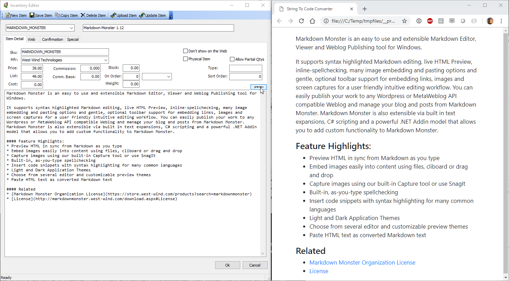

If it's all good I can upload the item to my Web Server via a Web service and look at the item online where the Markdown is rendered using Markdig as shown before (but using .NET in this case).

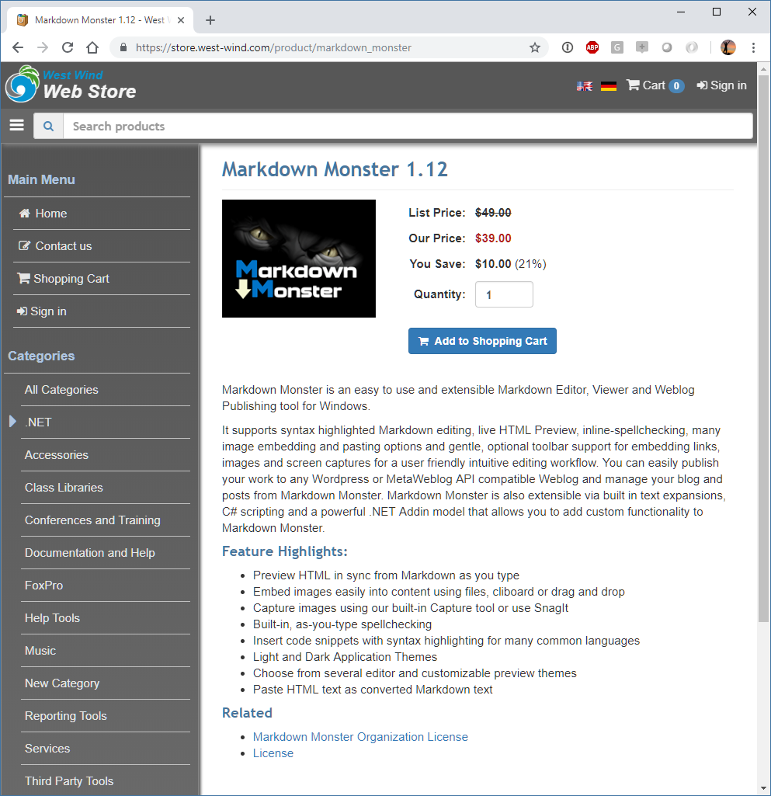

The desktop application doesn't use Markdown in other places so here I just do the simplest thing possible in .NET code:

```csharp
private void btnPreview_Click(object sender, EventArgs e)
{
    var builder = new MarkdownPipelineBuilder()
        .UseEmphasisExtras()
        .UsePipeTables()
        .UseGridTables()
        .UseAutoLinks() // URLs are parsed into anchors
        .UseAutoIdentifiers(AutoIdentifierOptions.GitHub) // Headers get id="name" 
        .UseAbbreviations()
        .UseYamlFrontMatter()
        .UseEmojiAndSmiley(true)
        .UseMediaLinks()
        .UseListExtras()
        .UseFigures()
        .UseCustomContainers()
        .UseGenericAttributes();

    var pipeline = builder.Build();
    
    var parsedHtml = Markdown.ToHtml(Item.Entity.Ldescript,pipeline);

    var html = PreviewTemplate.Replace("${ParsedHtml}", parsedHtml);
    ShellUtils.ShowHtml(html);
}
```

`ShellUtils.ShowHtml(html);` is part of [Westwind.Utilites](https://github.com/RickStrahl/Westwind.Utilities) and simply takes an HTML fragment or a full HTML document and dumps it to a file, then shows that file in the default browser which is the browser window shown in the previous figure.

### Using HTML for Documentation
As mentioned Markdown is great for text entry and documentation creation is the ultimate writing excercise. There are a couple of approaches that can be taken with this. I've two separate tools related to documentation: 

* **West Wind Html Help Builder**  
An older FoxPro application that stores documentation content in FoxPro tables. The application was updated a while back to use Markdown for all memo style text entry.

* **KavaDocs**  
This is a newer tool still under development that uses Markdown files on disk with embedded meta data to hold documentation and related data. The system is based on Git to provide shared editing functionality and collaboration. There are also many integrations with other technologies.


#### Help Builder and Traditional Help Systems
Help Builder uses FoxPro tables and is a self-contained solution where everything lives in a single tool. Help Builder was designed originally for building CHM files for use - with FoxPro and other tools, and the UI reflects that. In recent years however the focus has been on building Web based output along with a richer Web UI than was previously used.

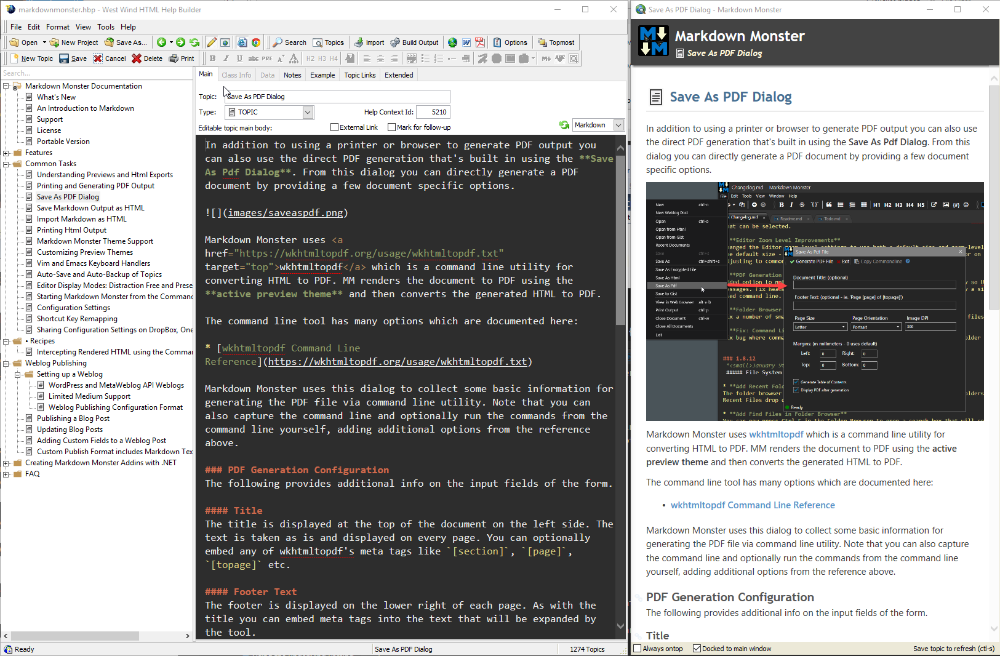

Help Builder internally uses script templates that are used to handle the layout for each topic type. The following is the main `Topic` template into a which the content of the `oTopic` object and its properties that make up the help content is rendered:

```html
<% Layout="~/templates/_Layout.wcs" %>

<h1 class="content-title">
    .png">
    <%= iif(oHelp.oTopic.Static,[],[]) %>
    <%= EncodeHtml(TRIM(oHelp.oTopic.Topic)) %>
</h1>


<div class="content-body" id="body">
<%= oHelp.FormatHTML(oHelp.oTopic.Body) %>
</div>

<% IF !EMPTY(oHelp.oTopic.Remarks) %>
<h3 class="outdent" id="remarks">Remarks</h3>
<blockquote>        
<%= oHelp.FormatHTML(oHelp.oTopic.Remarks) %>
</blockquote>
<% ENDIF %>  

<% IF !EMPTY(oHelp.oTopic.Example) %>
<h3 class="outdent" id="example">Example</h3>
<%= oHelp.FormatExample(oHelp.oTopic.Example)%>
<% ENDIF %>   

<% if !EMPTY(oHelp.oTopic.SeeAlso) %>
<h3 class="outdent" id="seealso">See also</h3>
<%= lcSeeAlsoTopics %>
<%  endif %>
```

These templates are customizable by the user.

The key items to not here is the `oHelp.FormatHtml()` function which is responsible for turning the content of a specific multi-line field into HTML. There are several formats with Markdown being the newest addition.

```foxpro
***********************************************************************
* wwHelp :: FormatHtml
*********************************
LPARAMETER lcHTML, llUnformat, llDontParseTopicLinks, lnViewMode
LOCAL x, lnRawHTML, lcBlock, llRichEditor, lcText, lcLink, lnRawHtml

IF EMPTY(lnViewMode)
  IF VARTYPE(this.oTopic) == "O"
     lnViewMode = this.oTopic.ViewMode
  ELSE
     lnViewMode = 0
  ENDIF     
ENDIF

*** MarkDown Mode
IF lnViewMode = 2 
   IF TYPE("poMarkdownParser") # "O"
      poMarkdownParser = CREATEOBJECT("wwHelpMarkDownParser")
      poMarkdownParser.CreateParser(.t.,.t.)
   ENDIF
   
   RETURN poMarkdownParser.Parse(lcHtml, llDontParseTopicLinks)
ENDIF  

IF lnViewMode = 1
   RETURN lcHtml
ENDIF

IF lnViewMode = 0 OR lnViewMode = 1
	loParser = CREATEOBJECT("HelpBuilderBodyParser")	
	RETURN loParser.Parse(lcHtml, llDontParseTopicLinks)
ENDIF

RETURN "Invalid ViewMode"
* EOF FixNoFormat
```

As I showed earlier in the Message Board sample, here again I use the Markdig parser, but in this case there's some additional logic built ontop of the base Markdown parser that deals with Help Builder specific directives and formatting options. `wwHelpMarkdownParser` extends `MarkdownParserExtended` to do this.

As before the parser is cached so if the instance exists it doesn't have to be created again for performance. Each topic can have up to 5 Markdown sections so reuse is an important performance point. The template renders HTML output into a local file, which is then displayed in the preview on the left in a Web Browser control. 

Output generation varies depending on whether you're previewing which generates a local file that is previewed from disk. Online there's a full HTML UI that surrounds each topic and provides for topic navigation:


The online version is completely static, so the Markdown to HTML generation actually happens during build time of the project. Once generated you end up with a static HTML Web site that can just be uploaded to a Web server.

#### KavaDocs
KavaDocs is another documentation project I'm working on with Markus Egger. It also uses Markdown but the concept is very different and relies on Markdown files on disk and online in a Git repository. There are two components to this tool. One is a local Markdown Monster Addin that basically provides project features to tie together the Markdown files that otherwise just exist on disk. The KavaDocs Addin provides a table of contents and hierarchy and some base information about topics. Most of the topic related information is actually stored inside of the topic files as YAML data.

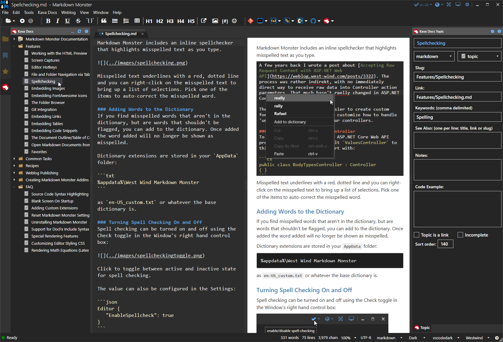

Files are stored and edited as plain Markdown files with topic content stored inside each of the topics. The Table of Contents contains the topics list to tie the individual topics together along with a few bits of other information like keywords, categories, related links and so on.

The other part to KavaDocs is an online application. It's a SAAS application that can serve this Markdown based documentation content dynamically via a generic Web service interface. You create a Web site like `markdownmonster.kavadocs.com` which then serves the documentation directly from a Github repository using a number of different nicely formatted and real-time switchable themes.

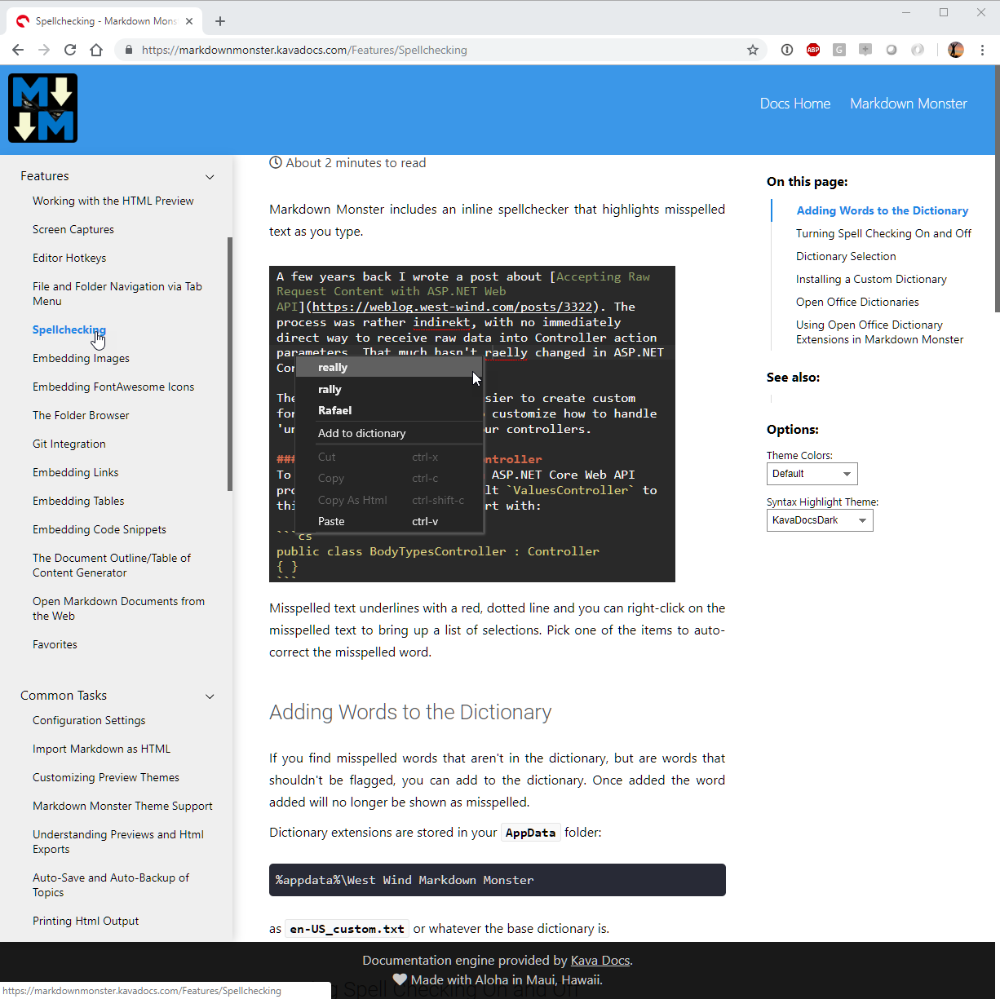

The concept here is very different in that the content is entirely managed on disk via plain Markdown files. The table of content pulls the project information together, and Git serves as the distribution mechanism. The Web site provides the front end while Git provides the data store. 

The big benefit for this solution is that it's easy to collaborate. Since all documentation is done as Markdown text it's easy to sync changes on Git and any changes merged into the master branch are immediately visible as soon as a change is made. It's a really quick way to get documentation online.

### White Papers and Articles like this one
These days I much prefer to write everything I can in Markdown. However, for articles for print or even some online magazines, the standard for documents continues to be Microsoft Word mainly because the review process in Word is well defined.

However, I like to **write my original document with Markdown** because I simply have a more efficient workflow writing this way, with real easy ways to capture images and paste them into documents for example. Markdown Monster's image pasting feature also copies files to disk and optimizes them, and it's just huge time saver as is the built in image capture integration using either SnagIt or a built-in capture. Linking to Web content too is much quicker with Markdown as is dealing with often frequently changing code snippets for technical articles. Belive me when I say that using Markdown can shave hours of document creation for me compared to using Word.

So for publications I often write in Markdown and then export the document to Word either using HTML rendering and importing the HTML, or by using [PanDoc](https://pandoc.org/) which is the Swiss Army knife of document conversions to convert my Markdown directly to Word or PDF. PDF conversions can be very good as you can see the Markdown Monster generated [PDF output of the original document for this article here](https://github.com/RickStrahl/SWFOX2018_MarkdownWithFoxPro/raw/master/Content/MarkdownInFoxPro.pdf). Conversions to MS Word are usually good, but they do need adjustments for the often funky paragraph formatting required for publishers. Even with that step writing in Markdown plus document fixing is usually easier than writing in Word.

The other advantage of this approach is that once the document is in Markdown I can reuse the document much more easily. If you've ever written a Word document and then tried to publish that Word document on the Web, you know what a hot mess Microsoft Word HTML is. It works but the documents are huge and basically become uneditable as HTML.

With a document written in Markdown I can convert my doc to Word to push and do a quick edit/cleanup run before pushing to my publisher, but I can then turn around and use the same Markdown and publish it on my blog, submit the PDF to conference and also make it available on GitHub for editing. I can also use the page handler I described earlier to simply drop the Markdown file plus the images into a folder on my Web site. 

IOW, Markdown makes it much easier to reuse the content you create because it is just text and inherently more portable.

## Generic Markdown Usage
Once you get the Markdown bug you'll find a lot of places where you can use Markdown. I love using Markdown for Notes, ToDo lists, keeping track client info, call logs, quick time tracking and other stuff.

here are a few examples.

### Using Gists to publish Markdown Pages
Github has a related site that allows you to publish individual code snippets for sharing. [Github Gist](https://gist.github.com) is basically a mini Git repository that holds one or more files that you can quickly post and share. It's great for sharing a code snippet on Twitter or other social network that you can then link to from a Tweet for example.

Gists are typically named as files and the file extension determines what kind of syntax coloring is applied to the snippet or snippet(s). One of the supported formats is Markdown which makes it possible to easily create Gists and write and publish an entire article.

publishing of Gists, which are essentially mini documents that can be posted as Code snippets on the Web. It's an easy way to share code snippets or even treat it like a simple micro blogging platform:
 
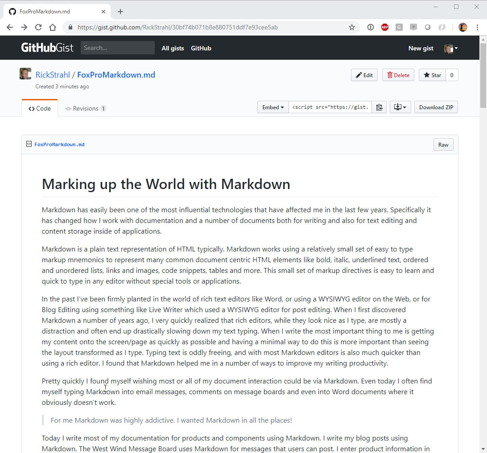

Gists can be shared via URL, and can also be retrieved via a simple REST API. 

For example, Markdown Monster allows you to open a document from Gist using **Open From Gist**. You can edit the document in the local editor, then post it back to the Gist which effectively updates it. All this happens through two very simple JSON REST API calls.

One fly in the oinment to this approach is that images have to be linked as absolute Web URLs because there's no facility to upload images as part of a Gist. You can upload images to a Github image repo, Azure Blob storage or some similar mechanism to create your images as absolute URLs.

I love posting Gists for Code Samples. Although gists support posting specific language files (like foxpro or csharp files) I much rather post a Markdown document that **includes the code** and then describe more info around the code snippet.

## Markdown for Everything? No!
Ok, so I've been touting Markdown as pretty awesome and I really think it addresses many of the issues I've had over the years of writing for publications, writing documentation or simply keeping track of things. Using Markdown has made me more productive for many text editing tasks.

But at the same time there are limits to what you can effectively do with Markdown at least to date. For magazine articles I still tend to need to use Word. Although I usually write my articles using Markdown, I usually have to convert them to a Word document (which BTW is easy via HTML conversion or even using a tool like PanDoc to convert Markdown to Word). The reason is that my editors work with Word and when all is said and done Word's Document Writer Review and Comparision are second to none. While you can certainly do change tracking and multi-user syncing by using Markdown with Git, it's not anywhere as smooth as what's built into Word.

There are other things that Markdown is not good for. When talking about HTML, Markdown addresses bulk text editing needs nicely. If you're editing an About page or Privacy Policy, Sales page etc. Markdown is much easier than HTML to get into the page. Even larger blocks of Html Text inside of larger HTML documents are a good fit for Markdown using what I call Markdown Islands. But Markdown is not a replacement for full HTML layout. You're not going to replace entire Web sites using just Markdown - you still need raw HTML for layout and overall site behavior.

In short, make sure you understand what you're using Markdown for and whether that makes sense. I think it's fairly easy to spot the edges where Markdown usage is not the best choice and also where it is. If you're dealing with mostly text data Markdown is probably a good fit. Know what works...


### Markdown for Notes and Todo Lists
In addition to application related features, I've also found Markdown to be an excellent format for note taking and general notes. It's easy to create lists with Markdown text, so it's easy to open up a Markdown document and just fire away.

Here are some things I keep in Markdown:

#### General Notes
* General Todo List
* Phone Call Notes Document

#### Client Specific Notes
* Client specific Notes
* Client specific Work Item List
* Client Logins/Account information (using MM Encrypted Files)

#### Shared Content - DropBox/OneDrive
* Clipboard.md - machine sharable clipboard


#### Shared Access: DropBox or Git
First off I store most of my notes and todo items in shared folders of some sort. For my personal notes and Todo lists they are stored on DropBox in a custom Notes folder which has task specific sub-folders.

For customers I tend to store my public notes in Git repositories along with the source code (in a Documentation or Administration folder usually). Private notes I keep in my DropBox Notes folder.

#### Markdown Monster Favorites
Another super helpful feature in **Markdown Monster** that I use a lot is the **Favorites** feature. Favorites lets me pin individual Markdown documents like my Call Log and ToDo list or an entire folder on the searchable Favorites tab. This makes it very quick to find relevant content without keeping a ton of Markdown documents open all the time.

## Summary
Markdown is simple tech which at the surface seems like a throwback to earlier days of technology. But - to me at least - the simpler technology actually means better productivity and much better control over the document format. The simplicity of text means I get a fast editor, easy content focused editing and as an extra bonus as a developer I get the opportunity to hack on Markdown with code. It's just text so it's easy to handle custom syntax or otherwise manipulate the Markdown document.

In fact, I went overboard on this and created my own Markdown Editor because frankly the tooling that has been out there for Windows really sucked. Markdown Monster is my vision of how I want a Markdown Editor to work. I write a lot and so a lot of first hand writing experience and convenience is baked into this editor and the Markdown processing that happens. If I was dealing with a proprietary format like Word, or even with just HTML, none of that would be possible. But because Markdown is just text there are lots of opportunities to manipulate both the Markdown itself in terms of (optional) UI editing experience as well the output generation. It's truly awesome what is possible.

<div style="margin-top: 30px;font-size: 0.8em;
            border-top: 1px solid #eee;padding-top: 8px;">
    
    this post was created and published with
    <a href="https://markdownmonster.west-wind.com" 
       target="top">Markdown Monster</a> 
</div>


### Resources
* [Samples and Slides for this Paper](https://github.com/RickStrahl/SWFOX2018_MarkdownWithFoxPro/)
* [gist.github.com](https://gist.github.com) - Code Snippet Sharing
* [Markdown Monster](https://markdownmonster.west-wind.com)
* [Kava Docs](https://kavadocs.com)
* [West Wind Message Board on GitHub](https://github.com/RickStrahl/West-Wind-Message-Board)