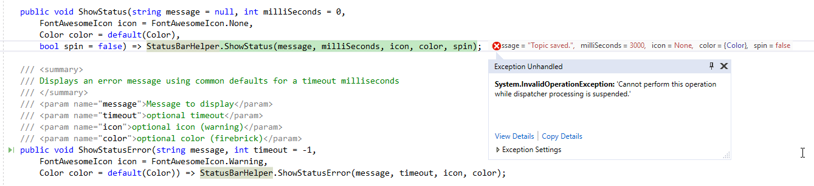

# Of WPF Event Loops and Dispatcher Hell



You know what **they** say: 

> There's best practices and then there's reality.

In WPF there are a lot of **best practices** that all sound good on paper, but in reality are often difficult to enforce under all conditions. 

## Crash me Baby!
I've been struggling with a nasty bug I ran into in a Markdown Monster Addin I'm working on which was causing silent crashes of the entire application. Even with the debugger attached the application would just pack up and go home. Error handlers bypassed, debugger ignored, no log entry, no event log - up and gone. It's always fun to debug those.

I was able to track this particular failure to a modal dialog that I am popping up as part of my add-in that then as part of the processing updates some UI features on the host form. The end result was this mysterious crash that completely bypassed all of the .NET error trapping mechanisms.

After a bit of sleuthing and additional logging I finally managed to pin this bug down to a Dispatcher failure, due to his particular exception:

> Cannot perform this operation while dispatcher processing is suspended.


Come again? *Isn't the whole point of a Dispatcher to get you around the issues of blocking?*

## Dispatcher Hell
This particular error was caused by the following scenario:

* Modal Dialog
* Dialog is about to be closed
* Calling a method in the parent form
* Method causes an event to fire 
* Which in turn uses the dispatcher

I ended up with two (non-obvious) solutions to this problem:

* Make the form non-modal (possible in this case)
* Explicitly used a Dispatcher for invoking the parent form operations that are in turn using the Dispatcher.


Let me demonstrate with a concrete example of what I did here. The code starts with a Command fired from a menu operation (New Topic) in this case:

```cs
public void Command_NewTopic()
{
    NewTopicCommand = new CommandBase((parameter, command) =>
    {
        var newTopic = new NewTopicDialog(Model.Window);
        newTopic.ShowDialog();
    });
}
```

Notice the `ShowDialog()` call - this operation creates a new topic in a table of contents.


## DoEvents()?
Ok this is the part where 'best practices' come in. You should **never** have to wait on render updates in WPF as WPF should be able to handle this for you automatically if you work through models and specific binding code. And for those few exceptional cases `Dispatcher.Invoke()` can force the delayed execution or at least out of band rendering to occur. 

That's all nice and neat in application scenarios but it can be a pain for generic code that can't easily work through bindings.

For example, I have a `StatusHelper` class that I can add to a WPF window and a status bar and it will handle updating the status bar with a message, icon, icon color, delayed clearing etc. It's a very useful helper, but it is pretty generic and so it's there's no simple and easily reusable way to have a binding attached. But at the same time a StatusBar display **has to update immediately** and not when the WPF render loop decides it can.

There are work-around and the aforementioned best practices but that's not always feasible especially if you are in generic code that won't know what context it's being called in. Still these things can help avoiding Dispatcher updates:

* Dispatcher.Invoke()
* Use of Async calls for processing + Dispatcher.Invoke()


