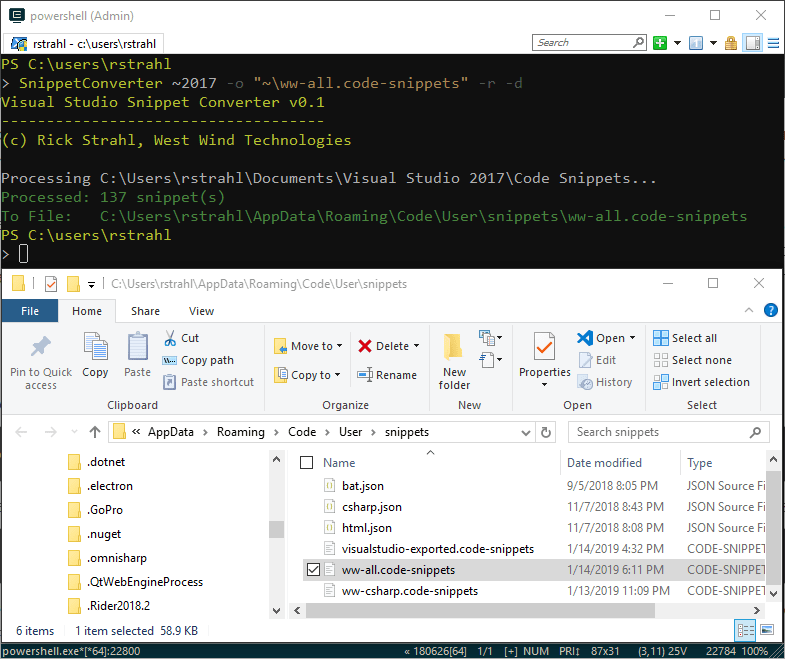
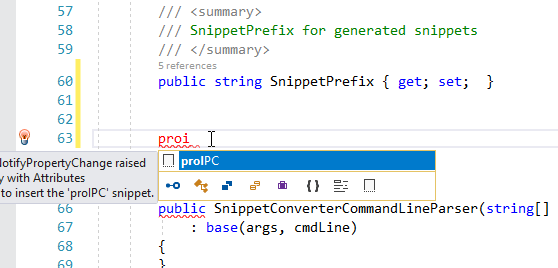
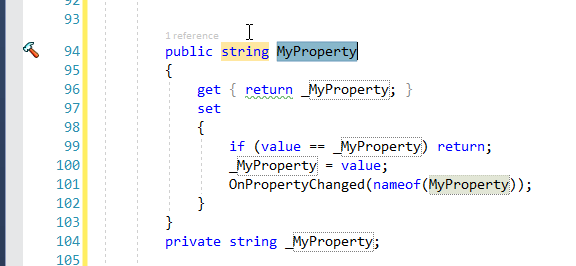

# A Visual Studio to Visual Studio Code Snippet Converter


Visual Studio has very nice Code Snippet facility built into it and over the years I've been using it to create a ton of useful expansion snippets that make my day to day development easier. I have quite a few C# code snippets, but even more I use the HTML snippets for things like my Bootstrap customized snippets, snippets for complex HTML controls and the like. There are few others for JavaScript, XAML and even some Powershell ones. Overall I have nearly 150 code snippets.

Over the last couple of years I have been more and more using other tools in combination with Visual Studio. Two tools in particular: [Visual Studio Code](https://github.com/RickStrahl/wwMongoDb/stargazers) and [JetBrains Rider](https://www.jetbrains.com/rider/). 

Over the years I've accumulated nearly hundred 150 code-snippets in Visual Studio and when I'm working in other environments and I really do miss them especially the HTML ones for long blocks that are painful to look up on doc sites and then customize. With snippets this stuff auto-fills or fills with a few keystrokes which saves me lots of time every day.

In fact, I missed this stuff so much that at times I'd just fire up Visual Studio with an HTML editor open to just expand HTML snippets I need, and then paste them into VS Code or Rider. Tedious but still faster than manually typing out some of these longer blocks of text with the appropriate insertions added. It sure would be a lot nicer to do this directly in each respective environment.

So over the last couple of weekends I threw together a small utility that allows me to move my Visual Studio snippets to Visual Studio Code snippets and - with limited features - to JetBrains Rider.

If you just want to jump in, you can find the code on GitHub:

* [VisualStudioSnippetConverter on GitHub](https://github.com/RickStrahl/VisualStudioSnippetConverter)

A word of warning - this is a hacky project, and there's no guarantee that it'll work with all types of snippets that are supported. However, for my snippets all of them ported over nicely to VS Code and I can re-run the export multiple times and easily create new snippet files for the exports to compare/update as needed.

For Rider the story is more complicated as Rider has a crazy mechanism for storing templates in an internal, single configuration file. It also uses a couple of completely different storage engines for the .NET related snippets (C#,VB,F#, Razor, ASPNET) and the Web based ones (html,css,js etc.). This tool currently only supports the .NET related snippets and a one-time export since the crazy GUID based key system in Rider doesn't allow for finding existing snippets without the GUID. More on that later.

## The Snippet Converter
You can download and run it as .NET Global SDK Tool ([.NET SDK 2.1 ](https://dotnet.microsoft.com/download) or later) which is installable via Nuget:

```ps
dotnet tool install --global dotnet-snippetconverter
```

If you don't want to install and just run the tool you can clone or download the Github repo you can:

```ps
cd .\SnippetConverter\
# assumes .NET 2.1+ is installed
dotnet run
```

Once installed this tool can convert Visual Studio Snippets to VS Code snippets, either individually or in batch by pointing a folder or individual snippet.

```
snippetconverter ~2017 -r -d
```

will convert all Visual Studio 2017 snippets to VS Code into a single  `visualstudio-exported.code-snippets` snippets file. 



There are a few options available to convert individual snippets and folders, add a prefix, recurse folders, display the generated file and more:

```text
Syntax:
-------
SnippetConverter <sourceFileOrDirectory> -o <outputFile> 
                 --mode --prefix --recurse --display

Commands:
---------
HELP || /?          This help display           

Options:
--------
sourceFileOrDirectory  Either an individual snippet file, or a source folder
                       Optional special start syntax using `~` to point at User Code Snippets folder:
                       ~      -  Visual Studio User Code Snippets folder (latest version installed)
                       ~2017  -  Visual Studio User Code Snippets folder (specific VS version 2019-2012)                       

-o <outputFile>        Output file where VS Code snippets are generated into (ignored by Rider)   
                       Optional special start syntax using `~` to point at User Code Snippets folder:
                       %APPDATA%\Code\User\snippets\ww-my-codesnippets.code-snippets
                       ~\ww-my-codesnippets.code-snippets
                       if omitted generates `~\exported-visualstudio.code-snippets`
                       
-m,--mode              vs-vscode  (default)
                       vs-rider   experimental - (C#,VB.NET,html only)
-d                     display the target file in Explorer
-r                     if specifying a source folder recurses into child folders
-p,--prefix            snippet prefix generate for all snippets exported
                       Example: `ww-` on a snippet called `ifempty` produces `ww-ifempty`

Examples:
---------
# vs-vscode: Individual Visual Studio Snippet
SnippetConverter "~2017\Visual C#\My Code Snippets\proIPC.snippet" 
                 -o "~\ww-csharp.code-snippets" -d

# vs-vscode: All snippets in a folder user VS Snippets and in recursive child folers
SnippetConverter "~2017\Visual C#\My Code Snippets" -o "~\ww-csharp.code-snippets" -r -d

# vs-vscode: All the user VS Snippets and in recursive child folders
SnippetConverter ~2017\ -o "~\ww-all.code-snippets" -r -d

# vs-vscode: All defaults: Latest version of VS, all snippets export to  ~\visualstudio-export.code-snippets
SnippetConverter ~ -r -d --prefix ww-

# vs-rider: Individual VS Snippet
SnippetConverter "~2017\proIPC.snippet" -m vs-rider -d

# vs-rider: All VS Snippets in a folder
SnippetConverter "~2017\Visual C#\My Code Snippets" -m vs-rider -d
```

This should give you an idea of what you can do. For more info read on... 

But first a little background.

## Visual Studio Code Snippets?
If you're not familiar or not using Code Snippets, you're not alone. They're pretty much a hidden feature in Visual Studio, which is a shame because they are a very useful productivity tool. Unfortunately Visual Studio doesn't have any useful, built-in UI to create these snippets, and so this feature is largely under-utilized by most developers. There's only the crappy **Tool -> Code Snippet Manager**, which isn't a manager of anything but nothing but a viewer that lets you see what snippets are active and available. There's no built-in way to create or edit snippets or even jump to and open a snippet. You're on your own.

However, Code Snippets are just simple XML files in a known folder location in your Documents folder. They are very easy to create and update and all things considered editing the raw XML file in syntax colored editor like VS Code might just be the easiest UI to create them anyway. There are a few low quality Visual Studio addins that provide UI but they tend to be more cumbersome than the raw snippet files.

The best way to create a new Code Snippet is to copy an existing snippet and modify it to fit your needs.

Snippets are located in:

```text
<Documents>\Visual Studio 2017\Code Snippets
```

Each language/technology has its own subfolder for grouping, but that's really just for organization - snippets determine what language they apply to via a `Language` attribute in the XML.

Visual Studio ships with a number of code snippets in this location that you can use and learn from as a template for new snippets. 

Snippets look something like this:

```xml
<?xml version="1.0" encoding="utf-8"?>
<CodeSnippets xmlns="http://schemas.microsoft.com/VisualStudio/2005/CodeSnippet">
  <CodeSnippet Format="1.0.0">
    <Header>
      <Title>Property with INotifyPropertyChange raised</Title>
      <Description>Control Property with Attributes</Description>
      <SnippetTypes>
        <SnippetType>Expansion</SnippetType>
      </SnippetTypes>
      <Shortcut>proIPC</Shortcut>
    </Header>
    <Snippet>
      <References />
      <Imports />
      <Declarations>
        <Literal Editable="true">
          <ID>name</ID>
          <Type></Type>
          <ToolTip>Property Name</ToolTip>
          <Default>MyProperty</Default>
          <Function></Function>
        </Literal>        
        <Literal Editable="true">
          <ID>type</ID>
          <Type></Type>
          <ToolTip>Property Type</ToolTip>
          <Default>string</Default>
          <Function></Function>
        </Literal>
      </Declarations>
      <Code Language="csharp" Kind="method decl" Delimiter="$"><![CDATA[public $type$ $name$
{
    get { return _$name$; }
    set
    {
        if (value == _$name$) return;
        _$name$ = value;
        OnPropertyChanged(nameof($name$));
    }
}        
private $type$ _$name$;
]]></Code>
    </Snippet>
  </CodeSnippet>
</CodeSnippets>
```

Once the file exists or is updated on disk, Visual Studio will immediately find it use it. No need to restart. In the relevant (C#) editor I now see the snippet in the IntelliSense list:



which inserts the template and lets you edit the declared place holders which are delimited with `$expr$` in the template:



This happens to be a C# snippet but most common VS languages are supported. You can see that the key is the `<Code>` block that defines the template text, plus the `<Shortcut>` key that defines the editor expansion that triggers the snippet. You can embed `$txt$` expressions in the template that are matched to the 'variable' `<Declaration>` elements above. Multiple place holder  locations are changed in sync.

The most useful and larger snippets I use are mostly for HTML insertions, especially around custom Bootstrap structures or custom controls that have syntax that I can never remember. I like to look that stuff up once on a Documentation site, then create a snippet that lets me just insert it into my HTML. After you've done this a few times it's very easy, and the time it saves can be immense. A few minutes spent setting up a template can pay back big in time savings of text not typed into an editor and time not wasted looking up the same 50 lines of Bootstrap code every time :-)

### Prefixes and Snippet Packs
There are also a number of snippet packs available in the Visual Studio Marketplace that you can install that provide a whole block of usually pre-fixed snippets that you can use. For example the Bootstrap Snippet pack adds a bunch of `bs-` snippets.

Using a prefix is a good idea as it makes it easy to find your own snippets in a see of Intellisense suggestions. I use `ww-` for most of my snippets. Unfortunately when I created many of my snippets originally I didn't follow this advice. But now when I export them I can explicitly specify a prefix when exporting if it doesn't exist already on the snippet name.

## Building a Converter
So over the last couple of weekends I threw together a small utility that allows me to move my Visual Studio snippets to Visual Studio Code snippets and - with limited features - to JetBrains Rider. 

I figure there might be a few others out there that would find this useful so I published this as a **.NET Global Tool** console application that you can quickly install:

```ps
dotnet tool install dotnet-snippetconverter
```

You'll need the [.NET 2.1 SDK or later](https://dotnet.microsoft.com/download) to run this.

> The following commands all export from Visual Studio to VS Code I'll talk about Rider separately later

Once installed you can quickly convert all your Visual Studio snippets to VS Code with the following command.

```ps
snippetconverter ~ -r -d
```

This will convert all snippets from the latest installed Visual Studio version (2017,2019 etc.) and create a single VS Code `visualstudio-exported.code-snippets` in your VS Code User Snippets folder. You can also specify a specific VS version:

```ps
snippetconverter ~2017 -r -d
```

Or a specific folder:

```ps
snippetconverter "~2017\Visual C#\My Code Snippets" -r -d
                 -o "~\ww-csharp.code-snippets"
```

This specifies a specific output file for the snippet file. The `~` both in the input and output folder options are optional, but they reference base locations for snippets in Visual Studio (`%Documents%\Visual Studio <year>`) and VS Code (`%appdata%\Code\User\Snippets\`) to not have to provide full path names. But if you prefer you can also use fully qualified paths.

Finally you can also move a single file:

```ps
snippetconverter "~2017\Visual C#\My Code Snippets\proIPC.snippet" -d
                 -o "~\ww-csharp.code-snippets"
```

The tool will update snippets if they already exist in VS Code so you can re-run it to update your VS Code snippets from time to time.

### Syncing Snippets
Moving snippets is one way **from Visual Studio** and **to VS Code** (for now). This means if you want to keep snippets in sync for both Visual Studio and VS Code it's best to create snippets in Visual Studio and then move them to VS Code via this tool.


## VS Code Snippet Format
I talked about the snippet format for Visual Studio Snippets earlier, so let's look at what VS Code Snippets look like and where they live.

VS Code Snippets

* Live in `%AppData\Code\User\snippets`
* Are in JSON format
* Have a `lang.json` format
* Or have a `<name>.code-snippet` format
* Can contain one or many Code Snippets

The SnippetConverter exports to `.code-snippet` files because there's too much of a chance of naming conflicts using the `lang.json` format. The default VS Code output file is `visualstudio-export.code-snippets`  if not specified via `-o` switch.

VS Code snippet files are JSON and they look like this:

```json
{
  "proipc": {
    "prefix": "proipc",
    "scope": "csharp",
    "body": [
      "public ${2:string} ${1:MyProperty}",
      "{",
      "    get { return _${1:MyProperty}; }",
      "    set",
      "    {",
      "        if (value == _${1:MyProperty}) return;",
      "        _${1:MyProperty} = value;",
      "        OnPropertyChanged(nameof(${1:MyProperty}));",
      "    }",
      "}        ",
      "private ${2:string} _${1:MyProperty};",
      ""
    ],
    "description": "Control Property with Attributes"
  },
  "commandbase-object-declaration": {
    "prefix": "commandbase",
    "scope": "csharp",
    "body": [
      "        public CommandBase ${1:CommandName}Command { get; set;  }",
      "",
      "        void Command_${1:CommandName}()",
      "        {",
      "            ${1:CommandName}Command = new CommandBase((parameter, command) =>",
      "            {",
      "              $0",
      "            }, (p, c) => true);",
      "        }",
      ""
    ],
    "description": "Create a CommandBase implementation and declaration"
  }	
}
```

The VS Code templates are conceptually simpler with a template, prefix and scope, and a simple embedded template that uses familiar string interpolation and convention to figure out how to display place holder values. There are additional fields that can be filled, but most of the values are optional and for conversion from Visual Studio at least - irrelevant. 

You can find the Visual Studio Code Snippet Template docs here:

* [VS Code Code Snippet Template Documentation](https://code.visualstudio.com/docs/editor/userdefinedsnippets)

But for actually manually creating a template, the JSON `body` property is a pain to create because the string is expected to be an array of strings (yuk) which is a bear to type. The good news is it's easy to generate a template when exporting from a Visual Studio snippet...

## Rider Formatting - Ugh
The SnippetConverter also works with Rider to some degree, but the functionality is much more limited. This is due to the fact that Rider uses a crazy format for storing its templates - or really all of its configuration using a GUID key/value based XML file. If you ever need an example of how not to use XML this would probably be it.

```dos
%USERPROFILE%\.Rider2018.2\config\resharper-host\GlobalSettingsStorage.DotSettings
```

Take a look at a couple of relevant exported Live Templates:

```xml
<root>
    <s:Boolean x:Key="/Default/PatternsAndTemplates/LiveTemplates/Template/=720E28E0ECFD4CA0B80F10DC82149BD4/Reformat/@EntryValue">True</s:Boolean>
    <s:String x:Key="/Default/PatternsAndTemplates/LiveTemplates/Template/=720E28E0ECFD4CA0B80F10DC82149BD4/Shortcut/@EntryValue">proipc</s:String>
    <s:Boolean x:Key="/Default/PatternsAndTemplates/LiveTemplates/Template/=720E28E0ECFD4CA0B80F10DC82149BD4/ShortenQualifiedReferences/@EntryValue">True</s:Boolean>
    <s:Boolean x:Key="/Default/PatternsAndTemplates/LiveTemplates/Template/=720E28E0ECFD4CA0B80F10DC82149BD4/Scope/=C3001E7C0DA78E4487072B7E050D86C5/@KeyIndexDefined">True</s:Boolean>
    <s:String x:Key="/Default/PatternsAndTemplates/LiveTemplates/Template/=720E28E0ECFD4CA0B80F10DC82149BD4/Scope/=C3001E7C0DA78E4487072B7E050D86C5/Type/@EntryValue">InCSharpFile</s:String>
    <s:String x:Key="/Default/PatternsAndTemplates/LiveTemplates/Template/=720E28E0ECFD4CA0B80F10DC82149BD4/Text/@EntryValue">public $type$ $name$
{
    get { return _$name$; }
    set
    {
        if (value == _$name$) return;
        _$name$ = value;
        OnPropertyChanged(nameof($name$));
    }
}        
private $type$ _$name$;
    </s:String>
    <s:Boolean x:Key="/Default/PatternsAndTemplates/LiveTemplates/Template/=720E28E0ECFD4CA0B80F10DC82149BD4/Field/=name/@KeyIndexDefined">True</s:Boolean>
    <s:String x:Key="/Default/PatternsAndTemplates/LiveTemplates/Template/=720E28E0ECFD4CA0B80F10DC82149BD4/Field/=name/Expression/@EntryValue">complete()</s:String>
    <s:Int64 x:Key="/Default/PatternsAndTemplates/LiveTemplates/Template/=720E28E0ECFD4CA0B80F10DC82149BD4/Field/=name/Order/@EntryValue">0</s:Int64>
    <s:Boolean x:Key="/Default/PatternsAndTemplates/LiveTemplates/Template/=720E28E0ECFD4CA0B80F10DC82149BD4/Field/=type/@KeyIndexDefined">True</s:Boolean>
    <s:String x:Key="/Default/PatternsAndTemplates/LiveTemplates/Template/=720E28E0ECFD4CA0B80F10DC82149BD4/Field/=type/Expression/@EntryValue">complete()</s:String>
    <s:Int64 x:Key="/Default/PatternsAndTemplates/LiveTemplates/Template/=720E28E0ECFD4CA0B80F10DC82149BD4/Field/=type/Order/@EntryValue">1</s:Int64>

    <s:Boolean x:Key="/Default/PatternsAndTemplates/LiveTemplates/Template/=E88A906D39C741C0A3B8095C5063DADE/@KeyIndexDefined">True</s:Boolean>
    <s:Boolean x:Key="/Default/PatternsAndTemplates/LiveTemplates/Template/=E88A906D39C741C0A3B8095C5063DADE/Applicability/=Live/@EntryIndexedValue">True</s:Boolean>
    <s:Boolean x:Key="/Default/PatternsAndTemplates/LiveTemplates/Template/=E88A906D39C741C0A3B8095C5063DADE/Reformat/@EntryValue">True</s:Boolean>
    <s:String x:Key="/Default/PatternsAndTemplates/LiveTemplates/Template/=E88A906D39C741C0A3B8095C5063DADE/Shortcut/@EntryValue">seterror</s:String>
    <s:Boolean x:Key="/Default/PatternsAndTemplates/LiveTemplates/Template/=E88A906D39C741C0A3B8095C5063DADE/ShortenQualifiedReferences/@EntryValue">True</s:Boolean>
    <s:Boolean x:Key="/Default/PatternsAndTemplates/LiveTemplates/Template/=E88A906D39C741C0A3B8095C5063DADE/Scope/=C3001E7C0DA78E4487072B7E050D86C5/@KeyIndexDefined">True</s:Boolean>
    <s:String x:Key="/Default/PatternsAndTemplates/LiveTemplates/Template/=E88A906D39C741C0A3B8095C5063DADE/Scope/=C3001E7C0DA78E4487072B7E050D86C5/Type/@EntryValue">InCSharpFile</s:String>
    <s:String x:Key="/Default/PatternsAndTemplates/LiveTemplates/Template/=E88A906D39C741C0A3B8095C5063DADE/Text/@EntryValue">		
		public string ErrorMessage {get; set; }

        protected void SetError()
        {
            this.SetError("CLEAR");
        }

        protected void SetError(string message)
        {
            if (message == null || message=="CLEAR")
            {
                this.ErrorMessage = string.Empty;
                return;
            }
            this.ErrorMessage += message;
        }

        protected void SetError(Exception ex, bool checkInner = false)
        {
            if (ex == null)
                this.ErrorMessage = string.Empty;

            Exception e = ex;
            if (checkInner)
                e = e.GetBaseException();

            ErrorMessage = e.Message;
        }
    </s:String>
    <s:Boolean x:Key="/Default/PatternsAndTemplates/LiveTemplates/Template/=E88A906D39C741C0A3B8095C5063DADE/Field/=busObject/@KeyIndexDefined">True</s:Boolean>
    <s:String x:Key="/Default/PatternsAndTemplates/LiveTemplates/Template/=E88A906D39C741C0A3B8095C5063DADE/Field/=busObject/Expression/@EntryValue">complete()</s:String>
    <s:Int64 x:Key="/Default/PatternsAndTemplates/LiveTemplates/Template/=E88A906D39C741C0A3B8095C5063DADE/Field/=busObject/Order/@EntryValue">0</s:Int64>
    <s:Boolean x:Key="/Default/PatternsAndTemplates/LiveTemplates/Template/=E88A906D39C741C0A3B8095C5063DADE/Field/=NewLiteral/@KeyIndexDefined">True</s:Boolean>
    <s:String x:Key="/Default/PatternsAndTemplates/LiveTemplates/Template/=E88A906D39C741C0A3B8095C5063DADE/Field/=NewLiteral/Expression/@EntryValue">complete()</s:String>
    <s:Int64 x:Key="/Default/PatternsAndTemplates/LiveTemplates/Template/=E88A906D39C741C0A3B8095C5063DADE/Field/=NewLiteral/Order/@EntryValue">1</s:Int64>
</root>       
```

Ugh...

Using this crazy format you can't even tell where one set of settings starts or ends. Each key has a multi-value, plus GUID key which makes it next to impossible to try to match up an existing snippet to see if it exists already.

For this reason Rider imports are one-time - they will double up if you export the same snippets twice.

> For testing I've added a marker key into the file which Rider preserves. Then after I've imported and need to clear the imported snippets I remove the added snippets. Ugly but it works for testing. Probably not practical if other settings get changed in between.

This format is only supported for Rider's native .NET Specific code types: .NET Languages, Razor and WebForms which includes HTML templates. The other formats (JavaScript/HTML/CSS) use completely separate format and I don't have the energy to make that work at this point. For Rider my main concern are C# and HTML templates and those work just fine using this exporter.

Just be sure to export only specific folders like the C# folder or HTML snippets:

```text
SnippetConverter "~2017\Visual C#\My Code Snippets" -m vs-rider -d
SnippetConverter "~2017\Code Snippets\Visual Web Developer\My HTML Snippets" -m vs-rider -d
```

Rather than doing the entire snippet folder in batch.

## Summary
As I mentioned earlier all of this is pretty hacky, but for Visual Studio Code exports all of my snippets actually export and work without issues. For Rider, my C# and HTML snippets export and that works as well, but other types (like JavaScript, CSS) will cause errors. I'm aware but I can live with that for a personal tool. If there's enough interest I can get those bits moved as well but it basically requires another completely separate converter.

I haven't tested all the supported Visual Studio document types and those might cause problems even in VS Code. If you want to be safe, don't do a wholesale export of all snippets, but export each type of snippet separately.

I also highly recommend using prefixes as it makes it much easier to find your snippets and keep them out of the way when you're just heads down writing code.

For now this is good enough for me, but I'm curious to see if I'm one of the few people who cares enough about Code Snippets to go through this excercise :-)

## Resources
* [Visual Studio SnippetConverter on GitHub](https://github.com/RickStrahl/VisualStudioSnippetConverter)
* [dotnet-snippetconverter .NET Global Tool](https://www.nuget.org/packages/dotnet-snippetconverter/)


<div style="margin-top: 30px;font-size: 0.8em;
            border-top: 1px solid #eee;padding-top: 8px;">
    
    this post created and published with 
    <a href="https://markdownmonster.west-wind.com" 
       target="top">Markdown Monster</a> 
</div>