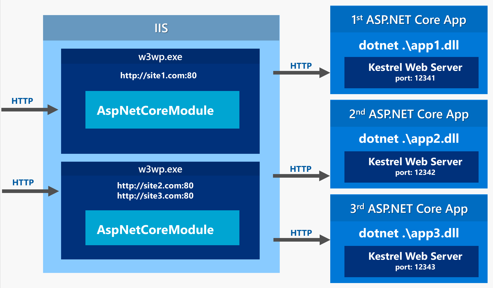
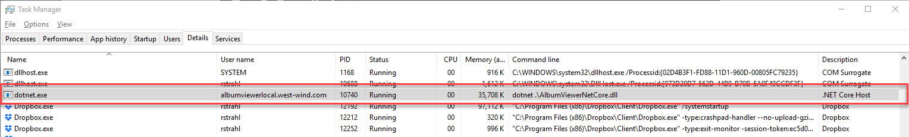
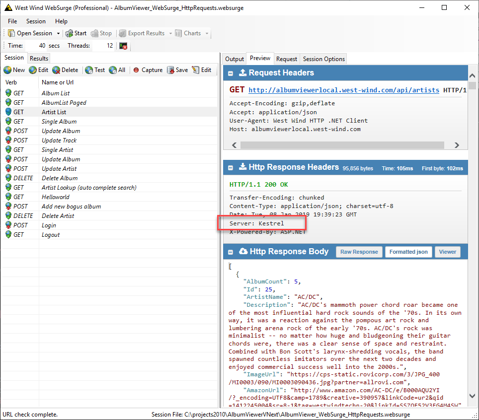
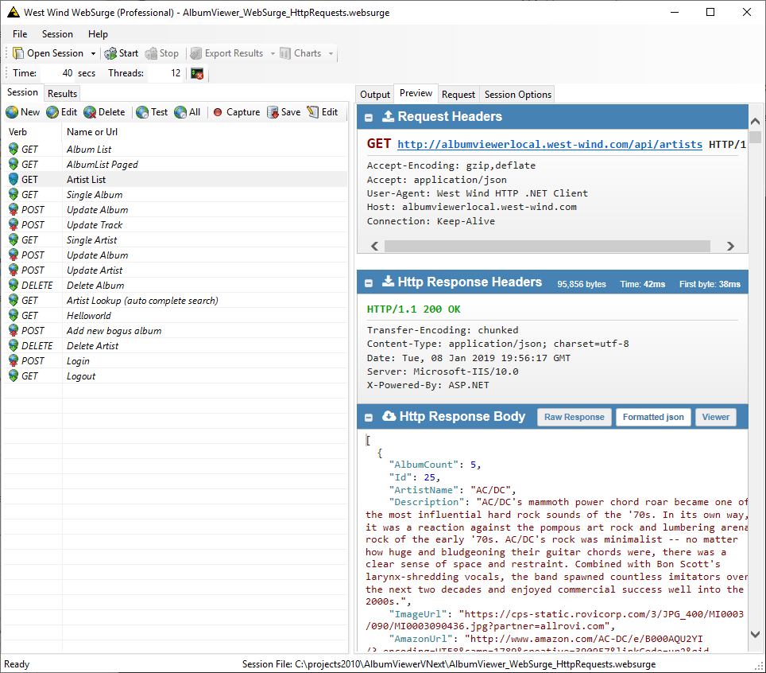

# ASP.NET Core Hosting on IIS with ASP.NET Core 2.2

ASP.NET Core 2.2 is out and with it comes some significant improvements to the hosting model if you plan on hosting in IIS. In previous versions you were **required to** host ASP.NET Core applications out of process with IIS effectively as a Reverse Proxy. I wrote about this [in a detailed blog post](https://weblog.west-wind.com/posts/2016/Jun/06/Publishing-and-Running-ASPNET-Core-Applications-with-IIS) a while back.

With ASP.NET Core 2.2 there's now an `InProcess` hosting model which essentially hosts .NET Core directly inside of an IIS Application pool and hooks into IIS's processing pipeline. 

This improves throughput for ASP.NET Core requests significantly. In my off the cuff testing I see nearly double the request throughput for small do-nothing requests using IIS InProcess hosting. 

Microsoft has done a good job of introducing this hosting model with minimal impact on existing configuration: It's easy to switch between the old OutOfProcess and InProcess models via a simple project configuration switch that is propagated into the deployed `web.config` file.

## Switching between OutOfProcess and InProcess Hosting
For new applications that are deployed to IIS you almost certainly will want to use InProcess hosting because it provides better performance.

There are a few cases when OutOfProcess hosting might be desirable, such as for trouble shooting and debugging a failing server (you can run with console logging enabled for example), but in most cases InProcess will be the desired model for IIS hosting.

New ASP.NET Core projects automatically configure the default `web.config` for InProcess hosting, but if you're coming from an older project you may have to update your project settings explicitly.

### Project Change - `<AspnetCoreHostingModel>`
The first change is in the project file where you can specify the hosting model to use using the `<AspNetCoreHostingModel>`. This affects how `dotnet publish` creates your configuration when you `publish` your project and what it generates into the `web.config` file when the project is published.

The relevant project setting is the `AspNetCoreHostingModel` which can be `inprocess` or `outofprocess`. When missing it defaults to the old `outofprocess` mode.

```xml
<PropertyGroup>
    <TargetFramework>netcoreapp2.2</TargetFramework>
    <AspNetCoreHostingModel>InProcess</AspNetCoreHostingModel>
</PropertyGroup>
```

### web.config Change
This affects the generated `web.config` file and the `hostingModel` attribute that is generated into the publish/deploy folder:

```xml
<?xml version="1.0" encoding="utf-8"?>
<configuration>
  <location path="." inheritInChildApplications="false">
    <system.webServer>
      <handlers>
      
        <add name="aspNetCore" path="*" verb="*" modules="AspNetCoreModuleV2" />
      </handlers>
      
      <aspNetCore processPath="dotnet" arguments=".\WebApplication1.dll"	
			      stdoutLogEnabled="false" stdoutLogFile=".\logs\stdout"
			      hostingModel="InProcess" />
    </system.webServer>
  </location>
</configuration>
```

If the `<AspNetCoreHostingModel>` key in the project is set to `OutOfProcess` or is missing, the `hostingModel` attribute is not generated and the application defaults to `OutOfProcess`.

> #### @icon-warning Refresh web.config on Publish
> I found that unlike the rest of the files in the publish output folder the `web.config` file **was not updated** on a new publish unless I deleted the file (or the entire publish folder). If you make changes that affect the IIS configuration I recommend to nuke the publish folder and doing a clean publish.

Note that you can easily switch between modes **after publishing** by simply changing the value between `InProcess` and `OutOfProcess` in the `web.config` in the Publish folder.  I can't really see a good scenario where `OutOfProcess` makes sense since behavior is the same and performance of the InProcess is significantly faster. But it's there if you decide you need it perhaps for debugging purposes on a server that's failing to load.

## Reviewing IIS Hosting
To understand why InProcess hosting for IIS is a big deal, lets review how ASP.NET Core applications are hosted on Windows with IIS (which is also Azure's default ASP.NET Core deployment model BTW). Let's review how ASP.NET Core apps work and how they were traditionally hosted when running with IIS.

When you create an ASP.NET Core application you typically create a standalone Console application that is launched with `dotnet .\MyApplication.dll`. ASP.NET Core then hosts its own internal Kestrel Web Server inside of the application by way of the ASP.NET Core framework that serves HTTP requests. 

> When you build an ASP.NET Web application you essentially create a fully self contained Web Server that runs ASP.NET Core on top of it.

On Windows you typically use IIS as the front end server for your ASP.NET Core application. You want to use either IIS or some other Web server/proxy to provide the lifetime management service to ensure that your application is up and running and stays running if it crashes,  [much more efficient static file processing](https://weblog.west-wind.com/posts/2017/Apr/27/IIS-and-ASPNET-Core-Rewrite-Rules-for-Static-Files-and-Html-5-Routing), certificate management, multi-domain hosting on a single port and so on.

You can read [my previous detailed post on ASP.NET Core IIS hosting](https://weblog.west-wind.com/posts/2016/Jun/06/Publishing-and-Running-ASPNET-Core-Applications-with-IIS) if you want a lot more detail on the hows and whys. 

Here's a quick review of the relevant bits.

### Why use IIS rather than access Kestrel Directly
Kestrel, the internal Web Server, is **very fast and efficient** - it's what you see in those TechemPower benchmarks that ASP.NET Core is turning heads with by providing blistering performance. That's good right, so why put a "Web front end" in front of this beast of a server?

As fast as Kestrel is, it's a specialized, raw server that is optimized for fast connections and passing requests efficiently through its internal pipeline. It does not support many common Web Server Platform features directly. A lot of the support management and administration features - certificate management, lifetime management, subdomain routing etc. - are not features that are built-in or are not optimized. Most of the administration and management features you expect to have in a full featured Web server are not there.

For this reason ASP.NET Core applications typically **are not directly exposed to the Internet** but instead run behind either a reverse proxy, or Web Server front end in order to provide lifetime management services, static file serving, file compression, multi-site hosting, certificate management services and so. Kestrel is very capable raw Http Server, but it doesn't provide many of the "Service" features that a full Web server provides. 

In time we may see lots of middleware extensions for many of these features and tasks, but as of today a lot of that is not there and you typically run ASP.NET Core apps behind some Web Frontend like IIS on Windows or nginx on Linux for example.

Here are a few things that IIS provides and why it makes sense to host with IIS as a front:

#### Lifetime Management
First and most importantly your app is just a single Console application. If you run it without any support infrastructure any crash or failure will shut down the application and take your app offline.

One way or another you need a process manager that can monitor your application and make sure it restarts if it crashes, hangs or uses too many resources. IIS provides a robust and proven host manager and by running it to front ASP.NET Core applications you get process management for free as part of the ASP.NET Core IIS Host Module functionality.

#### Static File Serving is Inefficient with base Kestrel
A lot of the content that Web Sites serve these days is static, and as it turns out that on Windows, IIS is **very efficient** at serving static content. IIS can serve static content a lot faster than and with a lot less resources usage through caching and built-in content compression, using Kernel mode processing of most static requests. On Windows IIS is the most efficient way to serve static content.

ASP.NET Core's static built in file handler lacks caching, support for automatic content compression and is fairly inefficient at serving static files. It's much more efficient to let IIS handle the static file handling.

#### HostName Support
When Kestrel is configured to listen on a port, Kestrel handles all of the traffic for that port regardless of requests' Host headers. In other words, Kestrel handles all access to a given IP Address and port and doesn't provide native host header handling that allows easy multi-hosting of multiple sites.

It is possible to use the [ASP.NET Core Host Filtering Middleware](https://www.nuget.org/packages/Microsoft.AspNetCore.HostFiltering) which allows a single kestrel instance to handle multiple domains, but you can't have multiple Kestrel based applications share the same port.

For this to work you need IIS which provides multi-domain mapping via host headers at the Kernel level and via internal routing. Sitting behind IIS, ASP.NET Core applications 


#### Web Server Infrastructure
IIS has more control over **all** of the Web site's that are running via the IIS Admin Service, because IIS is a Service Manager that acts as a coordinating service in front of all IIS Web sites, while your ASP.NET Core is a self-contained Console application. This makes it possible to handle the pre-routing of requests directly out of the kernel mode `http.sys` driver.

The Admin Service also manages lifetime management for each IIS application (and by extension the ASP.NET Core Host Module) that makes sure servers are up and running and get relaunched when it crashes, can be recycled when certain limits are hit and so on.

This can be done in other ways with specialized hosting software but it's


### Out of Process Hosting
Prior to ASP.NET Core 2.2 the only way to host ASP.NET Core on IIS was through out of process, proxy mode hosting. In this model IIS is acting like a Web Server Frontend/Proxy that passes through requests to a separately executing instance of the .NET Core Console application that runs your ASP.NET Core site.

Using the **AspNetCoreModule** IIS basically launched the console application on an internal port and forwards requests to it like a proxy and the picks up the response and serves the result. **Figure 1** shows what that looks like.



<small>**Figure 1** - Out of Process ASP.NET Core IIS Hosting</small>

## InProcess And OutOfProcess Hosting

To see which model you're using you check a few different things:

#### Check for the `dotnet` process
Check for a `dotnet` process that runs your application's dll.



<small>**Figure 1** - OutOfProcess uses `dotnet.exe` to run your application in proxy forwarding mode when using IIS.</small>

If the `dotnet.exe` process is running with your application's specific command line, you know your app is running Out Of Process.

#### Check the Response `Server` Header
You can also check the HTTP response for the server and check for either `Kestrel` or `Microsoft IIS` as the Web Server for `OutOfProcess` and `Inprocess` modes respectively :

**OutOfProcess**



<small>**Figure 1** - Out of Process IIS Hosting forwards requests to an externally hosted ASP.Core application running Kestrel.</small>


**InProcess** 


<small>**Figure 1** - In Process IIS Hosting implements the Web server host inside of the Asp.Net Core Module using IIS infrastructure.</small>


