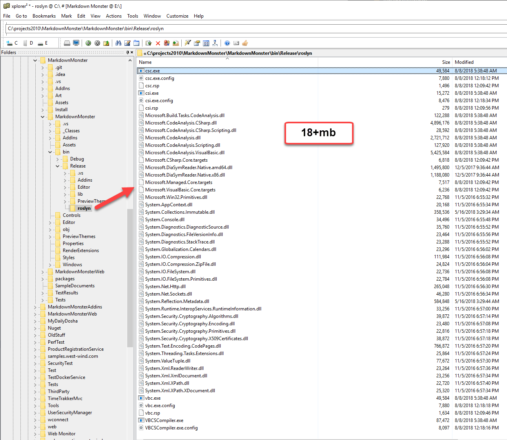
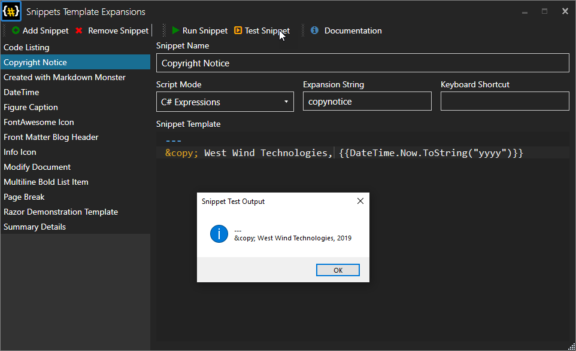

# Moving old Dynamic Compilation Code to use Roslyn

You probably know that compiling code in .NET has changed a bit since the early days of .NET with the advent of the Roslyn compiler. If you've been using the old `CSharpCodeProvider` in the past you probably also know that it uses the old compiler platform which means you don't get to take advantage of new CSharp (and VBNet) language features that have been introduced since Roslyn was introduced - all new language features are implemented only in Roslyn.

I used dynamic compilation for a number of features in applications - usually for some sort of scripting automation or for embedding scripts into editors. Quite frequently I've gotten notes from people asking *Why isn't the C# syntax supporting newer language features?* Well the answer is the old compilers don't support it.

Roslyn introduces completely new compilation APIs which are generally cleaner and pretty easy to use, but what I didn't know until yesterday is that the compiler APIs also provide the classic `ICodeProvider` interface which means you can pretty much replace replace a single line of code, add the Roslyn compiler libraries to your project to get the new compiler features.

##### ^^^ Check Interface ####

Here's a neat trick that I didn't realize was possible: You can take your old `CSharpProvider` based C# (or VB) code compilation code and almost seamlessly move it to Roslyn based compilation so you get to take advantage of the newer, Roslyn only features of C# 6+. 

As it turns out Roslyn provides an `ICodeProvider` interface that basically lets you wholesale swap out old compiler based code by changing only the code provider instantiation.

### My Scenario
I have a really, really old bit of library code that performs dynamic compilation of code snippets, methods or entire classes. This old library writes out a source code based class and compiles that class on the fly, then executes the code. It can cache the generated assembly so same script execution doesn't keep reloading the same library each time.

It's not overly complex and not super efficient but it's been really useful code for integration of scripting features. 

The initial library was written as one of the first things I ever built in .NET - in the .NET 1.0 days around 2002-2003. Eeeek. It's ugly code in need of some serious refactory, but heck it works as is. I've been using this library in Markdown Monster for both [Editor Snippet Expansion](https://github.com/RickStrahl/Snippets-MarkdownMonster-Addin) and for the Commander Addin

## What you need 
So the good news is that you can easily swap out code. The bad news is that it's going to cost your application some overhead. If you're shipping a desktop application you're going to end up with a heavy load of extra assemblies you have to ship in order to run the Roslyn compiler. 

### NuGet Package to add to your Project
Unlike the previous versions of the compiler, Roslyn is not explicitly included with the .NET runtime, but it's a separately installed component. For your .NET apps this means you have add a reference:

```
install-package Microsoft.CodeDom.Providers.DotNetCompilerPlatform
```

When you add this package it causes a separate `Roslyn` folder to be added to your project.

### Very large Distribution
The Roslyn distribution is not small and it will add some significant overhead to your application. Here's what the folder looks like in a project with the NuGet package expanded:



The folder contains over 18mb worth of files.

You can actually toss out a lot of that code if you're only compiling code (rather than using Code Analysis, Scripting etc.) but even so I still ended up with nearly 10mb of code into a distribution resulting in a distributable that is 3mb (out of 12mb originally) larger than my previous distribution. 

Ouch!


## Lift and Shift
The good news however is that if you have existing `CSharpCodeProvider` code using the old compiler tools you can change the compiler to Roslyn's version in one place to get the newest C# feature support:

**Classic Code**:

```cs
Compiler = new Microsoft.CSharp.CSharpCodeProvider().CreateCompiler();
```

**Roslyn Code**:

```cs
 Compiler = new Microsoft.CodeDom.Providers.DotNetCompilerPlatform.CSharpCodeProvider().CreateCompiler();
```

Other than that my previous 1.0 based compiler code didn't need to change in order to take advantage of the new features.

That's pretty cool.


## Performance Differences
While the compiler code stays pretty much the same, there are some performance considerations. Roslyn is considerably faster compiling code than the older compiler, but it is **very slow to start up for the first time**.

In Markdown Monster I use code compilation for snippet expansion, and I have a snippet editor that can contain C# expressions.



These expressions expand when you type the Expansion String and pause or via a shortcut. Using the old classic compilation code the first code execution was nearly instant - with the new compiler it takes 4-5 seconds before the first snippet is compiled. Subsequent compilations are very fast however, it's only the first compilation that is a problem.

This is kind of a bad trade off in this application, because speed of the compiled code or even compilation speed isn't that important since the snippets are usually very small. But the startup speed is definitely noticable and - even though I know what the issue is - more than once I wondered if the application had hung doing the first expansion.


## Alternative - Mono.CSharp
If the 