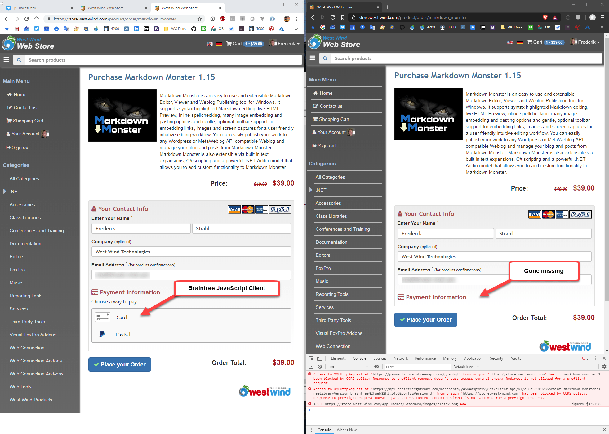
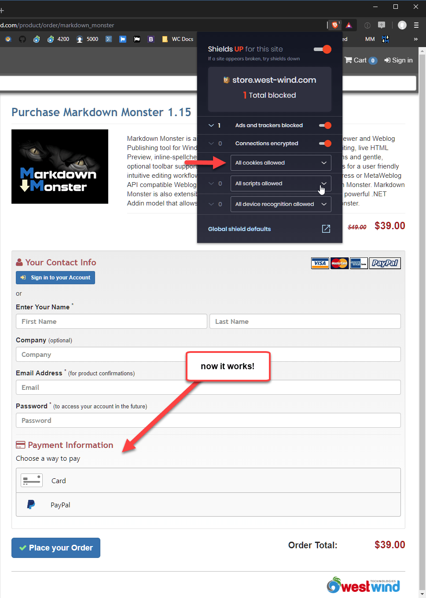
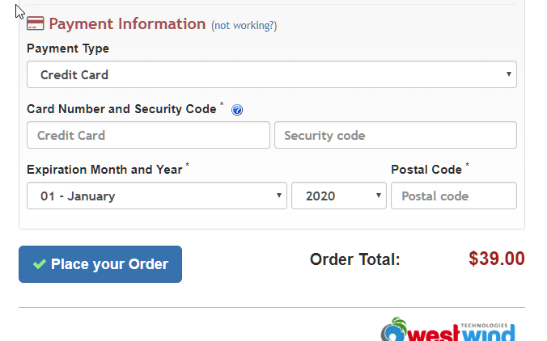
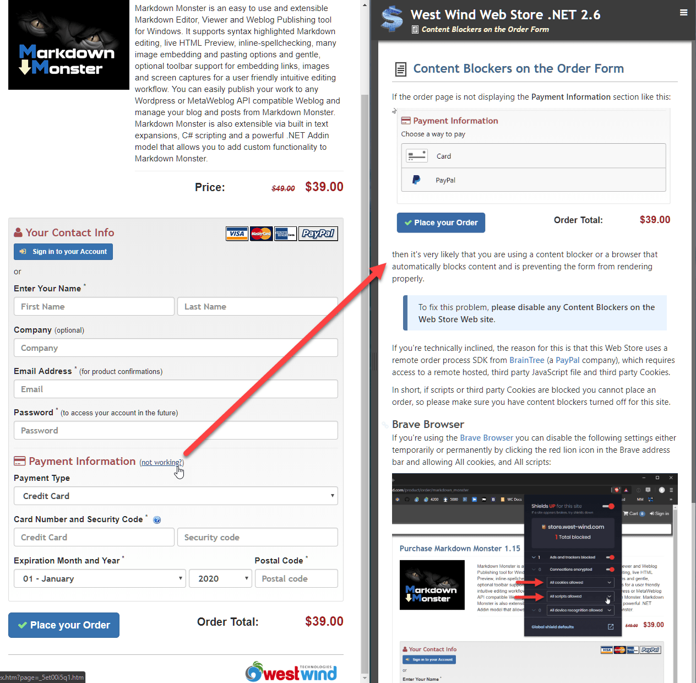

# Ad Blockers, Brave and BrainTree Credit Card Processing Client SDKs

I just ran into an interesting issue with my Web Store. On my site I use a custom Web Store and the payment integration is going through [BrainTree's](https://www.braintreepayments.com/) CC Processing APIs. Braintree has both server side and client side SDKs and the site uses the JavaScript SDK to remotely render the partial payment form into the overall order form. 

These days it's a pretty common scenario to use a JavaScript SDK that essentially removes the payment detail handling on the server so that the server never actually touches the credit card data. The SDK and the remote hosted form keeps the credit card data on BrainTree's server which reduces the risk of credit cards getting hacked during the payment process. Or, if something does go wrong the responsibility lies with the processor since they are the ones handling the Credit Card transaction data.

## Good News, Bad News
The good news is works very well. Order processing is very quick through this remote interface and with BrainTree at least as a bonus you can process PayPal requests just as you do Credit Cards using the exact same process with a different 'card type' - no need to use a separate PayPal order flow. Nice.

But - and there's always a but - today I noticed a fairly major problem: For the last few months I've been using the [Brave Browser](https://brave.com/) for most of my Web browsing. Brave is a Chromium based browser that provides most of the features of Chrome without Google tracking you each step of your browsing adventures. Brave also provides **built-in ad-blocking** by default so overall the browsing experience out of box is much better than you get in stock [Google Chrome](https://www.google.com/chrome/), because a lot of the crap ad content that makes up a good part of the Web these days is not being loaded.

When visiting one of the payment pages in my store with Brave, I noticed that the payment page wasn't working. Basically the remote payment form wasn't showing up.

Here is a side by side figure of Chrome and Brave of the same order form page: (Chrome on the left, Brave on the right):

Notice that Brave doesn't render the payment form and if I open the DevTools I can see that it's failing because of CORS policy.

My first thought is that something was wrong with BrainTree's CORS policy that they are pushing down to my site, because typically CORS errors are related to missing sites in the content policy and CORS headers that are returned from the target SDK server.

### Content Blocking in Brave
But alas it turns out that the problem isn't really the CORS headers but rather the fact that  Brave is **blocking third party cookies**. 

Now, I can now go in and manually disable that option and then get the page to work properly:

I had to enable **All Cookies Allowed** to enable third party cookies, which BrainTree is using to handle the internal order flow it uses between the JavaScript client component and its servers.

This is likely to be a problem with not just Brave Browser, but any content/ad blocker since third party cookies are a primary source of identity tracking. Unfortunately in this case the third party cookie is required for operation of the order form and not for tracking purposes.

## Now What?
So while there's a workaround to the non-loading page, it's not really something that a user can readily figure out which is a pretty big problem for an order form, especially if the user was ready to pay. The last thing we want to do at that point is make the user go - "wait what" or worse "WTF?"...

So, how to address this problem?

### Server Side Processing 
I'm not sure if there's a real technical solution unless you want to fall back to server side processing which for security reasons is not a good idea. 

In my custom store I can actually process either server side or using the client form. But because of the PCI requirements and liabilities, falling back to the server side processing is simply not an option for me. However, this might be for a larger company that has gone through their own PCI certification.

### Documentation
The only other solution I see is to provide some **help to the user** should they find themselves in this situation. I've added a link to the form that takes the user to a documentation page that describes what they should see and with some explanation on turning off content blockers.

This is not very satisfying but hopefully it might help keep people who hit this problem on the site and get them to disable their content blockers.

## Summary
Ah - progress. By offloading payment processing to a remote service I've solved one thorny problem (PCI) and now I've potentially brought in another problem that might keep some customers from being able to place an order. It seems that no matter how you turn things with security, there is always some sort of trade off.

If you're using a browser like Brave you are probably fairly technically savy. It's also very likely that you will eventually run into problems like this with other sites. These days there is so much integration between applications using APIs that require remote scripts and third party cookie integrations and content blockers likely will become a more common problem for users in that more and more legitimate content will end up getting blocked. This whitelisting takes a little work, but it's usually still better than the alternative of getting flooded with ads and trackers.

The hard part is realizing that it's happening. In using Brave I often simply forget that it's blocking stuff and when stuff fails my first reaction is that Brave is not doing the right thing, when really it's the content blocker. For less savvy users this is especially the case since they have no idea why a page doesn't work right and thinking of turning the content blocking off won't come natural. Heck it didn't come as the first thought to me - I googled CORS issues with BrainTree initially, before trying a different browser :-). 

Carry on...

    
    this post created and published with 
    <a href="https://markdownmonster.west-wind.com" 
       target="top">Markdown Monster</a> 

