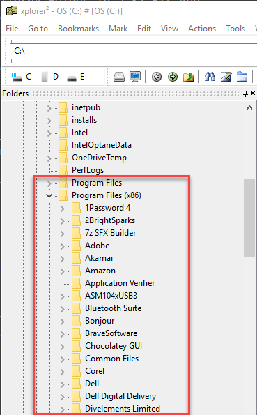
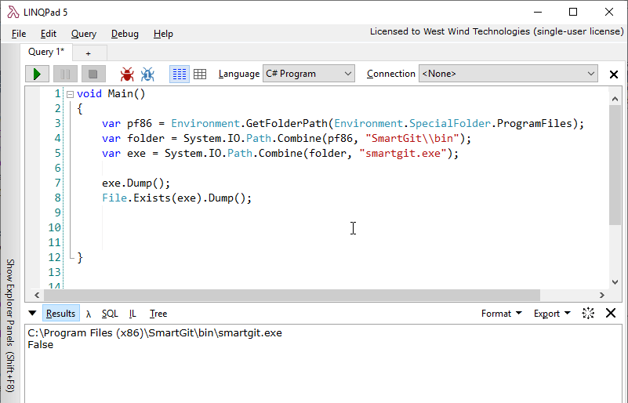

# Finding the 64 Bit  Program Files Folder in a 32 Bit App

You probably know that on Windows using .NET you can use [System.Environment.GetFolderPath()](https://docs.microsoft.com/en-us/dotnet/api/system.environment.getfolderpath?view=netframework-4.7.2) to pick out a host of special Windows folders. You can find Local App Data, Programs, My Documents, Pictures and so on using the [Environment.SpecialFolder enum](https://docs.microsoft.com/en-us/dotnet/api/system.environment.specialfolder?view=netframework-4.7.2) .

This function is needed because these special folders often are localized and using this function ensures that the paths are properly adjusted for various localized versions of Windows. You don't ever want to be building special paths by hand as they are likely to break if you run on a differently localized version of Windows. For example here's a link that shows what `Program Files` in Windows looks like in different languages:

http://www.samlogic.net/articles/program-files-folder-different-languages.htm

Bottom line is if you need to access Windows special folders **always** use the `GetFolderPath()` function and then build your path from there with `Path.Combine()`.

While the function works well there are a number of common paths missing, and some others are a little quirky.

### Using ProgramFiles and ProgramFiles32
One of those quirks is the Program Files folder. There are two `Program Files` folders in Windows the 64 bit versions of Windows most of us are running today:

* Program Files
* Program Files (x86)

Here's what this looks like on disk off the `C:\` root:



**Program Files** is for 64 bit apps, and **Program Files (x86)** is for 32 bit apps on  64 bit systems. On 32 Bit systems there's only `Program Files` which holds 32 bit applications and there's no support for 64 bit applications at all.

On 64 bit machines, the `Program Files` location where applications install changes the behaviors of Windows launchers. For example if you compile a .NET Desktop application with `Any CPU` and you launch from `Program Files (x86)` you'll launch as a 32 bit app. Launch from `Program Files` and you'll launch as a 64 bit application. Windows provides a launching process some hints that suggest whether the app should run 32 or 64 bit modes.

### Special Folders
So the `System.Environment.SpecialFolder` enum has values that seem pretty obvious choices for finding those two folders:

* ProgramFiles
* ProgramFilesX86

But it's never that simple...

Quick, what does the following return when you run your application as a **32 bit** application (on 64 bit Windows):

```cs
var pf86 = Environment.GetFolderPath(Environment.SpecialFolder.ProgramFiles);	
var folder = System.IO.Path.Combine(pf86, "SmartGit\\bin");
var exe = System.IO.Path.Combine(folder, "smartgit.exe");

exe.Dump();	
File.Exists(exe).Dump();
```

Here's a hint: Not what you'd expect.



In fact in a 32 bit application you'll find this to be true:

```cs
var pf86 = Environment.GetFolderPath(Environment.SpecialFolder.ProgramFilesX86);	
var pf = Environment.GetFolderPath(Environment.SpecialFolder.ProgramFiles);	
Assert.AreEqual(pf,pf86);    // true!
```

Now repeat this with a 64 bit application:

```cs
var pf86 = Environment.GetFolderPath(Environment.SpecialFolder.ProgramFilesX86);	
var pf = Environment.GetFolderPath(Environment.SpecialFolder.ProgramFiles);	
Assert.AreEqual(pf,pf86);    // false
```

Got that? It's confusing, but in its own twisted way this makes sense. A 32 bit application assumes it's running on a 32 bit system and should look for program files in the `Program Files (x86)` folder so it returns that folder for `ProgramFiles` because that's all it knows - 1 folder where 32 bit applications live. 

Using 32 bit mode and the `SpecialFolder` enum there's no way to actually discover the true 64 bit `Program Files` folder. Ouch!

### The Workaround - Using Environment Var
These days you'd be hard pressed to find a 32 bit version of Windows. Most people run 64 bit versions. So if you run a 32 bit application on a 64 bit version of Windows you can use the following code to get the 'real' `Program Files` folder:

```cs
var pf86 = Environment.GetEnvironmentVariable("ProgramW6432");
if (string.IsNullOrEmpty(pf86))
    pf86 = Environment.GetFolder(Environment.SpecialFolder.ProgramFiles)
```

This gives you the 64 bit `Program Files` path in a 32 bit application. If the environment variable doesn't exist because you're running an old or 32 bit version of Windows, the code falls back to `SpecialFolder.ProgramFiles` so it should still work in those environments as well.

### Practicalities - Why is this a Problem
If you're running a 64 bit application there really is no problem. In 64 bit mode `ProgramFiles` returns the `Program Files` folder and `ProgramFilesX86` returns the `Program Files (x86)` folder. Problem solved right? Yeah - for 64 bit.

But... if you have a a 32 bit application as I do with [Markdown Monster](https://markdownmonster.west-wind.com) you need to use the environment variable to retrieve the right `Program Files` path. 

You might say - just use 64 bit, but in the case of Markdown Monster I run in 32 bit in order to get better performance and stability out of the Web Browser control that is heavily used in this application. 64 bit IE was always a train wreck and the Web Browser control reflects that.

So the app runs in 32 bit mode, but I'm also shelling out and launching a number of other applications: I open command lines (Powershell or Command) for the user, run Git commands, open a GUI git client, various viewers like Image Viewers, explicitly launch browsers and so forth. The apps that are being launched are a mix of 32 and 64 bit applications.

In the example above I open [SmartGit](https://www.syntevo.com/smartgit/) which is my GUI Git Client of choice and it's a 64 bit app, hence I need to build a path for it.

Using the code above lets me do that.

### Summary 
I'm writing this down because I've run into this more than a few times and each and every time I go hunting for the solution because I forgot exactly I did to get around it. Now I can just search for this post - maybe it'll help you remember too :-)

<div style="margin-top: 30px;font-size: 0.8em;
            border-top: 1px solid #eee;padding-top: 8px;">
    
    this post created and published with 
    <a href="https://markdownmonster.west-wind.com" 
       target="top">Markdown Monster</a> 
</div>