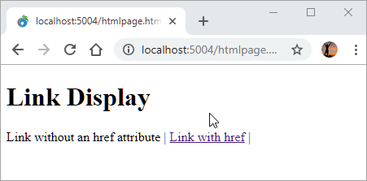
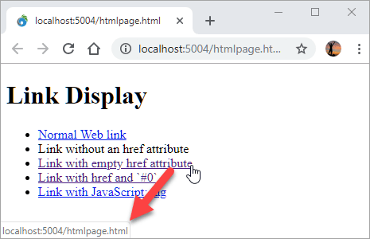
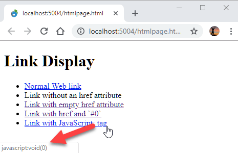
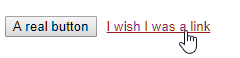
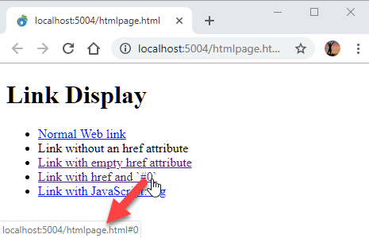

# Back to Basics: Non-Navigating HTML HRef Anchor Links


When you're creating `<a href>` links that are **non-navigating** and handled via script code or through some JavaScript framework, how exactly do you create that link on the page?

*I'm talking about plain vanilla HTML/JavaScript here, not about what happens when you use any JS frameworks which usually add special handling for links.*

The problem here is that if you create a link without an `href` attribute the link won't show typical link behavior. So this:

```html
<h1>Link Display</h1>
<a>Link without an href attribute</a> | <a href="#0">Link with href</a> |
```

renders to the following with the default browser styling:



Notice that the 'link-less' link renders without link styling. So when using dynamic navigation via event handlers or jQuery etc. you need to make sure that you explicitly specifiy **some sort of link in the href attribute**.

> If you're using a UI framework like BootStrap it will still style missing `href` links properly. But the default HTML styles render anchors without `href` with link styling that doesn't trigger the  `text-decoration` styling.

> If you're using a JavaScript framework like Angular, Vue, React etc. those frameworks will automatically fix up links and provide the empty navigation handling as well, so the discussion here centers on vanilla JS and HTML.

## The Short Answer: `href="#0"`
I've been using various approaches over the years, but probably the cleanest and least visually offensive solution is to use a hash to a non-existing name reference in a page.

So this is what I've settled on:

```html
<a href="#0">Fly, fly, fly away</a>
```

I like this because:

* It doesn't navigate
* It makes it obvious that this it's a do-nothing navigation
* Link looks reasonable on the status bar
* It doesn't flag security scanners

I actually found out that this works only recently and previously I had been using a slew of other approaches, which is what prompted me to write this up.

For a little more background lets take a look.

## Empty HREF Link Navigation
Ok, so what options are there? There quite a few actually, some better than others. I would argue some of these aren't an option, but I'll list them anyway:

1. `<a href="">`
1. `<a href="#">` 
1. `<a href="#" onclick="return false;"  />`
1. `<a href="javascript:void(0)">`
1. `<a href="javascript:{}">`
1. `<a href="#0">`
1. Use a styled `<button>`

Until recently I've been using #5, but just recently discovered that #6 is actually possible and which to me is preferrable.

Here's a little HTML you can experiment with ([CodePen](https://codepen.io/rstrahl/pen/bzrpKR)):

```html
<h1>Link Display</h1>
<ul>
<li><a href="https://weblog.west-wind.com">Normal Web link</a></li>
<li><a>Link without an href attribute</a></li>
<li><a href="">Link with empty href attribute</a></li>
<li><a href="#0">Link with href and `#0`</a></li>
<li><a href="javascript:void(0)">Link with JavaScript: tag</a></li>
</ul>
```


### Don't use an empty HREF
Empty HREF links might be tempting but they are problematic as they basically mean *re-navigate the current page*. It's like a Refresh operation which resubmits to the server.

Notice that an empty HREF renders as a link with a target URL pointing back to the current page:



This can be deceiving on small pages as you may not actually notice the page is navigating. 

Empty HREF links are useful for a few things, just not for dynamic navigation scenarios. It's a good choice for **Refresh this Page** style links, or for `<form href="" method="POST">` form submissions which posts back to the same URL.

### Don't use `#` by itself
As it turns out the second choice is the most commonly used in examples and demonstrations, but this is usually not a good choice because this syntax:

```html
<a href="#">Link Text</a>
```

actually is **not** a `do-nothing` navigation. It causes navigation to the the top of the page. Unless your page is small enough to fit into a single Viewport screen, or every handled link actually explicitly aborts navigation (more on that below), you don't want to use this option.

### Handling `onclick` and Returning false
One way you can prevent navigation is to implement an `click`/`onclick` JavaScript event handler and `return false` from it. Alternately you can use `event.preventDefault()` inside the click event's event object passed into the handler too.

While that works, it's easy to forget (unless you use a JavaScript framework that likely handles this for you). If you are already using handler this is Ok, but otherwise one of the other options is a better choice.

### javascript: Tags
Another way to do this is to provide essentially a **null JavaScript link**. There are a number of variations for this:

```html
<a href="javascript:void(0)">
<a href="javascript:{}">`
<a href="javascript:null">`
```

These all function just fine, but they show some nasty looking links in the status bar as the `javascript:` text is displayed. 



The links and text are harmless as they literally do nothing, but it's ugly, and to the average non-Web savvy person probably a bit scary.

Note that strict security standards - specifically [Content Security Policy (CSP)](https://en.wikipedia.org/wiki/Content_Security_Policy) - don't permit `javascript:` links and they are disabled. `javascript:` links are disabled so this would still work actually, but during a security audit the javascript links would still show up.

### Use a Button
Several comments mentioned not using links but instead using buttons to handle non-navigating operations. Semantically that makes sense - you're not actually 'linking' anywhere, but you are handling an operation in JavaScript so a button is actually a good semantic choice for non-link navigation.

The problem is that buttons are... well buttons, and by default they may not be the look that you are going for. 

`Buttons != Links`

Now some frameworks like Bootstrap and Material Design provide custom styling for buttons so that buttons can be styled as links. 

For example in bootstrap you can use:

```html
<button class="btn btn-link btn-sm" id="btnGo">Go</button>
```

which looks **just like a link** (mostly - there are differences like the background boxing).

If you're not using a framework, it takes a little more effort to actually style a button to not behave like a button. Default user-agent styling has a lot of behavior associated with buttons and you have to unset most of that behavior.

If you want to manually use a style, try this:

```html
<button>A real button</button>
    
<style>
    button.link {
        background: transparent;
        color: blue;
        border: none;
        outline: 0;
        text-decoration: underline;
    }
    button.link:hover {
        color: firebrick;
    }
</style>
<button class="link" id="btnWishyWashy">I wish I was a link</button>
```

which gives you:



Not bad, but still doesn't quite behave like a link. You won't get `:visited` behavior, and of course it won't respect custom `a` CSS rules if applied globally - you'll have to add those explicitly to the styling as well.

### And the Winner is: `#0`
The best solution to me is `href="#0"`. Mainly because it does nothing, uses simple text and shows no scary looking link in the status bar unlike the `javascript:` links above.



This approach works by using a non existing hash link. Unless you have a named link or an ID named `0` - which is unlikely - the navigation fails, which effectively does nothing. No navigation and no scrolling.

If for some strange reason you have an ID or named link called `0` use a different non-existing value for the hash: `#foo123` works too :-)

## Most Frameworks handle this automatically
The cleanest and often automatic solution is using a framework that explicitly handles link navigation for you so you don't have to think about it. All major  frameworks like Angular, Vue, React, Ember etc. handle links automatically by short circuiting link navigation in the attached wrapped JavaScript event handlers.

So if you're using these frameworks you usually don't set the `href` attribute at all and let the framework handle that for you, both in terms of styling and the navigation.

## Summary
This is pretty basic stuff, but it's easy to forget which choices work and which sort of work or provide ugly results. I know I've gone back and forth on this many times in the past before I recently settled on:

```html
<a href="#0">Dynamic Navigation</a>
```

which seems the cleanest solution.

<div style="margin-top: 30px;font-size: 0.8em;
            border-top: 1px solid #eee;padding-top: 8px;">
    
    this post created and published with 
    <a href="https://markdownmonster.west-wind.com" 
       target="top">Markdown Monster</a> 
</div>