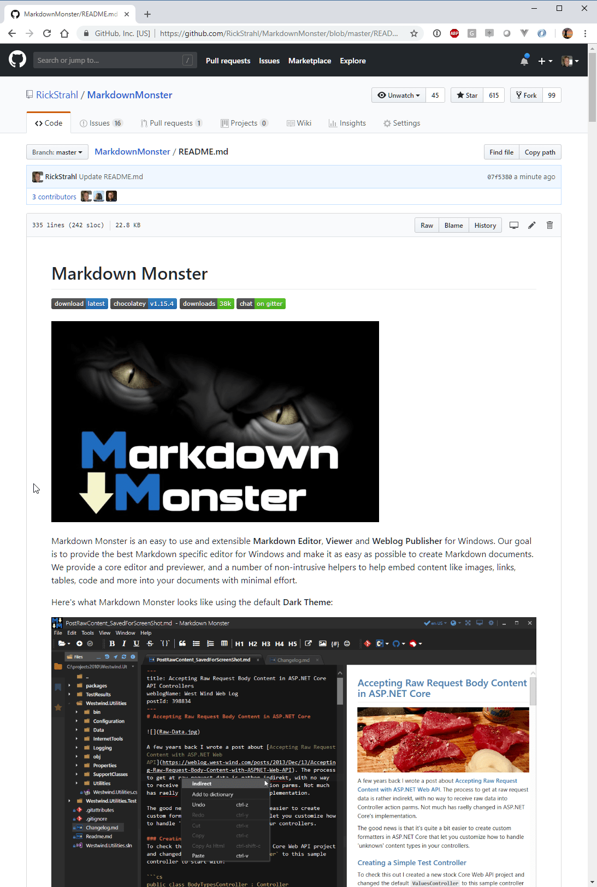
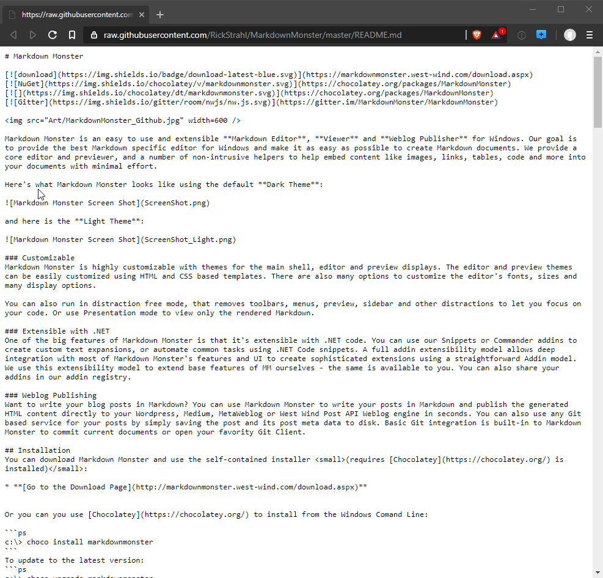

# Retrieving GitHub Listings and Content with OctoKit.GraphQL

I've been working on a documentation project for some time where we pull Markdown (and other) content from Github and render the content as part of a greater documentation system.

This works great, but currently we (Markus Egger and myself) are parsing the content using the GitHub Web site using the **Raw** Urls and basically screen scraping the HTML to retrieve 'directory' listings of files. In a nutshell we crawl a repository for documentation content we support.

This all works currently but there are a few problems with this approach:

* The Raw Url Interface is delayed by up to 5 minutes
* The Crawling relies on parsing HTML and is fickle

## The GitHub Raw URL Interface
The first and most important issue we've run into is that the Github Raw URL interface appears to be lagging behind the live site. 

For those of you that don't know, GitHub has an alternate URL (actually several that end up resolving to a single Raw url) interface that you can use to retrieve the raw content of a file.

So you can go to a GitHub URL like the `README.md` file in my Markdown Monster repository:

https://github.com/RickStrahl/MarkdownMonster/blob/master/README.md

which is an HTML endpoint that returns the formatted HTML of the Markdown document along with Github's Chrome.

To retrieve the actual content of the file you can switch the URL from `/blob/` to `/raw/` like this:

https://github.com/RickStrahl/MarkdownMonster/raw/master/README.md

This URL is actually redirected to:

https://raw.githubusercontent.com/RickStrahl/MarkdownMonster/master/README.md

Here's the raw Markdown content display in my default browser ([Brave](https://brave.com/)):

Either of those raw URLs above work and they return the **raw** Markdown in this case. This Raw API works for any files in your repository. This means for **applications** that need **access to content** there's an easy way using a URL to get at the content without having to use resort to a more complex API. 

And that's pretty awesome if you think about it. GitHub basically is a giant **content storage mechanism**.

### Timing is Everything
For most things that you need to do with GitHub content the URL based interface is probably fine, but there is a not so small caveat with this raw URL interface: 

> The Github Web Raw Interface can have a delay of up to 5 minutes before files recently committed  show up.

Again for most applications that just occasionally read content from GitHub that's not going to be a problem. However, if you are working on a documentation solution where you are making changes frequently, committing them and then checking to see what the resulting changes look like in production using the application that's pulling the GitHub  content and rendering it, that can be problematic. 

In our case, it's a problem because previewing is one of the features when you save and update a topic. The new topic is immediately displayed and if the content is out of date that experience is seriously diminished as you sit there pressing F5 waiting for the content to refresh :cry:

I'm not sure why there is a delay - the content is clearly on the Web site because the HTML page content is immediately updated so it's not that the content is not yet stored or updated on GitHub. 

It's very likely that server side caching on Github's end is the culprit as first time updates tend to refresh immediately, while successive updates tend to be delayed.

## GitHub Directory Retrieval
The other issue is retrieving a GitHub directory of a repository or part of a repository. Without API access the only wayt ot 

## What to do?
Now I know some people are likely to jump in here and say, why not use Git properly - Clone the repo and do all this stuff locally. Push and Pull and sync the remote and local instance.

That **would** solve the problem as Git commands are immediately updated and show the latest files. Locally it would also be trivial to simply parse the directory tree.

The problem is that this is a Web application and pulling down a repo to the local drive is not really an option and has it's own set of implications for size, permissions and certainly for persistency. In short for the particular application we are working with we haven't discovered a good way to deal storing local filesystem data in an Azure or Docker hosted application efficiently.

In our case we need to work with the data remotely, rather than pulling it down local.

## GitHub APIs to the Rescue
The good news is that GitHub has support for remote access to its content via various GitHub APIs. The latest iteration of the API - in trendy fashion - is the GraphQL API.

From what I've seen of GraphQL I can't say I'm a fan, but given that this API is the newest that GitHub has to offer we figured we better use that rather than the older (and much easier to use) classic REST API.

### GraphQL
GraphQL is a **OData** like API mechanism that provides what can only be called a query system to filter and massage data into a very specific, focused JSON responses. The result is a JSON object and GitHub provides a preview [octokit.graphql.net](https://github.com/octokit/octokit.graphql.net) library. The library uses an `IQueryable<T>` LINQ based implementation for getting content out of GraphQL and returns projectable objects (via `.Select()`) from the JSON data. 

It seems the .NET API is still pretty young - there's not a lot of documentation or much in the way of examples, but it does seem to work very well once you get your head around the funky GraphQL-isms and how they are translated into LINQ syntax. GraphQL is supposed to abstract away some of the complexity but to me it looks like you still have to have a very good understanding of the underlying Git object structure to even begin to understand how to construct anything but simple queries.

Incidentally the raw GraphQL syntax isn't any better - the JSON/Yaml Frankenstein sytnax isn't doing anybody any favors either :-) But I disgress.

The big benefit for GraphQL is that you can ask for very specific data in a variety of different way and often reduce the amount of data and number of queries you have to run to retrieve data from the server which means much less data and potentially fewer requests are sent to the server.

Essentially it allows you to specify exactly what you want to receive from the server, as opposed to REST Services which tend to give you everything and require you to filter on the client.

